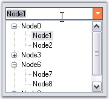
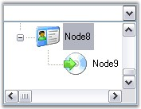

::: {style="DISPLAY: none"}
{#d2h_url_template}{#d2h_package_url style="WIDTH: 0px; DISPLAY: none; HEIGHT: 0px"}
:::

:::: {.d2h_secondary_topic style="PADDING-BOTTOM: 10pt; MARGIN: 0pt; PADDING-LEFT: 0pt; PADDING-RIGHT: 0pt; PADDING-TOP: 0pt"}
##### Event Handling {#event-handling style="tab-stops: 0pt"}

 

Events of ComboDropDown

**[]{style="COLOR: #15428b"}** 

**ComboDropDown.DropDown: ** It occurs before the dropdown portion is shown. This event can be handled to select the item in the control based on the text of ComboDropDown before its dropdown position is shown. The event handler receives an argument of type EventArgs.

 

Refer DropDown Event[[.]{style="COLOR: windowtext; TEXT-DECORATION: none; text-underline: none"}](../../../../../../../../Documents%20and%20Settings/sindhujamj/Desktop/SplashPanel.html)

**ComboDropDown.PopupContainer.Popup:** It occurs after the popup has been dropped down and made visible. It can be handled to get focus on the drop down portion of ComboDropDown. The event handler receives an argument of type EventArgs. Refer Make the DropDown Respond to Mouse Move[[.]{style="BACKGROUND: yellow; COLOR: blue; TEXT-DECORATION: none; text-underline: none"}](../../../../../../../../Documents%20and%20Settings/sindhujamj/Desktop/StatusBarAdv.html)

[]{style="COLOR: #15428b"} 

Events of ComboDropDown

**[]{style="COLOR: #15428b"}** 

**ComboDropDown.DropDown: ** It occurs before the dropdown portion is shown. This event can be handled to select the item in the control based on the text of ComboDropDown before its dropdown position is shown. The event handler receives an argument of type EventArgs.

 

Refer DropDown Event.

 

**ComboDropDown.PopupContainer.Popup:** It occurs after the popup has been dropped down and made visible. It can be handled to get focus on the drop down portion of ComboDropDown. The event handler receives an argument of type EventArgs. Refer Make the DropDown Respond to Mouse Move.[]{.MsoHyperlink}

[]{style="COLOR: black"} 

###### []{#p380}[]{#_DropDown_Event}3.3.5.1.4.1 DropDown Event {#dropdown-event style="tab-stops: 0pt"}

[]{style="COLOR: #15428b"} 

Setting Interaction between ComboDrop-Down and TreeView

[]{style="COLOR: #15428b"} 

1.   Create a handler for the ComboDrop-Down\'s **Drop-Down** event and the TreeView\'s **DoubleClick** event. In the DoubleClick event, set the combo\'s text based on the selected node as follows.

[]{style="COLOR: #15428b"} 

+--------------------------------------------------------------------------------------------------------------------------------------------------------------------------------------------------------------------------------------------------------------------------------------------------------------------------------------------------------------+
| **[\[C#\]]{style="FONT-FAMILY: 'Courier New'; COLOR: black"}**                                                                                                                                                                                                                                                                                               |
|                                                                                                                                                                                                                                                                                                                                                              |
| **[]{style="FONT-FAMILY: 'Courier New'; COLOR: black"}**                                                                                                                                                                                                                                                                                                     |
|                                                                                                                                                                                                                                                                                                                                                              |
| [private void]{style="FONT-FAMILY: 'Courier New'; COLOR: blue"}[ treeView1_DoubleClick(]{style="FONT-FAMILY: 'Courier New'; COLOR: black"}[object]{style="FONT-FAMILY: 'Courier New'; COLOR: blue"}[ sender, System.EventArgs e)]{style="FONT-FAMILY: 'Courier New'; COLOR: black"}                                                                          |
|                                                                                                                                                                                                                                                                                                                                                              |
| [{]{style="FONT-FAMILY: 'Courier New'; COLOR: black"}                                                                                                                                                                                                                                                                                                        |
|                                                                                                                                                                                                                                                                                                                                                              |
| [if]{style="FONT-FAMILY: 'Courier New'; COLOR: blue"}[(]{style="FONT-FAMILY: 'Courier New'; COLOR: black"}[this]{style="FONT-FAMILY: 'Courier New'; COLOR: blue"}[.treeView1.SelectedNode != ]{style="FONT-FAMILY: 'Courier New'; COLOR: black"}[null]{style="FONT-FAMILY: 'Courier New'; COLOR: blue"}[)]{style="FONT-FAMILY: 'Courier New'; COLOR: black"} |
|                                                                                                                                                                                                                                                                                                                                                              |
| []{style="FONT-FAMILY: 'Courier New'; COLOR: green"}                                                                                                                                                                                                                                                                                                         |
|                                                                                                                                                                                                                                                                                                                                                              |
| [// Set the combodropdown\'s text to be the TreeNode\'s text.]{style="FONT-FAMILY: 'Courier New'; COLOR: green"}                                                                                                                                                                                                                                             |
|                                                                                                                                                                                                                                                                                                                                                              |
| [this]{style="FONT-FAMILY: 'Courier New'; COLOR: blue"}[.comboDropDown1.Text = ]{style="FONT-FAMILY: 'Courier New'; COLOR: black"}[this]{style="FONT-FAMILY: 'Courier New'; COLOR: blue"}[.treeView1.SelectedNode.Text;]{style="FONT-FAMILY: 'Courier New'; COLOR: black"}                                                                                   |
|                                                                                                                                                                                                                                                                                                                                                              |
| [else]{style="FONT-FAMILY: 'Courier New'; COLOR: blue"}                                                                                                                                                                                                                                                                                                      |
|                                                                                                                                                                                                                                                                                                                                                              |
| [this]{style="FONT-FAMILY: 'Courier New'; COLOR: blue"}[.comboDropDown1.Text = ]{style="FONT-FAMILY: 'Courier New'; COLOR: black"}[String]{style="FONT-FAMILY: 'Courier New'; COLOR: blue"}[.Empty;]{style="FONT-FAMILY: 'Courier New'; COLOR: black"}                                                                                                       |
|                                                                                                                                                                                                                                                                                                                                                              |
| []{style="FONT-FAMILY: 'Courier New'; COLOR: green"}                                                                                                                                                                                                                                                                                                         |
|                                                                                                                                                                                                                                                                                                                                                              |
| [// Close the combodropdown.]{style="FONT-FAMILY: 'Courier New'; COLOR: green"}                                                                                                                                                                                                                                                                              |
|                                                                                                                                                                                                                                                                                                                                                              |
| [this]{style="FONT-FAMILY: 'Courier New'; COLOR: blue"}[.comboDropDown1.PopupContainer.HidePopup(PopupCloseType.Done);]{style="FONT-FAMILY: 'Courier New'; COLOR: black"}                                                                                                                                                                                    |
|                                                                                                                                                                                                                                                                                                                                                              |
| [}]{style="FONT-FAMILY: 'Courier New'; COLOR: black"}                                                                                                                                                                                                                                                                                                        |
+--------------------------------------------------------------------------------------------------------------------------------------------------------------------------------------------------------------------------------------------------------------------------------------------------------------------------------------------------------------+

[]{style="COLOR: #15428b"} 

+--------------------------------------------------------------------------------------------------------------------------------------------------------------------------------------------------------------------------------------------------------------------------------------------------------------------------------------------------------------------------------------------------------------------------------------------------------------------------------------------------------------------------------------+
| **[\[VB.NET\]]{style="FONT-FAMILY: 'Courier New'; COLOR: black"}**                                                                                                                                                                                                                                                                                                                                                                                                                                                                   |
|                                                                                                                                                                                                                                                                                                                                                                                                                                                                                                                                      |
| **[]{style="FONT-FAMILY: 'Courier New'; COLOR: black"}**                                                                                                                                                                                                                                                                                                                                                                                                                                                                             |
|                                                                                                                                                                                                                                                                                                                                                                                                                                                                                                                                      |
| [Private Sub]{style="FONT-FAMILY: 'Courier New'; COLOR: blue"}[ treeView1_DoubleClick(sender ]{style="FONT-FAMILY: 'Courier New'; COLOR: black"}[As Object]{style="FONT-FAMILY: 'Courier New'; COLOR: blue"}[, e ]{style="FONT-FAMILY: 'Courier New'; COLOR: black"}[As]{style="FONT-FAMILY: 'Courier New'; COLOR: blue"}[ System.EventArgs) ]{style="FONT-FAMILY: 'Courier New'; COLOR: black"}[Handles]{style="FONT-FAMILY: 'Courier New'; COLOR: blue"}[ treeView1.DoubleClick]{style="FONT-FAMILY: 'Courier New'; COLOR: black"} |
|                                                                                                                                                                                                                                                                                                                                                                                                                                                                                                                                      |
| [If Not]{style="FONT-FAMILY: 'Courier New'; COLOR: blue"}[ (]{style="FONT-FAMILY: 'Courier New'; COLOR: black"}[Me]{style="FONT-FAMILY: 'Courier New'; COLOR: blue"}[.treeView1.SelectedNode ]{style="FONT-FAMILY: 'Courier New'; COLOR: black"}[Is Nothing]{style="FONT-FAMILY: 'Courier New'; COLOR: blue"}[) ]{style="FONT-FAMILY: 'Courier New'; COLOR: black"}[Then]{style="FONT-FAMILY: 'Courier New'; COLOR: blue"}                                                                                                           |
|                                                                                                                                                                                                                                                                                                                                                                                                                                                                                                                                      |
| []{style="FONT-FAMILY: 'Courier New'; COLOR: green"}                                                                                                                                                                                                                                                                                                                                                                                                                                                                                 |
|                                                                                                                                                                                                                                                                                                                                                                                                                                                                                                                                      |
| [\' Set the combodropdown\'s text to be the TreeNode\'s text.]{style="FONT-FAMILY: 'Courier New'; COLOR: green"}                                                                                                                                                                                                                                                                                                                                                                                                                     |
|                                                                                                                                                                                                                                                                                                                                                                                                                                                                                                                                      |
| [Me]{style="FONT-FAMILY: 'Courier New'; COLOR: blue"}[.comboDropDown1.Text = ]{style="FONT-FAMILY: 'Courier New'; COLOR: black"}[Me]{style="FONT-FAMILY: 'Courier New'; COLOR: blue"}[.treeView1.SelectedNode.Text]{style="FONT-FAMILY: 'Courier New'; COLOR: black"}                                                                                                                                                                                                                                                                |
|                                                                                                                                                                                                                                                                                                                                                                                                                                                                                                                                      |
| [Else]{style="FONT-FAMILY: 'Courier New'; COLOR: blue"}                                                                                                                                                                                                                                                                                                                                                                                                                                                                              |
|                                                                                                                                                                                                                                                                                                                                                                                                                                                                                                                                      |
| [Me]{style="FONT-FAMILY: 'Courier New'; COLOR: blue"}[.comboDropDown1.Text = ]{style="FONT-FAMILY: 'Courier New'; COLOR: black"}[String]{style="FONT-FAMILY: 'Courier New'; COLOR: blue"}[.Empty]{style="FONT-FAMILY: 'Courier New'; COLOR: black"}                                                                                                                                                                                                                                                                                  |
|                                                                                                                                                                                                                                                                                                                                                                                                                                                                                                                                      |
| [End If]{style="FONT-FAMILY: 'Courier New'; COLOR: blue"}                                                                                                                                                                                                                                                                                                                                                                                                                                                                            |
|                                                                                                                                                                                                                                                                                                                                                                                                                                                                                                                                      |
| []{style="FONT-FAMILY: 'Courier New'; COLOR: green"}                                                                                                                                                                                                                                                                                                                                                                                                                                                                                 |
|                                                                                                                                                                                                                                                                                                                                                                                                                                                                                                                                      |
| [\' Close the combodropdown.]{style="FONT-FAMILY: 'Courier New'; COLOR: green"}                                                                                                                                                                                                                                                                                                                                                                                                                                                      |
|                                                                                                                                                                                                                                                                                                                                                                                                                                                                                                                                      |
| [Me]{style="FONT-FAMILY: 'Courier New'; COLOR: blue"}[.comboDropDown1.PopupContainer.HidePopup(PopupCloseType.Done)]{style="FONT-FAMILY: 'Courier New'; COLOR: black"}                                                                                                                                                                                                                                                                                                                                                               |
|                                                                                                                                                                                                                                                                                                                                                                                                                                                                                                                                      |
| [End Sub ]{style="FONT-FAMILY: 'Courier New'; COLOR: blue"}                                                                                                                                                                                                                                                                                                                                                                                                                                                                          |
+--------------------------------------------------------------------------------------------------------------------------------------------------------------------------------------------------------------------------------------------------------------------------------------------------------------------------------------------------------------------------------------------------------------------------------------------------------------------------------------------------------------------------------------+

[]{style="COLOR: #15428b"} 

2.   Simply traverses the tree structure recursively to find the matching node using the **FindNode** method discussed below.

[]{style="COLOR: #15428b"} 

+----------------------------------------------------------------------------------------------------------------------------------------------------------------------------------+
| **[\[C#\]]{style="FONT-FAMILY: 'Courier New'; COLOR: black"}**                                                                                                                   |
|                                                                                                                                                                                  |
| []{style="FONT-FAMILY: 'Courier New'; COLOR: black"}                                                                                                                             |
|                                                                                                                                                                                  |
| [private]{style="FONT-FAMILY: 'Courier New'; COLOR: blue"}[ TreeNode FindNode(TreeNodeCollection nodes, [string]{style="COLOR: blue"} text)]{style="FONT-FAMILY: 'Courier New'"} |
|                                                                                                                                                                                  |
| [{]{style="FONT-FAMILY: 'Courier New'"}                                                                                                                                          |
|                                                                                                                                                                                  |
| [foreach]{style="FONT-FAMILY: 'Courier New'; COLOR: blue"}[(TreeNode child [in]{style="COLOR: blue"} nodes)]{style="FONT-FAMILY: 'Courier New'"}                                 |
|                                                                                                                                                                                  |
| [      [if]{style="COLOR: blue"}(child.Text == text)]{style="FONT-FAMILY: 'Courier New'"}                                                                                        |
|                                                                                                                                                                                  |
| [            [return]{style="COLOR: blue"} child;]{style="FONT-FAMILY: 'Courier New'"}                                                                                           |
|                                                                                                                                                                                  |
| [foreach]{style="FONT-FAMILY: 'Courier New'; COLOR: blue"}[(TreeNode child [in]{style="COLOR: blue"} nodes)]{style="FONT-FAMILY: 'Courier New'"}                                 |
|                                                                                                                                                                                  |
| [      {]{style="FONT-FAMILY: 'Courier New'"}                                                                                                                                    |
|                                                                                                                                                                                  |
| [TreeNode matched = [this]{style="COLOR: blue"}.FindNode(child.Nodes, text);]{style="FONT-FAMILY: 'Courier New'"}                                                                |
|                                                                                                                                                                                  |
| [      [if]{style="COLOR: blue"}(matched != [null]{style="COLOR: blue"})]{style="FONT-FAMILY: 'Courier New'"}                                                                    |
|                                                                                                                                                                                  |
| [            [return]{style="COLOR: blue"} matched;]{style="FONT-FAMILY: 'Courier New'"}                                                                                         |
|                                                                                                                                                                                  |
| [       }]{style="FONT-FAMILY: 'Courier New'"}                                                                                                                                   |
|                                                                                                                                                                                  |
| [return]{style="FONT-FAMILY: 'Courier New'; COLOR: blue"}[ [null]{style="COLOR: blue"};]{style="FONT-FAMILY: 'Courier New'"}                                                     |
|                                                                                                                                                                                  |
| [}]{style="FONT-FAMILY: 'Courier New'"}                                                                                                                                          |
+----------------------------------------------------------------------------------------------------------------------------------------------------------------------------------+

[]{style="COLOR: #15428b"} 

+----------------------------------------------------------------------------------------------------------------------------------------------------------------------------------------------------------------------------------------------------------------------------------------------------------------------------------------------------------+
| **[\[VB.NET\]]{style="FONT-FAMILY: 'Courier New'; COLOR: black"}**                                                                                                                                                                                                                                                                                       |
|                                                                                                                                                                                                                                                                                                                                                          |
| []{style="FONT-FAMILY: 'Courier New'; COLOR: black"}                                                                                                                                                                                                                                                                                                     |
|                                                                                                                                                                                                                                                                                                                                                          |
| [Private]{style="FONT-FAMILY: 'Courier New'; COLOR: blue"}[ [Function]{style="COLOR: blue"} FindNode([ByVal]{style="COLOR: blue"} nodes [As]{style="COLOR: blue"} TreeNodeCollection, [ByVal]{style="COLOR: blue"} text [As]{style="COLOR: blue"} [String]{style="COLOR: blue"}) [As]{style="COLOR: blue"} TreeNode]{style="FONT-FAMILY: 'Courier New'"} |
|                                                                                                                                                                                                                                                                                                                                                          |
| [    [For]{style="COLOR: blue"} [Each]{style="COLOR: blue"} child [As]{style="COLOR: blue"} TreeNode [In]{style="COLOR: blue"} nodes]{style="FONT-FAMILY: 'Courier New'"}                                                                                                                                                                                |
|                                                                                                                                                                                                                                                                                                                                                          |
| [        [If]{style="COLOR: blue"} child.Text = text [Then]{style="COLOR: blue"}]{style="FONT-FAMILY: 'Courier New'"}                                                                                                                                                                                                                                    |
|                                                                                                                                                                                                                                                                                                                                                          |
| [            [Return]{style="COLOR: blue"} child]{style="FONT-FAMILY: 'Courier New'"}                                                                                                                                                                                                                                                                    |
|                                                                                                                                                                                                                                                                                                                                                          |
| [        [End]{style="COLOR: blue"} [If]{style="COLOR: blue"}]{style="FONT-FAMILY: 'Courier New'"}                                                                                                                                                                                                                                                       |
|                                                                                                                                                                                                                                                                                                                                                          |
| [    [Next]{style="COLOR: blue"} child]{style="FONT-FAMILY: 'Courier New'"}                                                                                                                                                                                                                                                                              |
|                                                                                                                                                                                                                                                                                                                                                          |
| [    [For]{style="COLOR: blue"} [Each]{style="COLOR: blue"} child [As]{style="COLOR: blue"} TreeNode [In]{style="COLOR: blue"} nodes]{style="FONT-FAMILY: 'Courier New'"}                                                                                                                                                                                |
|                                                                                                                                                                                                                                                                                                                                                          |
| [        [Dim]{style="COLOR: blue"} matched [As]{style="COLOR: blue"} TreeNode = [Me]{style="COLOR: blue"}.FindNode(child.Nodes, text)]{style="FONT-FAMILY: 'Courier New'"}                                                                                                                                                                              |
|                                                                                                                                                                                                                                                                                                                                                          |
| [        [If]{style="COLOR: blue"} [Not]{style="COLOR: blue"} matched [Is]{style="COLOR: blue"} [Nothing]{style="COLOR: blue"} [Then]{style="COLOR: blue"}]{style="FONT-FAMILY: 'Courier New'"}                                                                                                                                                          |
|                                                                                                                                                                                                                                                                                                                                                          |
| [            [Return]{style="COLOR: blue"} matched]{style="FONT-FAMILY: 'Courier New'"}                                                                                                                                                                                                                                                                  |
|                                                                                                                                                                                                                                                                                                                                                          |
| [        [End]{style="COLOR: blue"} [If]{style="COLOR: blue"}]{style="FONT-FAMILY: 'Courier New'"}                                                                                                                                                                                                                                                       |
|                                                                                                                                                                                                                                                                                                                                                          |
| [    [Next]{style="COLOR: blue"} child]{style="FONT-FAMILY: 'Courier New'"}                                                                                                                                                                                                                                                                              |
|                                                                                                                                                                                                                                                                                                                                                          |
| [    [Return]{style="COLOR: blue"} [Nothing]{style="COLOR: blue"}]{style="FONT-FAMILY: 'Courier New'"}                                                                                                                                                                                                                                                   |
|                                                                                                                                                                                                                                                                                                                                                          |
| [End]{style="FONT-FAMILY: 'Courier New'; COLOR: blue"}[ [Function]{style="COLOR: blue"}]{style="FONT-FAMILY: 'Courier New'"}                                                                                                                                                                                                                             |
+----------------------------------------------------------------------------------------------------------------------------------------------------------------------------------------------------------------------------------------------------------------------------------------------------------------------------------------------------------+

[]{style="COLOR: #15428b"} 

3.   In the drop-down event, find the node whose text matches the text in the combo and make that the selected node, using the following code.

[]{style="COLOR: #15428b"} 

+----------------------------------------------------------------------------------------------------------------------------------------------------------------------------------------------------------------------------------------------------------------------------------------------------------------------------------------------------------------------------------------------------------------------------------------------------------------+
| **[\[C#\]]{style="FONT-FAMILY: 'Courier New'; COLOR: black"}**                                                                                                                                                                                                                                                                                                                                                                                                 |
|                                                                                                                                                                                                                                                                                                                                                                                                                                                                |
| **[]{style="FONT-FAMILY: 'Courier New'; COLOR: black"}**                                                                                                                                                                                                                                                                                                                                                                                                       |
|                                                                                                                                                                                                                                                                                                                                                                                                                                                                |
| [private void]{style="FONT-FAMILY: 'Courier New'; COLOR: blue"}[ comboDropDown1_DropDown(]{style="FONT-FAMILY: 'Courier New'; COLOR: black"}[object]{style="FONT-FAMILY: 'Courier New'; COLOR: blue"}[ sender, System.EventArgs e)]{style="FONT-FAMILY: 'Courier New'; COLOR: black"}                                                                                                                                                                          |
|                                                                                                                                                                                                                                                                                                                                                                                                                                                                |
| [{]{style="FONT-FAMILY: 'Courier New'; COLOR: black"}                                                                                                                                                                                                                                                                                                                                                                                                          |
|                                                                                                                                                                                                                                                                                                                                                                                                                                                                |
| []{style="FONT-FAMILY: 'Courier New'; COLOR: green"}                                                                                                                                                                                                                                                                                                                                                                                                           |
|                                                                                                                                                                                                                                                                                                                                                                                                                                                                |
| [// Before the drop-down is shown, select a TreeNode based on the text in the combo.]{style="FONT-FAMILY: 'Courier New'; COLOR: green"}                                                                                                                                                                                                                                                                                                                        |
|                                                                                                                                                                                                                                                                                                                                                                                                                                                                |
| [if]{style="FONT-FAMILY: 'Courier New'; COLOR: blue"}[(]{style="FONT-FAMILY: 'Courier New'; COLOR: black"}[this]{style="FONT-FAMILY: 'Courier New'; COLOR: blue"}[.comboDropDown1.Text != ]{style="FONT-FAMILY: 'Courier New'; COLOR: black"}[String]{style="FONT-FAMILY: 'Courier New'; COLOR: blue"}[.Empty)]{style="FONT-FAMILY: 'Courier New'; COLOR: black"}                                                                                              |
|                                                                                                                                                                                                                                                                                                                                                                                                                                                                |
| [{]{style="FONT-FAMILY: 'Courier New'; COLOR: black"}                                                                                                                                                                                                                                                                                                                                                                                                          |
|                                                                                                                                                                                                                                                                                                                                                                                                                                                                |
| [TreeNode matchedNode = ]{style="FONT-FAMILY: 'Courier New'; COLOR: black"}[this]{style="FONT-FAMILY: 'Courier New'; COLOR: blue"}[.FindNode(]{style="FONT-FAMILY: 'Courier New'; COLOR: black"}[this]{style="FONT-FAMILY: 'Courier New'; COLOR: blue"}[.treeView1.Nodes, ]{style="FONT-FAMILY: 'Courier New'; COLOR: black"}[this]{style="FONT-FAMILY: 'Courier New'; COLOR: blue"}[.comboDropDown1.Text);]{style="FONT-FAMILY: 'Courier New'; COLOR: black"} |
|                                                                                                                                                                                                                                                                                                                                                                                                                                                                |
| [this]{style="FONT-FAMILY: 'Courier New'; COLOR: blue"}[.treeView1.SelectedNode = matchedNode;]{style="FONT-FAMILY: 'Courier New'; COLOR: black"}                                                                                                                                                                                                                                                                                                              |
|                                                                                                                                                                                                                                                                                                                                                                                                                                                                |
| [}]{style="FONT-FAMILY: 'Courier New'; COLOR: black"}                                                                                                                                                                                                                                                                                                                                                                                                          |
|                                                                                                                                                                                                                                                                                                                                                                                                                                                                |
| [}]{style="FONT-FAMILY: 'Courier New'; COLOR: black"}                                                                                                                                                                                                                                                                                                                                                                                                          |
+----------------------------------------------------------------------------------------------------------------------------------------------------------------------------------------------------------------------------------------------------------------------------------------------------------------------------------------------------------------------------------------------------------------------------------------------------------------+

[]{style="COLOR: #15428b"} 

+--------------------------------------------------------------------------------------------------------------------------------------------------------------------------------------------------------------------------------------------------------------------------------------------------------------------------------------------------------------------------------------------------------------------------------------------------------------------------------------------------------------------------------------------------------------------------------------------------------------------------------------------------------------------------------------------------------------------------------------------------------------------+
| **[\[VB.NET\]]{style="FONT-FAMILY: 'Courier New'; COLOR: black"}**                                                                                                                                                                                                                                                                                                                                                                                                                                                                                                                                                                                                                                                                                                 |
|                                                                                                                                                                                                                                                                                                                                                                                                                                                                                                                                                                                                                                                                                                                                                                    |
| **[]{style="FONT-FAMILY: 'Courier New'; COLOR: black"}**                                                                                                                                                                                                                                                                                                                                                                                                                                                                                                                                                                                                                                                                                                           |
|                                                                                                                                                                                                                                                                                                                                                                                                                                                                                                                                                                                                                                                                                                                                                                    |
| [Private Sub]{style="FONT-FAMILY: 'Courier New'; COLOR: blue"}[ comboDropDown1_DropDown(]{style="FONT-FAMILY: 'Courier New'; COLOR: black"}[ByVal]{style="FONT-FAMILY: 'Courier New'; COLOR: blue"}[ sender ]{style="FONT-FAMILY: 'Courier New'; COLOR: black"}[As Object]{style="FONT-FAMILY: 'Courier New'; COLOR: blue"}[, ]{style="FONT-FAMILY: 'Courier New'; COLOR: black"}[ByVal]{style="FONT-FAMILY: 'Courier New'; COLOR: blue"}[ e ]{style="FONT-FAMILY: 'Courier New'; COLOR: black"}[As]{style="FONT-FAMILY: 'Courier New'; COLOR: blue"}[ System.EventArgs)]{style="FONT-FAMILY: 'Courier New'; COLOR: black"}[ Handles]{style="FONT-FAMILY: 'Courier New'; COLOR: blue"}[ comboDropDown1.DropDown]{style="FONT-FAMILY: 'Courier New'; COLOR: black"} |
|                                                                                                                                                                                                                                                                                                                                                                                                                                                                                                                                                                                                                                                                                                                                                                    |
| []{style="FONT-FAMILY: 'Courier New'; COLOR: green"}                                                                                                                                                                                                                                                                                                                                                                                                                                                                                                                                                                                                                                                                                                               |
|                                                                                                                                                                                                                                                                                                                                                                                                                                                                                                                                                                                                                                                                                                                                                                    |
| [\' Before the drop-down is shown, select a TreeNode based on the text in the combo.]{style="FONT-FAMILY: 'Courier New'; COLOR: green"}                                                                                                                                                                                                                                                                                                                                                                                                                                                                                                                                                                                                                            |
|                                                                                                                                                                                                                                                                                                                                                                                                                                                                                                                                                                                                                                                                                                                                                                    |
| [If Me]{style="FONT-FAMILY: 'Courier New'; COLOR: blue"}[.comboDropDown1.Text \<\> ]{style="FONT-FAMILY: 'Courier New'; COLOR: black"}[String]{style="FONT-FAMILY: 'Courier New'; COLOR: blue"}[.Empty ]{style="FONT-FAMILY: 'Courier New'; COLOR: black"}[Then]{style="FONT-FAMILY: 'Courier New'; COLOR: blue"}                                                                                                                                                                                                                                                                                                                                                                                                                                                  |
|                                                                                                                                                                                                                                                                                                                                                                                                                                                                                                                                                                                                                                                                                                                                                                    |
| [Dim]{style="FONT-FAMILY: 'Courier New'; COLOR: blue"}[ matchedNode]{style="FONT-FAMILY: 'Courier New'; COLOR: black"}[ As]{style="FONT-FAMILY: 'Courier New'; COLOR: blue"}[ TreeNode = ]{style="FONT-FAMILY: 'Courier New'; COLOR: black"}[Me]{style="FONT-FAMILY: 'Courier New'; COLOR: blue"}[.FindNode(]{style="FONT-FAMILY: 'Courier New'; COLOR: black"}[Me]{style="FONT-FAMILY: 'Courier New'; COLOR: blue"}[.treeView1.Nodes, ]{style="FONT-FAMILY: 'Courier New'; COLOR: black"}[Me]{style="FONT-FAMILY: 'Courier New'; COLOR: blue"}[.comboDropDown1.Text)]{style="FONT-FAMILY: 'Courier New'; COLOR: black"}                                                                                                                                           |
|                                                                                                                                                                                                                                                                                                                                                                                                                                                                                                                                                                                                                                                                                                                                                                    |
| [Me]{style="FONT-FAMILY: 'Courier New'; COLOR: blue"}[.treeView1.SelectedNode = matchedNode]{style="FONT-FAMILY: 'Courier New'; COLOR: black"}                                                                                                                                                                                                                                                                                                                                                                                                                                                                                                                                                                                                                     |
|                                                                                                                                                                                                                                                                                                                                                                                                                                                                                                                                                                                                                                                                                                                                                                    |
| [End If]{style="FONT-FAMILY: 'Courier New'; COLOR: blue"}                                                                                                                                                                                                                                                                                                                                                                                                                                                                                                                                                                                                                                                                                                          |
|                                                                                                                                                                                                                                                                                                                                                                                                                                                                                                                                                                                                                                                                                                                                                                    |
| [End Sub]{style="FONT-FAMILY: 'Courier New'; COLOR: blue"}[ ]{style="FONT-FAMILY: 'Courier New'; COLOR: black"}                                                                                                                                                                                                                                                                                                                                                                                                                                                                                                                                                                                                                                                    |
+--------------------------------------------------------------------------------------------------------------------------------------------------------------------------------------------------------------------------------------------------------------------------------------------------------------------------------------------------------------------------------------------------------------------------------------------------------------------------------------------------------------------------------------------------------------------------------------------------------------------------------------------------------------------------------------------------------------------------------------------------------------------+

[]{style="COLOR: #15428b"} 

4.   At run time, when the user double on a node, the node text will appears in the ComboDropDown.

 

5.   Also when the user edits the text, the corresponding node will be selected in the tree in the drop down.

[]{style="COLOR: #15428b"} 

{border="0"}

[]{style="COLOR: #15428b"} 

Figure 340: Selecting the Edited Node

**[]{style="COLOR: #15428b"}** 

::: {style="BORDER-BOTTOM: windowtext 1pt solid; BORDER-LEFT: medium none; PADDING-BOTTOM: 1pt; MARGIN-TOP: 9pt; PADDING-LEFT: 0pt; PADDING-RIGHT: 0pt; MARGIN-BOTTOM: 9pt; BORDER-TOP: windowtext 1pt solid; BORDER-RIGHT: medium none; PADDING-TOP: 1pt"}
{border="0"} Note: We can also suppress the dropdown event from firing by setting SuppressDropDownEvent property to true.
:::

[]{style="COLOR: #15428b"} 

We can also associate a GridList control with the ComboDropDown and make it interactive. A sample which demonstrates this feature is available in the below sample installation location.

[]{style="COLOR: #15428b"} 

..\\My Documents\\Syncfusion\\EssentialStudio***\\Version Number***\\Windows\\Tools.Windows\\Samples\\2.0\\Editors Package\\ComboDropDown

###### []{#p381}[]{#_Popup_Event}3.3.5.1.4.2 Popup Event {#popup-event style="tab-stops: 0pt"}

**[]{style="COLOR: #15428b"}** 

Make the Drop-Down Respond to Mouse Move

[]{style="COLOR: #15428b"} 

By default, the drop-down control will not have the focus on drop-down, so the control will not respond to mouse move messages, if configured to do so. To work around this, you can force the control hosted in the drop-down to take focus on drop-down.

 

Drag the ComboDropDown and TreeView control onto the Form. Then add TreeView with nodes to the drop-down portion of ComboDropDown.

 

Listen to the ComboDrop-Down\'s PopupContainer\'s **Popup** event. This event will be fired after the drop-down is shown. In this event, call the drop-down control\'s **Focus** method.

[]{style="COLOR: #15428b"} 

+-------------------------------------------------------------------------------------------------------------------------------------------------------------------------------------------------------------------------------+
| **[\[C#\]]{style="FONT-FAMILY: 'Courier New'; COLOR: black"}**                                                                                                                                                                |
|                                                                                                                                                                                                                               |
| []{style="FONT-FAMILY: 'Courier New'; COLOR: black"}                                                                                                                                                                          |
|                                                                                                                                                                                                                               |
| [this]{style="FONT-FAMILY: 'Courier New'; COLOR: blue"}[.comboDropDown1.PopupContainer.Popup += [new]{style="COLOR: blue"} EventHandler([this]{style="COLOR: blue"}.AfterDropDownPopup);]{style="FONT-FAMILY: 'Courier New'"} |
|                                                                                                                                                                                                                               |
| []{style="FONT-FAMILY: 'Courier New'"}                                                                                                                                                                                        |
|                                                                                                                                                                                                                               |
| [private]{style="FONT-FAMILY: 'Courier New'; COLOR: blue"}[ [void]{style="COLOR: blue"} AfterDropDownPopup([object]{style="COLOR: blue"} sender, EventArgs e)]{style="FONT-FAMILY: 'Courier New'"}                            |
|                                                                                                                                                                                                                               |
| [{]{style="FONT-FAMILY: 'Courier New'"}                                                                                                                                                                                       |
|                                                                                                                                                                                                                               |
| [//[ Tree takes focus on dropdown.]{style="COLOR: green"}]{style="FONT-FAMILY: 'Courier New'"}                                                                                                                                |
|                                                                                                                                                                                                                               |
| [this]{style="FONT-FAMILY: 'Courier New'; COLOR: blue"}[.treeView1.Focus();]{style="FONT-FAMILY: 'Courier New'"}                                                                                                              |
|                                                                                                                                                                                                                               |
| [}]{style="FONT-FAMILY: 'Courier New'"}                                                                                                                                                                                       |
+-------------------------------------------------------------------------------------------------------------------------------------------------------------------------------------------------------------------------------+

[]{style="COLOR: #15428b"} 

+-----------------------------------------------------------------------------------------------------------------------------------------------------------------------------------------------------------------------------------------------------------------------------------------------------------------+
| **[\[VB.NET\]]{style="FONT-FAMILY: 'Courier New'; COLOR: black"}**                                                                                                                                                                                                                                              |
|                                                                                                                                                                                                                                                                                                                 |
| []{style="FONT-FAMILY: 'Courier New'; COLOR: blue"}                                                                                                                                                                                                                                                             |
|                                                                                                                                                                                                                                                                                                                 |
| [Private]{style="FONT-FAMILY: 'Courier New'; COLOR: blue"}[ [Me]{style="COLOR: blue"}.comboDropDown1.PopupContainer.Popup += [New]{style="COLOR: blue"} EventHandler([Me]{style="COLOR: blue"}.AfterDropDownPopup)]{style="FONT-FAMILY: 'Courier New'"}                                                         |
|                                                                                                                                                                                                                                                                                                                 |
| []{style="FONT-FAMILY: 'Courier New'"}                                                                                                                                                                                                                                                                          |
|                                                                                                                                                                                                                                                                                                                 |
| [Private]{style="FONT-FAMILY: 'Courier New'; COLOR: blue"}[ [Sub]{style="COLOR: blue"} AfterDropDownPopup([ByVal]{style="COLOR: blue"} sender [As]{style="COLOR: blue"} [Object]{style="COLOR: blue"}, [ByVal]{style="COLOR: blue"} e [As]{style="COLOR: blue"} EventArgs)]{style="FONT-FAMILY: 'Courier New'"} |
|                                                                                                                                                                                                                                                                                                                 |
| [    [\' Tree takes focus on dropdown.]{style="COLOR: green"}]{style="FONT-FAMILY: 'Courier New'"}                                                                                                                                                                                                              |
|                                                                                                                                                                                                                                                                                                                 |
| [    [Me]{style="COLOR: blue"}.treeView1.Focus()]{style="FONT-FAMILY: 'Courier New'"}                                                                                                                                                                                                                           |
|                                                                                                                                                                                                                                                                                                                 |
| [End]{style="FONT-FAMILY: 'Courier New'; COLOR: blue"}[ [Sub]{style="COLOR: blue"}]{style="FONT-FAMILY: 'Courier New'"}                                                                                                                                                                                         |
+-----------------------------------------------------------------------------------------------------------------------------------------------------------------------------------------------------------------------------------------------------------------------------------------------------------------+

[]{style="COLOR: #15428b"} 

{border="0"}

[]{style="COLOR: #15428b"} 

Figure 341: AfterDropDownPopup Event Illustrated

[]{#related-topics}
::::
