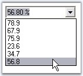

::: {style="DISPLAY: none"}
{#d2h_url_template}{#d2h_package_url style="WIDTH: 0px; DISPLAY: none; HEIGHT: 0px"}
:::

::::::: {.d2h_secondary_topic style="PADDING-BOTTOM: 10pt; MARGIN: 0pt; PADDING-LEFT: 0pt; PADDING-RIGHT: 0pt; PADDING-TOP: 0pt"}
##### Event Handling {#event-handling style="tab-stops: 0pt"}

Selection Events

**[]{style="COLOR: #15428b"}** 

The events present in the ComboxBox can be applied for ComboxBoxAdv control.

[]{style="COLOR: #15428b"} 

::: {align="center"}
  -------------------------- ---------------------------------------------------------
  ComboBoxAdv Events         Description
  SelectedIndexChanged       Handled when SelectedIndex property is changed.
  SelectedIndexChanging      Handled when SelectedIndex property is changing.
  SelectedValueChanged       Handled when SelectedValue property is changed.
  SelectionChangeCommitted   Handled when the user selects a new text for the combo.
  DropDown Event             Handled before the dropdown is shown.
  -------------------------- ---------------------------------------------------------
:::

 

The ComboBoxAdv handles different events for the different user interaction scenarios. The occurrence and order of the events are tabulated below.

[]{style="COLOR: #15428b"} 

::: {align="center"}
  ----------------------------------------------- -------------------------------------------------------- ---------------------- ---------------------- ----------------------
  Scenarios                                       SelectionChangedCommitted Event                          SelectedValueChanged   SelectedIndexChanged   Validating/Validated
  TextArea-Change Selection by Keys               Yes:1                                                    Yes:2                  Yes:3                  No
  TextArea-On AutoComplete                        No                                                       No                     No                     No
  Drop-Down List-Change Selection by Keys         No                                                       Yes:1                  Yes:2                  No
  Drop-Down List-Change Selection by Mouse Move   No                                                       No                     No                     No
  Drop-Down Close by Enter Key                    Yes:1                                                    No                     No                     No
  Drop-Down Close by Escape Key                   No                                                       No                     No                     No
  Drop-Down Close by Click                        Yes:1                                                    Yes:2                  Yes:3                  No
  Losing Focus                                    Yes:2 (in DropDownStyle.DropDown (editable) mode only)   No                     No                     Yes:1
  Changing Text Property in Code                  Yes:1                                                    No                     No                     No
  ----------------------------------------------- -------------------------------------------------------- ---------------------- ---------------------- ----------------------
:::

**[]{style="COLOR: #15428b"}** 

Selection Events

**[]{style="COLOR: #15428b"}** 

The events present in the ComboxBox can be applied for ComboxBoxAdv control.

[]{style="COLOR: #15428b"} 

::: {align="center"}
  -------------------------- ---------------------------------------------------------
  ComboBoxAdv Events         Description
  SelectedIndexChanged       Handled when SelectedIndex property is changed.
  SelectedIndexChanging      Handled when SelectedIndex property is changing.
  SelectedValueChanged       Handled when SelectedValue property is changed.
  SelectionChangeCommitted   Handled when the user selects a new text for the combo.
  DropDown Event             Handled before the dropdown is shown.
  -------------------------- ---------------------------------------------------------
:::

[]{style="COLOR: #15428b"} 

The ComboBoxAdv handles different events for the different user interaction scenarios. The occurrence and order of the events are tabulated below.

[]{style="COLOR: #15428b"} 

::: {align="center"}
  ----------------------------------------------- -------------------------------------------------------- ---------------------- ---------------------- ----------------------
  Scenarios                                       SelectionChangedCommitted Event                          SelectedValueChanged   SelectedIndexChanged   Validating/Validated
  TextArea-Change Selection by Keys               Yes:1                                                    Yes:2                  Yes:3                  No
  TextArea-On AutoComplete                        No                                                       No                     No                     No
  Drop-Down List-Change Selection by Keys         No                                                       Yes:1                  Yes:2                  No
  Drop-Down List-Change Selection by Mouse Move   No                                                       No                     No                     No
  Drop-Down Close by Enter Key                    Yes:1                                                    No                     No                     No
  Drop-Down Close by Escape Key                   No                                                       No                     No                     No
  Drop-Down Close by Click                        Yes:1                                                    Yes:2                  Yes:3                  No
  Losing Focus                                    Yes:2 (in DropDownStyle.DropDown (editable) mode only)   No                     No                     Yes:1
  Changing Text Property in Code                  Yes:1                                                    No                     No                     No
  ----------------------------------------------- -------------------------------------------------------- ---------------------- ---------------------- ----------------------
:::

###### []{#p402}3.3.5.2.4.1 Populating the ComboBoxAdv {#populating-the-comboboxadv style="tab-stops: 0pt"}

[]{style="COLOR: #15428b"} 

To Populate the ComboBoxAdv containing predefined percent values with other percent values and allowing the text field of the ComboBoxAdv to behave like PercentTextBox

[]{style="COLOR: #15428b"} 

1.   Derive a new class from the existing Syncfusion ComboBoxAdv. Override as shown below and give a new definition for TextBox.

[]{style="COLOR: #15428b"} 

+----------------------------------------------------------------------------------------------------------------------------------------------------------------------------------------------------------------------------------------------------------------------------+
| **[\[C#\]]{style="FONT-FAMILY: 'Courier New'; COLOR: black"}**                                                                                                                                                                                                             |
|                                                                                                                                                                                                                                                                            |
| **[]{style="FONT-FAMILY: 'Courier New'; COLOR: black"}**                                                                                                                                                                                                                   |
|                                                                                                                                                                                                                                                                            |
| [// Derive a new class from the existing Syncfusion ComboBoxAdv.]{style="FONT-FAMILY: 'Courier New'; COLOR: green"}                                                                                                                                                        |
|                                                                                                                                                                                                                                                                            |
| [public class]{style="FONT-FAMILY: 'Courier New'; COLOR: blue"}[ PercentComboBoxAdv : Syncfusion.Windows.Forms.Tools.ComboBoxAdv ]{style="FONT-FAMILY: 'Courier New'; COLOR: black"}                                                                                       |
|                                                                                                                                                                                                                                                                            |
| [{]{style="FONT-FAMILY: 'Courier New'; COLOR: black"}                                                                                                                                                                                                                      |
|                                                                                                                                                                                                                                                                            |
| [// Overrides the internal TextBox.]{style="FONT-FAMILY: 'Courier New'; COLOR: green"}                                                                                                                                                                                     |
|                                                                                                                                                                                                                                                                            |
| [protected override ]{style="FONT-FAMILY: 'Courier New'; COLOR: blue"}[TextBox CreateTextBox()]{style="FONT-FAMILY: 'Courier New'; COLOR: black"}                                                                                                                          |
|                                                                                                                                                                                                                                                                            |
| [{]{style="FONT-FAMILY: 'Courier New'; COLOR: black"}                                                                                                                                                                                                                      |
|                                                                                                                                                                                                                                                                            |
| [     Syncfusion.Windows.Forms.Tools.PercentTextBox  ptb =]{style="FONT-FAMILY: 'Courier New'; COLOR: black"}[ new]{style="FONT-FAMILY: 'Courier New'; COLOR: blue"}[ Syncfusion.Windows.Forms.Tools.PercentTextBox ();]{style="FONT-FAMILY: 'Courier New'; COLOR: black"} |
|                                                                                                                                                                                                                                                                            |
| [     return ]{style="FONT-FAMILY: 'Courier New'; COLOR: blue"}[ptb ]{style="FONT-FAMILY: 'Courier New'; COLOR: black"}[as]{style="FONT-FAMILY: 'Courier New'; COLOR: blue"}[ TextBox;]{style="FONT-FAMILY: 'Courier New'; COLOR: black"}                                  |
|                                                                                                                                                                                                                                                                            |
| [}]{style="FONT-FAMILY: 'Courier New'; COLOR: black"}                                                                                                                                                                                                                      |
|                                                                                                                                                                                                                                                                            |
| []{style="FONT-FAMILY: 'Courier New'; COLOR: black"}                                                                                                                                                                                                                       |
|                                                                                                                                                                                                                                                                            |
| [public new]{style="FONT-FAMILY: 'Courier New'; COLOR: blue"}[ Syncfusion.Windows.Forms.Tools.PercentTextBox TextBox]{style="FONT-FAMILY: 'Courier New'; COLOR: black"}                                                                                                    |
|                                                                                                                                                                                                                                                                            |
| [{]{style="FONT-FAMILY: 'Courier New'; COLOR: black"}                                                                                                                                                                                                                      |
|                                                                                                                                                                                                                                                                            |
| [    get]{style="FONT-FAMILY: 'Courier New'; COLOR: blue"}                                                                                                                                                                                                                 |
|                                                                                                                                                                                                                                                                            |
| [   {]{style="FONT-FAMILY: 'Courier New'; COLOR: black"}                                                                                                                                                                                                                   |
|                                                                                                                                                                                                                                                                            |
| [      return]{style="FONT-FAMILY: 'Courier New'; COLOR: blue"}[ (Syncfusion.Windows.Forms.Tools.PercentTextBox ) base.TextBox;]{style="FONT-FAMILY: 'Courier New'; COLOR: black"}                                                                                         |
|                                                                                                                                                                                                                                                                            |
| [   }]{style="FONT-FAMILY: 'Courier New'; COLOR: black"}                                                                                                                                                                                                                   |
|                                                                                                                                                                                                                                                                            |
| [}     ]{style="FONT-FAMILY: 'Courier New'; COLOR: black"}                                                                                                                                                                                                                 |
|                                                                                                                                                                                                                                                                            |
| [}]{style="FONT-FAMILY: 'Courier New'; COLOR: black"}                                                                                                                                                                                                                      |
+----------------------------------------------------------------------------------------------------------------------------------------------------------------------------------------------------------------------------------------------------------------------------+

[]{style="COLOR: #15428b"} 

+---------------------------------------------------------------------------------------------------------------------------------------------------------------------------------------------------------------------------------------------------------------------------------------------------------------------------------------------------------------------------------------------------------------------------------------------------------------------------------------------+
| **[\[VB.NET\]]{style="FONT-FAMILY: 'Courier New'; COLOR: black"}**                                                                                                                                                                                                                                                                                                                                                                                                                          |
|                                                                                                                                                                                                                                                                                                                                                                                                                                                                                             |
| **[]{style="FONT-FAMILY: 'Courier New'; COLOR: black"}**                                                                                                                                                                                                                                                                                                                                                                                                                                    |
|                                                                                                                                                                                                                                                                                                                                                                                                                                                                                             |
| [\' Derive a new class from the existing Syncfusion ComboBoxAdv.]{style="FONT-FAMILY: 'Courier New'; COLOR: green"}                                                                                                                                                                                                                                                                                                                                                                         |
|                                                                                                                                                                                                                                                                                                                                                                                                                                                                                             |
| [Public Class]{style="FONT-FAMILY: 'Courier New'; COLOR: blue"}[ PercentComboBoxAdv : ]{style="FONT-FAMILY: 'Courier New'; COLOR: black"}[Inherits]{style="FONT-FAMILY: 'Courier New'; COLOR: blue"}[ Syncfusion.Windows.Forms.Tools.ComboBoxAdv]{style="FONT-FAMILY: 'Courier New'; COLOR: black"}                                                                                                                                                                                         |
|                                                                                                                                                                                                                                                                                                                                                                                                                                                                                             |
| [\' Overrides the internal TextBox.]{style="FONT-FAMILY: 'Courier New'; COLOR: green"}                                                                                                                                                                                                                                                                                                                                                                                                      |
|                                                                                                                                                                                                                                                                                                                                                                                                                                                                                             |
| [Protected Overrides Function]{style="FONT-FAMILY: 'Courier New'; COLOR: blue"}[ CreateTextBox() ]{style="FONT-FAMILY: 'Courier New'; COLOR: black"}[As]{style="FONT-FAMILY: 'Courier New'; COLOR: blue"}[ TextBox]{style="FONT-FAMILY: 'Courier New'; COLOR: black"}                                                                                                                                                                                                                       |
|                                                                                                                                                                                                                                                                                                                                                                                                                                                                                             |
| [Dim]{style="FONT-FAMILY: 'Courier New'; COLOR: blue"}[ ptb ]{style="FONT-FAMILY: 'Courier New'; COLOR: black"}[As]{style="FONT-FAMILY: 'Courier New'; COLOR: blue"}[ Syncfusion.Windows.Forms.Tools.PercentTextBox = ]{style="FONT-FAMILY: 'Courier New'; COLOR: black"}[New]{style="FONT-FAMILY: 'Courier New'; COLOR: blue"}[ Syncfusion.Windows.Forms.Tools.PercentTextBox ()]{style="FONT-FAMILY: 'Courier New'; COLOR: black"}                                                        |
|                                                                                                                                                                                                                                                                                                                                                                                                                                                                                             |
| [Return CType]{style="FONT-FAMILY: 'Courier New'; COLOR: blue"}[(IIf(]{style="FONT-FAMILY: 'Courier New'; COLOR: black"}[TypeOf]{style="FONT-FAMILY: 'Courier New'; COLOR: blue"}[ ptb ]{style="FONT-FAMILY: 'Courier New'; COLOR: black"}[Is]{style="FONT-FAMILY: 'Courier New'; COLOR: blue"}[ TextBox, ptb, ]{style="FONT-FAMILY: 'Courier New'; COLOR: black"}[Nothing]{style="FONT-FAMILY: 'Courier New'; COLOR: blue"}[), TextBox)]{style="FONT-FAMILY: 'Courier New'; COLOR: black"} |
|                                                                                                                                                                                                                                                                                                                                                                                                                                                                                             |
| [End Function]{style="FONT-FAMILY: 'Courier New'; COLOR: blue"}                                                                                                                                                                                                                                                                                                                                                                                                                             |
|                                                                                                                                                                                                                                                                                                                                                                                                                                                                                             |
| []{style="FONT-FAMILY: 'Courier New'; COLOR: black"}                                                                                                                                                                                                                                                                                                                                                                                                                                        |
|                                                                                                                                                                                                                                                                                                                                                                                                                                                                                             |
| [Public Shadows ReadOnly Property]{style="FONT-FAMILY: 'Courier New'; COLOR: blue"}[ TextBox() ]{style="FONT-FAMILY: 'Courier New'; COLOR: black"}[As]{style="FONT-FAMILY: 'Courier New'; COLOR: blue"}[ Syncfusion.Windows.Forms.Tools.PercentTextBox]{style="FONT-FAMILY: 'Courier New'; COLOR: black"}                                                                                                                                                                                   |
|                                                                                                                                                                                                                                                                                                                                                                                                                                                                                             |
| [Get]{style="FONT-FAMILY: 'Courier New'; COLOR: blue"}                                                                                                                                                                                                                                                                                                                                                                                                                                      |
|                                                                                                                                                                                                                                                                                                                                                                                                                                                                                             |
| [Return CType]{style="FONT-FAMILY: 'Courier New'; COLOR: blue"}[(MyBase.TextBox, Syncfusion.Windows.Forms.Tools.PercentTextBox)]{style="FONT-FAMILY: 'Courier New'; COLOR: black"}                                                                                                                                                                                                                                                                                                          |
|                                                                                                                                                                                                                                                                                                                                                                                                                                                                                             |
| [End Get]{style="FONT-FAMILY: 'Courier New'; COLOR: blue"}                                                                                                                                                                                                                                                                                                                                                                                                                                  |
|                                                                                                                                                                                                                                                                                                                                                                                                                                                                                             |
| [End Property]{style="FONT-FAMILY: 'Courier New'; COLOR: blue"}[ ]{style="FONT-FAMILY: 'Courier New'; COLOR: black"}                                                                                                                                                                                                                                                                                                                                                                        |
|                                                                                                                                                                                                                                                                                                                                                                                                                                                                                             |
| [End Class]{style="FONT-FAMILY: 'Courier New'; COLOR: blue"}                                                                                                                                                                                                                                                                                                                                                                                                                                |
+---------------------------------------------------------------------------------------------------------------------------------------------------------------------------------------------------------------------------------------------------------------------------------------------------------------------------------------------------------------------------------------------------------------------------------------------------------------------------------------------+

[]{style="COLOR: #15428b"} 

2.   Create an instance for the derived class and initialize.

[]{style="COLOR: #15428b"} 

+------------------------------------------------------------------------------------------------------------------------------------------------------------------------------------------------------------------------------------------------------------------------------------------------------------------------------------------------------------------------------------------------------------------------------------------------------------------------------------------------------------------------+
| **[\[C#\]]{style="FONT-FAMILY: 'Courier New'; COLOR: black"}**                                                                                                                                                                                                                                                                                                                                                                                                                                                         |
|                                                                                                                                                                                                                                                                                                                                                                                                                                                                                                                        |
| **[]{style="FONT-FAMILY: 'Courier New'; COLOR: black"}**                                                                                                                                                                                                                                                                                                                                                                                                                                                               |
|                                                                                                                                                                                                                                                                                                                                                                                                                                                                                                                        |
| [// Do the initialization.]{style="FONT-FAMILY: 'Courier New'; COLOR: green"}                                                                                                                                                                                                                                                                                                                                                                                                                                          |
|                                                                                                                                                                                                                                                                                                                                                                                                                                                                                                                        |
| [private]{style="FONT-FAMILY: 'Courier New'; COLOR: blue"}[ PercentComboBoxAdv PercentComboBoxAdv1;]{style="FONT-FAMILY: 'Courier New'; COLOR: black"}                                                                                                                                                                                                                                                                                                                                                                 |
|                                                                                                                                                                                                                                                                                                                                                                                                                                                                                                                        |
| [this]{style="FONT-FAMILY: 'Courier New'; COLOR: blue"}[.PercentComboBoxAdv1 = ]{style="FONT-FAMILY: 'Courier New'; COLOR: black"}[new]{style="FONT-FAMILY: 'Courier New'; COLOR: blue"}[ PercentComboBoxAdv();]{style="FONT-FAMILY: 'Courier New'; COLOR: black"}                                                                                                                                                                                                                                                     |
|                                                                                                                                                                                                                                                                                                                                                                                                                                                                                                                        |
| [this]{style="FONT-FAMILY: 'Courier New'; COLOR: blue"}[.PercentComboBoxAdv1.Location = ]{style="FONT-FAMILY: 'Courier New'; COLOR: black"}[new]{style="FONT-FAMILY: 'Courier New'; COLOR: blue"}[ System.Drawing.Point(]{style="FONT-FAMILY: 'Courier New'; COLOR: black"}[this]{style="FONT-FAMILY: 'Courier New'; COLOR: blue"}[.Width/4, ]{style="FONT-FAMILY: 'Courier New'; COLOR: black"}[this]{style="FONT-FAMILY: 'Courier New'; COLOR: blue"}[.Height/3);]{style="FONT-FAMILY: 'Courier New'; COLOR: black"} |
|                                                                                                                                                                                                                                                                                                                                                                                                                                                                                                                        |
| [this]{style="FONT-FAMILY: 'Courier New'; COLOR: blue"}[.Controls.Add(]{style="FONT-FAMILY: 'Courier New'; COLOR: black"}[this]{style="FONT-FAMILY: 'Courier New'; COLOR: blue"}[.PercentComboBoxAdv1);]{style="FONT-FAMILY: 'Courier New'; COLOR: black"}                                                                                                                                                                                                                                                             |
|                                                                                                                                                                                                                                                                                                                                                                                                                                                                                                                        |
| [this]{style="FONT-FAMILY: 'Courier New'; COLOR: blue"}[.PercentComboBoxAdv1 .SelectedValueChanged+= ]{style="FONT-FAMILY: 'Courier New'; COLOR: black"}[new]{style="FONT-FAMILY: 'Courier New'; COLOR: blue"}[ System.EventHandler(]{style="FONT-FAMILY: 'Courier New'; COLOR: black"}[this]{style="FONT-FAMILY: 'Courier New'; COLOR: blue"}[.PercentComboBoxAdv1_SelectedValueChanged);]{style="FONT-FAMILY: 'Courier New'; COLOR: black"}                                                                          |
+------------------------------------------------------------------------------------------------------------------------------------------------------------------------------------------------------------------------------------------------------------------------------------------------------------------------------------------------------------------------------------------------------------------------------------------------------------------------------------------------------------------------+

[]{style="COLOR: #15428b"} 

+-----------------------------------------------------------------------------------------------------------------------------------------------------------------------------------------------------------------------------------------------------------------------------------------------------------------------------------------------------------------------------------------------------------------------------------------------------------------------------------------------------------------+
| **[\[VB.NET\]]{style="FONT-FAMILY: 'Courier New'; COLOR: black"}**                                                                                                                                                                                                                                                                                                                                                                                                                                              |
|                                                                                                                                                                                                                                                                                                                                                                                                                                                                                                                 |
| **[]{style="FONT-FAMILY: 'Courier New'; COLOR: black"}**                                                                                                                                                                                                                                                                                                                                                                                                                                                        |
|                                                                                                                                                                                                                                                                                                                                                                                                                                                                                                                 |
| [\' Do the initialization.]{style="FONT-FAMILY: 'Courier New'; COLOR: green"}                                                                                                                                                                                                                                                                                                                                                                                                                                   |
|                                                                                                                                                                                                                                                                                                                                                                                                                                                                                                                 |
| [Private]{style="FONT-FAMILY: 'Courier New'; COLOR: blue"}[ PercentComboBoxAdv1 ]{style="FONT-FAMILY: 'Courier New'; COLOR: black"}[As]{style="FONT-FAMILY: 'Courier New'; COLOR: blue"}[ PercentComboBoxAdv]{style="FONT-FAMILY: 'Courier New'; COLOR: black"}                                                                                                                                                                                                                                                 |
|                                                                                                                                                                                                                                                                                                                                                                                                                                                                                                                 |
| [Me]{style="FONT-FAMILY: 'Courier New'; COLOR: blue"}[.PercentComboBoxAdv1 = ]{style="FONT-FAMILY: 'Courier New'; COLOR: black"}[New]{style="FONT-FAMILY: 'Courier New'; COLOR: blue"}[ PercentComboBoxAdv()]{style="FONT-FAMILY: 'Courier New'; COLOR: black"}                                                                                                                                                                                                                                                 |
|                                                                                                                                                                                                                                                                                                                                                                                                                                                                                                                 |
| [Me]{style="FONT-FAMILY: 'Courier New'; COLOR: blue"}[.PercentComboBoxAdv1.Location = ]{style="FONT-FAMILY: 'Courier New'; COLOR: black"}[New]{style="FONT-FAMILY: 'Courier New'; COLOR: blue"}[ System.Drawing.Point(]{style="FONT-FAMILY: 'Courier New'; COLOR: black"}[Me]{style="FONT-FAMILY: 'Courier New'; COLOR: blue"}[.Width/4, ]{style="FONT-FAMILY: 'Courier New'; COLOR: black"}[Me]{style="FONT-FAMILY: 'Courier New'; COLOR: blue"}[.Height/3)]{style="FONT-FAMILY: 'Courier New'; COLOR: black"} |
|                                                                                                                                                                                                                                                                                                                                                                                                                                                                                                                 |
| [Me]{style="FONT-FAMILY: 'Courier New'; COLOR: blue"}[.Controls.Add(]{style="FONT-FAMILY: 'Courier New'; COLOR: black"}[Me]{style="FONT-FAMILY: 'Courier New'; COLOR: blue"}[.PercentComboBoxAdv1)]{style="FONT-FAMILY: 'Courier New'; COLOR: black"}                                                                                                                                                                                                                                                           |
|                                                                                                                                                                                                                                                                                                                                                                                                                                                                                                                 |
| [Me]{style="FONT-FAMILY: 'Courier New'; COLOR: blue"}[.PercentComboBoxAdv1.SelectedValueChanged+= ]{style="FONT-FAMILY: 'Courier New'; COLOR: black"}[New]{style="FONT-FAMILY: 'Courier New'; COLOR: blue"}[ System.EventHandler(]{style="FONT-FAMILY: 'Courier New'; COLOR: black"}[Me]{style="FONT-FAMILY: 'Courier New'; COLOR: blue"}[.PercentComboBoxAdv1_SelectedValueChanged)]{style="FONT-FAMILY: 'Courier New'; COLOR: black"}                                                                         |
+-----------------------------------------------------------------------------------------------------------------------------------------------------------------------------------------------------------------------------------------------------------------------------------------------------------------------------------------------------------------------------------------------------------------------------------------------------------------------------------------------------------------+

[]{style="COLOR: #15428b"} 

3.   You can populate the derived control with values using **Items** property.

[]{style="COLOR: #15428b"} 

+--------------------------------------------------------------------------------------------------------------------------------------------------------------------------------------------------------------------------------------------------------------------------+
| **[\[C#\]]{style="FONT-FAMILY: 'Courier New'; COLOR: black"}**                                                                                                                                                                                                           |
|                                                                                                                                                                                                                                                                          |
| **[]{style="FONT-FAMILY: 'Courier New'; COLOR: black"}**                                                                                                                                                                                                                 |
|                                                                                                                                                                                                                                                                          |
| [private void]{style="FONT-FAMILY: 'Courier New'; COLOR: blue"}[ Form1_Load(]{style="FONT-FAMILY: 'Courier New'; COLOR: black"}[object]{style="FONT-FAMILY: 'Courier New'; COLOR: blue"}[ sender, System.EventArgs e)]{style="FONT-FAMILY: 'Courier New'; COLOR: black"} |
|                                                                                                                                                                                                                                                                          |
| [{]{style="FONT-FAMILY: 'Courier New'; COLOR: black"}                                                                                                                                                                                                                    |
|                                                                                                                                                                                                                                                                          |
| [ ]{style="FONT-FAMILY: 'Courier New'; COLOR: black"}[ // Populating the control with items.]{style="FONT-FAMILY: 'Courier New'; COLOR: green"}                                                                                                                          |
|                                                                                                                                                                                                                                                                          |
| [this]{style="FONT-FAMILY: 'Courier New'; COLOR: blue"}[.PercentComboBoxAdv1.Items.Add (78.9);]{style="FONT-FAMILY: 'Courier New'; COLOR: black"}                                                                                                                        |
|                                                                                                                                                                                                                                                                          |
| [this]{style="FONT-FAMILY: 'Courier New'; COLOR: blue"}[.PercentComboBoxAdv1.Items.Add (67.9);]{style="FONT-FAMILY: 'Courier New'; COLOR: black"}                                                                                                                        |
|                                                                                                                                                                                                                                                                          |
| [this]{style="FONT-FAMILY: 'Courier New'; COLOR: blue"}[.PercentComboBoxAdv1.Items.Add (75.9);]{style="FONT-FAMILY: 'Courier New'; COLOR: black"}                                                                                                                        |
|                                                                                                                                                                                                                                                                          |
| [this]{style="FONT-FAMILY: 'Courier New'; COLOR: blue"}[.PercentComboBoxAdv1.Items.Add (23.6);]{style="FONT-FAMILY: 'Courier New'; COLOR: black"}                                                                                                                        |
|                                                                                                                                                                                                                                                                          |
| [this]{style="FONT-FAMILY: 'Courier New'; COLOR: blue"}[.PercentComboBoxAdv1.Items.Add (34.7);]{style="FONT-FAMILY: 'Courier New'; COLOR: black"}                                                                                                                        |
|                                                                                                                                                                                                                                                                          |
| [this]{style="FONT-FAMILY: 'Courier New'; COLOR: blue"}[.PercentComboBoxAdv1.Items.Add (56.8);]{style="FONT-FAMILY: 'Courier New'; COLOR: black"}                                                                                                                        |
|                                                                                                                                                                                                                                                                          |
| [}]{style="FONT-FAMILY: 'Courier New'; COLOR: black"}                                                                                                                                                                                                                    |
+--------------------------------------------------------------------------------------------------------------------------------------------------------------------------------------------------------------------------------------------------------------------------+

[]{style="COLOR: #15428b"} 

+----------------------------------------------------------------------------------------------------------------------------------------------------------------------------------------------------------------------------------------------------------------------------------------------------------------------------------------------------------------------------------------------------------------------------------------------------------------------------------------------------------------------------------------------------------------------------------------------------------------+
| **[\[VB.NET\]]{style="FONT-FAMILY: 'Courier New'; COLOR: black"}**                                                                                                                                                                                                                                                                                                                                                                                                                                                                                                                                             |
|                                                                                                                                                                                                                                                                                                                                                                                                                                                                                                                                                                                                                |
| **[]{style="FONT-FAMILY: 'Courier New'; COLOR: black"}**                                                                                                                                                                                                                                                                                                                                                                                                                                                                                                                                                       |
|                                                                                                                                                                                                                                                                                                                                                                                                                                                                                                                                                                                                                |
| [Private Sub]{style="FONT-FAMILY: 'Courier New'; COLOR: blue"}[ Form1_Load(]{style="FONT-FAMILY: 'Courier New'; COLOR: black"}[ByVal]{style="FONT-FAMILY: 'Courier New'; COLOR: blue"}[ sender ]{style="FONT-FAMILY: 'Courier New'; COLOR: black"}[As Object]{style="FONT-FAMILY: 'Courier New'; COLOR: blue"}[, ]{style="FONT-FAMILY: 'Courier New'; COLOR: black"}[ByVal]{style="FONT-FAMILY: 'Courier New'; COLOR: blue"}[ e ]{style="FONT-FAMILY: 'Courier New'; COLOR: black"}[As]{style="FONT-FAMILY: 'Courier New'; COLOR: blue"}[ System.EventArgs)]{style="FONT-FAMILY: 'Courier New'; COLOR: black"} |
|                                                                                                                                                                                                                                                                                                                                                                                                                                                                                                                                                                                                                |
| []{style="FONT-FAMILY: 'Courier New'; COLOR: black"}                                                                                                                                                                                                                                                                                                                                                                                                                                                                                                                                                           |
|                                                                                                                                                                                                                                                                                                                                                                                                                                                                                                                                                                                                                |
| [ ]{style="FONT-FAMILY: 'Courier New'; COLOR: black"}[\' Populating the control with items.]{style="FONT-FAMILY: 'Courier New'; COLOR: green"}                                                                                                                                                                                                                                                                                                                                                                                                                                                                 |
|                                                                                                                                                                                                                                                                                                                                                                                                                                                                                                                                                                                                                |
| [Me]{style="FONT-FAMILY: 'Courier New'; COLOR: blue"}[.PercentComboBoxAdv1.Items.Add (78.9)]{style="FONT-FAMILY: 'Courier New'; COLOR: black"}                                                                                                                                                                                                                                                                                                                                                                                                                                                                 |
|                                                                                                                                                                                                                                                                                                                                                                                                                                                                                                                                                                                                                |
| [Me]{style="FONT-FAMILY: 'Courier New'; COLOR: blue"}[.PercentComboBoxAdv1.Items.Add (67.9)]{style="FONT-FAMILY: 'Courier New'; COLOR: black"}                                                                                                                                                                                                                                                                                                                                                                                                                                                                 |
|                                                                                                                                                                                                                                                                                                                                                                                                                                                                                                                                                                                                                |
| [Me]{style="FONT-FAMILY: 'Courier New'; COLOR: blue"}[.PercentComboBoxAdv1.Items.Add (75.9)]{style="FONT-FAMILY: 'Courier New'; COLOR: black"}                                                                                                                                                                                                                                                                                                                                                                                                                                                                 |
|                                                                                                                                                                                                                                                                                                                                                                                                                                                                                                                                                                                                                |
| [Me]{style="FONT-FAMILY: 'Courier New'; COLOR: blue"}[.PercentComboBoxAdv1.Items.Add (23.6)]{style="FONT-FAMILY: 'Courier New'; COLOR: black"}                                                                                                                                                                                                                                                                                                                                                                                                                                                                 |
|                                                                                                                                                                                                                                                                                                                                                                                                                                                                                                                                                                                                                |
| [Me]{style="FONT-FAMILY: 'Courier New'; COLOR: blue"}[.PercentComboBoxAdv1.Items.Add (34.7)]{style="FONT-FAMILY: 'Courier New'; COLOR: black"}                                                                                                                                                                                                                                                                                                                                                                                                                                                                 |
|                                                                                                                                                                                                                                                                                                                                                                                                                                                                                                                                                                                                                |
| [Me]{style="FONT-FAMILY: 'Courier New'; COLOR: blue"}[.PercentComboBoxAdv1.Items.Add (56.8)]{style="FONT-FAMILY: 'Courier New'; COLOR: black"}                                                                                                                                                                                                                                                                                                                                                                                                                                                                 |
|                                                                                                                                                                                                                                                                                                                                                                                                                                                                                                                                                                                                                |
| []{style="FONT-FAMILY: 'Courier New'; COLOR: black"}                                                                                                                                                                                                                                                                                                                                                                                                                                                                                                                                                           |
|                                                                                                                                                                                                                                                                                                                                                                                                                                                                                                                                                                                                                |
| [End Sub]{style="FONT-FAMILY: 'Courier New'; COLOR: blue"}                                                                                                                                                                                                                                                                                                                                                                                                                                                                                                                                                     |
+----------------------------------------------------------------------------------------------------------------------------------------------------------------------------------------------------------------------------------------------------------------------------------------------------------------------------------------------------------------------------------------------------------------------------------------------------------------------------------------------------------------------------------------------------------------------------------------------------------------+

[]{style="COLOR: #15428b"} 

4.   In the **SelectedValueChanged** event, you can display the corresponding selected value in Percent Format.

[               ]{style="FONT-FAMILY: 'Times New Roman','serif'"}

+---------------------------------------------------------------------------------------------------------------------------------------------------------------------------------------------------------------------------------------------------------------------------------------------------------------------------------------------------------------------------------------------------------------------------------------+
| **[\[C#\]]{style="FONT-FAMILY: 'Courier New'; COLOR: black"}**                                                                                                                                                                                                                                                                                                                                                                        |
|                                                                                                                                                                                                                                                                                                                                                                                                                                       |
| **[]{style="FONT-FAMILY: 'Courier New'; COLOR: black"}**                                                                                                                                                                                                                                                                                                                                                                              |
|                                                                                                                                                                                                                                                                                                                                                                                                                                       |
| [private void]{style="FONT-FAMILY: 'Courier New'; COLOR: blue"}[ PercentComboBoxAdv1_SelectedValueChanged(]{style="FONT-FAMILY: 'Courier New'; COLOR: black"}[object]{style="FONT-FAMILY: 'Courier New'; COLOR: blue"}[ sender, System.EventArgs e)]{style="FONT-FAMILY: 'Courier New'; COLOR: black"}                                                                                                                                |
|                                                                                                                                                                                                                                                                                                                                                                                                                                       |
| [{  ]{style="FONT-FAMILY: 'Courier New'; COLOR: black"}                                                                                                                                                                                                                                                                                                                                                                               |
|                                                                                                                                                                                                                                                                                                                                                                                                                                       |
| [ ]{style="FONT-FAMILY: 'Courier New'; COLOR: black"}[ // Displays the  corresponding selected value.]{style="FONT-FAMILY: 'Courier New'; COLOR: green"}[                    ]{style="FONT-FAMILY: 'Courier New'; COLOR: black"}                                                                                                                                                                                                      |
|                                                                                                                                                                                                                                                                                                                                                                                                                                       |
| [this]{style="FONT-FAMILY: 'Courier New'; COLOR: blue"}[.PercentComboBoxAdv1.TextBox.PercentValue = ]{style="FONT-FAMILY: 'Courier New'; COLOR: black"}[Double]{style="FONT-FAMILY: 'Courier New'; COLOR: blue"}[.Parse (]{style="FONT-FAMILY: 'Courier New'; COLOR: black"}[this]{style="FONT-FAMILY: 'Courier New'; COLOR: blue"}[.PercentComboBoxAdv1.SelectedItem.ToString());]{style="FONT-FAMILY: 'Courier New'; COLOR: black"} |
|                                                                                                                                                                                                                                                                                                                                                                                                                                       |
| [}]{style="FONT-FAMILY: 'Courier New'; COLOR: black"}                                                                                                                                                                                                                                                                                                                                                                                 |
+---------------------------------------------------------------------------------------------------------------------------------------------------------------------------------------------------------------------------------------------------------------------------------------------------------------------------------------------------------------------------------------------------------------------------------------+

[]{style="COLOR: #15428b"} 

+----------------------------------------------------------------------------------------------------------------------------------------------------------------------------------------------------------------------------------------------------------------------------------------------------------------------------------------------------------------------------------------------------------------------------------------------------------------------------------------------------------------------------------------------------------------------------------------------------------------------------------------------+
| **[\[VB.NET\]]{style="FONT-FAMILY: 'Courier New'; COLOR: black"}**                                                                                                                                                                                                                                                                                                                                                                                                                                                                                                                                                                           |
|                                                                                                                                                                                                                                                                                                                                                                                                                                                                                                                                                                                                                                              |
| **[]{style="FONT-FAMILY: 'Courier New'; COLOR: black"}**                                                                                                                                                                                                                                                                                                                                                                                                                                                                                                                                                                                     |
|                                                                                                                                                                                                                                                                                                                                                                                                                                                                                                                                                                                                                                              |
| [Private Sub]{style="FONT-FAMILY: 'Courier New'; COLOR: blue"}[ PercentComboBoxAdv1_SelectedValueChanged(]{style="FONT-FAMILY: 'Courier New'; COLOR: black"}[ByVal]{style="FONT-FAMILY: 'Courier New'; COLOR: blue"}[ sender ]{style="FONT-FAMILY: 'Courier New'; COLOR: black"}[As Object]{style="FONT-FAMILY: 'Courier New'; COLOR: blue"}[, ]{style="FONT-FAMILY: 'Courier New'; COLOR: black"}[ByVal]{style="FONT-FAMILY: 'Courier New'; COLOR: blue"}[ e ]{style="FONT-FAMILY: 'Courier New'; COLOR: black"}[As]{style="FONT-FAMILY: 'Courier New'; COLOR: blue"}[ System.EventArgs)]{style="FONT-FAMILY: 'Courier New'; COLOR: black"} |
|                                                                                                                                                                                                                                                                                                                                                                                                                                                                                                                                                                                                                                              |
| []{style="FONT-FAMILY: 'Courier New'; COLOR: black"}                                                                                                                                                                                                                                                                                                                                                                                                                                                                                                                                                                                         |
|                                                                                                                                                                                                                                                                                                                                                                                                                                                                                                                                                                                                                                              |
| [  \' Displays the  corresponding selected value.]{style="FONT-FAMILY: 'Courier New'; COLOR: green"}                                                                                                                                                                                                                                                                                                                                                                                                                                                                                                                                         |
|                                                                                                                                                                                                                                                                                                                                                                                                                                                                                                                                                                                                                                              |
| [Me]{style="FONT-FAMILY: 'Courier New'; COLOR: blue"}[.PercentComboBoxAdv1.TextBox.PercentValue = ]{style="FONT-FAMILY: 'Courier New'; COLOR: black"}[Double]{style="FONT-FAMILY: 'Courier New'; COLOR: blue"}[.Parse (]{style="FONT-FAMILY: 'Courier New'; COLOR: black"}[Me]{style="FONT-FAMILY: 'Courier New'; COLOR: blue"}[.PercentComboBoxAdv1.SelectedItem.ToString())]{style="FONT-FAMILY: 'Courier New'; COLOR: black"}                                                                                                                                                                                                             |
|                                                                                                                                                                                                                                                                                                                                                                                                                                                                                                                                                                                                                                              |
| [End Sub]{style="FONT-FAMILY: 'Courier New'; COLOR: blue"}                                                                                                                                                                                                                                                                                                                                                                                                                                                                                                                                                                                   |
+----------------------------------------------------------------------------------------------------------------------------------------------------------------------------------------------------------------------------------------------------------------------------------------------------------------------------------------------------------------------------------------------------------------------------------------------------------------------------------------------------------------------------------------------------------------------------------------------------------------------------------------------+

[]{style="FONT-FAMILY: 'Courier New'; COLOR: black"} 

{border="0"}

**[]{style="COLOR: #15428b"}** 

Figure 358: ComboBoxAdv with Predefined Percent Value

###### []{#p403}3.3.5.2.4.2 DropDown Event {#dropdown-event style="tab-stops: 0pt"}

[]{style="COLOR: #15428b"} 

This event is handled before the dropdown is shown.

 

An use-case for this event is discussed in the following topic. How to programmatically select the record in the dropdown that matches the text typed in?[]{style="COLOR: black"}

[]{#related-topics}
:::::::
