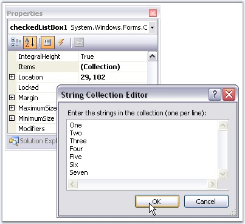
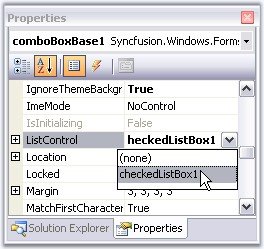
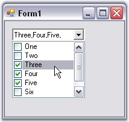

::: {style="DISPLAY: none"}
{#d2h_url_template}{#d2h_package_url style="WIDTH: 0px; DISPLAY: none; HEIGHT: 0px"}
:::

:::: {.d2h_secondary_topic style="PADDING-BOTTOM: 10pt; MARGIN: 0pt; PADDING-LEFT: 0pt; PADDING-RIGHT: 0pt; PADDING-TOP: 0pt"}
##### Event Handling {#event-handling style="tab-stops: 0pt"}

Selection Events

**[]{style="COLOR: #15428b"}** 

The ComboBoxBase fires different events for the different user interaction scenarios. The occurrence and order of the events are tabulated below.

[]{style="COLOR: #15428b"} 

::: {align="center"}
  ----------------------------------------------- -------------------------------------------------------- ---------------------- ---------------------- ----------------------
  Scenarios                                       SelectionChangedCommitted                                SelectedValueChanged   SelectedIndexChanged   Validating/Validated
  TextArea-Change Selection by Keys               Yes:1                                                    Yes:2                  Yes:3                  No
  TextArea-On AutoComplete                        No                                                       No                     No                     No
  Drop-Down List-Change Selection by Keys         No                                                       Yes:1                  Yes:2                  No
  Drop-Down List-Change Selection by Mouse Move   No                                                       No                     No                     No
  Drop-Down Close by Enter Key                    Yes:1                                                    No                     No                     No
  Drop-Down Close by Escape Key                   No                                                       No                     No                     No
  Drop-Down Close by Click                        Yes:1                                                    Yes:2                  Yes:3                  No
  Losing Focus                                    Yes:2 (in DropDownStyle.DropDown (editable) mode only)   No                     No                     Yes:1
  Changing Text Property in Code                  Yes:1                                                    No                     No                     No
  ----------------------------------------------- -------------------------------------------------------- ---------------------- ---------------------- ----------------------
:::

[]{style="COLOR: #15428b"} 

[]{style="COLOR: #15428b"} 

###### []{#p414}[]{#_DropDownCloseOnClick_Event}3.3.5.3.4.1 DropDownCloseOnClick Event {#dropdowncloseonclick-event style="tab-stops: 0pt"}

[]{style="COLOR: #15428b"} 

This section deals with associating a CheckedListBox and handling the events. After the dropdown had closed, the checked items will be displayed on the dropdown text area. The steps are as follows.

[]{style="COLOR: #15428b"} 

1.   Create a CheckedListBox and populate it.

[]{style="COLOR: #15428b"} 

{border="0"}

[]{style="COLOR: #15428b"} 

Figure 365: Adding String Collection to CheckedListBox Control

[]{style="COLOR: #15428b"} 

2.   Associate it with the ComboBoxBase control.

[]{style="COLOR: #15428b"} 

{border="0"}

[]{style="COLOR: #15428b"} 

Figure 366: Associating CheckedListBox Control as Dropdown for ComboBoxBase

[]{style="COLOR: #15428b"} 

3.   To avoid the closing of dropdown when we are in checking the items, handle the **DropDownCloseOnClick** event and set **args.Cancel=true**.

[]{style="COLOR: #15428b"} 

+------------------------------------------------------------------------------------------------------------------------------------------------------------------------------------------------------------------------------------------------+
| **[\[C#\]]{style="FONT-FAMILY: 'Courier New'; COLOR: black"}**                                                                                                                                                                                 |
|                                                                                                                                                                                                                                                |
| []{style="COLOR: #15428b"}                                                                                                                                                                                                                     |
|                                                                                                                                                                                                                                                |
| [// Avoids the closing of dropdown.]{style="FONT-FAMILY: 'Courier New'; COLOR: green"}                                                                                                                                                         |
|                                                                                                                                                                                                                                                |
| [private void]{style="FONT-FAMILY: 'Courier New'; COLOR: blue"}[ comboBoxBase1_DropDownCloseOnClick([object]{style="COLOR: blue"} sender, Syncfusion.Windows.Forms.Tools.MouseClickCancelEventArgs args) ]{style="FONT-FAMILY: 'Courier New'"} |
|                                                                                                                                                                                                                                                |
| [{]{style="FONT-FAMILY: 'Courier New'"}                                                                                                                                                                                                        |
|                                                                                                                                                                                                                                                |
| [args.Cancel=[true]{style="COLOR: blue"};]{style="FONT-FAMILY: 'Courier New'"}                                                                                                                                                                 |
|                                                                                                                                                                                                                                                |
| [}]{style="FONT-FAMILY: 'Courier New'"}                                                                                                                                                                                                        |
+------------------------------------------------------------------------------------------------------------------------------------------------------------------------------------------------------------------------------------------------+

[]{style="COLOR: #15428b"} 

+--------------------------------------------------------------------------------------------------------------------------------------------------------------------------------------------------------------------------------------------------------------------------------------------------------------------------------------+
| **[\[VB.NET\]]{style="FONT-FAMILY: 'Courier New'; COLOR: black"}**                                                                                                                                                                                                                                                                   |
|                                                                                                                                                                                                                                                                                                                                      |
| []{style="COLOR: #15428b"}                                                                                                                                                                                                                                                                                                           |
|                                                                                                                                                                                                                                                                                                                                      |
| [\' Avoids the closing of dropdown.]{style="FONT-FAMILY: 'Courier New'; COLOR: green"}                                                                                                                                                                                                                                               |
|                                                                                                                                                                                                                                                                                                                                      |
| [Private  Sub]{style="FONT-FAMILY: 'Courier New'; COLOR: blue"}[ comboBoxBase1_DropDownCloseOnClick([ByVal]{style="COLOR: blue"} sender [As Object]{style="COLOR: blue"}, [ByVal]{style="COLOR: blue"} args [As]{style="COLOR: blue"} Syncfusion.Windows.Forms.Tools.MouseClickCancelEventArgs)]{style="FONT-FAMILY: 'Courier New'"} |
|                                                                                                                                                                                                                                                                                                                                      |
| [args.Cancel=[True]{style="COLOR: blue"}]{style="FONT-FAMILY: 'Courier New'"}                                                                                                                                                                                                                                                        |
|                                                                                                                                                                                                                                                                                                                                      |
| [End Sub]{style="FONT-FAMILY: 'Courier New'; COLOR: blue"}                                                                                                                                                                                                                                                                           |
+--------------------------------------------------------------------------------------------------------------------------------------------------------------------------------------------------------------------------------------------------------------------------------------------------------------------------------------+

[]{style="COLOR: #15428b"} 

4.   Handle **SelectedIndexChanged** event of the CheckedListBox and add the following code.

[]{style="COLOR: #15428b"} 

+-------------------------------------------------------------------------------------------------------------------------------------------------------------------------------------------------------+
| **[\[C#\]]{style="FONT-FAMILY: 'Courier New'; COLOR: black"}**                                                                                                                                        |
|                                                                                                                                                                                                       |
| []{style="COLOR: #15428b"}                                                                                                                                                                            |
|                                                                                                                                                                                                       |
| [// Sets the corresponding selected text in the ComboBoxBase TextBox.]{style="FONT-FAMILY: 'Courier New'; COLOR: green"}                                                                              |
|                                                                                                                                                                                                       |
| [private void]{style="FONT-FAMILY: 'Courier New'; COLOR: blue"}[ checkedListBox1_SelectedIndexChanged([object]{style="COLOR: blue"} sender, System.EventArgs e) ]{style="FONT-FAMILY: 'Courier New'"} |
|                                                                                                                                                                                                       |
| [{]{style="FONT-FAMILY: 'Courier New'"}                                                                                                                                                               |
|                                                                                                                                                                                                       |
| [comboBoxBase1.TextBox.Text=\"\";]{style="FONT-FAMILY: 'Courier New'"}                                                                                                                                |
|                                                                                                                                                                                                       |
| [foreach]{style="FONT-FAMILY: 'Courier New'; COLOR: blue"}[([object]{style="COLOR: blue"} s [in]{style="COLOR: blue"} checkedListBox1.CheckedItems ) ]{style="FONT-FAMILY: 'Courier New'"}            |
|                                                                                                                                                                                                       |
| [comboBoxBase1.TextBox.Text  += s.ToString();]{style="FONT-FAMILY: 'Courier New'"}                                                                                                                    |
|                                                                                                                                                                                                       |
| [}]{style="FONT-FAMILY: 'Courier New'"}                                                                                                                                                               |
+-------------------------------------------------------------------------------------------------------------------------------------------------------------------------------------------------------+

[]{style="COLOR: #15428b"} 

+----------------------------------------------------------------------------------------------------------------------------------------------------------------------------------------------------------------------------------------------------------------------+
| **[\[VB.NET\]]{style="FONT-FAMILY: 'Courier New'; COLOR: black"}**                                                                                                                                                                                                   |
|                                                                                                                                                                                                                                                                      |
| []{style="COLOR: #15428b"}                                                                                                                                                                                                                                           |
|                                                                                                                                                                                                                                                                      |
| [\' Sets the corresponding selected text in the ComboBoxBase TextBox.]{style="FONT-FAMILY: 'Courier New'; COLOR: green"}                                                                                                                                             |
|                                                                                                                                                                                                                                                                      |
| [Private  Sub]{style="FONT-FAMILY: 'Courier New'; COLOR: blue"}[ checkedListBox1_SelectedIndexChanged(ByVal sender [As Object]{style="COLOR: blue"}, [ByVal]{style="COLOR: blue"} e [As]{style="COLOR: blue"} System.EventArgs)]{style="FONT-FAMILY: 'Courier New'"} |
|                                                                                                                                                                                                                                                                      |
| [comboBoxBase1.TextBox.Text=\"\"]{style="FONT-FAMILY: 'Courier New'"}                                                                                                                                                                                                |
|                                                                                                                                                                                                                                                                      |
| [Dim]{style="FONT-FAMILY: 'Courier New'; COLOR: blue"}[ s [As Object]{style="COLOR: blue"}]{style="FONT-FAMILY: 'Courier New'"}                                                                                                                                      |
|                                                                                                                                                                                                                                                                      |
| [For Each]{style="FONT-FAMILY: 'Courier New'; COLOR: blue"}[ s [In]{style="COLOR: blue"} checkedListBox1.CheckedItems]{style="FONT-FAMILY: 'Courier New'"}                                                                                                           |
|                                                                                                                                                                                                                                                                      |
| [comboBoxBase1.TextBox.Text  += s.ToString()]{style="FONT-FAMILY: 'Courier New'"}                                                                                                                                                                                    |
|                                                                                                                                                                                                                                                                      |
| [Next]{style="FONT-FAMILY: 'Courier New'; COLOR: blue"}                                                                                                                                                                                                              |
|                                                                                                                                                                                                                                                                      |
| [End Sub]{style="FONT-FAMILY: 'Courier New'; COLOR: blue"}                                                                                                                                                                                                           |
+----------------------------------------------------------------------------------------------------------------------------------------------------------------------------------------------------------------------------------------------------------------------+

[]{style="COLOR: #15428b"} 

{border="0"}

[]{style="COLOR: #15428b"} 

Figure 367: ComboBoxBase with selected options at Run Time

###### []{#p415}3.3.5.3.4.2 DropDown Event {#dropdown-event style="tab-stops: 0pt"}

[]{style="COLOR: #15428b"} 

In order to place ComboBoxBase within a PopupControlContainer, derive from our PopupControlContainer, override the **OnPopup** method and set the focus to the derived control. This ensures that the derived PopupControlContainer does not lose focus and close prematurely.

[]{style="COLOR: #15428b"} 

+--------------------------------------------------------------------------------------------------------------------------------------------------------------------------------------------------------------------------------------------------------------------------------+
| **[\[C#\]]{style="FONT-FAMILY: 'Courier New'; COLOR: black"}**                                                                                                                                                                                                                 |
|                                                                                                                                                                                                                                                                                |
| **[]{style="FONT-FAMILY: 'Courier New'; COLOR: black"}**                                                                                                                                                                                                                       |
|                                                                                                                                                                                                                                                                                |
| [// Derive from PopupControlContainer.]{style="FONT-FAMILY: 'Courier New'; COLOR: green"}                                                                                                                                                                                      |
|                                                                                                                                                                                                                                                                                |
| [public class]{style="FONT-FAMILY: 'Courier New'; COLOR: blue"}[ CustomPopupControlContainer : Syncfusion.Windows.Forms.PopupControlContainer\                                                                                                                                 |
| {]{style="FONT-FAMILY: 'Courier New'; COLOR: black"}                                                                                                                                                                                                                           |
|                                                                                                                                                                                                                                                                                |
| [public ]{style="FONT-FAMILY: 'Courier New'; COLOR: blue"}[CustomPopupControlContainer()\                                                                                                                                                                                      |
| {\                                                                                                                                                                                                                                                                             |
| }]{style="FONT-FAMILY: 'Courier New'; COLOR: black"}                                                                                                                                                                                                                           |
|                                                                                                                                                                                                                                                                                |
| [\                                                                                                                                                                                                                                                                             |
| ]{style="FONT-FAMILY: 'Courier New'; COLOR: black"}[public]{style="FONT-FAMILY: 'Courier New'; COLOR: blue"}[ CustomPopupControlContainer(IContainer container):]{style="FONT-FAMILY: 'Courier New'; COLOR: black"}[this]{style="FONT-FAMILY: 'Courier New'; COLOR: blue"}[()\ |
| {]{style="FONT-FAMILY: 'Courier New'; COLOR: black"}                                                                                                                                                                                                                           |
|                                                                                                                                                                                                                                                                                |
| [container.Add(]{style="FONT-FAMILY: 'Courier New'; COLOR: black"}[this]{style="FONT-FAMILY: 'Courier New'; COLOR: blue"}[);]{style="FONT-FAMILY: 'Courier New'; COLOR: black"}                                                                                                |
|                                                                                                                                                                                                                                                                                |
| [}]{style="FONT-FAMILY: 'Courier New'; COLOR: black"}                                                                                                                                                                                                                          |
|                                                                                                                                                                                                                                                                                |
| []{style="FONT-FAMILY: 'Courier New'; COLOR: black"}                                                                                                                                                                                                                           |
|                                                                                                                                                                                                                                                                                |
| [protected override void]{style="FONT-FAMILY: 'Courier New'; COLOR: blue"}[ OnPopup(EventArgs args)]{style="FONT-FAMILY: 'Courier New'; COLOR: black"}                                                                                                                         |
|                                                                                                                                                                                                                                                                                |
| [{]{style="FONT-FAMILY: 'Courier New'; COLOR: black"}                                                                                                                                                                                                                          |
|                                                                                                                                                                                                                                                                                |
| [  ]{style="FONT-FAMILY: 'Courier New'; COLOR: black"}[ // Sets focus to the derived control.]{style="FONT-FAMILY: 'Courier New'; COLOR: green"}                                                                                                                               |
|                                                                                                                                                                                                                                                                                |
| [base.OnPopup(args);]{style="FONT-FAMILY: 'Courier New'; COLOR: black"}                                                                                                                                                                                                        |
|                                                                                                                                                                                                                                                                                |
| [this]{style="FONT-FAMILY: 'Courier New'; COLOR: blue"}[.Focus();]{style="FONT-FAMILY: 'Courier New'; COLOR: black"}                                                                                                                                                           |
|                                                                                                                                                                                                                                                                                |
| [}]{style="FONT-FAMILY: 'Courier New'; COLOR: black"}                                                                                                                                                                                                                          |
|                                                                                                                                                                                                                                                                                |
| [}]{style="FONT-FAMILY: 'Courier New'; COLOR: black"}                                                                                                                                                                                                                          |
+--------------------------------------------------------------------------------------------------------------------------------------------------------------------------------------------------------------------------------------------------------------------------------+

[]{style="COLOR: #15428b"} 

+--------------------------------------------------------------------------------------------------------------------------------------------------------------------------------------------------------------------------------------------------------------------------------------------------------------------------------------------------------------------------------------------------------------------------------+
| **[\[VB.NET\]]{style="FONT-FAMILY: 'Courier New'; COLOR: black"}**                                                                                                                                                                                                                                                                                                                                                             |
|                                                                                                                                                                                                                                                                                                                                                                                                                                |
| **[]{style="FONT-FAMILY: 'Courier New'; COLOR: black"}**                                                                                                                                                                                                                                                                                                                                                                       |
|                                                                                                                                                                                                                                                                                                                                                                                                                                |
| [\' Derive from PopupControlContainer.]{style="FONT-FAMILY: 'Courier New'; COLOR: green"}                                                                                                                                                                                                                                                                                                                                      |
|                                                                                                                                                                                                                                                                                                                                                                                                                                |
| [Public Class]{style="FONT-FAMILY: 'Courier New'; COLOR: blue"}[ CustomPopupControlContainer ]{style="FONT-FAMILY: 'Courier New'; COLOR: black"}[Inherits]{style="FONT-FAMILY: 'Courier New'; COLOR: blue"}[ Syncfusion.Windows.Forms.PopupControlContainer]{style="FONT-FAMILY: 'Courier New'; COLOR: black"}                                                                                                                 |
|                                                                                                                                                                                                                                                                                                                                                                                                                                |
| []{style="FONT-FAMILY: 'Courier New'; COLOR: black"}                                                                                                                                                                                                                                                                                                                                                                           |
|                                                                                                                                                                                                                                                                                                                                                                                                                                |
| [Public Sub]{style="FONT-FAMILY: 'Courier New'; COLOR: blue"}[ New()\                                                                                                                                                                                                                                                                                                                                                          |
| ]{style="FONT-FAMILY: 'Courier New'; COLOR: black"}[End Sub]{style="FONT-FAMILY: 'Courier New'; COLOR: blue"}                                                                                                                                                                                                                                                                                                                  |
|                                                                                                                                                                                                                                                                                                                                                                                                                                |
| []{style="FONT-FAMILY: 'Courier New'; COLOR: blue"}                                                                                                                                                                                                                                                                                                                                                                            |
|                                                                                                                                                                                                                                                                                                                                                                                                                                |
| [Public Sub]{style="FONT-FAMILY: 'Courier New'; COLOR: blue"}[ New(]{style="FONT-FAMILY: 'Courier New'; COLOR: black"}[ByVal]{style="FONT-FAMILY: 'Courier New'; COLOR: blue"}[ container ]{style="FONT-FAMILY: 'Courier New'; COLOR: black"}[As]{style="FONT-FAMILY: 'Courier New'; COLOR: blue"}[ IContainer) : ]{style="FONT-FAMILY: 'Courier New'; COLOR: black"}[Me]{style="FONT-FAMILY: 'Courier New'; COLOR: blue"}[()\ |
| container.Add(]{style="FONT-FAMILY: 'Courier New'; COLOR: black"}[Me]{style="FONT-FAMILY: 'Courier New'; COLOR: blue"}[)\                                                                                                                                                                                                                                                                                                      |
| ]{style="FONT-FAMILY: 'Courier New'; COLOR: black"}[End Sub]{style="FONT-FAMILY: 'Courier New'; COLOR: blue"}                                                                                                                                                                                                                                                                                                                  |
|                                                                                                                                                                                                                                                                                                                                                                                                                                |
| []{style="FONT-FAMILY: 'Courier New'; COLOR: green"}                                                                                                                                                                                                                                                                                                                                                                           |
|                                                                                                                                                                                                                                                                                                                                                                                                                                |
| [\' Sets focus to the derived control.\                                                                                                                                                                                                                                                                                                                                                                                        |
| ]{style="FONT-FAMILY: 'Courier New'; COLOR: green"}[Protected Overrides Sub]{style="FONT-FAMILY: 'Courier New'; COLOR: blue"}[ OnPopup(]{style="FONT-FAMILY: 'Courier New'; COLOR: black"}[ByVal]{style="FONT-FAMILY: 'Courier New'; COLOR: blue"}[ args ]{style="FONT-FAMILY: 'Courier New'; COLOR: black"}[As]{style="FONT-FAMILY: 'Courier New'; COLOR: blue"}[ EventArgs)\                                                 |
| MyBase.OnPopup(args)\                                                                                                                                                                                                                                                                                                                                                                                                          |
| ]{style="FONT-FAMILY: 'Courier New'; COLOR: black"}[Me]{style="FONT-FAMILY: 'Courier New'; COLOR: blue"}[.Focus()\                                                                                                                                                                                                                                                                                                             |
| ]{style="FONT-FAMILY: 'Courier New'; COLOR: black"}[End Sub]{style="FONT-FAMILY: 'Courier New'; COLOR: blue"}                                                                                                                                                                                                                                                                                                                  |
|                                                                                                                                                                                                                                                                                                                                                                                                                                |
| [\                                                                                                                                                                                                                                                                                                                                                                                                                             |
| End Class]{style="FONT-FAMILY: 'Courier New'; COLOR: blue"}                                                                                                                                                                                                                                                                                                                                                                    |
+--------------------------------------------------------------------------------------------------------------------------------------------------------------------------------------------------------------------------------------------------------------------------------------------------------------------------------------------------------------------------------------------------------------------------------+

[]{style="COLOR: #15428b"} 

Here the specification of the parent-child relationship between the ComboBoxBase\'s popup and the PopupControlContainer is explained with the help of coding.

[]{style="COLOR: #15428b"} 

+-----------------------------------------------------------------------------------------------------------------------------------------------------------------------------------------------------------------------------------------------------------------------------------------------------------------------------------------------------+
| **[\[C#\]]{style="FONT-FAMILY: 'Courier New'; COLOR: black"}**                                                                                                                                                                                                                                                                                      |
|                                                                                                                                                                                                                                                                                                                                                     |
| **[]{style="FONT-FAMILY: 'Courier New'; COLOR: black"}**                                                                                                                                                                                                                                                                                            |
|                                                                                                                                                                                                                                                                                                                                                     |
| [private void]{style="FONT-FAMILY: 'Courier New'; COLOR: blue"}[ comboBoxBase1_DropDown(]{style="FONT-FAMILY: 'Courier New'; COLOR: black"}[object]{style="FONT-FAMILY: 'Courier New'; COLOR: blue"}[ sender, System.EventArgs e)\                                                                                                                  |
| {\                                                                                                                                                                                                                                                                                                                                                  |
|  ]{style="FONT-FAMILY: 'Courier New'; COLOR: black"}                                                                                                                                                                                                                                                                                                |
|                                                                                                                                                                                                                                                                                                                                                     |
| [/\* Setup the relationship between the ComboBoxBase\'s dropdown and it\'s parent PopupControlContainer, so that the popup will not close when the ComboBoxBase's dropdown is shown \*/]{style="FONT-FAMILY: 'Courier New'; COLOR: green"}                                                                                                          |
|                                                                                                                                                                                                                                                                                                                                                     |
| []{style="FONT-FAMILY: 'Courier New'; COLOR: black"}                                                                                                                                                                                                                                                                                                |
|                                                                                                                                                                                                                                                                                                                                                     |
| [this]{style="FONT-FAMILY: 'Courier New'; COLOR: blue"}[.comboBoxBase1.PopupContainer.PopupParent = ]{style="FONT-FAMILY: 'Courier New'; COLOR: black"}[this]{style="FONT-FAMILY: 'Courier New'; COLOR: blue"}[.popupControlContainer1;\                                                                                                            |
| ]{style="FONT-FAMILY: 'Courier New'; COLOR: black"}[this]{style="FONT-FAMILY: 'Courier New'; COLOR: blue"}[.popupControlContainer1.CurrentPopupChild = ]{style="FONT-FAMILY: 'Courier New'; COLOR: black"}[this]{style="FONT-FAMILY: 'Courier New'; COLOR: blue"}[.comboBoxBase1.PopupContainer;]{style="FONT-FAMILY: 'Courier New'; COLOR: black"} |
|                                                                                                                                                                                                                                                                                                                                                     |
| [}]{style="FONT-FAMILY: 'Courier New'; COLOR: black"}                                                                                                                                                                                                                                                                                               |
+-----------------------------------------------------------------------------------------------------------------------------------------------------------------------------------------------------------------------------------------------------------------------------------------------------------------------------------------------------+

[]{style="COLOR: #15428b"} 

+----------------------------------------------------------------------------------------------------------------------------------------------------------------------------------------------------------------------------------------------------------------------------------------------------------------------------------------------------------------------------------------------------------------------------------------------------------------------------------------------------------------------------------------------------------------------------------------------------------------------------+
| **[\[VB.NET\]]{style="FONT-FAMILY: 'Courier New'; COLOR: black"}**                                                                                                                                                                                                                                                                                                                                                                                                                                                                                                                                                         |
|                                                                                                                                                                                                                                                                                                                                                                                                                                                                                                                                                                                                                            |
| **[]{style="FONT-FAMILY: 'Courier New'; COLOR: black"}**                                                                                                                                                                                                                                                                                                                                                                                                                                                                                                                                                                   |
|                                                                                                                                                                                                                                                                                                                                                                                                                                                                                                                                                                                                                            |
| [Private Sub]{style="FONT-FAMILY: 'Courier New'; COLOR: blue"}[ comboBoxBase1_DropDown(]{style="FONT-FAMILY: 'Courier New'; COLOR: black"}[ByVal]{style="FONT-FAMILY: 'Courier New'; COLOR: blue"}[ sender ]{style="FONT-FAMILY: 'Courier New'; COLOR: black"}[As Object]{style="FONT-FAMILY: 'Courier New'; COLOR: blue"}[,]{style="FONT-FAMILY: 'Courier New'; COLOR: black"}[ ByVal]{style="FONT-FAMILY: 'Courier New'; COLOR: blue"}[ e ]{style="FONT-FAMILY: 'Courier New'; COLOR: black"}[As]{style="FONT-FAMILY: 'Courier New'; COLOR: blue"}[ System.EventArgs)]{style="FONT-FAMILY: 'Courier New'; COLOR: black"} |
|                                                                                                                                                                                                                                                                                                                                                                                                                                                                                                                                                                                                                            |
| []{style="FONT-FAMILY: 'Courier New'; COLOR: black"}                                                                                                                                                                                                                                                                                                                                                                                                                                                                                                                                                                       |
|                                                                                                                                                                                                                                                                                                                                                                                                                                                                                                                                                                                                                            |
| [ \'Setup the relationship between the ComboBoxBase\'s dropdown and it\'s parent PopupControlContainer, so that the popup will not close when the ComboBoxBase's  dropdown is shown\                                                                                                                                                                                                                                                                                                                                                                                                                                       |
| ]{style="FONT-FAMILY: 'Courier New'; COLOR: green"}[\                                                                                                                                                                                                                                                                                                                                                                                                                                                                                                                                                                      |
| ]{style="FONT-FAMILY: 'Courier New'; COLOR: black"}[Me]{style="FONT-FAMILY: 'Courier New'; COLOR: blue"}[.comboBoxBase1.PopupContainer.PopupParent = ]{style="FONT-FAMILY: 'Courier New'; COLOR: black"}[Me]{style="FONT-FAMILY: 'Courier New'; COLOR: blue"}[.popupControlContainer1\                                                                                                                                                                                                                                                                                                                                     |
| ]{style="FONT-FAMILY: 'Courier New'; COLOR: black"}[Me]{style="FONT-FAMILY: 'Courier New'; COLOR: blue"}[.popupControlContainer1.CurrentPopupChild = ]{style="FONT-FAMILY: 'Courier New'; COLOR: black"}[Me]{style="FONT-FAMILY: 'Courier New'; COLOR: blue"}[.comboBoxBase1.PopupContainer]{style="FONT-FAMILY: 'Courier New'; COLOR: black"}                                                                                                                                                                                                                                                                             |
|                                                                                                                                                                                                                                                                                                                                                                                                                                                                                                                                                                                                                            |
| [End Sub]{style="FONT-FAMILY: 'Courier New'; COLOR: blue"}                                                                                                                                                                                                                                                                                                                                                                                                                                                                                                                                                                 |
+----------------------------------------------------------------------------------------------------------------------------------------------------------------------------------------------------------------------------------------------------------------------------------------------------------------------------------------------------------------------------------------------------------------------------------------------------------------------------------------------------------------------------------------------------------------------------------------------------------------------------+

[]{#related-topics}
::::
