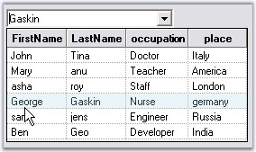

::: {style="DISPLAY: none"}
{#d2h_url_template}{#d2h_package_url style="WIDTH: 0px; DISPLAY: none; HEIGHT: 0px"}
:::

:::: {.d2h_secondary_topic style="PADDING-BOTTOM: 10pt; MARGIN: 0pt; PADDING-LEFT: 0pt; PADDING-RIGHT: 0pt; PADDING-TOP: 0pt"}
##### Event Handling {#event-handling style="tab-stops: 0pt"}

[]{style="COLOR: #15428b"} 

The events of ComboBoxAdv present in the MultiColumnComboBox.

[]{style="COLOR: #15428b"} 

Selection Events

[]{style="COLOR: #15428b"} 

The MultiColumnComboBox fires different events for the different user interaction scenarios. The occurrence and order of the events are tabulated below:

[]{style="COLOR: #15428b"} 

::: {align="center"}
  ----------------------------------------------- -------------------------------------------------------- ------------------------ ------------------------ ----------------------
  Scenarios                                       Selection Changed Committed                              Selected Value Changed   Selected Index Changed   Validating/Validated
  TextArea-Change Selection by Keys               Yes:1                                                    Yes:2                    Yes:3                    No
  TextArea-On AutoComplete                        No                                                       No                       No                       No
  Drop-Down List-Change Selection by Keys         No                                                       Yes:1                    Yes:2                    No
  Drop-Down List-Change Selection by Mouse Move   No                                                       No                       No                       No
  Drop-Down Close by Enter Key                    Yes:1                                                    No                       No                       No
  Drop-Down Close by Escape Key                   No                                                       No                       No                       No
  Drop-Down Close by Click                        Yes:1                                                    Yes:2                    Yes:3                    No
  Losing Focus                                    Yes:2 (in DropDownStyle.DropDown (editable) mode only)   No                       No                       Yes:1
  Changing Text Property in Code                  Yes:1                                                    No                       No                       No
  ----------------------------------------------- -------------------------------------------------------- ------------------------ ------------------------ ----------------------
:::

[]{style="COLOR: #15428b"} 

You can refer the following topics which gives you an idea on implementing the above events.

[]{style="COLOR: #15428b"} 

[[·      ]{style="FONT-FAMILY: Symbol; TEXT-DECORATION: none; text-underline: none"}]{.UGHyperlink}[How to display multiple members in a MultiColumnComboBox?]{.UGHyperlink}[]{.UGHyperlink}

[[·      ]{style="FONT-FAMILY: Symbol; TEXT-DECORATION: none; text-underline: none"}]{.UGHyperlink}[How to retrieve the columns other than Display and Value members in a MultiColumnComboBox?]{.UGHyperlink}[]{.UGHyperlink}

###### []{#p427}[]{#_SelectedValueChanged_Event}3.3.5.4.4.1 SelectedValueChanged Event {#selectedvaluechanged-event style="tab-stops: 0pt"}

[]{style="COLOR: #15428b"} 

This event is handled when the selected value is changed in the combobox. This section discusses a use case illustrating the event.

[]{style="COLOR: #15428b"} 

Setting Text According to Selection

[]{style="COLOR: #15428b"} 

The process of accessing the selected item is a complex one. We need to access DataRowView from the control and then to get the values. Include the below code in the **SelectedValueChanged** event handler to set the text of MultiColumnComboBox to the text in the first column of the selected row.

[]{style="COLOR: #15428b"} 

+-----------------------------------------------------------------------------------------------------------------------------------------------------------------------------------------------------------------------------------+
| **[\[C#\]]{style="FONT-FAMILY: 'Courier New'; COLOR: black"}**                                                                                                                                                                    |
|                                                                                                                                                                                                                                   |
| []{style="COLOR: #15428b"}                                                                                                                                                                                                        |
|                                                                                                                                                                                                                                   |
| [private void]{style="FONT-FAMILY: 'Courier New'; COLOR: blue"}[ multiColumnComboBox1_SelectedValueChanged(object sender, System.EventArgs e) ]{style="FONT-FAMILY: 'Courier New'; COLOR: black"}                                 |
|                                                                                                                                                                                                                                   |
| [{]{style="FONT-FAMILY: 'Courier New'; COLOR: black"}                                                                                                                                                                             |
|                                                                                                                                                                                                                                   |
| [ComboBoxBaseDataBound c=multiColumnComboBox1 ]{style="FONT-FAMILY: 'Courier New'; COLOR: black"}[as]{style="FONT-FAMILY: 'Courier New'; COLOR: blue"}[ ComboBoxBaseDataBound;]{style="FONT-FAMILY: 'Courier New'; COLOR: black"} |
|                                                                                                                                                                                                                                   |
| [if ]{style="FONT-FAMILY: 'Courier New'; COLOR: blue"}[(c.SelectedIndex!=-1)        ]{style="FONT-FAMILY: 'Courier New'; COLOR: black"}                                                                                           |
|                                                                                                                                                                                                                                   |
| [{]{style="FONT-FAMILY: 'Courier New'; COLOR: black"}                                                                                                                                                                             |
|                                                                                                                                                                                                                                   |
| [       // Sets the text of MultiColumnComboBox to the text in the first column of selected row.]{style="FONT-FAMILY: 'Courier New'; COLOR: green"}                                                                               |
|                                                                                                                                                                                                                                   |
| [       DataRowView drv=c.Items\[c.SelectedIndex\] ]{style="FONT-FAMILY: 'Courier New'; COLOR: black"}[as]{style="FONT-FAMILY: 'Courier New'; COLOR: blue"}[ DataRowView;]{style="FONT-FAMILY: 'Courier New'; COLOR: black"}      |
|                                                                                                                                                                                                                                   |
| [       c.Text=drv.Row\[1\].ToString();]{style="FONT-FAMILY: 'Courier New'; COLOR: black"}                                                                                                                                        |
|                                                                                                                                                                                                                                   |
| [}]{style="FONT-FAMILY: 'Courier New'; COLOR: black"}                                                                                                                                                                             |
|                                                                                                                                                                                                                                   |
| [}]{style="FONT-FAMILY: 'Courier New'; COLOR: black"}                                                                                                                                                                             |
+-----------------------------------------------------------------------------------------------------------------------------------------------------------------------------------------------------------------------------------+

[]{style="COLOR: #15428b"} 

+------------------------------------------------------------------------------------------------------------------------------------------------------------------------------------------------------------------------------------------------------------------------------------------------------------------------------------------------------------------------------------------------------------------------------------------------------------------------------------------------------------------------------------------------------------------------------------------------------------------------------------------------+
| **[\[VB.NET\]]{style="FONT-FAMILY: 'Courier New'; COLOR: black"}**                                                                                                                                                                                                                                                                                                                                                                                                                                                                                                                                                                             |
|                                                                                                                                                                                                                                                                                                                                                                                                                                                                                                                                                                                                                                                |
| []{style="COLOR: #15428b"}                                                                                                                                                                                                                                                                                                                                                                                                                                                                                                                                                                                                                     |
|                                                                                                                                                                                                                                                                                                                                                                                                                                                                                                                                                                                                                                                |
| [Private Sub]{style="FONT-FAMILY: 'Courier New'; COLOR: blue"}[ multiColumnComboBox1_SelectedValueChanged(]{style="FONT-FAMILY: 'Courier New'; COLOR: black"}[ByVal]{style="FONT-FAMILY: 'Courier New'; COLOR: blue"}[ sender ]{style="FONT-FAMILY: 'Courier New'; COLOR: black"}[As Object]{style="FONT-FAMILY: 'Courier New'; COLOR: blue"}[, ]{style="FONT-FAMILY: 'Courier New'; COLOR: black"}[ByVal]{style="FONT-FAMILY: 'Courier New'; COLOR: blue"}[ e ]{style="FONT-FAMILY: 'Courier New'; COLOR: black"}[As]{style="FONT-FAMILY: 'Courier New'; COLOR: blue"}[ System.EventArgs) ]{style="FONT-FAMILY: 'Courier New'; COLOR: black"} |
|                                                                                                                                                                                                                                                                                                                                                                                                                                                                                                                                                                                                                                                |
| [Dim]{style="FONT-FAMILY: 'Courier New'; COLOR: blue"}[ c ]{style="FONT-FAMILY: 'Courier New'; COLOR: black"}[As]{style="FONT-FAMILY: 'Courier New'; COLOR: blue"}[ ComboBoxBaseDataBound = ]{style="FONT-FAMILY: 'Courier New'; COLOR: black"}[CType]{style="FONT-FAMILY: 'Courier New'; COLOR: blue"}[(multiColumnComboBox1, ComboBoxBaseDataBound) ]{style="FONT-FAMILY: 'Courier New'; COLOR: black"}                                                                                                                                                                                                                                      |
|                                                                                                                                                                                                                                                                                                                                                                                                                                                                                                                                                                                                                                                |
| [If Not]{style="FONT-FAMILY: 'Courier New'; COLOR: blue"}[ (c.SelectedIndex = -1) ]{style="FONT-FAMILY: 'Courier New'; COLOR: black"}[Then]{style="FONT-FAMILY: 'Courier New'; COLOR: blue"}[ ]{style="FONT-FAMILY: 'Courier New'; COLOR: black"}                                                                                                                                                                                                                                                                                                                                                                                              |
|                                                                                                                                                                                                                                                                                                                                                                                                                                                                                                                                                                                                                                                |
| []{style="FONT-FAMILY: 'Courier New'; COLOR: black"}                                                                                                                                                                                                                                                                                                                                                                                                                                                                                                                                                                                           |
|                                                                                                                                                                                                                                                                                                                                                                                                                                                                                                                                                                                                                                                |
| [       \' Sets the text of MultiColumnComboBox to the text in the first column of selected row.]{style="FONT-FAMILY: 'Courier New'; COLOR: green"}                                                                                                                                                                                                                                                                                                                                                                                                                                                                                            |
|                                                                                                                                                                                                                                                                                                                                                                                                                                                                                                                                                                                                                                                |
| [       Dim]{style="FONT-FAMILY: 'Courier New'; COLOR: blue"}[ drv ]{style="FONT-FAMILY: 'Courier New'; COLOR: black"}[As]{style="FONT-FAMILY: 'Courier New'; COLOR: blue"}[ DataRowView = ]{style="FONT-FAMILY: 'Courier New'; COLOR: black"}[CType]{style="FONT-FAMILY: 'Courier New'; COLOR: blue"}[(c.Items(c.SelectedIndex), DataRowView) ]{style="FONT-FAMILY: 'Courier New'; COLOR: black"}                                                                                                                                                                                                                                             |
|                                                                                                                                                                                                                                                                                                                                                                                                                                                                                                                                                                                                                                                |
| [       c.Text = drv.Row(1).ToString ]{style="FONT-FAMILY: 'Courier New'; COLOR: black"}                                                                                                                                                                                                                                                                                                                                                                                                                                                                                                                                                       |
|                                                                                                                                                                                                                                                                                                                                                                                                                                                                                                                                                                                                                                                |
| [End If ]{style="FONT-FAMILY: 'Courier New'; COLOR: blue"}                                                                                                                                                                                                                                                                                                                                                                                                                                                                                                                                                                                     |
|                                                                                                                                                                                                                                                                                                                                                                                                                                                                                                                                                                                                                                                |
| [End Sub]{style="FONT-FAMILY: 'Courier New'; COLOR: blue"}                                                                                                                                                                                                                                                                                                                                                                                                                                                                                                                                                                                     |
+------------------------------------------------------------------------------------------------------------------------------------------------------------------------------------------------------------------------------------------------------------------------------------------------------------------------------------------------------------------------------------------------------------------------------------------------------------------------------------------------------------------------------------------------------------------------------------------------------------------------------------------------+

[]{style="COLOR: #15428b"} 

{border="0"}

[]{style="COLOR: #15428b"} 

Figure 376: Second Column Value of the Selected Row Displayed in the ComboBox

###### []{#p428}[]{#_SelectedIndexChanged_Event}3.3.5.4.4.2 SelectedIndexChanged Event {#selectedindexchanged-event style="tab-stops: 0pt"}

[]{style="COLOR: #15428b"} 

[This event is illustrated in ]{style="COLOR: #15428b"}How to retrieve the columns other than Display and Value members in a MultiColumnComboBox?[ topic.]{style="COLOR: #15428b"}

[]{#related-topics}
::::
