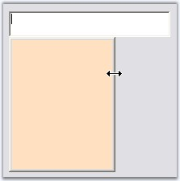
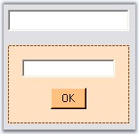
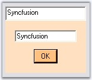

::: {style="DISPLAY: none"}
{#d2h_url_template}{#d2h_package_url style="WIDTH: 0px; DISPLAY: none; HEIGHT: 0px"}
:::

:::: {.d2h_secondary_topic style="PADDING-BOTTOM: 10pt; MARGIN: 0pt; PADDING-LEFT: 0pt; PADDING-RIGHT: 0pt; PADDING-TOP: 0pt"}
##### Event Handling {#event-handling style="tab-stops: 0pt"}

**[]{style="COLOR: #15428b"}** 

PopupControlContainer handles events before and after the Popup is shown. The most commonly used events are discussed below.

[]{style="COLOR: #15428b"} 

::: {align="center"}
+-----------------------------------+--------------------------------------------------------------------------------------------------------------------------------------------------------------------------------------+
|  Event                            | Description                                                                                                                                                                          |
+-----------------------------------+--------------------------------------------------------------------------------------------------------------------------------------------------------------------------------------+
| Popup                             | It occurs after the Popup has been dropped down and made visible. The event handler receives an argument of type EventArgs.                                                          |
|                                   |                                                                                                                                                                                      |
|                                   |                                                                                                                                                                                      |
|                                   |                                                                                                                                                                                      |
|                                   | This event can be handled to get focus on the PopupControlContainer.                                                                                                                 |
+-----------------------------------+--------------------------------------------------------------------------------------------------------------------------------------------------------------------------------------+
| BeforePopup                       | It occurs when the Popup is about to be shown. The event handler receives an argument of type CancelEventArgs. The event property associated with the CancelEventArgs is as follows. |
|                                   |                                                                                                                                                                                      |
|                                   |                                                                                                                                                                                      |
|                                   |                                                                                                                                                                                      |
|                                   | Cancel - Gets/Sets a value indicating whether the event should be canceled.                                                                                                          |
|                                   |                                                                                                                                                                                      |
|                                   |                                                                                                                                                                                      |
|                                   |                                                                                                                                                                                      |
|                                   | This event can be handled to resize the PopupControlContainer.                                                                                                                       |
+-----------------------------------+--------------------------------------------------------------------------------------------------------------------------------------------------------------------------------------+
| CloseUp                           | It occurs when a Popup is closed. The event handler receives an argument of type PopupClosedEventArgs. The event property associated with the PopupClosedEventArgs is as follows.    |
|                                   |                                                                                                                                                                                      |
|                                   |                                                                                                                                                                                      |
|                                   |                                                                                                                                                                                      |
|                                   | PopupCloseType - Returns the PopupCloseType value indicating the way in which the popup can be closed.                                                                               |
|                                   |                                                                                                                                                                                      |
|                                   |                                                                                                                                                                                      |
|                                   |                                                                                                                                                                                      |
|                                   | This event can be handled to transfer data from the Popup to the controls on the Form.                                                                                               |
+-----------------------------------+--------------------------------------------------------------------------------------------------------------------------------------------------------------------------------------+
:::

[]{style="COLOR: #15428b"} 

Refer the following topicswhich gives you an idea on the above events.

[]{style="COLOR: #15428b"} 

###### []{#p444}3.3.6.1.4.1 Popup Event {#popup-event style="tab-stops: 0pt"}

 

This event is handled after the popup is dropped down and made visible. Below is an example which uses Popup event.

**[]{style="COLOR: #15428b"}** 

Mnemonic Support

**[]{style="COLOR: #15428b"}** 

The controls that are placed within the PopupControlContainer do not respond to mnemonics. The reason for this behavior is that the main form gets focus immediately after the PopupControlContainer is displayed. However, the work around here would be to set the focus back to the PopupControlContainer in the PopupControlContainer\'s Popup event handler, so that the access keys will work fine.

[]{style="COLOR: #15428b"} 

+---------------------------------------------------------------------------------------------------------------------------------------------------------------------------------------------------------------------------------------------------------------------------------------------+
| **[\[C#\]]{style="FONT-FAMILY: 'Courier New'; COLOR: black"}**                                                                                                                                                                                                                              |
|                                                                                                                                                                                                                                                                                             |
| []{style="COLOR: #15428b"}                                                                                                                                                                                                                                                                  |
|                                                                                                                                                                                                                                                                                             |
| [private void]{style="FONT-FAMILY: 'Courier New'; COLOR: blue"}[ popupControlContainer1_Popup(]{style="FONT-FAMILY: 'Courier New'; COLOR: black"}[object]{style="FONT-FAMILY: 'Courier New'; COLOR: blue"}[ sender, System.EventArgs e) ]{style="FONT-FAMILY: 'Courier New'; COLOR: black"} |
|                                                                                                                                                                                                                                                                                             |
| [{ ]{style="FONT-FAMILY: 'Courier New'; COLOR: black"}                                                                                                                                                                                                                                      |
|                                                                                                                                                                                                                                                                                             |
| [this]{style="FONT-FAMILY: 'Courier New'; COLOR: blue"}[.popupControlContainer1.Focus(); ]{style="FONT-FAMILY: 'Courier New'; COLOR: black"}                                                                                                                                                |
|                                                                                                                                                                                                                                                                                             |
| [} ]{style="FONT-FAMILY: 'Courier New'; COLOR: black"}                                                                                                                                                                                                                                      |
+---------------------------------------------------------------------------------------------------------------------------------------------------------------------------------------------------------------------------------------------------------------------------------------------+

[]{style="COLOR: #15428b"} 

+-----------------------------------------------------------------------------------------------------------------------------------------------------------------------------------------------------------------------------------------------------------------------------------------------------------------------------------------------------------------------------------------------------------------------------------------------------------------------------------------------------------------------------------------------------------------------------------------------------------------------------------+
| **[\[VB.NET\]]{style="FONT-FAMILY: 'Courier New'; COLOR: black"}**                                                                                                                                                                                                                                                                                                                                                                                                                                                                                                                                                                |
|                                                                                                                                                                                                                                                                                                                                                                                                                                                                                                                                                                                                                                   |
| []{style="COLOR: #15428b"}                                                                                                                                                                                                                                                                                                                                                                                                                                                                                                                                                                                                        |
|                                                                                                                                                                                                                                                                                                                                                                                                                                                                                                                                                                                                                                   |
| [Private Sub]{style="FONT-FAMILY: 'Courier New'; COLOR: blue"}[ popupControlContainer1_Popup(]{style="FONT-FAMILY: 'Courier New'; COLOR: black"}[ByVal]{style="FONT-FAMILY: 'Courier New'; COLOR: blue"}[ sender ]{style="FONT-FAMILY: 'Courier New'; COLOR: black"}[As Object]{style="FONT-FAMILY: 'Courier New'; COLOR: blue"}[, ]{style="FONT-FAMILY: 'Courier New'; COLOR: black"}[ByVal]{style="FONT-FAMILY: 'Courier New'; COLOR: blue"}[ e ]{style="FONT-FAMILY: 'Courier New'; COLOR: black"}[As]{style="FONT-FAMILY: 'Courier New'; COLOR: blue"}[ System.EventArgs) ]{style="FONT-FAMILY: 'Courier New'; COLOR: black"} |
|                                                                                                                                                                                                                                                                                                                                                                                                                                                                                                                                                                                                                                   |
| [   ]{style="FONT-FAMILY: 'Courier New'; COLOR: black"}[Me]{style="FONT-FAMILY: 'Courier New'; COLOR: blue"}[.popupControlContainer1.Focus()]{style="FONT-FAMILY: 'Courier New'; COLOR: black"}                                                                                                                                                                                                                                                                                                                                                                                                                                   |
|                                                                                                                                                                                                                                                                                                                                                                                                                                                                                                                                                                                                                                   |
| [End Sub]{style="FONT-FAMILY: 'Courier New'; COLOR: blue"}[ ]{style="FONT-FAMILY: 'Courier New'; COLOR: black"}                                                                                                                                                                                                                                                                                                                                                                                                                                                                                                                   |
+-----------------------------------------------------------------------------------------------------------------------------------------------------------------------------------------------------------------------------------------------------------------------------------------------------------------------------------------------------------------------------------------------------------------------------------------------------------------------------------------------------------------------------------------------------------------------------------------------------------------------------------+

 

[]{#p445} 

###### []{#_BeforePopup_Event}[3.3.6.1.4.2      ]{style="FONT-SIZE: 9pt"}BeforePopup Event[]{style="FONT-SIZE: 9pt"} {#beforepopup-event style="tab-stops: 0pt"}

[]{style="COLOR: #15428b"} 

This event occurs when the popup is about to be shown.

[]{style="COLOR: #15428b"} 

Resizing the Popup

**[]{style="COLOR: #15428b"}** 

Drag and drop the ParentControl say RichTextBox and PopupControlContainer onto the form. In the MouseUp event of RichTextBox, show the Popup using **ShowPopup()** method.

 

To make the Popup resizable, handle **BeforePopup** event of PopupControlContainer and give the following code snippet.

[]{style="COLOR: #15428b"} 

+------------------------------------------------------------------------------------------------------------------------------------------------------------------------------------------------------------------------------------------------+
| **[\[C#\]]{style="FONT-FAMILY: 'Courier New'; COLOR: black"}**                                                                                                                                                                                 |
|                                                                                                                                                                                                                                                |
| []{style="COLOR: #15428b"}                                                                                                                                                                                                                     |
|                                                                                                                                                                                                                                                |
| [private]{style="FONT-FAMILY: 'Courier New'; COLOR: blue"}[ [void]{style="COLOR: blue"} popupControlContainer1_BeforePopup([object]{style="COLOR: blue"} sender, System.ComponentModel.CancelEventArgs e)]{style="FONT-FAMILY: 'Courier New'"} |
|                                                                                                                                                                                                                                                |
| [{]{style="FONT-FAMILY: 'Courier New'"}                                                                                                                                                                                                        |
|                                                                                                                                                                                                                                                |
| []{style="FONT-FAMILY: 'Courier New'"}                                                                                                                                                                                                         |
|                                                                                                                                                                                                                                                |
| [// Make the pop-up host\'s border style re-sizable. ]{style="FONT-FAMILY: 'Courier New'; COLOR: green"}                                                                                                                                       |
|                                                                                                                                                                                                                                                |
| [this]{style="FONT-FAMILY: 'Courier New'; COLOR: blue"}[.popupControlContainer1.PopupHost.FormBorderStyle = FormBorderStyle.SizableToolWindow; ]{style="FONT-FAMILY: 'Courier New'"}                                                           |
|                                                                                                                                                                                                                                                |
| [this]{style="FONT-FAMILY: 'Courier New'; COLOR: blue"}[.popupControlContainer1.PopupHost.BackColor = [this]{style="COLOR: blue"}.BackColor;  ]{style="FONT-FAMILY: 'Courier New'"}                                                            |
|                                                                                                                                                                                                                                                |
| []{style="FONT-FAMILY: 'Courier New'"}                                                                                                                                                                                                         |
|                                                                                                                                                                                                                                                |
| [// Necessary to set the host\'s client size every time, especially since the pop-up\'s Dock style is set to DockStyle.Fill.  ]{style="FONT-FAMILY: 'Courier New'; COLOR: green"}                                                              |
|                                                                                                                                                                                                                                                |
| [if]{style="FONT-FAMILY: 'Courier New'; COLOR: blue"}[([this]{style="COLOR: blue"}.popupControlContainer1.PopupHost.Size.Width \< 160)    ]{style="FONT-FAMILY: 'Courier New'"}                                                                |
|                                                                                                                                                                                                                                                |
| [this]{style="FONT-FAMILY: 'Courier New'; COLOR: blue"}[.popupControlContainer1.PopupHost.Size =[new]{style="COLOR: blue"} Size(160,176); ]{style="FONT-FAMILY: 'Courier New'"}                                                                |
|                                                                                                                                                                                                                                                |
| []{style="FONT-FAMILY: 'Courier New'"}                                                                                                                                                                                                         |
|                                                                                                                                                                                                                                                |
| [// So that the pop-up container will fill the entire pop-up host when resized.  ]{style="FONT-FAMILY: 'Courier New'; COLOR: green"}                                                                                                           |
|                                                                                                                                                                                                                                                |
| [this]{style="FONT-FAMILY: 'Courier New'; COLOR: blue"}[.popupControlContainer1.Dock= System.Windows.Forms.DockStyle.Fill;]{style="FONT-FAMILY: 'Courier New'"}                                                                                |
|                                                                                                                                                                                                                                                |
| [} ]{style="FONT-FAMILY: 'Courier New'; COLOR: black"}                                                                                                                                                                                         |
+------------------------------------------------------------------------------------------------------------------------------------------------------------------------------------------------------------------------------------------------+

[]{style="COLOR: #15428b"} 

+-------------------------------------------------------------------------------------------------------------------------------------------------------------------------------------------------------------------------------------------------------------------------------------------------------------------------------------------------------------+
| **[\[VB.NET\]]{style="FONT-FAMILY: 'Courier New'; COLOR: black"}**                                                                                                                                                                                                                                                                                          |
|                                                                                                                                                                                                                                                                                                                                                             |
| []{style="COLOR: #15428b"}                                                                                                                                                                                                                                                                                                                                  |
|                                                                                                                                                                                                                                                                                                                                                             |
| [Private]{style="FONT-FAMILY: 'Courier New'; COLOR: blue"}[ [Sub]{style="COLOR: blue"} popupControlContainer1_BeforePopup([ByVal]{style="COLOR: blue"} sender [As]{style="COLOR: blue"} [Object]{style="COLOR: blue"}, [ByVal]{style="COLOR: blue"} e [As]{style="COLOR: blue"} System.ComponentModel.CancelEventArgs)]{style="FONT-FAMILY: 'Courier New'"} |
|                                                                                                                                                                                                                                                                                                                                                             |
| []{style="FONT-FAMILY: 'Courier New'"}                                                                                                                                                                                                                                                                                                                      |
|                                                                                                                                                                                                                                                                                                                                                             |
| [    [\' Make the pop-up host\'s border style re-sizable. ]{style="COLOR: green"}]{style="FONT-FAMILY: 'Courier New'"}                                                                                                                                                                                                                                      |
|                                                                                                                                                                                                                                                                                                                                                             |
| [    [Me]{style="COLOR: blue"}.popupControlContainer1.PopupHost.FormBorderStyle = FormBorderStyle.SizableToolWindow]{style="FONT-FAMILY: 'Courier New'"}                                                                                                                                                                                                    |
|                                                                                                                                                                                                                                                                                                                                                             |
| [    [Me]{style="COLOR: blue"}.popupControlContainer1.PopupHost.BackColor = [Me]{style="COLOR: blue"}.BackColor]{style="FONT-FAMILY: 'Courier New'"}                                                                                                                                                                                                        |
|                                                                                                                                                                                                                                                                                                                                                             |
| []{style="FONT-FAMILY: 'Courier New'"}                                                                                                                                                                                                                                                                                                                      |
|                                                                                                                                                                                                                                                                                                                                                             |
| [    [\' Necessary to set the host\'s client size every time, especially since the pop-up\'s Dock style is set to DockStyle.Fill.  ]{style="COLOR: green"}]{style="FONT-FAMILY: 'Courier New'"}                                                                                                                                                             |
|                                                                                                                                                                                                                                                                                                                                                             |
| [    [If]{style="COLOR: blue"} [Me]{style="COLOR: blue"}.popupControlContainer1.PopupHost.Size.Width \< 160 [Then]{style="COLOR: blue"}]{style="FONT-FAMILY: 'Courier New'"}                                                                                                                                                                                |
|                                                                                                                                                                                                                                                                                                                                                             |
| [        [Me]{style="COLOR: blue"}.popupControlContainer1.PopupHost.Size = [New]{style="COLOR: blue"} Size(160, 176)]{style="FONT-FAMILY: 'Courier New'"}                                                                                                                                                                                                   |
|                                                                                                                                                                                                                                                                                                                                                             |
| [    [End]{style="COLOR: blue"} [If]{style="COLOR: blue"}]{style="FONT-FAMILY: 'Courier New'"}                                                                                                                                                                                                                                                              |
|                                                                                                                                                                                                                                                                                                                                                             |
| []{style="FONT-FAMILY: 'Courier New'; COLOR: blue"}                                                                                                                                                                                                                                                                                                         |
|                                                                                                                                                                                                                                                                                                                                                             |
| [    [\' So that the pop-up container will fill the entire pop-up host when resized.  ]{style="COLOR: green"}]{style="FONT-FAMILY: 'Courier New'"}                                                                                                                                                                                                          |
|                                                                                                                                                                                                                                                                                                                                                             |
| [    [Me]{style="COLOR: blue"}.popupControlContainer1.Dock = System.Windows.Forms.DockStyle.Fill]{style="FONT-FAMILY: 'Courier New'"}                                                                                                                                                                                                                       |
|                                                                                                                                                                                                                                                                                                                                                             |
| [End]{style="FONT-FAMILY: 'Courier New'; COLOR: blue"}[ [Sub]{style="COLOR: blue"}]{style="FONT-FAMILY: 'Courier New'"}                                                                                                                                                                                                                                     |
+-------------------------------------------------------------------------------------------------------------------------------------------------------------------------------------------------------------------------------------------------------------------------------------------------------------------------------------------------------------+

[]{style="COLOR: #15428b"} 

{border="0"}

[]{style="COLOR: #15428b"} 

Figure 383: Resizable PopupControlContainer

###### []{#p446}[]{#_CloseUp_Event}3.3.6.1.4.3 CloseUp Event {#closeup-event style="tab-stops: 0pt"}

[]{style="COLOR: #15428b"} 

We can assign data from the Popup to the control on the Form. This is possible by handling **CloseUp** and **BeforePopup** events. Follow the steps below to achieve the same.

[]{style="COLOR: #15428b"} 

1.   Include the required namespace.

[]{style="COLOR: #15428b"} 

+--------------------------------------------------------------------------------------------------------------------------------+
| **[\[C#\]]{style="FONT-FAMILY: 'Courier New'; COLOR: black"}**                                                                 |
|                                                                                                                                |
| []{style="COLOR: #15428b"}                                                                                                     |
|                                                                                                                                |
| [using]{style="FONT-FAMILY: 'Courier New'; COLOR: blue"}[ Syncfusion.Windows.Forms.Tools;]{style="FONT-FAMILY: 'Courier New'"} |
+--------------------------------------------------------------------------------------------------------------------------------+

[]{style="COLOR: #15428b"} 

+---------------------------------------------------------------------------------------------------------------------------------+
| **[\[VB.NET\]]{style="FONT-FAMILY: 'Courier New'; COLOR: black"}**                                                              |
|                                                                                                                                 |
| []{style="COLOR: #15428b"}                                                                                                      |
|                                                                                                                                 |
| [Imports]{style="FONT-FAMILY: 'Courier New'; COLOR: blue"}[ Syncfusion.Windows.Forms.Tools]{style="FONT-FAMILY: 'Courier New'"} |
+---------------------------------------------------------------------------------------------------------------------------------+

[]{style="COLOR: #15428b"} 

2.   Set up a Form with TextBox1 and Button1 added to the PopupControlContainer and RichTextBox as shown in the following figure.

[]{style="COLOR: #15428b"} 

{border="0"}

[]{style="COLOR: #15428b"} 

Figure 384: TextBox and Button controls added to the PopupControlContainer

[]{style="COLOR: #15428b"} 

3.   Display the Popup on the RichTextBox using following code snippet.

[]{style="COLOR: #15428b"} 

+--------------------------------------------------------------------------------------------------------------------------------------------------------------------------------------------------------------------------------+
| **[\[C#\]]{style="FONT-FAMILY: 'Courier New'; COLOR: black"}**                                                                                                                                                                 |
|                                                                                                                                                                                                                                |
| []{style="COLOR: #15428b"}                                                                                                                                                                                                     |
|                                                                                                                                                                                                                                |
| [private]{style="FONT-FAMILY: 'Courier New'; COLOR: blue"}[ [void]{style="COLOR: blue"} richTextBox1_MouseUp([object]{style="COLOR: blue"} sender, System.Windows.Forms.MouseEventArgs e)]{style="FONT-FAMILY: 'Courier New'"} |
|                                                                                                                                                                                                                                |
| [{]{style="FONT-FAMILY: 'Courier New'"}                                                                                                                                                                                        |
|                                                                                                                                                                                                                                |
| [this]{style="FONT-FAMILY: 'Courier New'; COLOR: blue"}[.popupControlContainer1.ShowPopup(Point.Empty);]{style="FONT-FAMILY: 'Courier New'"}                                                                                   |
|                                                                                                                                                                                                                                |
| [}]{style="FONT-FAMILY: 'Courier New'"}                                                                                                                                                                                        |
+--------------------------------------------------------------------------------------------------------------------------------------------------------------------------------------------------------------------------------+

[]{style="COLOR: #15428b"} 

+---------------------------------------------------------------------------------------------------------------------------------------------------------------------------------------------------------------------------------------------------------------------------------------------------------------------------------------------+
| **[\[VB.NET\]]{style="FONT-FAMILY: 'Courier New'; COLOR: black"}**                                                                                                                                                                                                                                                                          |
|                                                                                                                                                                                                                                                                                                                                             |
| []{style="COLOR: #15428b"}                                                                                                                                                                                                                                                                                                                  |
|                                                                                                                                                                                                                                                                                                                                             |
| [Private]{style="FONT-FAMILY: 'Courier New'; COLOR: blue"}[ [Sub]{style="COLOR: blue"} richTextBox1_MouseUp([ByVal]{style="COLOR: blue"} sender [As]{style="COLOR: blue"} [Object]{style="COLOR: blue"}, [ByVal]{style="COLOR: blue"} e [As]{style="COLOR: blue"} System.Windows.Forms.MouseEventArgs)]{style="FONT-FAMILY: 'Courier New'"} |
|                                                                                                                                                                                                                                                                                                                                             |
| [    [Me]{style="COLOR: blue"}.popupControlContainer1.ShowPopup(Point.Empty)]{style="FONT-FAMILY: 'Courier New'"}                                                                                                                                                                                                                           |
|                                                                                                                                                                                                                                                                                                                                             |
| [End]{style="FONT-FAMILY: 'Courier New'; COLOR: blue"}[ [Sub]{style="COLOR: blue"}]{style="FONT-FAMILY: 'Courier New'"}                                                                                                                                                                                                                     |
+---------------------------------------------------------------------------------------------------------------------------------------------------------------------------------------------------------------------------------------------------------------------------------------------------------------------------------------------+

[]{style="COLOR: #15428b"} 

4.   Handle **BeforePopup** event.

[]{style="COLOR: #15428b"} 

+------------------------------------------------------------------------------------------------------------------------------------------------------------------------------------------------------------------------------------------------+
| **[\[C#\]]{style="FONT-FAMILY: 'Courier New'; COLOR: black"}**                                                                                                                                                                                 |
|                                                                                                                                                                                                                                                |
| []{style="COLOR: #15428b"}                                                                                                                                                                                                                     |
|                                                                                                                                                                                                                                                |
| [private]{style="FONT-FAMILY: 'Courier New'; COLOR: blue"}[ [void]{style="COLOR: blue"} popupControlContainer1_BeforePopup([object]{style="COLOR: blue"} sender, System.ComponentModel.CancelEventArgs e)]{style="FONT-FAMILY: 'Courier New'"} |
|                                                                                                                                                                                                                                                |
| [{]{style="FONT-FAMILY: 'Courier New'"}                                                                                                                                                                                                        |
|                                                                                                                                                                                                                                                |
| [// Set the text of richTextBox to the textBox]{style="FONT-FAMILY: 'Courier New'; COLOR: green"}                                                                                                                                              |
|                                                                                                                                                                                                                                                |
| [this]{style="FONT-FAMILY: 'Courier New'; COLOR: blue"}[.textBox1.Text = [this]{style="COLOR: blue"}.richTextBox1.Text;]{style="FONT-FAMILY: 'Courier New'"}                                                                                   |
|                                                                                                                                                                                                                                                |
| [}]{style="FONT-FAMILY: 'Courier New'"}                                                                                                                                                                                                        |
+------------------------------------------------------------------------------------------------------------------------------------------------------------------------------------------------------------------------------------------------+

[]{style="COLOR: #15428b"} 

+-------------------------------------------------------------------------------------------------------------------------------------------------------------------------------------------------------------------------------------------------------------------------------------------------------------------------------------------------------------+
| **[\[VB.NET\]]{style="FONT-FAMILY: 'Courier New'; COLOR: black"}**                                                                                                                                                                                                                                                                                          |
|                                                                                                                                                                                                                                                                                                                                                             |
| []{style="COLOR: #15428b"}                                                                                                                                                                                                                                                                                                                                  |
|                                                                                                                                                                                                                                                                                                                                                             |
| [Private]{style="FONT-FAMILY: 'Courier New'; COLOR: blue"}[ [Sub]{style="COLOR: blue"} popupControlContainer1_BeforePopup([ByVal]{style="COLOR: blue"} sender [As]{style="COLOR: blue"} [Object]{style="COLOR: blue"}, [ByVal]{style="COLOR: blue"} e [As]{style="COLOR: blue"} System.ComponentModel.CancelEventArgs)]{style="FONT-FAMILY: 'Courier New'"} |
|                                                                                                                                                                                                                                                                                                                                                             |
| [    [\' Set the text of richTextBox to the textBox]{style="COLOR: green"}]{style="FONT-FAMILY: 'Courier New'"}                                                                                                                                                                                                                                             |
|                                                                                                                                                                                                                                                                                                                                                             |
| [    [Me]{style="COLOR: blue"}.textBox1.Text = [Me]{style="COLOR: blue"}.richTextBox1.Text]{style="FONT-FAMILY: 'Courier New'"}                                                                                                                                                                                                                             |
|                                                                                                                                                                                                                                                                                                                                                             |
| [End]{style="FONT-FAMILY: 'Courier New'; COLOR: blue"}[ [Sub]{style="COLOR: blue"}]{style="FONT-FAMILY: 'Courier New'"}                                                                                                                                                                                                                                     |
+-------------------------------------------------------------------------------------------------------------------------------------------------------------------------------------------------------------------------------------------------------------------------------------------------------------------------------------------------------------+

[]{style="COLOR: #15428b"} 

5.   Handle **CloseUp** event to implement the data transfer from the Popup to the control on the form.

[]{style="COLOR: #15428b"} 

+----------------------------------------------------------------------------------------------------------------------------------------------------------------------------------------------------------------------------------------------------+
| **[\[C#\]]{style="FONT-FAMILY: 'Courier New'; COLOR: black"}**                                                                                                                                                                                     |
|                                                                                                                                                                                                                                                    |
| []{style="COLOR: #15428b"}                                                                                                                                                                                                                         |
|                                                                                                                                                                                                                                                    |
| [private]{style="FONT-FAMILY: 'Courier New'; COLOR: blue"}[ [void]{style="COLOR: blue"} popupControlContainer1_CloseUp([object]{style="COLOR: blue"} sender, Syncfusion.Windows.Forms.PopupClosedEventArgs e)]{style="FONT-FAMILY: 'Courier New'"} |
|                                                                                                                                                                                                                                                    |
| [{]{style="FONT-FAMILY: 'Courier New'"}                                                                                                                                                                                                            |
|                                                                                                                                                                                                                                                    |
| [if]{style="FONT-FAMILY: 'Courier New'; COLOR: blue"}[(e.PopupCloseType == Syncfusion.Windows.Forms.PopupCloseType.Done)]{style="FONT-FAMILY: 'Courier New'"}                                                                                      |
|                                                                                                                                                                                                                                                    |
| [{]{style="FONT-FAMILY: 'Courier New'"}                                                                                                                                                                                                            |
|                                                                                                                                                                                                                                                    |
| [this]{style="FONT-FAMILY: 'Courier New'; COLOR: blue"}[.richTextBox1.Text = [this]{style="COLOR: blue"}.textBox1.Text;]{style="FONT-FAMILY: 'Courier New'"}                                                                                       |
|                                                                                                                                                                                                                                                    |
| [}]{style="FONT-FAMILY: 'Courier New'"}                                                                                                                                                                                                            |
|                                                                                                                                                                                                                                                    |
| [// Set focus back to textbox.]{style="FONT-FAMILY: 'Courier New'; COLOR: green"}                                                                                                                                                                  |
|                                                                                                                                                                                                                                                    |
| [if]{style="FONT-FAMILY: 'Courier New'; COLOR: blue"}[(e.PopupCloseType == Syncfusion.Windows.Forms.PopupCloseType.Done\|\| e.PopupCloseType == Syncfusion.Windows.Forms.PopupCloseType.Canceled)]{style="FONT-FAMILY: 'Courier New'"}             |
|                                                                                                                                                                                                                                                    |
| [this]{style="FONT-FAMILY: 'Courier New'; COLOR: blue"}[.richTextBox1.Focus();]{style="FONT-FAMILY: 'Courier New'"}                                                                                                                                |
|                                                                                                                                                                                                                                                    |
| [}]{style="FONT-FAMILY: 'Courier New'"}                                                                                                                                                                                                            |
+----------------------------------------------------------------------------------------------------------------------------------------------------------------------------------------------------------------------------------------------------+

[]{style="COLOR: #15428b"} 

+-----------------------------------------------------------------------------------------------------------------------------------------------------------------------------------------------------------------------------------------------------------------------------------------------------------------------------------------------------------------+
| **[\[VB.NET\]]{style="FONT-FAMILY: 'Courier New'; COLOR: black"}**                                                                                                                                                                                                                                                                                              |
|                                                                                                                                                                                                                                                                                                                                                                 |
| []{style="COLOR: #15428b"}                                                                                                                                                                                                                                                                                                                                      |
|                                                                                                                                                                                                                                                                                                                                                                 |
| [Private]{style="FONT-FAMILY: 'Courier New'; COLOR: blue"}[ [Sub]{style="COLOR: blue"} popupControlContainer1_CloseUp([ByVal]{style="COLOR: blue"} sender [As]{style="COLOR: blue"} [Object]{style="COLOR: blue"}, [ByVal]{style="COLOR: blue"} e [As]{style="COLOR: blue"} Syncfusion.Windows.Forms.PopupClosedEventArgs)]{style="FONT-FAMILY: 'Courier New'"} |
|                                                                                                                                                                                                                                                                                                                                                                 |
| [    [If]{style="COLOR: blue"} e.PopupCloseType = Syncfusion.Windows.Forms.PopupCloseType.Done [Then]{style="COLOR: blue"}]{style="FONT-FAMILY: 'Courier New'"}                                                                                                                                                                                                 |
|                                                                                                                                                                                                                                                                                                                                                                 |
| [        [Me]{style="COLOR: blue"}.richTextBox1.Text = [Me]{style="COLOR: blue"}.textBox1.Text]{style="FONT-FAMILY: 'Courier New'"}                                                                                                                                                                                                                             |
|                                                                                                                                                                                                                                                                                                                                                                 |
| [    [End]{style="COLOR: blue"} [If]{style="COLOR: blue"}]{style="FONT-FAMILY: 'Courier New'"}                                                                                                                                                                                                                                                                  |
|                                                                                                                                                                                                                                                                                                                                                                 |
| [    [\' Set focus back to textbox.]{style="COLOR: green"}]{style="FONT-FAMILY: 'Courier New'"}                                                                                                                                                                                                                                                                 |
|                                                                                                                                                                                                                                                                                                                                                                 |
| [    [If]{style="COLOR: blue"} e.PopupCloseType = Syncfusion.Windows.Forms.PopupCloseType.Done [OrElse]{style="COLOR: blue"} e.PopupCloseType = Syncfusion.Windows.Forms.PopupCloseType.Canceled [Then]{style="COLOR: blue"}]{style="FONT-FAMILY: 'Courier New'"}                                                                                               |
|                                                                                                                                                                                                                                                                                                                                                                 |
| [        [Me]{style="COLOR: blue"}.richTextBox1.Focus()]{style="FONT-FAMILY: 'Courier New'"}                                                                                                                                                                                                                                                                    |
|                                                                                                                                                                                                                                                                                                                                                                 |
| [    [End]{style="COLOR: blue"} [If]{style="COLOR: blue"}]{style="FONT-FAMILY: 'Courier New'"}                                                                                                                                                                                                                                                                  |
|                                                                                                                                                                                                                                                                                                                                                                 |
| [End]{style="FONT-FAMILY: 'Courier New'; COLOR: blue"}[ [Sub]{style="COLOR: blue"}]{style="FONT-FAMILY: 'Courier New'"}                                                                                                                                                                                                                                         |
+-----------------------------------------------------------------------------------------------------------------------------------------------------------------------------------------------------------------------------------------------------------------------------------------------------------------------------------------------------------------+

[]{style="COLOR: #15428b"} 

6.   In Button_Click, hide the Popup as shown in the following code snippet.

[]{style="COLOR: #15428b"} 

+-------------------------------------------------------------------------------------------------------------------------------------------------------------------------------+
| **[\[C#\]]{style="FONT-FAMILY: 'Courier New'; COLOR: black"}**                                                                                                                |
|                                                                                                                                                                               |
| []{style="COLOR: #15428b"}                                                                                                                                                    |
|                                                                                                                                                                               |
| [this]{style="FONT-FAMILY: 'Courier New'; COLOR: blue"}[.popupControlContainer1.HidePopup(Syncfusion.Windows.Forms.PopupCloseType.Done);]{style="FONT-FAMILY: 'Courier New'"} |
+-------------------------------------------------------------------------------------------------------------------------------------------------------------------------------+

[]{style="COLOR: #15428b"} 

+----------------------------------------------------------------------------------------------------------------------------------------------------------------------------+
| **[\[VB.NET\]]{style="FONT-FAMILY: 'Courier New'; COLOR: black"}**                                                                                                         |
|                                                                                                                                                                            |
| []{style="COLOR: #15428b"}                                                                                                                                                 |
|                                                                                                                                                                            |
| [Me]{style="FONT-FAMILY: 'Courier New'; COLOR: blue"}[.popupControlContainer1.HidePopup(Syncfusion.Windows.Forms.PopupCloseType.Done)]{style="FONT-FAMILY: 'Courier New'"} |
+----------------------------------------------------------------------------------------------------------------------------------------------------------------------------+

[]{style="COLOR: #15428b"} 

At runtime, the Popup will be shown when the user right clicks on the RichTextBox. Type any text and close the Popup by clicking \'OK\' button, you would see the text being assigned to the RichTextBox.

[]{style="COLOR: #15428b"} 

{border="0"}

[]{style="COLOR: #15428b"} 

Figure 385: Data Assigned to the textbox through Popup

[]{#related-topics}
::::
