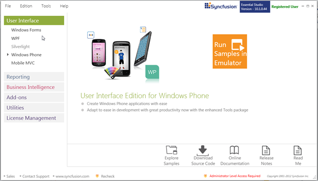
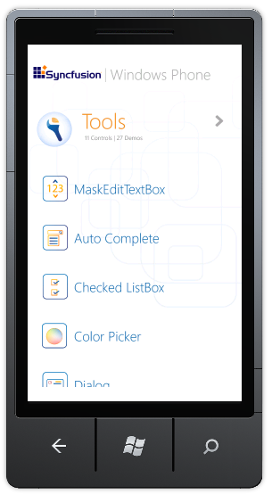

::: {style="DISPLAY: none"}
{#d2h_url_template}{#d2h_package_url style="WIDTH: 0px; DISPLAY: none; HEIGHT: 0px"}
:::

::: {.d2h_secondary_topic style="PADDING-BOTTOM: 10pt; MARGIN: 0pt; PADDING-LEFT: 0pt; PADDING-RIGHT: 0pt; PADDING-TOP: 0pt"}
#### Events {#events style="TEXT-JUSTIFY: inter-ideograph; TEXT-ALIGN: justify; tab-stops: 0pt"}

 

  **[Event ]{style="COLOR: black"}**[]{style="COLOR: black"}   **[Description ]{style="COLOR: black"}**[]{style="COLOR: black"}                   **[Arguments ]{style="COLOR: black"}**[]{style="COLOR: black"}   **[Type ]{style="COLOR: black"}**[]{style="COLOR: black"}
  ------------------------------------------------------------ ---------------------------------------------------------------------------------- ---------------------------------------------------------------- -----------------------------------------------------------
  OnValueChanged                                               This event is fired when the value of the control is changed.                      Value                                                            **PropertyChangedCallback**
  OnWaterMarkTextIsVisibilityChanged                           This event is fired when the WaterMarkText visibility of the control is changed.   Visibility                                                       **PropertyChangedCallback**
  OnTextSelectionOnFocusChanged                                This event is fired when the text selection on focus of the control is changed.    Bool                                                             **PropertyChangedCallback**

[]{style="FONT-FAMILY: 'Calibri','sans-serif'; COLOR: black"}[]{style="COLOR: #c00000"} 

Sample Link

To view Samples:

 

1.  [Click **Start** \> **All Programs** \> **Syncfusion** \> **Essential Studio \<x.x.x.x.\>** \> **Dashboard**]{style="FONT-FAMILY: 'Arial','sans-serif'"}

[]{style="FONT-FAMILY: 'Arial','sans-serif'"} 

[The **Essential Studio Enterprise Edition** window is displayed.]{style="FONT-FAMILY: 'Arial','sans-serif'"}

 

{border="0"}

Fig 134: Essential Studio Enterprise Edition Window

 

2.  [The **User Interface** edition panel is displayed by default. ]{style="FONT-FAMILY: 'Arial','sans-serif'"}

Select **Windows Phone** from the samples listed. The following options will be displayed. You can view the samples in the following three ways:

[·      ]{style="FONT-FAMILY: Symbol"}**[Run Samples in Emulator]{style="FONT-FAMILY: 'Arial','sans-serif'"}**[---View the locally installed Tools samples for Windows Phone using the sample browser.]{style="FONT-FAMILY: 'Arial','sans-serif'"}

[·      ]{style="FONT-FAMILY: Symbol"}**[Explore Samples]{style="FONT-FAMILY: 'Arial','sans-serif'"}**[---Locate the Windows Phone samples on the disk.]{style="FONT-FAMILY: 'Arial','sans-serif'"}

 

3.  [Click **Run Samples in Emulator**. The Windows Phone sample browser will be displayed as shown below.]{style="FONT-FAMILY: 'Arial','sans-serif'"}

 

{border="0"}

Fig 135: Locally installed WP Samples

[]{#related-topics}
:::
