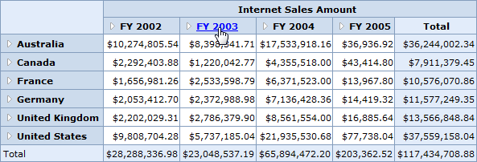
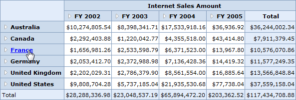
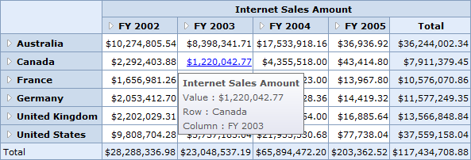

::: {style="DISPLAY: none"}
{#d2h_url_template}{#d2h_package_url style="WIDTH: 0px; DISPLAY: none; HEIGHT: 0px"}
:::

::::: {.d2h_secondary_topic style="PADDING-BOTTOM: 10pt; MARGIN: 0pt; PADDING-LEFT: 0pt; PADDING-RIGHT: 0pt; PADDING-TOP: 0pt"}
#### Events {#events style="tab-stops: 0pt"}

The **Hyperlink Cell Click** event can be tagged in the following ways:

+------------------------------------------------------------------------------------------------------------------------------------------------------------------------------------------------------------------------------------------------------------------------------+
| **[\[C#\]]{style="FONT-FAMILY: 'Courier New'"}**                                                                                                                                                                                                                             |
|                                                                                                                                                                                                                                                                              |
| [// Tag Hyperlink Cell Click Event.]{style="FONT-FAMILY: 'Courier New'; COLOR: green"}                                                                                                                                                                                       |
|                                                                                                                                                                                                                                                                              |
| [this]{style="FONT-FAMILY: 'Courier New'; COLOR: blue"}[.OlapGrid1.HyperlinkCellClick += [new]{style="COLOR: blue"} [OlapGrid]{style="COLOR: #2b91af"}.[RaiseHyperlinkCellClick]{style="COLOR: #2b91af"}(OlapGrid1_HyperlinkCellClick);]{style="FONT-FAMILY: 'Courier New'"} |
+------------------------------------------------------------------------------------------------------------------------------------------------------------------------------------------------------------------------------------------------------------------------------+

 

+-----------------------------------------------------------------------------------------------------------------------------------------------------------------------------------------------------------------------+
| **[\[VB\]]{style="FONT-FAMILY: 'Courier New'"}**                                                                                                                                                                      |
|                                                                                                                                                                                                                       |
| [\'Tag Hyperlink Cell Click Event.]{style="FONT-FAMILY: 'Courier New'; COLOR: green"}[]{style="FONT-FAMILY: 'Courier New'"}                                                                                           |
|                                                                                                                                                                                                                       |
| [Me]{style="FONT-FAMILY: 'Courier New'; COLOR: blue"}[.OlapGrid1.HyperlinkCellClick += [New]{style="COLOR: blue"} OlapGrid.RaiseHyperlinkCellClick(OlapGrid1_HyperlinkCellClick)]{style="FONT-FAMILY: 'Courier New'"} |
+-----------------------------------------------------------------------------------------------------------------------------------------------------------------------------------------------------------------------+

 

The **HyperlinkCellClickArg**[ ]{style="FONT-FAMILY: 'Courier New'"}argument will return the clicked cell descriptor.

+---------------------------------------------------------------------------------------------------------------------------------------------------------------------------------------------------------------------+
| **[\[C#\]]{style="FONT-FAMILY: 'Courier New'"}**                                                                                                                                                                    |
|                                                                                                                                                                                                                     |
| [void]{style="FONT-FAMILY: 'Courier New'; COLOR: blue"}[ OlapGrid1_HyperlinkCellClick([object]{style="COLOR: blue"} sender, [HyperlinkCellClickArg]{style="COLOR: #2b91af"} e)]{style="FONT-FAMILY: 'Courier New'"} |
|                                                                                                                                                                                                                     |
| [{]{style="FONT-FAMILY: 'Courier New'"}                                                                                                                                                                             |
|                                                                                                                                                                                                                     |
| [   [string]{style="COLOR: blue"} uniqueName = e.PivotCellDescriptor.UniqueName;     ]{style="FONT-FAMILY: 'Courier New'"}                                                                                          |
|                                                                                                                                                                                                                     |
| [}]{style="FONT-FAMILY: 'Courier New'"}                                                                                                                                                                             |
+---------------------------------------------------------------------------------------------------------------------------------------------------------------------------------------------------------------------+

 

+---------------------------------------------------------------------------------------------------------------------------------------------------------------------------------------------------------------------------------------------------------------------------------------------------------------------------------------+
| **[\[VB\]]{style="FONT-FAMILY: 'Courier New'"}**                                                                                                                                                                                                                                                                                      |
|                                                                                                                                                                                                                                                                                                                                       |
| [Private]{style="FONT-FAMILY: 'Courier New'; COLOR: blue"}[ [Sub]{style="COLOR: blue"} OlapGrid1_HyperlinkCellClick([ByVal]{style="COLOR: blue"} sender [As]{style="COLOR: blue"} [Object]{style="COLOR: blue"}, [ByVal]{style="COLOR: blue"} e [As]{style="COLOR: blue"} HyperlinkCellClickArg)]{style="FONT-FAMILY: 'Courier New'"} |
|                                                                                                                                                                                                                                                                                                                                       |
| [Dim]{style="FONT-FAMILY: 'Courier New'; COLOR: blue"}[ uniqueName [As]{style="COLOR: blue"} [String]{style="COLOR: blue"} = e.PivotCellDescriptor.UniqueName]{style="FONT-FAMILY: 'Courier New'"}                                                                                                                                    |
|                                                                                                                                                                                                                                                                                                                                       |
| [End]{style="FONT-FAMILY: 'Courier New'; COLOR: blue"}[ [Sub]{style="COLOR: blue"}]{style="FONT-FAMILY: 'Courier New'"}                                                                                                                                                                                                               |
+---------------------------------------------------------------------------------------------------------------------------------------------------------------------------------------------------------------------------------------------------------------------------------------------------------------------------------------+

 

 

{border="0"}

Figure 17: OLAP Grid with Hyperlinked Column Header

[]{style="FONT-FAMILY: 'Courier New'; COLOR: blue"} 

{border="0"}

Figure 18: OLAP Grid with Hyperlinked Row Header

 

{border="0"}

Figure 19: OLAP Grid with Hyperlinked Value Cell

 

Table 8: Properties

::: {align="center"}
  ----------------------------- ---------------------------------------------------------------- ------------- -----------
  Property                      Description                                                      Type          Data Type
  EnableHyperLinkColumnHeader   Gets or sets to enable or disable the Hyperlink Column Header.   Server side   boolean
  EnableHyperLinkRowHeader      Gets or sets to enable or disable the Hyperlink Row Header.      Server side   boolean
  EnableHyperLinkValueCell      Gets or sets to enable or disable the Hyperlink Value Cell.      Server side   boolean
  ----------------------------- ---------------------------------------------------------------- ------------- -----------
:::

 

Table 9: HyperlinkCellClick Event

::: {align="center"}
+--------------------+----------------------------------------------------------------+---------------------+-----------------------+
|                    |                                                                |                     |                       |
|                    |                                                                |                     |                       |
| Event              | Description                                                    | Arguments           |  Type                 |
|                    |                                                                |                     |                       |
|                    |                                                                |                     |                       |
+--------------------+----------------------------------------------------------------+---------------------+-----------------------+
| HyperlinkCellClick | Handles the Hyperlink Cell Click event of the OlapGrid control | PivotCellDescriptor | HyperlinkCellClickArg |
+--------------------+----------------------------------------------------------------+---------------------+-----------------------+
:::

 

Sample Location

A sample demo is available in the following location:

**..\\Syncfusion\\EssentialStudio\\\<VersionNumber\>\\BI\\Web\\OlapGrid.Web\\Samples\\3.5\\Hyperlink Cells\\Hyperlink Cells Demo**

 

[]{#related-topics}
:::::
