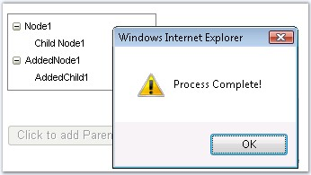

::: {style="DISPLAY: none"}
{#d2h_url_template}{#d2h_package_url style="WIDTH: 0px; DISPLAY: none; HEIGHT: 0px"}
:::

::::: {.d2h_secondary_topic style="PADDING-BOTTOM: 10pt; MARGIN: 0pt; PADDING-LEFT: 0pt; PADDING-RIGHT: 0pt; PADDING-TOP: 0pt"}
#### Events[]{style="FONT-SIZE: 10pt"} {#events style="tab-stops: 0pt"}

[]{style="FONT-FAMILY: 'Trebuchet MS','sans-serif'; COLOR: #15428b; FONT-SIZE: 9pt"} 

The server side event can be invoked to refresh the data on client side and the client side events can be triggered to execute some defined functions on client side without postback. The various server and client events supported by the CallbackPanel are as follows.

[]{style="FONT-FAMILY: 'Trebuchet MS','sans-serif'; COLOR: #15428b; FONT-SIZE: 9pt"} 

::: {align="center"}
+-----------------------------------+---------------------------------------------------------------------------+
|                                   |                                                                           |
|                                   |                                                                           |
| Server-Side Event                 | Description                                                               |
+-----------------------------------+---------------------------------------------------------------------------+
| CallbackRefresh                   | Specifies to execute the event when the data is refreshed on client side. |
+-----------------------------------+---------------------------------------------------------------------------+
:::

[]{style="FONT-FAMILY: 'Trebuchet MS','sans-serif'; COLOR: #15428b; FONT-SIZE: 9pt"} 

::: {align="center"}
+----------------------------------------+--------------------------------------------------------------------------------------------+
| Client-Side Event                      | Description                                                                                |
+----------------------------------------+--------------------------------------------------------------------------------------------+
| AfterCallbackResponseProcessedScript   | Specifies the script to execute after the callback result is processed.                    |
+----------------------------------------+--------------------------------------------------------------------------------------------+
| AfterCallbackScript                    | Specifies the script function to execute after the callback request is sent to the server. |
|                                        |                                                                                            |
|                                        |                                                                                            |
+----------------------------------------+--------------------------------------------------------------------------------------------+
| BeforeCallbackResponseProcessingScript | Specifies the script to execute before the callback result is processed.                   |
+----------------------------------------+--------------------------------------------------------------------------------------------+
| BeforeCallbackScript                   | Specifies the script to execute before a callback request is sent to the server.           |
+----------------------------------------+--------------------------------------------------------------------------------------------+
:::

[]{style="FONT-FAMILY: 'Trebuchet MS','sans-serif'; COLOR: #15428b; FONT-SIZE: 9pt"} 

{border="0"}

[]{style="FONT-FAMILY: 'Trebuchet MS','sans-serif'; COLOR: #15428b; FONT-SIZE: 9pt"} 

Figure 164: Nodes populated in the tree control using callback, which is invoked on button click

[]{style="FONT-FAMILY: 'Trebuchet MS','sans-serif'; COLOR: #15428b; FONT-SIZE: 9pt"} 

To raise the client events, follow the steps given below:

[]{style="FONT-FAMILY: 'Trebuchet MS','sans-serif'; COLOR: #15428b; FONT-SIZE: 9pt"} 

1.   Define the client functions that should be executed.

[]{style="FONT-FAMILY: 'Trebuchet MS','sans-serif'; COLOR: #15428b; FONT-SIZE: 9pt"} 

+-----------------------------------------------------------------------------------------------------------------------------------------------------------------------------+
| **[\[javascript\]]{style="FONT-FAMILY: 'Courier New'; FONT-SIZE: 9pt"}**                                                                                                    |
|                                                                                                                                                                             |
| []{style="FONT-FAMILY: 'Courier New'; COLOR: blue; FONT-SIZE: 9pt"}                                                                                                         |
|                                                                                                                                                                             |
| [function]{style="FONT-FAMILY: 'Courier New'; COLOR: blue; FONT-SIZE: 9pt"}[ OnRefresh()]{style="FONT-FAMILY: 'Courier New'; FONT-SIZE: 9pt"}                               |
|                                                                                                                                                                             |
| [{]{style="FONT-FAMILY: 'Courier New'; FONT-SIZE: 9pt"}                                                                                                                     |
|                                                                                                                                                                             |
| [    \_sfCallbackPanel2.callback();]{style="FONT-FAMILY: 'Courier New'; FONT-SIZE: 9pt"}                                                                                    |
|                                                                                                                                                                             |
| [}       ]{style="FONT-FAMILY: 'Courier New'; FONT-SIZE: 9pt"}                                                                                                              |
|                                                                                                                                                                             |
| [function]{style="FONT-FAMILY: 'Courier New'; COLOR: blue; FONT-SIZE: 9pt"}[ BeforeCallback()]{style="FONT-FAMILY: 'Courier New'; FONT-SIZE: 9pt"}                          |
|                                                                                                                                                                             |
| [{]{style="FONT-FAMILY: 'Courier New'; FONT-SIZE: 9pt"}                                                                                                                     |
|                                                                                                                                                                             |
| [    document.getElementById([\'Button1\']{style="COLOR: maroon"}).disabled=[true]{style="COLOR: blue"};]{style="FONT-FAMILY: 'Courier New'; FONT-SIZE: 9pt"}               |
|                                                                                                                                                                             |
| [} ]{style="FONT-FAMILY: 'Courier New'; FONT-SIZE: 9pt"}                                                                                                                    |
|                                                                                                                                                                             |
| [function]{style="FONT-FAMILY: 'Courier New'; COLOR: blue; FONT-SIZE: 9pt"}[ AfterCallback(obj)]{style="FONT-FAMILY: 'Courier New'; FONT-SIZE: 9pt"}                        |
|                                                                                                                                                                             |
| [{]{style="FONT-FAMILY: 'Courier New'; FONT-SIZE: 9pt"}                                                                                                                     |
|                                                                                                                                                                             |
| [    alert([\"Callback Invoked\"]{style="COLOR: maroon"});]{style="FONT-FAMILY: 'Courier New'; FONT-SIZE: 9pt"}                                                             |
|                                                                                                                                                                             |
| [}      ]{style="FONT-FAMILY: 'Courier New'; FONT-SIZE: 9pt"}                                                                                                               |
|                                                                                                                                                                             |
| [function]{style="FONT-FAMILY: 'Courier New'; COLOR: blue; FONT-SIZE: 9pt"}[ BeforeResponseProcess()]{style="FONT-FAMILY: 'Courier New'; FONT-SIZE: 9pt"}                   |
|                                                                                                                                                                             |
| [{]{style="FONT-FAMILY: 'Courier New'; FONT-SIZE: 9pt"}                                                                                                                     |
|                                                                                                                                                                             |
| [    alert([\'Processing Script\']{style="COLOR: maroon"});]{style="FONT-FAMILY: 'Courier New'; FONT-SIZE: 9pt"}                                                            |
|                                                                                                                                                                             |
| [}]{style="FONT-FAMILY: 'Courier New'; FONT-SIZE: 9pt"}                                                                                                                     |
|                                                                                                                                                                             |
| [function]{style="FONT-FAMILY: 'Courier New'; COLOR: blue; FONT-SIZE: 9pt"}[ AfterResponseProcess()]{style="FONT-FAMILY: 'Courier New'; FONT-SIZE: 9pt"}                    |
|                                                                                                                                                                             |
| [{]{style="FONT-FAMILY: 'Courier New'; FONT-SIZE: 9pt"}                                                                                                                     |
|                                                                                                                                                                             |
| [    alert([\'Process Complete\']{style="COLOR: maroon"});]{style="FONT-FAMILY: 'Courier New'; FONT-SIZE: 9pt"}                                                             |
|                                                                                                                                                                             |
| [    document.getElementById([\'Button1\']{style="COLOR: maroon"}).disabled= [false]{style="COLOR: blue"};            ]{style="FONT-FAMILY: 'Courier New'; FONT-SIZE: 9pt"} |
|                                                                                                                                                                             |
| [}]{style="FONT-FAMILY: 'Courier New'; FONT-SIZE: 9pt"}                                                                                                                     |
+-----------------------------------------------------------------------------------------------------------------------------------------------------------------------------+

[]{style="FONT-FAMILY: 'Trebuchet MS','sans-serif'; COLOR: #15428b; FONT-SIZE: 9pt"} 

Alert message will be displayed when all the functions are triggered. When the **BeforeCallback** function is executed, the button will be disabled and in the AfterResponseProcess, the button will again be enabled.

[]{style="FONT-FAMILY: 'Trebuchet MS','sans-serif'; COLOR: #15428b; FONT-SIZE: 9pt"} 

18.  Set the client side functions to the function names that has to be executed and which are defined.

[]{style="FONT-FAMILY: 'Trebuchet MS','sans-serif'; COLOR: #15428b; FONT-SIZE: 9pt"} 

+---------------------------------------------------------------------------------------------------------------------------------------------------------------------------------------------------------------------------------------------------------------------------------------------------------------------------------------------------------------------------------------------------------------------------------------------------------------------------------------------------------------------------------------------------------------------------------------------------------------------------------------------------------------------------------------------------------------------------------------------------------------------------------------------------------------------------------------------------------------------------------------------------------------------------------------------------------------------------------------------------------+
| **[\[aspx\]]{style="FONT-FAMILY: 'Courier New'; FONT-SIZE: 9pt"}**                                                                                                                                                                                                                                                                                                                                                                                                                                                                                                                                                                                                                                                                                                                                                                                                                                                                                                                                      |
|                                                                                                                                                                                                                                                                                                                                                                                                                                                                                                                                                                                                                                                                                                                                                                                                                                                                                                                                                                                                         |
| []{style="FONT-FAMILY: 'Courier New'; COLOR: blue; FONT-SIZE: 9pt"}                                                                                                                                                                                                                                                                                                                                                                                                                                                                                                                                                                                                                                                                                                                                                                                                                                                                                                                                     |
|                                                                                                                                                                                                                                                                                                                                                                                                                                                                                                                                                                                                                                                                                                                                                                                                                                                                                                                                                                                                         |
| [\<]{style="FONT-FAMILY: 'Courier New'; COLOR: blue; FONT-SIZE: 9pt"}[ssw]{style="FONT-FAMILY: 'Courier New'; COLOR: maroon; FONT-SIZE: 9pt"}[:]{style="FONT-FAMILY: 'Courier New'; COLOR: blue; FONT-SIZE: 9pt"}[CallbackPanel]{style="FONT-FAMILY: 'Courier New'; COLOR: maroon; FONT-SIZE: 9pt"}[ [ID]{style="COLOR: red"}[=\"CallbackPanel2\"]{style="COLOR: blue"} [runat]{style="COLOR: red"}[=\"server\"]{style="COLOR: blue"} [OnCallbackRefresh]{style="COLOR: red"}[=\"CallbackPanel2_CallbackRefresh\"]{style="COLOR: blue"} [BeforeCallbackScript]{style="COLOR: red"}[=\"BeforeCallback()\"]{style="COLOR: blue"} [BeforeCallbackResponseProcessingScript]{style="COLOR: red"}[=\"BeforeResponseProcess()\"]{style="COLOR: blue"} [AfterCallbackScript]{style="COLOR: red"}[=\"AfterCallback()\"]{style="COLOR: blue"} [AfterCallbackResponseProcessedScript]{style="COLOR: red"}[=\"AfterResponseProcess()\"\>]{style="COLOR: blue"}]{style="FONT-FAMILY: 'Courier New'; FONT-SIZE: 9pt"} |
|                                                                                                                                                                                                                                                                                                                                                                                                                                                                                                                                                                                                                                                                                                                                                                                                                                                                                                                                                                                                         |
| [    [\<]{style="COLOR: blue"}[cc1]{style="COLOR: maroon"}[:]{style="COLOR: blue"}[TreeView]{style="COLOR: maroon"} [ID]{style="COLOR: red"}[=\"TreeView1\"]{style="COLOR: blue"} [runat]{style="COLOR: red"}[=\"server\"]{style="COLOR: blue"} [BorderColor]{style="COLOR: red"}[=\"Gray\"]{style="COLOR: blue"} [BorderStyle]{style="COLOR: red"}[=\"Solid\"]{style="COLOR: blue"}]{style="FONT-FAMILY: 'Courier New'; FONT-SIZE: 9pt"}                                                                                                                                                                                                                                                                                                                                                                                                                                                                                                                                                               |
|                                                                                                                                                                                                                                                                                                                                                                                                                                                                                                                                                                                                                                                                                                                                                                                                                                                                                                                                                                                                         |
| [        [BorderWidth]{style="COLOR: red"}[=\"1px\"]{style="COLOR: blue"} [Height]{style="COLOR: red"}[=\"80px\"]{style="COLOR: blue"} [Width]{style="COLOR: red"}[=\"160px\"\>]{style="COLOR: blue"}]{style="FONT-FAMILY: 'Courier New'; FONT-SIZE: 9pt"}                                                                                                                                                                                                                                                                                                                                                                                                                                                                                                                                                                                                                                                                                                                                              |
|                                                                                                                                                                                                                                                                                                                                                                                                                                                                                                                                                                                                                                                                                                                                                                                                                                                                                                                                                                                                         |
| [        [\<]{style="COLOR: blue"}[Items]{style="COLOR: maroon"}[\>]{style="COLOR: blue"}]{style="FONT-FAMILY: 'Courier New'; FONT-SIZE: 9pt"}                                                                                                                                                                                                                                                                                                                                                                                                                                                                                                                                                                                                                                                                                                                                                                                                                                                          |
|                                                                                                                                                                                                                                                                                                                                                                                                                                                                                                                                                                                                                                                                                                                                                                                                                                                                                                                                                                                                         |
| [            [\<]{style="COLOR: blue"}[cc1]{style="COLOR: maroon"}[:]{style="COLOR: blue"}[TreeViewNode]{style="COLOR: maroon"} [Expanded]{style="COLOR: red"}[=\"True\"]{style="COLOR: blue"} [Text]{style="COLOR: red"}[=\"Node1\"\>]{style="COLOR: blue"}]{style="FONT-FAMILY: 'Courier New'; FONT-SIZE: 9pt"}                                                                                                                                                                                                                                                                                                                                                                                                                                                                                                                                                                                                                                                                                       |
|                                                                                                                                                                                                                                                                                                                                                                                                                                                                                                                                                                                                                                                                                                                                                                                                                                                                                                                                                                                                         |
| [                [\<]{style="COLOR: blue"}[cc1]{style="COLOR: maroon"}[:]{style="COLOR: blue"}[TreeViewNode]{style="COLOR: maroon"} [Text]{style="COLOR: red"}[=\"Child Node1\"\>]{style="COLOR: blue"}]{style="FONT-FAMILY: 'Courier New'; FONT-SIZE: 9pt"}                                                                                                                                                                                                                                                                                                                                                                                                                                                                                                                                                                                                                                                                                                                                            |
|                                                                                                                                                                                                                                                                                                                                                                                                                                                                                                                                                                                                                                                                                                                                                                                                                                                                                                                                                                                                         |
| [                [\</]{style="COLOR: blue"}[cc1]{style="COLOR: maroon"}[:]{style="COLOR: blue"}[TreeViewNode]{style="COLOR: maroon"}[\>]{style="COLOR: blue"}]{style="FONT-FAMILY: 'Courier New'; FONT-SIZE: 9pt"}                                                                                                                                                                                                                                                                                                                                                                                                                                                                                                                                                                                                                                                                                                                                                                                      |
|                                                                                                                                                                                                                                                                                                                                                                                                                                                                                                                                                                                                                                                                                                                                                                                                                                                                                                                                                                                                         |
| [            [\</]{style="COLOR: blue"}[cc1]{style="COLOR: maroon"}[:]{style="COLOR: blue"}[TreeViewNode]{style="COLOR: maroon"}[\>]{style="COLOR: blue"}]{style="FONT-FAMILY: 'Courier New'; FONT-SIZE: 9pt"}                                                                                                                                                                                                                                                                                                                                                                                                                                                                                                                                                                                                                                                                                                                                                                                          |
|                                                                                                                                                                                                                                                                                                                                                                                                                                                                                                                                                                                                                                                                                                                                                                                                                                                                                                                                                                                                         |
| [        [\</]{style="COLOR: blue"}[Items]{style="COLOR: maroon"}[\>]{style="COLOR: blue"}]{style="FONT-FAMILY: 'Courier New'; FONT-SIZE: 9pt"}                                                                                                                                                                                                                                                                                                                                                                                                                                                                                                                                                                                                                                                                                                                                                                                                                                                         |
|                                                                                                                                                                                                                                                                                                                                                                                                                                                                                                                                                                                                                                                                                                                                                                                                                                                                                                                                                                                                         |
| [    [\</]{style="COLOR: blue"}[cc1]{style="COLOR: maroon"}[:]{style="COLOR: blue"}[TreeView]{style="COLOR: maroon"}[\>]{style="COLOR: blue"}]{style="FONT-FAMILY: 'Courier New'; FONT-SIZE: 9pt"}                                                                                                                                                                                                                                                                                                                                                                                                                                                                                                                                                                                                                                                                                                                                                                                                      |
|                                                                                                                                                                                                                                                                                                                                                                                                                                                                                                                                                                                                                                                                                                                                                                                                                                                                                                                                                                                                         |
| [\</]{style="FONT-FAMILY: 'Courier New'; COLOR: blue; FONT-SIZE: 9pt"}[ssw]{style="FONT-FAMILY: 'Courier New'; COLOR: maroon; FONT-SIZE: 9pt"}[:]{style="FONT-FAMILY: 'Courier New'; COLOR: blue; FONT-SIZE: 9pt"}[CallbackPanel]{style="FONT-FAMILY: 'Courier New'; COLOR: maroon; FONT-SIZE: 9pt"}[\>]{style="FONT-FAMILY: 'Courier New'; COLOR: blue; FONT-SIZE: 9pt"}                                                                                                                                                                                                                                                                                                                                                                                                                                                                                                                                                                                                                               |
|                                                                                                                                                                                                                                                                                                                                                                                                                                                                                                                                                                                                                                                                                                                                                                                                                                                                                                                                                                                                         |
| [\<]{style="FONT-FAMILY: 'Courier New'; COLOR: blue; FONT-SIZE: 9pt"}[asp]{style="FONT-FAMILY: 'Courier New'; COLOR: maroon; FONT-SIZE: 9pt"}[:]{style="FONT-FAMILY: 'Courier New'; COLOR: blue; FONT-SIZE: 9pt"}[Button]{style="FONT-FAMILY: 'Courier New'; COLOR: maroon; FONT-SIZE: 9pt"}[ [ID]{style="COLOR: red"}[=\"Button1\"]{style="COLOR: blue"} [runat]{style="COLOR: red"}[=\"server\"]{style="COLOR: blue"} [Text]{style="COLOR: red"}[=\"Click to add Parent Node\"]{style="COLOR: blue"} [OnClientClick]{style="COLOR: red"}[=\"OnRefresh(\'Request\');return false;\"]{style="COLOR: blue"}  [/\>]{style="COLOR: blue"}]{style="FONT-FAMILY: 'Courier New'; FONT-SIZE: 9pt"}                                                                                                                                                                                                                                                                                                             |
+---------------------------------------------------------------------------------------------------------------------------------------------------------------------------------------------------------------------------------------------------------------------------------------------------------------------------------------------------------------------------------------------------------------------------------------------------------------------------------------------------------------------------------------------------------------------------------------------------------------------------------------------------------------------------------------------------------------------------------------------------------------------------------------------------------------------------------------------------------------------------------------------------------------------------------------------------------------------------------------------------------+

[]{style="FONT-FAMILY: 'Trebuchet MS','sans-serif'; COLOR: #15428b; FONT-SIZE: 9pt"} 

19.  In the code behind file, the nodes are added to the treecontrol in the **CallbackRefresh** event.

[]{style="FONT-FAMILY: 'Trebuchet MS','sans-serif'; COLOR: #15428b; FONT-SIZE: 9pt"} 

+----------------------------------------------------------------------------------------------------------------------------------------------------------------------------------------------------------------------------------------------------------------------------------------------------------+
| **[\[C#\]]{style="FONT-FAMILY: 'Courier New'; FONT-SIZE: 9pt"}**                                                                                                                                                                                                                                         |
|                                                                                                                                                                                                                                                                                                          |
| []{style="FONT-FAMILY: 'Courier New'; COLOR: blue; FONT-SIZE: 9pt"}                                                                                                                                                                                                                                      |
|                                                                                                                                                                                                                                                                                                          |
| [protected]{style="FONT-FAMILY: 'Courier New'; COLOR: blue; FONT-SIZE: 9pt"}[ [void]{style="COLOR: blue"} CallbackPanel2_CallbackRefresh([object]{style="COLOR: blue"} sender,  Syncfusion.Web.UI.WebControls.Tools.CancellableCallbackEventArgs e)]{style="FONT-FAMILY: 'Courier New'; FONT-SIZE: 9pt"} |
|                                                                                                                                                                                                                                                                                                          |
| [{]{style="FONT-FAMILY: 'Courier New'; FONT-SIZE: 9pt"}                                                                                                                                                                                                                                                  |
|                                                                                                                                                                                                                                                                                                          |
| [    System.Threading.Thread.Sleep(2000);]{style="FONT-FAMILY: 'Courier New'; FONT-SIZE: 9pt"}                                                                                                                                                                                                           |
|                                                                                                                                                                                                                                                                                                          |
| [    TreeViewNode rootNode = [new]{style="COLOR: blue"} TreeViewNode();]{style="FONT-FAMILY: 'Courier New'; FONT-SIZE: 9pt"}                                                                                                                                                                             |
|                                                                                                                                                                                                                                                                                                          |
| [    rootNode.Text = [\"AddedNode1\"]{style="COLOR: maroon"};]{style="FONT-FAMILY: 'Courier New'; FONT-SIZE: 9pt"}                                                                                                                                                                                       |
|                                                                                                                                                                                                                                                                                                          |
| [    rootNode.Expanded = [true]{style="COLOR: blue"};]{style="FONT-FAMILY: 'Courier New'; FONT-SIZE: 9pt"}                                                                                                                                                                                               |
|                                                                                                                                                                                                                                                                                                          |
| [    TreeView1.Items.Add(rootNode);]{style="FONT-FAMILY: 'Courier New'; FONT-SIZE: 9pt"}                                                                                                                                                                                                                 |
|                                                                                                                                                                                                                                                                                                          |
| []{style="FONT-FAMILY: 'Courier New'; FONT-SIZE: 9pt"}                                                                                                                                                                                                                                                   |
|                                                                                                                                                                                                                                                                                                          |
| [    TreeViewNode firstChild = [new]{style="COLOR: blue"} TreeViewNode();]{style="FONT-FAMILY: 'Courier New'; FONT-SIZE: 9pt"}                                                                                                                                                                           |
|                                                                                                                                                                                                                                                                                                          |
| [    firstChild.Text = [\"AddedChild1\"]{style="COLOR: maroon"};]{style="FONT-FAMILY: 'Courier New'; FONT-SIZE: 9pt"}                                                                                                                                                                                    |
|                                                                                                                                                                                                                                                                                                          |
| [    rootNode.Items.Add(firstChild);]{style="FONT-FAMILY: 'Courier New'; FONT-SIZE: 9pt"}                                                                                                                                                                                                                |
|                                                                                                                                                                                                                                                                                                          |
| [}]{style="FONT-FAMILY: 'Courier New'; FONT-SIZE: 9pt"}                                                                                                                                                                                                                                                  |
+----------------------------------------------------------------------------------------------------------------------------------------------------------------------------------------------------------------------------------------------------------------------------------------------------------+

[]{style="FONT-FAMILY: 'Trebuchet MS','sans-serif'; COLOR: #15428b; FONT-SIZE: 9pt"} 

+-----------------------------------------------------------------------------------------------------------------------------------------------------------------------------------------------------------------------------------------------------------------------------------------------------------------------------+
| **[\[VB.NET\]]{style="FONT-FAMILY: 'Courier New'; FONT-SIZE: 9pt"}**                                                                                                                                                                                                                                                        |
|                                                                                                                                                                                                                                                                                                                             |
| []{style="FONT-FAMILY: 'Courier New'; COLOR: blue; FONT-SIZE: 9pt"}                                                                                                                                                                                                                                                         |
|                                                                                                                                                                                                                                                                                                                             |
| [Protected [Sub]{style="COLOR: blue"} CallbackPanel2_CallbackRefresh([ByVal]{style="COLOR: blue"} sender [As]{style="COLOR: blue"} Object, [ByVal]{style="COLOR: blue"} e [As]{style="COLOR: blue"}  Syncfusion.Web.UI.WebControls.Tools.CancellableCallbackEventArgs)]{style="FONT-FAMILY: 'Courier New'; FONT-SIZE: 9pt"} |
|                                                                                                                                                                                                                                                                                                                             |
| [       System.Threading.Thread.Sleep(2000)]{style="FONT-FAMILY: 'Courier New'; FONT-SIZE: 9pt"}                                                                                                                                                                                                                            |
|                                                                                                                                                                                                                                                                                                                             |
| [       [Dim]{style="COLOR: blue"} rootNode [As]{style="COLOR: blue"} TreeViewNode = [New]{style="COLOR: blue"} TreeViewNode()]{style="FONT-FAMILY: 'Courier New'; FONT-SIZE: 9pt"}                                                                                                                                         |
|                                                                                                                                                                                                                                                                                                                             |
| [       rootNode.Text = [\"AddedNode1\"]{style="COLOR: maroon"}]{style="FONT-FAMILY: 'Courier New'; FONT-SIZE: 9pt"}                                                                                                                                                                                                        |
|                                                                                                                                                                                                                                                                                                                             |
| [       rootNode.Expanded = [True]{style="COLOR: blue"}]{style="FONT-FAMILY: 'Courier New'; FONT-SIZE: 9pt"}                                                                                                                                                                                                                |
|                                                                                                                                                                                                                                                                                                                             |
| [       TreeView1.Items.Add(rootNode)]{style="FONT-FAMILY: 'Courier New'; FONT-SIZE: 9pt"}                                                                                                                                                                                                                                  |
|                                                                                                                                                                                                                                                                                                                             |
| []{style="FONT-FAMILY: 'Courier New'; FONT-SIZE: 9pt"}                                                                                                                                                                                                                                                                      |
|                                                                                                                                                                                                                                                                                                                             |
| [       [Dim]{style="COLOR: blue"} firstChild [As]{style="COLOR: blue"} TreeViewNode = [New]{style="COLOR: blue"} TreeViewNode()]{style="FONT-FAMILY: 'Courier New'; FONT-SIZE: 9pt"}                                                                                                                                       |
|                                                                                                                                                                                                                                                                                                                             |
| [       firstChild.Text = [\"AddedChild1\"]{style="COLOR: maroon"}]{style="FONT-FAMILY: 'Courier New'; FONT-SIZE: 9pt"}                                                                                                                                                                                                     |
|                                                                                                                                                                                                                                                                                                                             |
| [       rootNode.Items.Add(firstChild)]{style="FONT-FAMILY: 'Courier New'; FONT-SIZE: 9pt"}                                                                                                                                                                                                                                 |
|                                                                                                                                                                                                                                                                                                                             |
| [End]{style="FONT-FAMILY: 'Courier New'; COLOR: blue; FONT-SIZE: 9pt"}[ [Sub]{style="COLOR: blue"}]{style="FONT-FAMILY: 'Courier New'; FONT-SIZE: 9pt"}                                                                                                                                                                     |
+-----------------------------------------------------------------------------------------------------------------------------------------------------------------------------------------------------------------------------------------------------------------------------------------------------------------------------+

[]{#related-topics}
:::::
