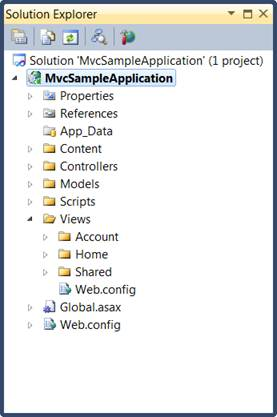
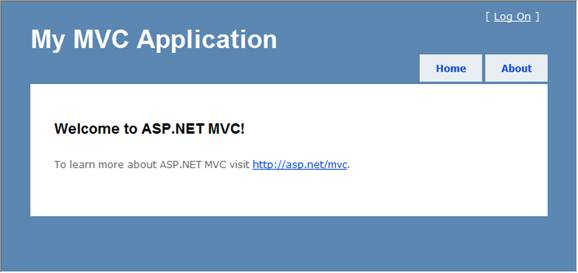

::: {style="DISPLAY: none"}
{#d2h_url_template}{#d2h_package_url style="WIDTH: 0px; DISPLAY: none; HEIGHT: 0px"}
:::

::::: {#nsbanner .d2h_main_nsbanner style="BORDER-BOTTOM: #999999 1px solid; POSITION: relative; PADDING-BOTTOM: 0px; BACKGROUND-COLOR: transparent; PADDING-LEFT: 0px; PADDING-RIGHT: 0px; DISPLAY: none; BORDER-TOP: #999999 1px solid; PADDING-TOP: 0px; LEFT: 0px"}
:::: {#TitleRow .d2h_main_titlerow style="PADDING-BOTTOM: 4px; BACKGROUND-COLOR: transparent; PADDING-LEFT: 22px; WIDTH: 100%; PADDING-RIGHT: 10px; DISPLAY: none; PADDING-TOP: 4px"}
::: {#ienav .d2h_main_ienav style="DISPLAY: none"}
{#D2HPrevious .D2HPreviousEnabled}  {#D2HNext .D2HNextEnabled}
:::
::::
:::::

:::: {#nstext .d2h_main_nstext style="PADDING-BOTTOM: 10px; BACKGROUND-COLOR: transparent; PADDING-LEFT: 22px; PADDING-RIGHT: 10px; HEIGHT: 100%; OVERFLOW: auto; PADDING-TOP: 5px" hasuserbackground="true" valign="bottom"}
::: {#d2h_breadcrumbs .d2h_breadcrumbs}
[Essential Studio User Guide Documentation](ms-xhelp:///?Id=12457748-09e3-4d74-a240-8e049cedf030){.d2h_breadcrumbsNormal}[ \> ]{.d2h_breadcrumbsLinkSeparator}[User Interface Edition](ms-xhelp:///?Id=c29296b7-531c-413b-a0ec-488ca1f7f669){.d2h_breadcrumbsNormal}[ \> ]{.d2h_breadcrumbsLinkSeparator}[Essential ASP.NET MVC](ms-xhelp:///?Id=4b14e7d1-65c4-4f67-b1aa-2c37709905a5){.d2h_breadcrumbsNormal}[ \> ]{.d2h_breadcrumbsLinkSeparator}[Essential Schedule]{.d2h_breadcrumbsContentsOnly}[ \> ]{.d2h_breadcrumbsLinkSeparator}[Getting Started](ms-xhelp:///?Id=b686dbe4-808e-405b-8e03-33b17be71f0d){.d2h_breadcrumbsNormal}[ \> ]{.d2h_breadcrumbsLinkSeparator}[Creating a Platform Application](ms-xhelp:///?Id=bfcddfaa-581e-4be3-ada8-fe85556151f0){.d2h_breadcrumbsNormal}
:::

### Examining the MVC Project {#examining-the-mvc-project style="tab-stops: 0pt"}

The following illustration shows the folder structure of a newly created MVC solution.

[]{style="FONT-FAMILY: 'Calibri','sans-serif'"} 

{border="0"}

[]{style="FONT-FAMILY: 'Calibri','sans-serif'"} 

Figure 34: Solution Explorer

[]{style="FONT-FAMILY: 'Calibri','sans-serif'"} 

The folder structure of an MVC project differs from that of an ASP.NET Web site project. The MVC project contains the following folders:

[·      ]{style="FONT-FAMILY: Symbol"}Content, this is for content support files. This folder contains the cascading style sheet (.css file) for the application.

[·      ]{style="FONT-FAMILY: Symbol"}Controllers, which is for controller files. This folder contains the application\'s sample controllers, which are named as *[AccountController]{style="FONT-FAMILY: 'Calibri','sans-serif'; FONT-SIZE: 11pt"}* and *[HomeController]{style="FONT-FAMILY: 'Calibri','sans-serif'; FONT-SIZE: 11pt"}*. The [AccountController]{style="FONT-FAMILY: 'Calibri','sans-serif'; FONT-SIZE: 11pt"} class contains login logic for the application. The [HomeController]{style="FONT-FAMILY: 'Calibri','sans-serif'; FONT-SIZE: 11pt"} class contains logic that is called by default when the application starts.

[·      ]{style="FONT-FAMILY: Symbol"}Models, which is for data-model files such as LINQ-to-SQL .dbml files or data-entity files.

[·      ]{style="FONT-FAMILY: Symbol"}Scripts, which is for script files, such as those that support ASP.NET AJAX and jQuery.

[·      ]{style="FONT-FAMILY: Symbol"}*Views*, which is for view page files. This folder contains three subfolders: *Account*, *Home*, and *Shared*. The Account folder contains views that are used as UI for logging in and changing passwords. The Home folder contains an Index view (the default starting page for the application) and an about page view. The Shared folder contains the master-page view for the application.

The newly generated MVC project is a complete application that you can compile and run without change. The following illustration shows what the application looks like when it runs in a browser:

[]{style="FONT-FAMILY: 'Calibri','sans-serif'; FONT-SIZE: 11pt"} 

{border="0"}

[]{style="FONT-FAMILY: 'Calibri','sans-serif'"} 

Figure 35: MVC Application Output

[]{style="FONT-FAMILY: 'Calibri','sans-serif'"} 

[]{#related-topics}
::::
