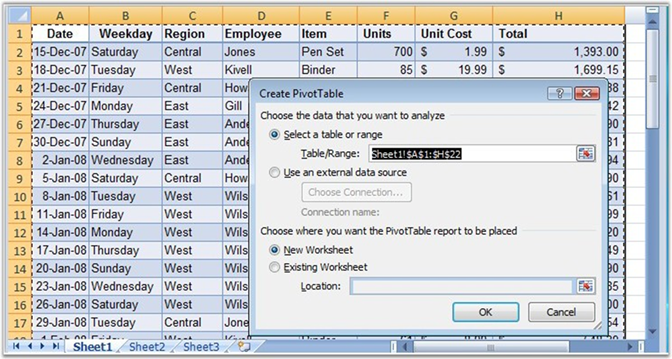
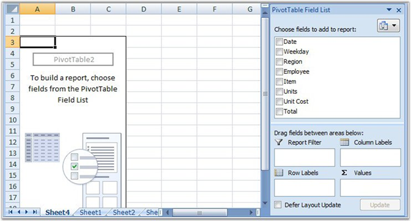
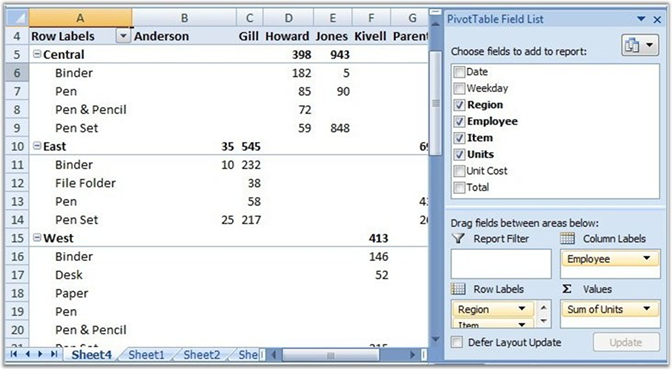
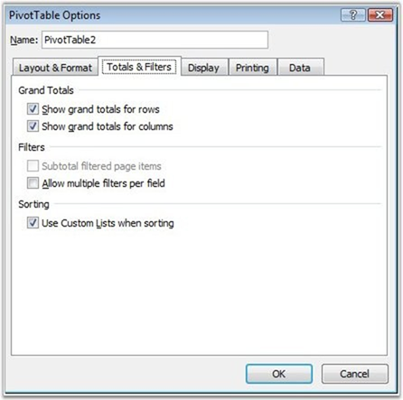
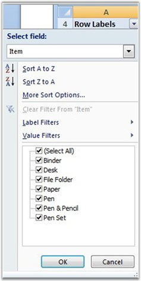
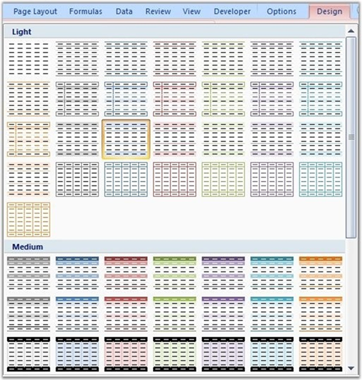
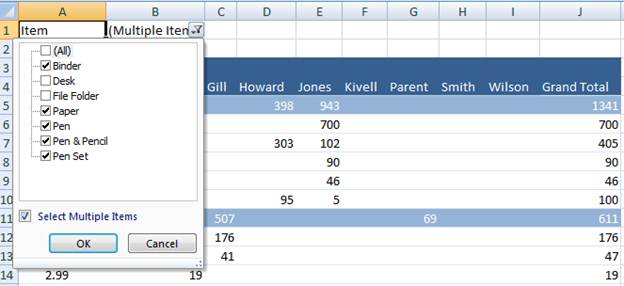
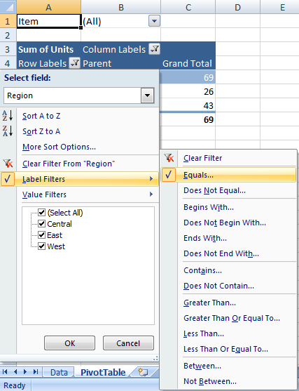
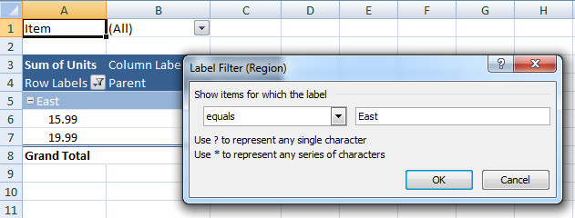

::: {style="DISPLAY: none"}
{#d2h_url_template}{#d2h_package_url style="WIDTH: 0px; DISPLAY: none; HEIGHT: 0px"}
:::

:::::::: {.d2h_secondary_topic style="PADDING-BOTTOM: 10pt; MARGIN: 0pt; PADDING-LEFT: 0pt; PADDING-RIGHT: 0pt; PADDING-TOP: 0pt"}
#### Excel 2007 {#excel-2007 style="tab-stops: 0pt"}

**[]{style="FONT-FAMILY: 'Segoe UI','sans-serif'; COLOR: black"}** 

Pivot Table Creation By Using MS Excel 2007

In Excel, Pivot table can be inserted by selecting the **PivotTable** option from the **Insert** menu.

 

{border="0"}

Figure 87: Create PivotTable Dialog Box[]{style="FONT-FAMILY: 'Trebuchet MS','sans-serif'; COLOR: #15428b"}

[]{style="FONT-FAMILY: 'Trebuchet MS','sans-serif'; COLOR: #15428b; FONT-SIZE: 9pt"} 

Excel automatically selects the entire range. However, it is possible to modify it if necessary. It also allows choosing where to place the PivotTable (New Worksheet is most commonly used to place the pivot table).

[]{style="FONT-FAMILY: 'Trebuchet MS','sans-serif'; COLOR: #15428b; FONT-SIZE: 9pt"} 

{border="0"}

Figure 88: New Sheet to place the Pivot Table[]{style="FONT-FAMILY: 'Trebuchet MS','sans-serif'; COLOR: #15428b"}

 

Once you select a field, the Pivot Table appears. Now you need to populate it with data fields, which appear in the field list on the right. Fields can be dragged to the Pivot Table grid, to one of the defined areas.

[]{style="FONT-FAMILY: 'Trebuchet MS','sans-serif'; COLOR: #15428b; FONT-SIZE: 9pt"} 

{border="0"}

Figure 89: Adding fields to the Pivot table[]{style="FONT-FAMILY: 'Trebuchet MS','sans-serif'; COLOR: #15428b"}

[]{style="FONT-FAMILY: 'Trebuchet MS','sans-serif'; COLOR: #15428b; FONT-SIZE: 9pt"} 

To filter by a field, open its drop-down list and select the value by which to filter. The table now displays data only for the filtered criterion (in this case, the Central region).

You can also sort by a field by opening its drop-down list and selecting one of the sort orders.

[]{style="FONT-FAMILY: 'Trebuchet MS','sans-serif'; COLOR: #15428b; FONT-SIZE: 9pt"} 

PivotTable Creation Manipulation Using XlsIO

[]{style="FONT-FAMILY: 'Trebuchet MS','sans-serif'; COLOR: #15428b; FONT-SIZE: 9pt"} 

XlsIO provides support for creation and manipulation of Pivot Table by using simple APIs. **IPivotCache** interface caches the data that needs to be summarized. **IPivotTable** represents a pivot table in object, and has properties that allow customizing it. IPivotTable interface returns the collection of Pivot Tables present in a worksheet. **IPivotField** represents the field in the pivot table. This includes row, column and data field axis. **IPivotDataFields** gets collection of data field.

[]{style="FONT-FAMILY: 'Trebuchet MS','sans-serif'; COLOR: #15428b; FONT-SIZE: 9pt"} 

::: {style="BORDER-BOTTOM: windowtext 1pt solid; BORDER-LEFT: medium none; PADDING-BOTTOM: 1pt; MARGIN-TOP: 9pt; PADDING-LEFT: 0pt; PADDING-RIGHT: 0pt; MARGIN-BOTTOM: 9pt; BORDER-TOP: windowtext 1pt solid; BORDER-RIGHT: medium none; PADDING-TOP: 1pt"}
{border="0"}Note: Pivot Table is currently not supported for .xls format.
:::

 

Following code example illustrates how to create a pivot table by using XlsIO.

 

+--------------------------------------------------------------------------------------------------------------------------------------------------------------------------------------------------------------------------------------------+
| **[\[C#\]]{style="FONT-FAMILY: 'Courier New'"}**                                                                                                                                                                                           |
|                                                                                                                                                                                                                                            |
| **[]{style="FONT-FAMILY: 'Courier New'"}**                                                                                                                                                                                                 |
|                                                                                                                                                                                                                                            |
| [IPivotCache]{style="FONT-FAMILY: 'Courier New'; COLOR: #2b91af"}[ cache = book.PivotCaches.Add(sheet\[[\"A1:D136\"]{style="COLOR: #a31515"}\]);]{style="FONT-FAMILY: 'Courier New'"}                                                      |
|                                                                                                                                                                                                                                            |
| [IPivotTable]{style="FONT-FAMILY: 'Courier New'; COLOR: #2b91af"}[ pivotTable = sheet1.PivotTables.Add([\"PivotTable1\"]{style="COLOR: #a31515"}, sheet1\[[\"A1\"]{style="COLOR: #a31515"}\], cache);]{style="FONT-FAMILY: 'Courier New'"} |
|                                                                                                                                                                                                                                            |
| [pivotTable.Fields\[0\].Axis = [PivotAxisTypes]{style="COLOR: #2b91af"}.Row;]{style="FONT-FAMILY: 'Courier New'"}                                                                                                                          |
|                                                                                                                                                                                                                                            |
| [pivotTable.Fields\[1\].Axis = [PivotAxisTypes]{style="COLOR: #2b91af"}.Row;]{style="FONT-FAMILY: 'Courier New'"}                                                                                                                          |
|                                                                                                                                                                                                                                            |
| [pivotTable.Fields\[3\].Axis = [PivotAxisTypes]{style="COLOR: #2b91af"}.Column;]{style="FONT-FAMILY: 'Courier New'"}                                                                                                                       |
|                                                                                                                                                                                                                                            |
| [         ]{style="FONT-FAMILY: 'Courier New'"}                                                                                                                                                                                            |
|                                                                                                                                                                                                                                            |
| [IPivotField]{style="FONT-FAMILY: 'Courier New'; COLOR: #2b91af"}[ field = pivotTable.Fields\[2\];]{style="FONT-FAMILY: 'Courier New'"}                                                                                                    |
|                                                                                                                                                                                                                                            |
| [pivotTable.DataFields.Add(field, [\"sum\"]{style="COLOR: #a31515"}, [PivotSubtotalTypes]{style="COLOR: #2b91af"}.Sum);]{style="FONT-FAMILY: 'Courier New'"}                                                                               |
+--------------------------------------------------------------------------------------------------------------------------------------------------------------------------------------------------------------------------------------------+

[]{style="FONT-FAMILY: 'Trebuchet MS','sans-serif'; COLOR: #15428b; FONT-SIZE: 9pt"} 

Properties

 

The following properties of the IPivotTable interface are used to fetch pivot table fields.

**** 

*[Table ]{style="FONT-SIZE: 9pt"}[1]{style="FONT-SIZE: 9pt"}[: IPivotTable Properties Table]{style="FONT-SIZE: 9pt"}*

::: {align="center"}
  ------------------ -----------------------------------------------------------------------------------------------
  Property           Description
  Name               Gets or sets pivot table name
  Location           Returns pivot table location
  CacheIndex         Gets Index of the pivot Cache. Read-only
  Fields             Gets collection of pivot fields. Read-only
  DataFields         Gets IDataField collection of pivot table data fields. Read-only
  ColumnFields       Returns the collection of Column field for the specified pivot table. Read-only
  RowFields          Returns the collection of Row field for the specified pivot table. Read-only
  PageFields         Returns the collection of page field for the specified pivot table. Read-only
  CalculatedFields   Returns the collection of calculated fields of the specified pivot table. Read-only
  ColumnsPerPage     Specifies the number of columns per page for this PivotTable that the filter area will occupy
  RowsPerPage        Specifies the number of rows per page for this PivotTable that the filter area will occupy
  Options            Represents the pivot table options.Read-only
  ------------------ -----------------------------------------------------------------------------------------------
:::

 

The following properties of the IPivotTableOption interface are used to customize the settings of the pivot table.

 

*[Table 2: IPivotTableOption Properties Table]{style="FONT-SIZE: 9pt"}*

::: {align="center"}
+-----------------------------------+------------------------------------------------------------------------------------------------------------------------------------------------------+
| Property                          | Description                                                                                                                                          |
+-----------------------------------+------------------------------------------------------------------------------------------------------------------------------------------------------+
| ShowAsteriskTotals                | True, if an asterisk (\*) is displayed next to each subtotal and grand total value in the specified PivotTable report                                |
+-----------------------------------+------------------------------------------------------------------------------------------------------------------------------------------------------+
| ColumnHeaderCaption               | Specifies the string to be displayed in column header of pivot Table when in compact layout mode.                                                    |
+-----------------------------------+------------------------------------------------------------------------------------------------------------------------------------------------------+
| RowHeaderCaption                  | Specifies the string to be displayed in Row header of pivot table when in compact layout mode                                                        |
+-----------------------------------+------------------------------------------------------------------------------------------------------------------------------------------------------+
| ShowCustomSortList                | Specifies a boolean value that indicates whether the \"custom lists\" option is offered when sorting this PivotTable                                 |
+-----------------------------------+------------------------------------------------------------------------------------------------------------------------------------------------------+
| ShowFieldList                     | False, to disable the ability to display the field list for the PivotTable. If the field list was already being displayed it disappears              |
+-----------------------------------+------------------------------------------------------------------------------------------------------------------------------------------------------+
| IsDataEditable                    | True, to disable the alert for when the user overwrites values in the data area of the PivotTable                                                    |
+-----------------------------------+------------------------------------------------------------------------------------------------------------------------------------------------------+
| EnableFieldProperties             | True, if the PivotTable Field dialog box is available when you double-click the PivotTable field                                                     |
+-----------------------------------+------------------------------------------------------------------------------------------------------------------------------------------------------+
| Indent                            | Specifies the indentation increment for compact axis and can be used to set the Report Layout to Compact Form                                        |
+-----------------------------------+------------------------------------------------------------------------------------------------------------------------------------------------------+
| ErrorString                       | Returns or sets the string displayed in cells that contain errors when the DisplayErrorString property is True                                       |
+-----------------------------------+------------------------------------------------------------------------------------------------------------------------------------------------------+
| DisplayErrorString                | True, if the PivotTable report displays a custom error string in cells that contain errors. The default value is False                               |
+-----------------------------------+------------------------------------------------------------------------------------------------------------------------------------------------------+
| MergeLabels                       | True, if the specified PivotTable report's outer-row item, column item, subtotal, and grand total labels use merged cells.                           |
+-----------------------------------+------------------------------------------------------------------------------------------------------------------------------------------------------+
| PageFieldWrapCount                | Returns or sets the number of page fields in each column or row in the PivotTable report.                                                            |
+-----------------------------------+------------------------------------------------------------------------------------------------------------------------------------------------------+
| PageFieldsOrder                   | Returns or sets the order in which page fields are added to the PivotTable report's layout                                                           |
+-----------------------------------+------------------------------------------------------------------------------------------------------------------------------------------------------+
| DisplayNullString                 | True, if the PivotTable report displays a custom string in cells that contain null values. The default value is True.                                |
+-----------------------------------+------------------------------------------------------------------------------------------------------------------------------------------------------+
| NullString                        | Returns or sets the string displayed in cells that contain null values when the DisplayNullString property is True.                                  |
+-----------------------------------+------------------------------------------------------------------------------------------------------------------------------------------------------+
| PreserveFormatting                | True, if formatting is preserved when the report is refreshed or recalculated by operations such as pivoting, sorting, or changing page field items. |
+-----------------------------------+------------------------------------------------------------------------------------------------------------------------------------------------------+
| ShowTooltips                      | True, if tooltips displayed for the pivot table cell.                                                                                                |
+-----------------------------------+------------------------------------------------------------------------------------------------------------------------------------------------------+
| DisplayFieldCaptions              | Gets/sets value controlling whether or not filter buttons and PivotField captions for rows and columns are displayed in the grid.                    |
+-----------------------------------+------------------------------------------------------------------------------------------------------------------------------------------------------+
| PrintTitles                       | True, if the print titles for the worksheet are set based on the PivotTable report.                                                                  |
|                                   |                                                                                                                                                      |
|                                   | False, if the print titles for the worksheet are used.                                                                                               |
+-----------------------------------+------------------------------------------------------------------------------------------------------------------------------------------------------+
| RowLayout                         | This property specifies the pivot table row layout settings.                                                                                         |
+-----------------------------------+------------------------------------------------------------------------------------------------------------------------------------------------------+
:::

 

Following are the properties of the IPivotCache interface.

 

*[Table 3: IPivotCache Properties Table]{style="FONT-SIZE: 9pt"}*

::: {align="center"}
  ------------- ---------------------------------------------------------------
  Property      Description
  Index         Gets zero-based cache index. Read-only
  SourceType    Specifies the pivot table cache source type. Read-only
  SourceRange   Returns the data source for the PivotTable report. Read-only.
  ------------- ---------------------------------------------------------------
:::

 

SubTotals

 

You can also insert various subtotal types for the pivot table through the **PivotSubtotalTypes** enum.

 

It is also possible to insert multiple subtotals for a field by using **Subtotal** property of IPivotField. This is demonstrated in the following code example.

 

+-------------------------------------------------------------------------------------------------------------------------------------------------------------------------------------------------------------------------------------------------------------------------------------------+
| **[\[C#\]]{style="FONT-FAMILY: 'Courier New'"}**                                                                                                                                                                                                                                          |
|                                                                                                                                                                                                                                                                                           |
| **[]{style="FONT-FAMILY: 'Courier New'"}**                                                                                                                                                                                                                                                |
|                                                                                                                                                                                                                                                                                           |
| [IPivotTable]{style="FONT-FAMILY: 'Courier New'; COLOR: #2b91af"}[ pivotTable = sheet1.PivotTables.Add([\"PivotTable1\"]{style="COLOR: #a31515"}, sheet1\[[\"A1\"]{style="COLOR: #a31515"}\], cache);]{style="FONT-FAMILY: 'Courier New'"}                                                |
|                                                                                                                                                                                                                                                                                           |
| [pivotTable.Fields\[0\].Axis = [PivotAxisTypes]{style="COLOR: #2b91af"}.Row;]{style="FONT-FAMILY: 'Courier New'"}                                                                                                                                                                         |
|                                                                                                                                                                                                                                                                                           |
| [pivotTable.Fields\[0\].Subtotals = [PivotSubtotalTypes]{style="COLOR: #2b91af"}.Sum\| [PivotSubtotalTypes]{style="COLOR: #2b91af"}.Average \| [PivotSubtotalTypes]{style="COLOR: #2b91af"}.Max \| [PivotSubtotalTypes]{style="COLOR: #2b91af"}.Min;]{style="FONT-FAMILY: 'Courier New'"} |
+-------------------------------------------------------------------------------------------------------------------------------------------------------------------------------------------------------------------------------------------------------------------------------------------+

[]{style="FONT-FAMILY: 'Trebuchet MS','sans-serif'; COLOR: #15428b; FONT-SIZE: 9pt"} 

Pivot Table Options

 

Excel provides various options through the **PivotTableOptions** dialog box to customize the appearance of the pivot table.

 

{border="0"}

Figure 90: PivotTable Options Dialog Box[]{style="FONT-FAMILY: 'Trebuchet MS','sans-serif'; COLOR: #15428b"}

[]{style="FONT-FAMILY: 'Trebuchet MS','sans-serif'; COLOR: #15428b; FONT-SIZE: 9pt"} 

 

XlsIO supports the pivot table options using IPivotTableOptions interface to control various settings for the existing Pivot table.  The following code snippet illustrates the same. 

 

+----------------------------------------------------------------------------------------------------------------------------------------------+
| **[\[C#\]]{style="FONT-FAMILY: 'Courier New'"}**                                                                                             |
|                                                                                                                                              |
| [IPivotTable]{style="FONT-FAMILY: 'Courier New'; COLOR: #2b91af"}[ pivotTable = sheet.PivotTables\[0\];]{style="FONT-FAMILY: 'Courier New'"} |
|                                                                                                                                              |
| [IPivotTableOptions]{style="FONT-FAMILY: 'Courier New'; COLOR: #2b91af"}[ options = pivotTable.Options;]{style="FONT-FAMILY: 'Courier New'"} |
|                                                                                                                                              |
| [options.ShowFieldList = [true]{style="COLOR: blue"};]{style="FONT-FAMILY: 'Courier New'"}                                                   |
|                                                                                                                                              |
| [options.ColumnHeaderCaption = [\"Sales Details\"]{style="COLOR: #a31515"};]{style="FONT-FAMILY: 'Courier New'"}                             |
|                                                                                                                                              |
| [options.ColumnHeaderCaption = [\"Customer Names\"]{style="COLOR: #a31515"};]{style="FONT-FAMILY: 'Courier New'"}                            |
|                                                                                                                                              |
| [options.ErrorString = [\"#ERROR#\"]{style="COLOR: #a31515"};]{style="FONT-FAMILY: 'Courier New'"}                                           |
+----------------------------------------------------------------------------------------------------------------------------------------------+

 

Show or Hide the Field List

In MS Excel, click the Field List button in the Design Tab. Show or Hide the pivot table field list pane in XlsIO,

 

+--------------------------------------------------------------------------------------------+
| **[\[C#\]]{style="FONT-FAMILY: 'Courier New'"}**                                           |
|                                                                                            |
| [options.ShowFieldList = [true]{style="COLOR: blue"};]{style="FONT-FAMILY: 'Courier New'"} |
+--------------------------------------------------------------------------------------------+

**** 

Header Caption:

In MS Excel, the Field Header button is used to show or hide the pivot table caption. In XlsIO, to enable and disable the caption, use the **DisplayFieldCaption** property. Use the **RowHeaderCaption** and **ColumnHeadercaption** properties to edit the respective pivot table headers.

+---------------------------------------------------------------------------------------------------------------+
| **[\[C#\]]{style="FONT-FAMILY: 'Courier New'"}**                                                              |
|                                                                                                               |
| [options.RowHeaderCaption = [\"Payment Dates\"]{style="COLOR: #a31515"};]{style="FONT-FAMILY: 'Courier New'"} |
|                                                                                                               |
| [options.ColumnHeaderCaption = [\"Payments\"]{style="COLOR: #a31515"}; ]{style="FONT-FAMILY: 'Courier New'"}  |
+---------------------------------------------------------------------------------------------------------------+

**[]{style="FONT-FAMILY: 'Trebuchet MS','sans-serif'; COLOR: #15428b"}** 

Grand Total

You can display or hide the totals for the current Pivot Table report by selecting an option from **Design -\> Layout-\> Grand Totals**. XlsIO provides an equivalent API to perform with simple properties as follows.

[]{style="FONT-FAMILY: 'Trebuchet MS','sans-serif'; COLOR: #15428b; FONT-SIZE: 9pt"} 

+----------------------------------------------------------------------------------------------+
| **[\[C#\]]{style="FONT-FAMILY: 'Courier New'"}**                                             |
|                                                                                              |
| **[]{style="FONT-FAMILY: 'Courier New'"}**                                                   |
|                                                                                              |
| [pivotTable.ColumnGrand = [false]{style="COLOR: blue"};]{style="FONT-FAMILY: 'Courier New'"} |
|                                                                                              |
| [pivotTable.RowGrand = [true]{style="COLOR: blue"};]{style="FONT-FAMILY: 'Courier New'"}     |
+----------------------------------------------------------------------------------------------+

[]{style="FONT-FAMILY: 'Trebuchet MS','sans-serif'; COLOR: #15428b; FONT-SIZE: 9pt"} 

Show/Hide Collapse Button

You can also show/hide the **Collapse** button that appears in the fields of the pivot table, when there exists more than one item in a field. The following code example illustrates how to do this.

[]{style="FONT-FAMILY: 'Trebuchet MS','sans-serif'; COLOR: #15428b; FONT-SIZE: 9pt"} 

+-----------------------------------------------------------------------------------------------------+
| **[\[C#\]]{style="FONT-FAMILY: 'Courier New'"}**                                                    |
|                                                                                                     |
| **[]{style="FONT-FAMILY: 'Courier New'"}**                                                          |
|                                                                                                     |
| [pivotTable.ShowDrillIndicators = [true;]{style="COLOR: blue"}]{style="FONT-FAMILY: 'Courier New'"} |
+-----------------------------------------------------------------------------------------------------+

[]{style="FONT-FAMILY: 'Trebuchet MS','sans-serif'; COLOR: #15428b; FONT-SIZE: 9pt"} 

Display Field Caption and Filter Option

It is also possible to show/hide the **Filter** button and field name in the pivot table by using the PivotTable Options dialog box in Excel. This is illustrated in the following code.

[]{style="FONT-FAMILY: 'Trebuchet MS','sans-serif'; COLOR: #15428b; FONT-SIZE: 9pt"} 

+------------------------------------------------------------------------------------------------------+
| **[\[C#\]]{style="FONT-FAMILY: 'Courier New'"}**                                                     |
|                                                                                                      |
| **[]{style="FONT-FAMILY: 'Courier New'"}**                                                           |
|                                                                                                      |
| [pivotTable.DisplayFieldCaptions = [true]{style="COLOR: blue"};]{style="FONT-FAMILY: 'Courier New'"} |
+------------------------------------------------------------------------------------------------------+

[]{style="FONT-FAMILY: 'Trebuchet MS','sans-serif'; COLOR: #15428b; FONT-SIZE: 9pt"} 

{border="0"}

Figure 91: Field Captions[]{style="FONT-FAMILY: 'Trebuchet MS','sans-serif'; COLOR: #15428b"}

[]{style="FONT-FAMILY: 'Trebuchet MS','sans-serif'; COLOR: #15428b; FONT-SIZE: 9pt"} 

Repeating Row Label on Each Page

 

XlsIO allows setting the row label on each page, while printing, allowing users to view the header on each page.

 

+---------------------------------------------------------------------------------------------------------------+
| **[\[C#\]]{style="FONT-FAMILY: 'Courier New'"}**                                                              |
|                                                                                                               |
| **[]{style="FONT-FAMILY: 'Courier New'"}**                                                                    |
|                                                                                                               |
| [pivotTable.RepeatItemsOnEachPrintedPage = [false]{style="COLOR: blue"};]{style="FONT-FAMILY: 'Courier New'"} |
+---------------------------------------------------------------------------------------------------------------+

[]{style="FONT-FAMILY: 'Trebuchet MS','sans-serif'; COLOR: #15428b; FONT-SIZE: 9pt"} 

Formatting the Pivot Table By using Excel 2007

[]{style="FONT-FAMILY: 'Trebuchet MS','sans-serif'; COLOR: #15428b; FONT-SIZE: 9pt"} 

Excel 2007 provides set of built-in styles that allow formatting the pivot table row and column header. When your cell pointer is inside the pivot table, you will have two new ribbon tabs under **PivotTable Tools heading - Options and Design**. On the Design ribbon, the Pivot Table Styles gallery offers 85 built-in formats for pivot tables.

[]{style="FONT-FAMILY: 'Trebuchet MS','sans-serif'; COLOR: #15428b; FONT-SIZE: 9pt"} 

{border="0"}

Figure 92: Pivot Table Styles Gallery

[]{style="FONT-FAMILY: 'Trebuchet MS','sans-serif'; COLOR: #15428b; FONT-SIZE: 9pt"} 

[]{style="FONT-FAMILY: 'Trebuchet MS','sans-serif'; COLOR: #15428b; FONT-SIZE: 9pt"} 

Formatting Pivot Table By Using XlsIO

[]{style="FONT-FAMILY: 'Trebuchet MS','sans-serif'; COLOR: #15428b; FONT-SIZE: 9pt"} 

XlsIO supports 85 built-in styles of Excel 2007, enabling users to create a table with rich formatting. This is done by using the **BuiltInStyle** property of IPivotTable as follows.

[]{style="FONT-FAMILY: 'Trebuchet MS','sans-serif'; COLOR: #15428b; FONT-SIZE: 9pt"} 

+--------------------------------------------------------------------------------------------------------------------------------+
| **[\[C#\]]{style="FONT-FAMILY: 'Courier New'"}**                                                                               |
|                                                                                                                                |
| **[]{style="FONT-FAMILY: 'Courier New'"}**                                                                                     |
|                                                                                                                                |
| [pivotTable.BuiltInStyle = [PivotBuiltInStyles]{style="COLOR: #2b91af"}.PivotStyleDark12;]{style="FONT-FAMILY: 'Courier New'"} |
+--------------------------------------------------------------------------------------------------------------------------------+

 

Adding Calculated Field in the existing Pivot Table

 

Calculated fields are a special type of database field that perform calculations by using the contents of other fields in the pivot table with the given formula. The formula can contain operators and expressions as in other worksheet formulas. You can use constants and refer to data from the PivotTable., XlsIO supports to read and create the Calculated Fields in the existing pivot table. The following are MS Excel restriction when using the formula.

[]{style="FONT-FAMILY: 'Trebuchet MS','sans-serif'; COLOR: #15428b; FONT-SIZE: 9pt"} 

[·      ]{style="FONT-FAMILY: Symbol"}Formula cannot contain cell references or defined names and

[·      ]{style="FONT-FAMILY: Symbol"}Formula cannot contains Worksheet functions that require cell references

[·      ]{style="FONT-FAMILY: Symbol"}Formula cannot use array functions.

[]{style="FONT-FAMILY: 'Trebuchet MS','sans-serif'; COLOR: #15428b; FONT-SIZE: 9pt"} 

In MS Excel, the Calculated Field can be added using the calculation option from the Option tab. In XlsIO, same can be achieved with following code snippet.

 

+-----------------------------------------------------------------------------------------------------------------------------------------------------------------------------------------------------------------------------------------+
| **[\[C#\]]{style="FONT-FAMILY: 'Courier New'"}**                                                                                                                                                                                        |
|                                                                                                                                                                                                                                         |
| **[]{style="FONT-FAMILY: 'Courier New'"}**                                                                                                                                                                                              |
|                                                                                                                                                                                                                                         |
| [IPivotTable]{style="FONT-FAMILY: 'Courier New'; COLOR: #2b91af"}[ pivotTable = sheet.PivotTables\[0\];]{style="FONT-FAMILY: 'Courier New'"}                                                                                            |
|                                                                                                                                                                                                                                         |
| [IPivotField]{style="FONT-FAMILY: 'Courier New'; COLOR: #2b91af"}[ field = pivotTable.CalculatedFields.Add([\"Percent\"]{style="COLOR: #a31515"}, [\"Sales/Total\*100\"]{style="COLOR: #a31515"});]{style="FONT-FAMILY: 'Courier New'"} |
+-----------------------------------------------------------------------------------------------------------------------------------------------------------------------------------------------------------------------------------------+

 

The formula can be fetched from the formula property of the IPivotField.

[]{style="FONT-FAMILY: 'Trebuchet MS','sans-serif'; COLOR: #15428b; FONT-SIZE: 9pt"} 

+-------------------------------------------------------------------------------------------------------+
| **[\[C#\]]{style="FONT-FAMILY: 'Courier New'"}**                                                      |
|                                                                                                       |
| **[]{style="FONT-FAMILY: 'Courier New'"}**                                                            |
|                                                                                                       |
| [field.Formula = [\"Sales/Total\*100\"]{style="COLOR: #a31515"};]{style="FONT-FAMILY: 'Courier New'"} |
+-------------------------------------------------------------------------------------------------------+

 

Lay Out the Pivot Table as MS Excel 2007

We have provided support for drawing a pivot table similar to the MS Excel layout using Essential XlsIO. Previously, we let MS Excel lay out the pivot table for XlsIO. By using a layout method, we draw the pivot table layout using XlsIO. Now we can get any values of the pivot table using XlsIO dynamically, apply a filter to the pivot table, and can get the filtered values of the pivot table dynamically.

 

Methods

::: {align="center"}
  ----------------- -------------------------------------------------------------------------------------
  **Method Name**   **Description**
  Layout            Method to lay out the pivot table using XlsIO like the MS Excel pivot table layout.
  ----------------- -------------------------------------------------------------------------------------
:::

\
The following code example illustrates how to enable Essential XlsIO to lay out the pivot table like MS Excel. 

 

+--------------------------------------------------------------------------------------------------------------------------------------------------------------------------------------------------------------------------------------------+
| **[\[C#\]]{style="FONT-FAMILY: 'Courier New'"}**[]{style="FONT-FAMILY: 'Courier New'"}                                                                                                                                                     |
|                                                                                                                                                                                                                                            |
| []{style="FONT-FAMILY: 'Courier New'"}                                                                                                                                                                                                     |
|                                                                                                                                                                                                                                            |
| [IPivotCache]{style="FONT-FAMILY: 'Courier New'; COLOR: #2b91af"}[ cache = book.PivotCaches.Add(sheet\[[\"A1:D136\"]{style="COLOR: #a31515"}\]);]{style="FONT-FAMILY: 'Courier New'"}                                                      |
|                                                                                                                                                                                                                                            |
| [IPivotTable]{style="FONT-FAMILY: 'Courier New'; COLOR: #2b91af"}[ pivotTable = sheet1.PivotTables.Add([\"PivotTable1\"]{style="COLOR: #a31515"}, sheet1\[[\"A1\"]{style="COLOR: #a31515"}\], cache);]{style="FONT-FAMILY: 'Courier New'"} |
|                                                                                                                                                                                                                                            |
| []{style="FONT-FAMILY: 'Courier New'"}                                                                                                                                                                                                     |
|                                                                                                                                                                                                                                            |
| [IPivotField]{style="FONT-FAMILY: 'Courier New'; COLOR: #2b91af; FONT-SIZE: 9.5pt"}[ field = pivotTable.Fields\[0\];]{style="FONT-FAMILY: 'Courier New'; FONT-SIZE: 9.5pt"}                                                                |
|                                                                                                                                                                                                                                            |
| [Field.Axis = [PivotAxisTypes]{style="COLOR: #2b91af"}.Page;]{style="FONT-FAMILY: 'Courier New'"}                                                                                                                                          |
|                                                                                                                                                                                                                                            |
| [//Setting the Filter to Page field of Pivot table]{style="FONT-FAMILY: 'Courier New'"}                                                                                                                                                    |
|                                                                                                                                                                                                                                            |
| [IPivotFilter]{style="FONT-FAMILY: 'Courier New'; COLOR: #2b91af; FONT-SIZE: 9.5pt"}[ filter = field .PivotFilters.Add();]{style="FONT-FAMILY: 'Courier New'; FONT-SIZE: 9.5pt"}                                                           |
|                                                                                                                                                                                                                                            |
| [filter.Value1 = [\"East\"]{style="COLOR: #a31515"};]{style="FONT-FAMILY: 'Courier New'; FONT-SIZE: 9.5pt"}                                                                                                                                |
|                                                                                                                                                                                                                                            |
| []{style="FONT-FAMILY: 'Courier New'"}                                                                                                                                                                                                     |
|                                                                                                                                                                                                                                            |
| [pivotTable.Fields\[0\].FilterValue="Binder";]{style="FONT-FAMILY: 'Courier New'"}                                                                                                                                                         |
|                                                                                                                                                                                                                                            |
| [pivotTable.Fields\[1\].Axis = [PivotAxisTypes]{style="COLOR: #2b91af"}.Row;]{style="FONT-FAMILY: 'Courier New'"}                                                                                                                          |
|                                                                                                                                                                                                                                            |
| [pivotTable.Fields\[3\].Axis = [PivotAxisTypes]{style="COLOR: #2b91af"}.Column;]{style="FONT-FAMILY: 'Courier New'"}                                                                                                                       |
|                                                                                                                                                                                                                                            |
| []{style="FONT-FAMILY: 'Courier New'"}                                                                                                                                                                                                     |
|                                                                                                                                                                                                                                            |
| [IPivotField]{style="FONT-FAMILY: 'Courier New'; COLOR: #2b91af"}[ field = pivotTable.Fields\[2\];]{style="FONT-FAMILY: 'Courier New'"}                                                                                                    |
|                                                                                                                                                                                                                                            |
| [pivotTable.DataFields.Add(field, [\"sum\"]{style="COLOR: #a31515"}, [PivotSubtotalTypes]{style="COLOR: #2b91af"}.Sum);]{style="FONT-FAMILY: 'Courier New'"}                                                                               |
|                                                                                                                                                                                                                                            |
| [//The following code snippet must be included to XlsIO layout the pivot //table like MS Excel.]{style="FONT-FAMILY: 'Courier New'"}                                                                                                       |
|                                                                                                                                                                                                                                            |
| [pivotTable.Layout();]{style="FONT-FAMILY: 'Courier New'"}                                                                                                                                                                                 |
+--------------------------------------------------------------------------------------------------------------------------------------------------------------------------------------------------------------------------------------------+

 

+----------------------------------------------------------------------------------------------------------------------------------------------------------------+
| **[\[VB.Net\]]{style="FONT-FAMILY: 'Courier New'"}**                                                                                                           |
|                                                                                                                                                                |
| []{style="FONT-FAMILY: 'Courier New'"}                                                                                                                         |
|                                                                                                                                                                |
| []{style="FONT-FAMILY: 'Courier New'"}                                                                                                                         |
|                                                                                                                                                                |
| [Dim cache As [IPivotCache]{style="COLOR: #2b91af"} = book.PivotCaches.Add(sheet(\"A1:D136\"))]{style="FONT-FAMILY: 'Courier New'"}                            |
|                                                                                                                                                                |
| [Dim pivotTable As [IPivotTable]{style="COLOR: #2b91af"} = sheet1.PivotTables.Add(\"PivotTable1\", sheet1(\"A1\"), cache)]{style="FONT-FAMILY: 'Courier New'"} |
|                                                                                                                                                                |
| []{style="FONT-FAMILY: 'Courier New'"}                                                                                                                         |
|                                                                                                                                                                |
| [Dim field As IPivotField = pivotTable.Fields(0)]{style="FONT-FAMILY: 'Courier New'"}                                                                          |
|                                                                                                                                                                |
| [Field.Axis = PivotAxisTypes.Page]{style="FONT-FAMILY: 'Courier New'"}                                                                                         |
|                                                                                                                                                                |
| [\'Setting the Filter to Page field of Pivot table]{style="FONT-FAMILY: 'Courier New'"}                                                                        |
|                                                                                                                                                                |
| [Dim filter As IPivotFilter = field.PivotFilters.Add()]{style="FONT-FAMILY: 'Courier New'"}                                                                    |
|                                                                                                                                                                |
| [filter.Value1 = \"East\"]{style="FONT-FAMILY: 'Courier New'"}                                                                                                 |
|                                                                                                                                                                |
| [pivotTable.Fields(1).Axis = [PivotAxisTypes]{style="COLOR: #2b91af"}.Row]{style="FONT-FAMILY: 'Courier New'"}                                                 |
|                                                                                                                                                                |
| [pivotTable.Fields(3).Axis = [PivotAxisTypes]{style="COLOR: #2b91af"}.Column]{style="FONT-FAMILY: 'Courier New'"}                                              |
|                                                                                                                                                                |
| []{style="FONT-FAMILY: 'Courier New'"}                                                                                                                         |
|                                                                                                                                                                |
| []{style="FONT-FAMILY: 'Courier New'"}                                                                                                                         |
|                                                                                                                                                                |
| [Dim field As [IPivotField]{style="COLOR: #2b91af"} = pivotTable.Fields(2)]{style="FONT-FAMILY: 'Courier New'"}                                                |
|                                                                                                                                                                |
| [pivotTable.DataFields.Add(field, \"sum\", [PivotSubtotalTypes]{style="COLOR: #2b91af"}.Sum)]{style="FONT-FAMILY: 'Courier New'"}                              |
|                                                                                                                                                                |
| [\'The following code snippet must be included to XlsIO layout the pivot table \'like MS Excel.]{style="FONT-FAMILY: 'Courier New'"}                           |
|                                                                                                                                                                |
| []{style="FONT-FAMILY: 'Courier New'"}                                                                                                                         |
|                                                                                                                                                                |
| [pivotTable.Layout()]{style="FONT-FAMILY: 'Courier New'"}                                                                                                      |
+----------------------------------------------------------------------------------------------------------------------------------------------------------------+

[]{style="FONT-WEIGHT: normal"} 

**Supported Elements:**

1.  [Apply filter value to page filter of the pivot table.]{style="FONT-FAMILY: 'Arial','sans-serif'"}

2.  [Pivot table values can be accessed dynamically.]{style="FONT-FAMILY: 'Arial','sans-serif'"}

 

Apply Filter to Pivot Table

In Microsoft Excel, filtered data of a pivot table displays only the subset of data that meet the [[criteria[ (criteria: Conditions you specify to limit which records are included in the result set of a query or filter.)]{style="DISPLAY: none"}]{style="COLOR: windowtext"}](javascript:AppendPopup(this,'420434735_1')) we specified. The Excel has drop-down filter arrows for report/page filter fields, row fields, and column fields. This can be achieved in XlsIO using the **IPivotFilters** interface.

 

Page Field Filter

The page field filter filters the pivot table based on page field items. The following code example illustrates how to apply multiple filters to the page field items.

 

+----------------------------------------------------------------------------------------------------------------------------------------------------------------------------------------------------------------------------------------------------+
| **[\[C#\]]{style="FONT-FAMILY: 'Courier New'"}**                                                                                                                                                                                                   |
|                                                                                                                                                                                                                                                    |
| []{style="FONT-FAMILY: 'Courier New'"}                                                                                                                                                                                                             |
|                                                                                                                                                                                                                                                    |
| [//Step 1: Instantiate the spreadsheet creation engine.]{style="FONT-FAMILY: 'Courier New'; COLOR: green"}[]{style="FONT-FAMILY: 'Courier New'"}                                                                                                   |
|                                                                                                                                                                                                                                                    |
| [ExcelEngine]{style="FONT-FAMILY: 'Courier New'; COLOR: #2b91af"}[ excelEngine = [new]{style="COLOR: blue"} [ExcelEngine]{style="COLOR: #2b91af"}();]{style="FONT-FAMILY: 'Courier New'"}                                                          |
|                                                                                                                                                                                                                                                    |
| [//Step 2: Instantiate the excel application object.]{style="FONT-FAMILY: 'Courier New'; COLOR: green"}[]{style="FONT-FAMILY: 'Courier New'"}                                                                                                      |
|                                                                                                                                                                                                                                                    |
| [IApplication]{style="FONT-FAMILY: 'Courier New'; COLOR: #2b91af"}[ application = excelEngine.Excel;]{style="FONT-FAMILY: 'Courier New'"}                                                                                                          |
|                                                                                                                                                                                                                                                    |
| []{style="FONT-FAMILY: 'Courier New'; COLOR: green"}                                                                                                                                                                                               |
|                                                                                                                                                                                                                                                    |
| [//Set the default version as Excel 2010.]{style="FONT-FAMILY: 'Courier New'; COLOR: green"}[]{style="FONT-FAMILY: 'Courier New'"}                                                                                                                 |
|                                                                                                                                                                                                                                                    |
| [application.DefaultVersion = [ExcelVersion]{style="COLOR: #2b91af"}.Excel2010;]{style="FONT-FAMILY: 'Courier New'"}                                                                                                                               |
|                                                                                                                                                                                                                                                    |
| []{style="FONT-FAMILY: 'Courier New'"}                                                                                                                                                                                                             |
|                                                                                                                                                                                                                                                    |
| [IWorkbook]{style="FONT-FAMILY: 'Courier New'; COLOR: #2b91af"}[ workbook = application.Workbooks.Open([\"PivotCodeDate.xlsx\"]{style="COLOR: #a31515"});]{style="FONT-FAMILY: 'Courier New'"}                                                     |
|                                                                                                                                                                                                                                                    |
| []{style="FONT-FAMILY: 'Courier New'"}                                                                                                                                                                                                             |
|                                                                                                                                                                                                                                                    |
| [// The first worksheet object in the worksheets collection is accessed.]{style="FONT-FAMILY: 'Courier New'; COLOR: green"}[]{style="FONT-FAMILY: 'Courier New'"}                                                                                  |
|                                                                                                                                                                                                                                                    |
| [IWorksheet]{style="FONT-FAMILY: 'Courier New'; COLOR: #2b91af"}[ worksheet = workbook.Worksheets\[0\];]{style="FONT-FAMILY: 'Courier New'"}                                                                                                       |
|                                                                                                                                                                                                                                                    |
| []{style="FONT-FAMILY: 'Courier New'"}                                                                                                                                                                                                             |
|                                                                                                                                                                                                                                                    |
| [//Access the worksheet to draw pivot table.]{style="FONT-FAMILY: 'Courier New'; COLOR: green"}[]{style="FONT-FAMILY: 'Courier New'"}                                                                                                              |
|                                                                                                                                                                                                                                                    |
| [IWorksheet]{style="FONT-FAMILY: 'Courier New'; COLOR: #2b91af"}[ pivotSheet = workbook.Worksheets\[1\];]{style="FONT-FAMILY: 'Courier New'"}                                                                                                      |
|                                                                                                                                                                                                                                                    |
| []{style="FONT-FAMILY: 'Courier New'; COLOR: green"}                                                                                                                                                                                               |
|                                                                                                                                                                                                                                                    |
| [//Select the data to add in cache.]{style="FONT-FAMILY: 'Courier New'; COLOR: green"}[]{style="FONT-FAMILY: 'Courier New'"}                                                                                                                       |
|                                                                                                                                                                                                                                                    |
| [IPivotCache]{style="FONT-FAMILY: 'Courier New'; COLOR: #2b91af"}[ cache = workbook.PivotCaches.Add(worksheet\[[\"A1:H50\"]{style="COLOR: #a31515"}\]);]{style="FONT-FAMILY: 'Courier New'"}                                                       |
|                                                                                                                                                                                                                                                    |
| []{style="FONT-FAMILY: 'Courier New'"}                                                                                                                                                                                                             |
|                                                                                                                                                                                                                                                    |
| [//Insert the pivot table. ]{style="FONT-FAMILY: 'Courier New'; COLOR: green"}[]{style="FONT-FAMILY: 'Courier New'"}                                                                                                                               |
|                                                                                                                                                                                                                                                    |
| [IPivotTable]{style="FONT-FAMILY: 'Courier New'; COLOR: #2b91af"}[ pivotTable = pivotSheet.PivotTables.Add([\"PivotTable1\"]{style="COLOR: #a31515"}, pivotSheet\[[\"A1\"]{style="COLOR: #a31515"}\], cache);]{style="FONT-FAMILY: 'Courier New'"} |
|                                                                                                                                                                                                                                                    |
| []{style="FONT-FAMILY: 'Courier New'; COLOR: green"}                                                                                                                                                                                               |
|                                                                                                                                                                                                                                                    |
| [//Set field axis to page.]{style="FONT-FAMILY: 'Courier New'; COLOR: green"}[]{style="FONT-FAMILY: 'Courier New'"}                                                                                                                                |
|                                                                                                                                                                                                                                                    |
| [pivotTable.Fields\[4\].Axis = [PivotAxisTypes]{style="COLOR: #2b91af"}.Page;]{style="FONT-FAMILY: 'Courier New'"}                                                                                                                                 |
|                                                                                                                                                                                                                                                    |
| []{style="FONT-FAMILY: 'Courier New'"}                                                                                                                                                                                                             |
|                                                                                                                                                                                                                                                    |
| [//Set field axis to row.]{style="FONT-FAMILY: 'Courier New'; COLOR: green"}[]{style="FONT-FAMILY: 'Courier New'"}                                                                                                                                 |
|                                                                                                                                                                                                                                                    |
| [pivotTable.Fields\[2\].Axis = [PivotAxisTypes]{style="COLOR: #2b91af"}.Row;]{style="FONT-FAMILY: 'Courier New'"}                                                                                                                                  |
|                                                                                                                                                                                                                                                    |
| [pivotTable.Fields\[6\].Axis = [PivotAxisTypes]{style="COLOR: #2b91af"}.Row;]{style="FONT-FAMILY: 'Courier New'"}                                                                                                                                  |
|                                                                                                                                                                                                                                                    |
| []{style="FONT-FAMILY: 'Courier New'"}                                                                                                                                                                                                             |
|                                                                                                                                                                                                                                                    |
| [//Set field axis to column.]{style="FONT-FAMILY: 'Courier New'; COLOR: green"}[]{style="FONT-FAMILY: 'Courier New'"}                                                                                                                              |
|                                                                                                                                                                                                                                                    |
| [pivotTable.Fields\[3\].Axis = [PivotAxisTypes]{style="COLOR: #2b91af"}.Column;]{style="FONT-FAMILY: 'Courier New'"}                                                                                                                               |
|                                                                                                                                                                                                                                                    |
| []{style="FONT-FAMILY: 'Courier New'"}                                                                                                                                                                                                             |
|                                                                                                                                                                                                                                                    |
| [IPivotField]{style="FONT-FAMILY: 'Courier New'; COLOR: #2b91af"}[ field = pivotSheet.PivotTables\[0\].Fields\[5\];]{style="FONT-FAMILY: 'Courier New'"}                                                                                           |
|                                                                                                                                                                                                                                                    |
| [pivotTable.DataFields.Add(field, [\"Sum of Units\"]{style="COLOR: #a31515"}, [PivotSubtotalTypes]{style="COLOR: #2b91af"}.Sum);]{style="FONT-FAMILY: 'Courier New'"}                                                                              |
|                                                                                                                                                                                                                                                    |
| []{style="FONT-FAMILY: 'Courier New'; COLOR: #2b91af"}                                                                                                                                                                                             |
|                                                                                                                                                                                                                                                    |
| [//Apply page field filter.]{style="FONT-FAMILY: 'Courier New'; COLOR: green"}[]{style="FONT-FAMILY: 'Courier New'"}                                                                                                                               |
|                                                                                                                                                                                                                                                    |
| [IPivotField]{style="FONT-FAMILY: 'Courier New'; COLOR: #2b91af"}[ pageField = pivotTable.Fields\[4\];]{style="FONT-FAMILY: 'Courier New'"}                                                                                                        |
|                                                                                                                                                                                                                                                    |
| []{style="FONT-FAMILY: 'Courier New'"}                                                                                                                                                                                                             |
|                                                                                                                                                                                                                                                    |
| [//Select multiple items in page field to filter.]{style="FONT-FAMILY: 'Courier New'; COLOR: green"}[]{style="FONT-FAMILY: 'Courier New'"}                                                                                                         |
|                                                                                                                                                                                                                                                    |
| [pageField.Items\[1\].Visible = [false]{style="COLOR: blue"};]{style="FONT-FAMILY: 'Courier New'"}                                                                                                                                                 |
|                                                                                                                                                                                                                                                    |
| [pageField.Items\[2\].Visible = [false]{style="COLOR: blue"};]{style="FONT-FAMILY: 'Courier New'"}                                                                                                                                                 |
|                                                                                                                                                                                                                                                    |
| []{style="FONT-FAMILY: 'Courier New'"}                                                                                                                                                                                                             |
|                                                                                                                                                                                                                                                    |
| [//Apply built-in style.]{style="FONT-FAMILY: 'Courier New'; COLOR: green"}[]{style="FONT-FAMILY: 'Courier New'"}                                                                                                                                  |
|                                                                                                                                                                                                                                                    |
| [pivotTable.BuiltInStyle = [PivotBuiltInStyles]{style="COLOR: #2b91af"}.PivotStyleMedium2;]{style="FONT-FAMILY: 'Courier New'"}                                                                                                                    |
|                                                                                                                                                                                                                                                    |
| []{style="FONT-FAMILY: 'Courier New'"}                                                                                                                                                                                                             |
|                                                                                                                                                                                                                                                    |
| [//Activate the pivot worksheet.]{style="FONT-FAMILY: 'Courier New'; COLOR: green"}[]{style="FONT-FAMILY: 'Courier New'"}                                                                                                                          |
|                                                                                                                                                                                                                                                    |
| [pivotSheet.Activate();]{style="FONT-FAMILY: 'Courier New'"}                                                                                                                                                                                       |
|                                                                                                                                                                                                                                                    |
| []{style="FONT-FAMILY: 'Courier New'"}                                                                                                                                                                                                             |
|                                                                                                                                                                                                                                                    |
| [//Save the workbook to disk.]{style="FONT-FAMILY: 'Courier New'; COLOR: green"}[]{style="FONT-FAMILY: 'Courier New'"}                                                                                                                             |
|                                                                                                                                                                                                                                                    |
| [workbook.SaveAs([\"PivotTable.xlsx\"]{style="COLOR: #a31515"});]{style="FONT-FAMILY: 'Courier New'"}                                                                                                                                              |
|                                                                                                                                                                                                                                                    |
| []{style="FONT-FAMILY: 'Courier New'"}                                                                                                                                                                                                             |
|                                                                                                                                                                                                                                                    |
| [//Close the workbook.]{style="FONT-FAMILY: 'Courier New'; COLOR: green"}[]{style="FONT-FAMILY: 'Courier New'"}                                                                                                                                    |
|                                                                                                                                                                                                                                                    |
| [workbook.Close();]{style="FONT-FAMILY: 'Courier New'"}                                                                                                                                                                                            |
|                                                                                                                                                                                                                                                    |
| []{style="FONT-FAMILY: 'Courier New'"}                                                                                                                                                                                                             |
|                                                                                                                                                                                                                                                    |
| [//No exception will be thrown if there are unsaved workbooks.]{style="FONT-FAMILY: 'Courier New'; COLOR: green"}[]{style="FONT-FAMILY: 'Courier New'"}                                                                                            |
|                                                                                                                                                                                                                                                    |
| [excelEngine.ThrowNotSavedOnDestroy = [false]{style="COLOR: blue"};]{style="FONT-FAMILY: 'Courier New'"}                                                                                                                                           |
|                                                                                                                                                                                                                                                    |
| [excelEngine.Dispose();]{style="FONT-FAMILY: 'Courier New'"}                                                                                                                                                                                       |
|                                                                                                                                                                                                                                                    |
| [  ]{style="FONT-FAMILY: 'Courier New'; COLOR: green"}[]{style="FONT-FAMILY: 'Courier New'"}                                                                                                                                                       |
+----------------------------------------------------------------------------------------------------------------------------------------------------------------------------------------------------------------------------------------------------+

 

+------------------------------------------------------------------------------------------------------------------------------------------------------------------------------------------------------------------------------------------------------------------------------------------------------+
| **[ \[VB\]]{style="FONT-FAMILY: 'Courier New'"}**                                                                                                                                                                                                                                                    |
|                                                                                                                                                                                                                                                                                                      |
| []{style="FONT-FAMILY: 'Courier New'; COLOR: green"}                                                                                                                                                                                                                                                 |
|                                                                                                                                                                                                                                                                                                      |
| [\'Step 1: Instantiate the spreadsheet creation engine.]{style="FONT-FAMILY: 'Courier New'; COLOR: green"}[]{style="FONT-FAMILY: 'Courier New'"}                                                                                                                                                     |
|                                                                                                                                                                                                                                                                                                      |
| [Dim]{style="FONT-FAMILY: 'Courier New'; COLOR: blue"}[ excelEngine [As]{style="COLOR: blue"} [New]{style="COLOR: blue"} [ExcelEngine]{style="COLOR: #2b91af"}()]{style="FONT-FAMILY: 'Courier New'"}                                                                                                |
|                                                                                                                                                                                                                                                                                                      |
| [\'Step 2: Instantiate the excel application object.]{style="FONT-FAMILY: 'Courier New'; COLOR: green"}[]{style="FONT-FAMILY: 'Courier New'"}                                                                                                                                                        |
|                                                                                                                                                                                                                                                                                                      |
| [Dim]{style="FONT-FAMILY: 'Courier New'; COLOR: blue"}[ application [As]{style="COLOR: blue"} [IApplication]{style="COLOR: #2b91af"} = excelEngine.Excel]{style="FONT-FAMILY: 'Courier New'"}                                                                                                        |
|                                                                                                                                                                                                                                                                                                      |
| []{style="FONT-FAMILY: 'Courier New'"}                                                                                                                                                                                                                                                               |
|                                                                                                                                                                                                                                                                                                      |
| [\'Set the default version as Excel 2010.]{style="FONT-FAMILY: 'Courier New'; COLOR: green"}[]{style="FONT-FAMILY: 'Courier New'"}                                                                                                                                                                   |
|                                                                                                                                                                                                                                                                                                      |
| [application.DefaultVersion = [ExcelVersion]{style="COLOR: #2b91af"}.Excel2010]{style="FONT-FAMILY: 'Courier New'"}                                                                                                                                                                                  |
|                                                                                                                                                                                                                                                                                                      |
| []{style="FONT-FAMILY: 'Courier New'"}                                                                                                                                                                                                                                                               |
|                                                                                                                                                                                                                                                                                                      |
| [\'Get the path of input file.]{style="FONT-FAMILY: 'Courier New'; COLOR: green"}[]{style="FONT-FAMILY: 'Courier New'"}                                                                                                                                                                              |
|                                                                                                                                                                                                                                                                                                      |
| [Dim]{style="FONT-FAMILY: 'Courier New'; COLOR: blue"}[ workbook [As]{style="COLOR: blue"} [IWorkbook]{style="COLOR: #2b91af"} = application.Workbooks.Open([\"PivotCodeDate.xlsx\"]{style="COLOR: #a31515"})]{style="FONT-FAMILY: 'Courier New'"}                                                   |
|                                                                                                                                                                                                                                                                                                      |
| []{style="FONT-FAMILY: 'Courier New'"}                                                                                                                                                                                                                                                               |
|                                                                                                                                                                                                                                                                                                      |
| [\'The first worksheet object in the worksheets collection is accessed.]{style="FONT-FAMILY: 'Courier New'; COLOR: green"}[]{style="FONT-FAMILY: 'Courier New'"}                                                                                                                                     |
|                                                                                                                                                                                                                                                                                                      |
| [Dim]{style="FONT-FAMILY: 'Courier New'; COLOR: blue"}[ worksheet [As]{style="COLOR: blue"} [IWorksheet]{style="COLOR: #2b91af"} = workbook.Worksheets(0)]{style="FONT-FAMILY: 'Courier New'"}                                                                                                       |
|                                                                                                                                                                                                                                                                                                      |
| []{style="FONT-FAMILY: 'Courier New'"}                                                                                                                                                                                                                                                               |
|                                                                                                                                                                                                                                                                                                      |
| [\'Access the worksheet to draw pivot table.]{style="FONT-FAMILY: 'Courier New'; COLOR: green"}[]{style="FONT-FAMILY: 'Courier New'"}                                                                                                                                                                |
|                                                                                                                                                                                                                                                                                                      |
| [Dim]{style="FONT-FAMILY: 'Courier New'; COLOR: blue"}[ pivotSheet [As]{style="COLOR: blue"} [IWorksheet]{style="COLOR: #2b91af"} = workbook.Worksheets(1)]{style="FONT-FAMILY: 'Courier New'"}                                                                                                      |
|                                                                                                                                                                                                                                                                                                      |
| []{style="FONT-FAMILY: 'Courier New'"}                                                                                                                                                                                                                                                               |
|                                                                                                                                                                                                                                                                                                      |
| [\'Select the data to add in cache.]{style="FONT-FAMILY: 'Courier New'; COLOR: green"}[]{style="FONT-FAMILY: 'Courier New'"}                                                                                                                                                                         |
|                                                                                                                                                                                                                                                                                                      |
| [Dim]{style="FONT-FAMILY: 'Courier New'; COLOR: blue"}[ cache [As]{style="COLOR: blue"} [IPivotCache]{style="COLOR: #2b91af"} = workbook.PivotCaches.Add(worksheet([\"A1:H50\"]{style="COLOR: #a31515"}))]{style="FONT-FAMILY: 'Courier New'"}                                                       |
|                                                                                                                                                                                                                                                                                                      |
| []{style="FONT-FAMILY: 'Courier New'"}                                                                                                                                                                                                                                                               |
|                                                                                                                                                                                                                                                                                                      |
| [\'Insert the pivot table. ]{style="FONT-FAMILY: 'Courier New'; COLOR: green"}[]{style="FONT-FAMILY: 'Courier New'"}                                                                                                                                                                                 |
|                                                                                                                                                                                                                                                                                                      |
| [Dim]{style="FONT-FAMILY: 'Courier New'; COLOR: blue"}[ pivotTable [As]{style="COLOR: blue"} [IPivotTable]{style="COLOR: #2b91af"} = pivotSheet.PivotTables.Add([\"PivotTable1\"]{style="COLOR: #a31515"}, pivotSheet([\"A1\"]{style="COLOR: #a31515"}), cache)]{style="FONT-FAMILY: 'Courier New'"} |
|                                                                                                                                                                                                                                                                                                      |
| [\'Set field axis to page.]{style="FONT-FAMILY: 'Courier New'; COLOR: green"}[]{style="FONT-FAMILY: 'Courier New'"}                                                                                                                                                                                  |
|                                                                                                                                                                                                                                                                                                      |
| [pivotTable.Fields(4).Axis = [PivotAxisTypes]{style="COLOR: #2b91af"}.Page]{style="FONT-FAMILY: 'Courier New'"}                                                                                                                                                                                      |
|                                                                                                                                                                                                                                                                                                      |
| []{style="FONT-FAMILY: 'Courier New'; COLOR: green"}                                                                                                                                                                                                                                                 |
|                                                                                                                                                                                                                                                                                                      |
| [\'Set field axis to row.]{style="FONT-FAMILY: 'Courier New'; COLOR: green"}[]{style="FONT-FAMILY: 'Courier New'"}                                                                                                                                                                                   |
|                                                                                                                                                                                                                                                                                                      |
| [pivotTable.Fields(2).Axis = [PivotAxisTypes]{style="COLOR: #2b91af"}.Row]{style="FONT-FAMILY: 'Courier New'"}                                                                                                                                                                                       |
|                                                                                                                                                                                                                                                                                                      |
| [pivotTable.Fields(6).Axis = [PivotAxisTypes]{style="COLOR: #2b91af"}.Row]{style="FONT-FAMILY: 'Courier New'"}                                                                                                                                                                                       |
|                                                                                                                                                                                                                                                                                                      |
| []{style="FONT-FAMILY: 'Courier New'"}                                                                                                                                                                                                                                                               |
|                                                                                                                                                                                                                                                                                                      |
| [\'Set field axis to column.]{style="FONT-FAMILY: 'Courier New'; COLOR: green"}[]{style="FONT-FAMILY: 'Courier New'"}                                                                                                                                                                                |
|                                                                                                                                                                                                                                                                                                      |
| [pivotTable.Fields(3).Axis = [PivotAxisTypes]{style="COLOR: #2b91af"}.Column]{style="FONT-FAMILY: 'Courier New'"}                                                                                                                                                                                    |
|                                                                                                                                                                                                                                                                                                      |
| []{style="FONT-FAMILY: 'Courier New'"}                                                                                                                                                                                                                                                               |
|                                                                                                                                                                                                                                                                                                      |
| [Dim]{style="FONT-FAMILY: 'Courier New'; COLOR: blue"}[ field [As]{style="COLOR: blue"} [IPivotField]{style="COLOR: #2b91af"} = pivotSheet.PivotTables(0).Fields(5)]{style="FONT-FAMILY: 'Courier New'"}                                                                                             |
|                                                                                                                                                                                                                                                                                                      |
| [pivotTable.DataFields.Add(field, [\"Sum of Units\"]{style="COLOR: #a31515"}, [PivotSubtotalTypes]{style="COLOR: #2b91af"}.Sum)]{style="FONT-FAMILY: 'Courier New'"}                                                                                                                                 |
|                                                                                                                                                                                                                                                                                                      |
| []{style="FONT-FAMILY: 'Courier New'"}                                                                                                                                                                                                                                                               |
|                                                                                                                                                                                                                                                                                                      |
| [\'Apply page field filter.]{style="FONT-FAMILY: 'Courier New'; COLOR: green"}[]{style="FONT-FAMILY: 'Courier New'"}                                                                                                                                                                                 |
|                                                                                                                                                                                                                                                                                                      |
| [Dim]{style="FONT-FAMILY: 'Courier New'; COLOR: blue"}[ pageField [As]{style="COLOR: blue"} [IPivotField]{style="COLOR: #2b91af"} = pivotTable.Fields(4)]{style="FONT-FAMILY: 'Courier New'"}                                                                                                        |
|                                                                                                                                                                                                                                                                                                      |
| []{style="FONT-FAMILY: 'Courier New'"}                                                                                                                                                                                                                                                               |
|                                                                                                                                                                                                                                                                                                      |
| [\'Select multiple items in page field to filter.]{style="FONT-FAMILY: 'Courier New'; COLOR: green"}[]{style="FONT-FAMILY: 'Courier New'"}                                                                                                                                                           |
|                                                                                                                                                                                                                                                                                                      |
| [pageField.Items(1).Visible = [False]{style="COLOR: blue"}]{style="FONT-FAMILY: 'Courier New'"}                                                                                                                                                                                                      |
|                                                                                                                                                                                                                                                                                                      |
| [pageField.Items(2).Visible = [False]{style="COLOR: blue"}]{style="FONT-FAMILY: 'Courier New'"}                                                                                                                                                                                                      |
|                                                                                                                                                                                                                                                                                                      |
| []{style="FONT-FAMILY: 'Courier New'"}                                                                                                                                                                                                                                                               |
|                                                                                                                                                                                                                                                                                                      |
| [\'Apply built-in style.]{style="FONT-FAMILY: 'Courier New'; COLOR: green"}[]{style="FONT-FAMILY: 'Courier New'"}                                                                                                                                                                                    |
|                                                                                                                                                                                                                                                                                                      |
| [pivotTable.BuiltInStyle = [PivotBuiltInStyles]{style="COLOR: #2b91af"}.PivotStyleMedium2]{style="FONT-FAMILY: 'Courier New'"}                                                                                                                                                                       |
|                                                                                                                                                                                                                                                                                                      |
| []{style="FONT-FAMILY: 'Courier New'"}                                                                                                                                                                                                                                                               |
|                                                                                                                                                                                                                                                                                                      |
| [\'Activate the pivot worksheet.]{style="FONT-FAMILY: 'Courier New'; COLOR: green"}[]{style="FONT-FAMILY: 'Courier New'"}                                                                                                                                                                            |
|                                                                                                                                                                                                                                                                                                      |
| [pivotSheet.Activate()]{style="FONT-FAMILY: 'Courier New'"}                                                                                                                                                                                                                                          |
|                                                                                                                                                                                                                                                                                                      |
| []{style="FONT-FAMILY: 'Courier New'"}                                                                                                                                                                                                                                                               |
|                                                                                                                                                                                                                                                                                                      |
| [\'Save the workbook to disk.]{style="FONT-FAMILY: 'Courier New'; COLOR: green"}[]{style="FONT-FAMILY: 'Courier New'"}                                                                                                                                                                               |
|                                                                                                                                                                                                                                                                                                      |
| [workbook.SaveAs([\"PivotTable.xlsx\"]{style="COLOR: #a31515"})]{style="FONT-FAMILY: 'Courier New'"}                                                                                                                                                                                                 |
|                                                                                                                                                                                                                                                                                                      |
| []{style="FONT-FAMILY: 'Courier New'"}                                                                                                                                                                                                                                                               |
|                                                                                                                                                                                                                                                                                                      |
| [\'Close the workbook.]{style="FONT-FAMILY: 'Courier New'; COLOR: green"}[]{style="FONT-FAMILY: 'Courier New'"}                                                                                                                                                                                      |
|                                                                                                                                                                                                                                                                                                      |
| [workbook.Close()]{style="FONT-FAMILY: 'Courier New'"}                                                                                                                                                                                                                                               |
|                                                                                                                                                                                                                                                                                                      |
| []{style="FONT-FAMILY: 'Courier New'"}                                                                                                                                                                                                                                                               |
|                                                                                                                                                                                                                                                                                                      |
| [\'No exception will be thrown if there are unsaved workbooks.]{style="FONT-FAMILY: 'Courier New'; COLOR: green"}[]{style="FONT-FAMILY: 'Courier New'"}                                                                                                                                              |
|                                                                                                                                                                                                                                                                                                      |
| [excelEngine.ThrowNotSavedOnDestroy = [False]{style="COLOR: blue"}]{style="FONT-FAMILY: 'Courier New'"}                                                                                                                                                                                              |
|                                                                                                                                                                                                                                                                                                      |
| [excelEngine.Dispose()]{style="FONT-FAMILY: 'Courier New'"}                                                                                                                                                                                                                                          |
|                                                                                                                                                                                                                                                                                                      |
| []{style="FONT-FAMILY: 'Courier New'"}                                                                                                                                                                                                                                                               |
|                                                                                                                                                                                                                                                                                                      |
| []{style="FONT-FAMILY: 'Courier New'"}                                                                                                                                                                                                                                                               |
+------------------------------------------------------------------------------------------------------------------------------------------------------------------------------------------------------------------------------------------------------------------------------------------------------+

 

{border="0"}

Figure 93: Applying multiple filter[]{style="FONT-STYLE: normal"}

 

Row Field and Column Field Filter

The row field and column field filter filters the pivot table based on labels, values and items of fields. The following code example illustrates how to apply this filter to a pivot table.

 

+----------------------------------------------------------------------------------------------------------------------------------------------------------------------------------------------------------------------------------------------------+
| **[\[C#\]]{style="FONT-FAMILY: 'Courier New'"}**                                                                                                                                                                                                   |
|                                                                                                                                                                                                                                                    |
| []{style="FONT-FAMILY: 'Courier New'"}                                                                                                                                                                                                             |
|                                                                                                                                                                                                                                                    |
| [//Step 1: Instantiate the spreadsheet creation engine.]{style="FONT-FAMILY: 'Courier New'; COLOR: green"}[]{style="FONT-FAMILY: 'Courier New'"}                                                                                                   |
|                                                                                                                                                                                                                                                    |
| [ExcelEngine]{style="FONT-FAMILY: 'Courier New'; COLOR: #2b91af"}[ excelEngine = [new]{style="COLOR: blue"} [ExcelEngine]{style="COLOR: #2b91af"}();]{style="FONT-FAMILY: 'Courier New'"}                                                          |
|                                                                                                                                                                                                                                                    |
| [//Step 2: Instantiate the excel application object.]{style="FONT-FAMILY: 'Courier New'; COLOR: green"}[]{style="FONT-FAMILY: 'Courier New'"}                                                                                                      |
|                                                                                                                                                                                                                                                    |
| [IApplication]{style="FONT-FAMILY: 'Courier New'; COLOR: #2b91af"}[ application = excelEngine.Excel;]{style="FONT-FAMILY: 'Courier New'"}                                                                                                          |
|                                                                                                                                                                                                                                                    |
| []{style="FONT-FAMILY: 'Courier New'; COLOR: green"}                                                                                                                                                                                               |
|                                                                                                                                                                                                                                                    |
| [//Set the default version as Excel 2010.]{style="FONT-FAMILY: 'Courier New'; COLOR: green"}[]{style="FONT-FAMILY: 'Courier New'"}                                                                                                                 |
|                                                                                                                                                                                                                                                    |
| [application.DefaultVersion = [ExcelVersion]{style="COLOR: #2b91af"}.Excel2010;]{style="FONT-FAMILY: 'Courier New'"}                                                                                                                               |
|                                                                                                                                                                                                                                                    |
| []{style="FONT-FAMILY: 'Courier New'"}                                                                                                                                                                                                             |
|                                                                                                                                                                                                                                                    |
| [IWorkbook]{style="FONT-FAMILY: 'Courier New'; COLOR: #2b91af"}[ workbook = application.Workbooks.Open([\"PivotCodeDate.xlsx\"]{style="COLOR: #a31515"});]{style="FONT-FAMILY: 'Courier New'"}                                                     |
|                                                                                                                                                                                                                                                    |
| []{style="FONT-FAMILY: 'Courier New'"}                                                                                                                                                                                                             |
|                                                                                                                                                                                                                                                    |
| [// The first worksheet object in the worksheets collection is accessed.]{style="FONT-FAMILY: 'Courier New'; COLOR: green"}[]{style="FONT-FAMILY: 'Courier New'"}                                                                                  |
|                                                                                                                                                                                                                                                    |
| [IWorksheet]{style="FONT-FAMILY: 'Courier New'; COLOR: #2b91af"}[ worksheet = workbook.Worksheets\[0\];]{style="FONT-FAMILY: 'Courier New'"}                                                                                                       |
|                                                                                                                                                                                                                                                    |
| []{style="FONT-FAMILY: 'Courier New'"}                                                                                                                                                                                                             |
|                                                                                                                                                                                                                                                    |
| [//Access the worksheet to draw pivot table.]{style="FONT-FAMILY: 'Courier New'; COLOR: green"}[]{style="FONT-FAMILY: 'Courier New'"}                                                                                                              |
|                                                                                                                                                                                                                                                    |
| [IWorksheet]{style="FONT-FAMILY: 'Courier New'; COLOR: #2b91af"}[ pivotSheet = workbook.Worksheets\[1\];]{style="FONT-FAMILY: 'Courier New'"}                                                                                                      |
|                                                                                                                                                                                                                                                    |
| []{style="FONT-FAMILY: 'Courier New'; COLOR: green"}                                                                                                                                                                                               |
|                                                                                                                                                                                                                                                    |
| [//Select the data to add in cache.]{style="FONT-FAMILY: 'Courier New'; COLOR: green"}[]{style="FONT-FAMILY: 'Courier New'"}                                                                                                                       |
|                                                                                                                                                                                                                                                    |
| [IPivotCache]{style="FONT-FAMILY: 'Courier New'; COLOR: #2b91af"}[ cache = workbook.PivotCaches.Add(worksheet\[[\"A1:H50\"]{style="COLOR: #a31515"}\]);]{style="FONT-FAMILY: 'Courier New'"}                                                       |
|                                                                                                                                                                                                                                                    |
| []{style="FONT-FAMILY: 'Courier New'"}                                                                                                                                                                                                             |
|                                                                                                                                                                                                                                                    |
| [//Insert the pivot table. ]{style="FONT-FAMILY: 'Courier New'; COLOR: green"}[]{style="FONT-FAMILY: 'Courier New'"}                                                                                                                               |
|                                                                                                                                                                                                                                                    |
| [IPivotTable]{style="FONT-FAMILY: 'Courier New'; COLOR: #2b91af"}[ pivotTable = pivotSheet.PivotTables.Add([\"PivotTable1\"]{style="COLOR: #a31515"}, pivotSheet\[[\"A1\"]{style="COLOR: #a31515"}\], cache);]{style="FONT-FAMILY: 'Courier New'"} |
|                                                                                                                                                                                                                                                    |
| [pivotTable.Fields\[4\].Axis = [PivotAxisTypes]{style="COLOR: #2b91af"}.Page;]{style="FONT-FAMILY: 'Courier New'"}                                                                                                                                 |
|                                                                                                                                                                                                                                                    |
| []{style="FONT-FAMILY: 'Courier New'"}                                                                                                                                                                                                             |
|                                                                                                                                                                                                                                                    |
| [pivotTable.Fields\[2\].Axis = [PivotAxisTypes]{style="COLOR: #2b91af"}.Row;]{style="FONT-FAMILY: 'Courier New'"}                                                                                                                                  |
|                                                                                                                                                                                                                                                    |
| [pivotTable.Fields\[6\].Axis = [PivotAxisTypes]{style="COLOR: #2b91af"}.Row;]{style="FONT-FAMILY: 'Courier New'"}                                                                                                                                  |
|                                                                                                                                                                                                                                                    |
| [pivotTable.Fields\[3\].Axis = [PivotAxisTypes]{style="COLOR: #2b91af"}.Column;]{style="FONT-FAMILY: 'Courier New'"}                                                                                                                               |
|                                                                                                                                                                                                                                                    |
| []{style="FONT-FAMILY: 'Courier New'"}                                                                                                                                                                                                             |
|                                                                                                                                                                                                                                                    |
| [IPivotField]{style="FONT-FAMILY: 'Courier New'; COLOR: #2b91af"}[ field = pivotSheet.PivotTables\[0\].Fields\[5\];]{style="FONT-FAMILY: 'Courier New'"}                                                                                           |
|                                                                                                                                                                                                                                                    |
| [pivotTable.DataFields.Add(field, [\"Sum of Units\"]{style="COLOR: #a31515"}, [PivotSubtotalTypes]{style="COLOR: #2b91af"}.Sum);]{style="FONT-FAMILY: 'Courier New'"}                                                                              |
|                                                                                                                                                                                                                                                    |
| []{style="FONT-FAMILY: 'Courier New'; COLOR: #2b91af"}                                                                                                                                                                                             |
|                                                                                                                                                                                                                                                    |
| [//Apply row field filter.]{style="FONT-FAMILY: 'Courier New'; COLOR: green"}[]{style="FONT-FAMILY: 'Courier New'"}                                                                                                                                |
|                                                                                                                                                                                                                                                    |
| [IPivotField]{style="FONT-FAMILY: 'Courier New'; COLOR: #2b91af"}[ rowField = pivotTable.Fields\[2\];]{style="FONT-FAMILY: 'Courier New'"}                                                                                                         |
|                                                                                                                                                                                                                                                    |
| [//Applying Label based row field filter]{style="FONT-FAMILY: 'Courier New'; COLOR: green"}[]{style="FONT-FAMILY: 'Courier New'"}                                                                                                                  |
|                                                                                                                                                                                                                                                    |
| [rowField .PivotFilters.Add([PivotFilterType]{style="COLOR: #2b91af"}.CaptionEqual, [null]{style="COLOR: blue"}, [\"East\"]{style="COLOR: #a31515"}, [null]{style="COLOR: blue"});]{style="FONT-FAMILY: 'Courier New'"}                            |
|                                                                                                                                                                                                                                                    |
| []{style="FONT-FAMILY: 'Courier New'"}                                                                                                                                                                                                             |
|                                                                                                                                                                                                                                                    |
| [//Apply column field label based filter.]{style="FONT-FAMILY: 'Courier New'; COLOR: green"}[]{style="FONT-FAMILY: 'Courier New'"}                                                                                                                 |
|                                                                                                                                                                                                                                                    |
| [IPivotField]{style="FONT-FAMILY: 'Courier New'; COLOR: #2b91af"}[ colField = pivotTable.Fields\[3\];]{style="FONT-FAMILY: 'Courier New'"}                                                                                                         |
|                                                                                                                                                                                                                                                    |
| []{style="FONT-FAMILY: 'Courier New'"}                                                                                                                                                                                                             |
|                                                                                                                                                                                                                                                    |
| [colField.Items\[0\].Visible = [false]{style="COLOR: blue"};]{style="FONT-FAMILY: 'Courier New'"}                                                                                                                                                  |
|                                                                                                                                                                                                                                                    |
| [colField.Items\[1\].Visible = [false]{style="COLOR: blue"};]{style="FONT-FAMILY: 'Courier New'"}                                                                                                                                                  |
|                                                                                                                                                                                                                                                    |
| [           ]{style="FONT-FAMILY: 'Courier New'"}                                                                                                                                                                                                  |
|                                                                                                                                                                                                                                                    |
| [//Apply built-in style.]{style="FONT-FAMILY: 'Courier New'; COLOR: green"}[]{style="FONT-FAMILY: 'Courier New'"}                                                                                                                                  |
|                                                                                                                                                                                                                                                    |
| [pivotTable.BuiltInStyle = [PivotBuiltInStyles]{style="COLOR: #2b91af"}.PivotStyleMedium2;]{style="FONT-FAMILY: 'Courier New'"}                                                                                                                    |
|                                                                                                                                                                                                                                                    |
| []{style="FONT-FAMILY: 'Courier New'"}                                                                                                                                                                                                             |
|                                                                                                                                                                                                                                                    |
| [//Activate the pivot worksheet.]{style="FONT-FAMILY: 'Courier New'; COLOR: green"}[]{style="FONT-FAMILY: 'Courier New'"}                                                                                                                          |
|                                                                                                                                                                                                                                                    |
| [pivotSheet.Activate();]{style="FONT-FAMILY: 'Courier New'"}                                                                                                                                                                                       |
|                                                                                                                                                                                                                                                    |
| []{style="FONT-FAMILY: 'Courier New'"}                                                                                                                                                                                                             |
|                                                                                                                                                                                                                                                    |
| [//Save the workbook to disk.]{style="FONT-FAMILY: 'Courier New'; COLOR: green"}[]{style="FONT-FAMILY: 'Courier New'"}                                                                                                                             |
|                                                                                                                                                                                                                                                    |
| [workbook.SaveAs([\"PivotTable.xlsx\"]{style="COLOR: #a31515"});]{style="FONT-FAMILY: 'Courier New'"}                                                                                                                                              |
|                                                                                                                                                                                                                                                    |
| []{style="FONT-FAMILY: 'Courier New'"}                                                                                                                                                                                                             |
|                                                                                                                                                                                                                                                    |
| [//Close the workbook.]{style="FONT-FAMILY: 'Courier New'; COLOR: green"}[]{style="FONT-FAMILY: 'Courier New'"}                                                                                                                                    |
|                                                                                                                                                                                                                                                    |
| [workbook.Close();]{style="FONT-FAMILY: 'Courier New'"}                                                                                                                                                                                            |
|                                                                                                                                                                                                                                                    |
| []{style="FONT-FAMILY: 'Courier New'"}                                                                                                                                                                                                             |
|                                                                                                                                                                                                                                                    |
| [//No exception will be thrown if there are unsaved workbooks.]{style="FONT-FAMILY: 'Courier New'; COLOR: green"}[]{style="FONT-FAMILY: 'Courier New'"}                                                                                            |
|                                                                                                                                                                                                                                                    |
| [excelEngine.ThrowNotSavedOnDestroy = [false]{style="COLOR: blue"};]{style="FONT-FAMILY: 'Courier New'"}                                                                                                                                           |
|                                                                                                                                                                                                                                                    |
| [excelEngine.Dispose();]{style="FONT-FAMILY: 'Courier New'"}                                                                                                                                                                                       |
|                                                                                                                                                                                                                                                    |
| []{style="FONT-FAMILY: 'Courier New'"}                                                                                                                                                                                                             |
+----------------------------------------------------------------------------------------------------------------------------------------------------------------------------------------------------------------------------------------------------+

 

+------------------------------------------------------------------------------------------------------------------------------------------------------------------------------------------------------------------------------------------------------------------------------------------------------+
| **[ \[VB\]]{style="FONT-FAMILY: 'Courier New'"}**                                                                                                                                                                                                                                                    |
|                                                                                                                                                                                                                                                                                                      |
| []{style="FONT-FAMILY: 'Courier New'"}                                                                                                                                                                                                                                                               |
|                                                                                                                                                                                                                                                                                                      |
| [\'Step 1: Instantiate the spreadsheet creation engine.]{style="FONT-FAMILY: 'Courier New'; COLOR: green"}[]{style="FONT-FAMILY: 'Courier New'"}                                                                                                                                                     |
|                                                                                                                                                                                                                                                                                                      |
| [Dim]{style="FONT-FAMILY: 'Courier New'; COLOR: blue"}[ excelEngine [As]{style="COLOR: blue"} [New]{style="COLOR: blue"} [ExcelEngine]{style="COLOR: #2b91af"}()]{style="FONT-FAMILY: 'Courier New'"}                                                                                                |
|                                                                                                                                                                                                                                                                                                      |
| [\'Step 2: Instantiate the excel application object.]{style="FONT-FAMILY: 'Courier New'; COLOR: green"}[]{style="FONT-FAMILY: 'Courier New'"}                                                                                                                                                        |
|                                                                                                                                                                                                                                                                                                      |
| [Dim]{style="FONT-FAMILY: 'Courier New'; COLOR: blue"}[ application [As]{style="COLOR: blue"} [IApplication]{style="COLOR: #2b91af"} = excelEngine.Excel]{style="FONT-FAMILY: 'Courier New'"}                                                                                                        |
|                                                                                                                                                                                                                                                                                                      |
| []{style="FONT-FAMILY: 'Courier New'"}                                                                                                                                                                                                                                                               |
|                                                                                                                                                                                                                                                                                                      |
| [\'Set the default version as Excel 2010.]{style="FONT-FAMILY: 'Courier New'; COLOR: green"}[]{style="FONT-FAMILY: 'Courier New'"}                                                                                                                                                                   |
|                                                                                                                                                                                                                                                                                                      |
| [application.DefaultVersion = [ExcelVersion]{style="COLOR: #2b91af"}.Excel2010]{style="FONT-FAMILY: 'Courier New'"}                                                                                                                                                                                  |
|                                                                                                                                                                                                                                                                                                      |
| []{style="FONT-FAMILY: 'Courier New'"}                                                                                                                                                                                                                                                               |
|                                                                                                                                                                                                                                                                                                      |
| [Dim]{style="FONT-FAMILY: 'Courier New'; COLOR: blue"}[ workbook [As]{style="COLOR: blue"} [IWorkbook]{style="COLOR: #2b91af"} = application.Workbooks.Open([\"PivotCodeDate.xlsx\"]{style="COLOR: #a31515"})]{style="FONT-FAMILY: 'Courier New'"}                                                   |
|                                                                                                                                                                                                                                                                                                      |
| []{style="FONT-FAMILY: 'Courier New'"}                                                                                                                                                                                                                                                               |
|                                                                                                                                                                                                                                                                                                      |
| [\'The first worksheet object in the worksheets collection is accessed.]{style="FONT-FAMILY: 'Courier New'; COLOR: green"}[]{style="FONT-FAMILY: 'Courier New'"}                                                                                                                                     |
|                                                                                                                                                                                                                                                                                                      |
| [Dim]{style="FONT-FAMILY: 'Courier New'; COLOR: blue"}[ worksheet [As]{style="COLOR: blue"} [IWorksheet]{style="COLOR: #2b91af"} = workbook.Worksheets(0)]{style="FONT-FAMILY: 'Courier New'"}                                                                                                       |
|                                                                                                                                                                                                                                                                                                      |
| []{style="FONT-FAMILY: 'Courier New'"}                                                                                                                                                                                                                                                               |
|                                                                                                                                                                                                                                                                                                      |
| [\'Access the worksheet to draw pivot table.]{style="FONT-FAMILY: 'Courier New'; COLOR: green"}[]{style="FONT-FAMILY: 'Courier New'"}                                                                                                                                                                |
|                                                                                                                                                                                                                                                                                                      |
| [Dim]{style="FONT-FAMILY: 'Courier New'; COLOR: blue"}[ pivotSheet [As]{style="COLOR: blue"} [IWorksheet]{style="COLOR: #2b91af"} = workbook.Worksheets(1)]{style="FONT-FAMILY: 'Courier New'"}                                                                                                      |
|                                                                                                                                                                                                                                                                                                      |
| []{style="FONT-FAMILY: 'Courier New'"}                                                                                                                                                                                                                                                               |
|                                                                                                                                                                                                                                                                                                      |
| [\'Select the data to add in cache.]{style="FONT-FAMILY: 'Courier New'; COLOR: green"}[]{style="FONT-FAMILY: 'Courier New'"}                                                                                                                                                                         |
|                                                                                                                                                                                                                                                                                                      |
| [Dim]{style="FONT-FAMILY: 'Courier New'; COLOR: blue"}[ cache [As]{style="COLOR: blue"} [IPivotCache]{style="COLOR: #2b91af"} = workbook.PivotCaches.Add(worksheet([\"A1:H50\"]{style="COLOR: #a31515"}))]{style="FONT-FAMILY: 'Courier New'"}                                                       |
|                                                                                                                                                                                                                                                                                                      |
| []{style="FONT-FAMILY: 'Courier New'"}                                                                                                                                                                                                                                                               |
|                                                                                                                                                                                                                                                                                                      |
| [\'Insert the pivot table. ]{style="FONT-FAMILY: 'Courier New'; COLOR: green"}[]{style="FONT-FAMILY: 'Courier New'"}                                                                                                                                                                                 |
|                                                                                                                                                                                                                                                                                                      |
| [Dim]{style="FONT-FAMILY: 'Courier New'; COLOR: blue"}[ pivotTable [As]{style="COLOR: blue"} [IPivotTable]{style="COLOR: #2b91af"} = pivotSheet.PivotTables.Add([\"PivotTable1\"]{style="COLOR: #a31515"}, pivotSheet([\"A1\"]{style="COLOR: #a31515"}), cache)]{style="FONT-FAMILY: 'Courier New'"} |
|                                                                                                                                                                                                                                                                                                      |
| [pivotTable.Fields(4).Axis = [PivotAxisTypes]{style="COLOR: #2b91af"}.Page]{style="FONT-FAMILY: 'Courier New'"}                                                                                                                                                                                      |
|                                                                                                                                                                                                                                                                                                      |
| []{style="FONT-FAMILY: 'Courier New'"}                                                                                                                                                                                                                                                               |
|                                                                                                                                                                                                                                                                                                      |
| [pivotTable.Fields(2).Axis = [PivotAxisTypes]{style="COLOR: #2b91af"}.Row]{style="FONT-FAMILY: 'Courier New'"}                                                                                                                                                                                       |
|                                                                                                                                                                                                                                                                                                      |
| [pivotTable.Fields(6).Axis = [PivotAxisTypes]{style="COLOR: #2b91af"}.Row]{style="FONT-FAMILY: 'Courier New'"}                                                                                                                                                                                       |
|                                                                                                                                                                                                                                                                                                      |
| [pivotTable.Fields(3).Axis = [PivotAxisTypes]{style="COLOR: #2b91af"}.Column]{style="FONT-FAMILY: 'Courier New'"}                                                                                                                                                                                    |
|                                                                                                                                                                                                                                                                                                      |
| []{style="FONT-FAMILY: 'Courier New'"}                                                                                                                                                                                                                                                               |
|                                                                                                                                                                                                                                                                                                      |
| [Dim]{style="FONT-FAMILY: 'Courier New'; COLOR: blue"}[ field [As]{style="COLOR: blue"} [IPivotField]{style="COLOR: #2b91af"} = pivotSheet.PivotTables(0).Fields(5)]{style="FONT-FAMILY: 'Courier New'"}                                                                                             |
|                                                                                                                                                                                                                                                                                                      |
| [pivotTable.DataFields.Add(field, [\"Sum of Units\"]{style="COLOR: #a31515"}, [PivotSubtotalTypes]{style="COLOR: #2b91af"}.Sum)]{style="FONT-FAMILY: 'Courier New'"}                                                                                                                                 |
|                                                                                                                                                                                                                                                                                                      |
| []{style="FONT-FAMILY: 'Courier New'"}                                                                                                                                                                                                                                                               |
|                                                                                                                                                                                                                                                                                                      |
| [\'Apply row field filter.]{style="FONT-FAMILY: 'Courier New'; COLOR: green"}[]{style="FONT-FAMILY: 'Courier New'"}                                                                                                                                                                                  |
|                                                                                                                                                                                                                                                                                                      |
| [Dim]{style="FONT-FAMILY: 'Courier New'; COLOR: blue"}[ rowField [As]{style="COLOR: blue"} [IPivotField]{style="COLOR: #2b91af"} = pivotTable.Fields(2)]{style="FONT-FAMILY: 'Courier New'"}                                                                                                         |
|                                                                                                                                                                                                                                                                                                      |
| [\'Applying Label based row field filter]{style="FONT-FAMILY: 'Courier New'; COLOR: green"}[]{style="FONT-FAMILY: 'Courier New'"}                                                                                                                                                                    |
|                                                                                                                                                                                                                                                                                                      |
| [rowField.PivotFilters.Add([PivotFilterType]{style="COLOR: #2b91af"}.CaptionEqual, [Nothing]{style="COLOR: blue"}, [\"East\"]{style="COLOR: #a31515"}, [Nothing]{style="COLOR: blue"})]{style="FONT-FAMILY: 'Courier New'"}                                                                          |
|                                                                                                                                                                                                                                                                                                      |
| []{style="FONT-FAMILY: 'Courier New'"}                                                                                                                                                                                                                                                               |
|                                                                                                                                                                                                                                                                                                      |
| [\'Apply column field label based filter.]{style="FONT-FAMILY: 'Courier New'; COLOR: green"}[]{style="FONT-FAMILY: 'Courier New'"}                                                                                                                                                                   |
|                                                                                                                                                                                                                                                                                                      |
| [Dim]{style="FONT-FAMILY: 'Courier New'; COLOR: blue"}[ colField [As]{style="COLOR: blue"} [IPivotField]{style="COLOR: #2b91af"} = pivotTable.Fields(3)]{style="FONT-FAMILY: 'Courier New'"}                                                                                                         |
|                                                                                                                                                                                                                                                                                                      |
| []{style="FONT-FAMILY: 'Courier New'"}                                                                                                                                                                                                                                                               |
|                                                                                                                                                                                                                                                                                                      |
| [colField.Items(0).Visible = [False]{style="COLOR: blue"}]{style="FONT-FAMILY: 'Courier New'"}                                                                                                                                                                                                       |
|                                                                                                                                                                                                                                                                                                      |
| [colField.Items(1).Visible = [False]{style="COLOR: blue"}]{style="FONT-FAMILY: 'Courier New'"}                                                                                                                                                                                                       |
|                                                                                                                                                                                                                                                                                                      |
| []{style="FONT-FAMILY: 'Courier New'"}                                                                                                                                                                                                                                                               |
|                                                                                                                                                                                                                                                                                                      |
| [\'Apply built-in style.]{style="FONT-FAMILY: 'Courier New'; COLOR: green"}[]{style="FONT-FAMILY: 'Courier New'"}                                                                                                                                                                                    |
|                                                                                                                                                                                                                                                                                                      |
| [pivotTable.BuiltInStyle = [PivotBuiltInStyles]{style="COLOR: #2b91af"}.PivotStyleMedium2]{style="FONT-FAMILY: 'Courier New'"}                                                                                                                                                                       |
|                                                                                                                                                                                                                                                                                                      |
| []{style="FONT-FAMILY: 'Courier New'"}                                                                                                                                                                                                                                                               |
|                                                                                                                                                                                                                                                                                                      |
| [\'Activate the pivot worksheet.]{style="FONT-FAMILY: 'Courier New'; COLOR: green"}[]{style="FONT-FAMILY: 'Courier New'"}                                                                                                                                                                            |
|                                                                                                                                                                                                                                                                                                      |
| [pivotSheet.Activate()]{style="FONT-FAMILY: 'Courier New'"}                                                                                                                                                                                                                                          |
|                                                                                                                                                                                                                                                                                                      |
| []{style="FONT-FAMILY: 'Courier New'"}                                                                                                                                                                                                                                                               |
|                                                                                                                                                                                                                                                                                                      |
| [\'Save the workbook to disk.]{style="FONT-FAMILY: 'Courier New'; COLOR: green"}[]{style="FONT-FAMILY: 'Courier New'"}                                                                                                                                                                               |
|                                                                                                                                                                                                                                                                                                      |
| [workbook.SaveAs([\"PivotTable.xlsx\"]{style="COLOR: #a31515"})]{style="FONT-FAMILY: 'Courier New'"}                                                                                                                                                                                                 |
|                                                                                                                                                                                                                                                                                                      |
| []{style="FONT-FAMILY: 'Courier New'"}                                                                                                                                                                                                                                                               |
|                                                                                                                                                                                                                                                                                                      |
| [\'Close the workbook.]{style="FONT-FAMILY: 'Courier New'; COLOR: green"}[]{style="FONT-FAMILY: 'Courier New'"}                                                                                                                                                                                      |
|                                                                                                                                                                                                                                                                                                      |
| [workbook.Close()]{style="FONT-FAMILY: 'Courier New'"}                                                                                                                                                                                                                                               |
|                                                                                                                                                                                                                                                                                                      |
| []{style="FONT-FAMILY: 'Courier New'"}                                                                                                                                                                                                                                                               |
|                                                                                                                                                                                                                                                                                                      |
| [\'No exception will be thrown if there are unsaved workbooks.]{style="FONT-FAMILY: 'Courier New'; COLOR: green"}[]{style="FONT-FAMILY: 'Courier New'"}                                                                                                                                              |
|                                                                                                                                                                                                                                                                                                      |
| [excelEngine.ThrowNotSavedOnDestroy = [False]{style="COLOR: blue"}]{style="FONT-FAMILY: 'Courier New'"}                                                                                                                                                                                              |
|                                                                                                                                                                                                                                                                                                      |
| [excelEngine.Dispose()]{style="FONT-FAMILY: 'Courier New'"}                                                                                                                                                                                                                                          |
|                                                                                                                                                                                                                                                                                                      |
| []{style="FONT-FAMILY: 'Courier New'"}                                                                                                                                                                                                                                                               |
+------------------------------------------------------------------------------------------------------------------------------------------------------------------------------------------------------------------------------------------------------------------------------------------------------+

 

{border="0"}

Figure 94: Applying Row Field Filter

 

{border="0"}

Figure 95: Setting Value to the Filter

 

[]{#related-topics}
::::::::
