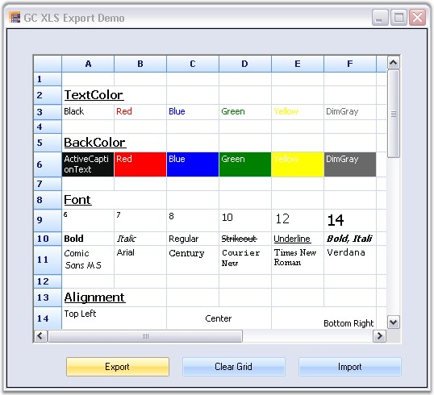
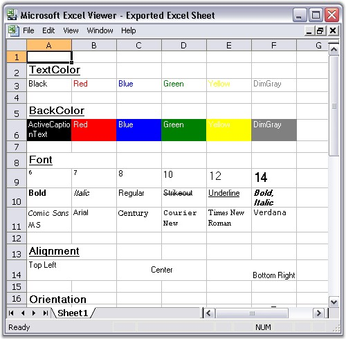

::: {style="DISPLAY: none"}
{#d2h_url_template}{#d2h_package_url style="WIDTH: 0px; DISPLAY: none; HEIGHT: 0px"}
:::

::: {.d2h_secondary_topic style="PADDING-BOTTOM: 10pt; MARGIN: 0pt; PADDING-LEFT: 0pt; PADDING-RIGHT: 0pt; PADDING-TOP: 0pt"}
##### Excel Export {#excel-export style="tab-stops: 0pt"}

[]{style="FONT-FAMILY: 'Trebuchet MS','sans-serif'; COLOR: #15428b; FONT-SIZE: 9pt"} 

Exporting data to an Excel spreadsheet is one of the most commonly preferred features in the .NET world. The Essential Grid control has in-built support for an Excel spreadsheet export. The class **GridExcelConverterControl** provides support for exporting data from a Grid control or Grid Data Bound Grid control to an Excel spreadsheet for verification and/or computation. This class automatically copies a grid\'s styles and formats to an Excel spreadsheet. The GridExcelConverterControl class is derived from the **GridExcelConverterBase** class. The XlsIO libraries are used to support the conversion of the grid contents to Excel.

[]{style="FONT-FAMILY: 'Trebuchet MS','sans-serif'; COLOR: #15428b; FONT-SIZE: 9pt"} 

For the control to function, the following dll files should be added along with the default dll files in the reference folder:

[]{style="FONT-FAMILY: 'Trebuchet MS','sans-serif'; COLOR: #15428b; FONT-SIZE: 9pt"} 

[·      ]{style="FONT-FAMILY: Symbol"}Syncfusion.GridConverter.Base

[·      ]{style="FONT-FAMILY: Symbol"}Syncfusion.XlsIO.Base

[]{style="FONT-FAMILY: 'Trebuchet MS','sans-serif'; COLOR: #15428b; FONT-SIZE: 9pt"} 

The **GridToExcel** method should be used to export the grid to an excel sheet. Following code example illustrates how to convert the content in Grid control to an Excel spreadsheet.

[]{style="FONT-FAMILY: 'Trebuchet MS','sans-serif'; COLOR: #15428b; FONT-SIZE: 9pt"} 

1.   Using C#

[]{style="FONT-FAMILY: 'Trebuchet MS','sans-serif'; COLOR: #15428b; FONT-SIZE: 9pt"} 

+------------------------------------------------------------------------------------------------------------------------------------------------------------------------------------------------------------------------------------------------+
| **[\[C#\]]{style="FONT-FAMILY: 'Courier New'; COLOR: black"}**                                                                                                                                                                                 |
|                                                                                                                                                                                                                                                |
| []{style="FONT-FAMILY: 'Courier New'; COLOR: black"}                                                                                                                                                                                           |
|                                                                                                                                                                                                                                                |
| [Syncfusion.GridExcelConverter.[GridExcelConverterControl]{style="COLOR: #2b91af"} gecc = [new]{style="COLOR: blue"} Syncfusion.GridExcelConverter.[GridExcelConverterControl]{style="COLOR: #2b91af"}();]{style="FONT-FAMILY: 'Courier New'"} |
|                                                                                                                                                                                                                                                |
| [gecc.GridToExcel([this]{style="COLOR: blue"}.gridControl1.Model, [@\"C:\\MyGC.xls\"]{style="COLOR: #a31515"});]{style="FONT-FAMILY: 'Courier New'"}                                                                                           |
+------------------------------------------------------------------------------------------------------------------------------------------------------------------------------------------------------------------------------------------------+

[]{style="FONT-FAMILY: 'Trebuchet MS','sans-serif'; COLOR: #15428b; FONT-SIZE: 9pt"} 

2.   Using VB.NET

[]{style="FONT-FAMILY: 'Trebuchet MS','sans-serif'; COLOR: #15428b; FONT-SIZE: 9pt"} 

+----------------------------------------------------------------------------------------------------------------------------------------------------------------------------------------------------------------------------------------------------------------------------+
| **[\[VB.NET\]]{style="FONT-FAMILY: 'Courier New'; COLOR: black"}**                                                                                                                                                                                                         |
|                                                                                                                                                                                                                                                                            |
| []{style="FONT-FAMILY: 'Courier New'; COLOR: black"}                                                                                                                                                                                                                       |
|                                                                                                                                                                                                                                                                            |
| [Dim]{style="FONT-FAMILY: 'Courier New'; COLOR: blue"}[ gecc [As]{style="COLOR: blue"} Syncfusion.GridExcelConverter.GridExcelConverterControl = [New]{style="COLOR: blue"} Syncfusion.GridExcelConverter.GridExcelConverterControl()]{style="FONT-FAMILY: 'Courier New'"} |
|                                                                                                                                                                                                                                                                            |
| [gecc.GridToExcel([Me]{style="COLOR: blue"}.gridControl1.Model, [\"C:\\MyGC.xls\"]{style="COLOR: #a31515"})]{style="FONT-FAMILY: 'Courier New'"}                                                                                                                           |
+----------------------------------------------------------------------------------------------------------------------------------------------------------------------------------------------------------------------------------------------------------------------------+

[]{style="FONT-FAMILY: 'Trebuchet MS','sans-serif'; COLOR: #15428b; FONT-SIZE: 9pt"} 

{border="0"}

[]{style="FONT-FAMILY: 'Trebuchet MS','sans-serif'; COLOR: #15428b; FONT-SIZE: 9pt"} 

*[Figure ]{style="FONT-SIZE: 9pt"}[140]{style="FONT-SIZE: 9pt"}[: Grid to be Exported]{style="FONT-SIZE: 9pt"}*

[]{style="FONT-FAMILY: 'Trebuchet MS','sans-serif'; COLOR: #15428b; FONT-SIZE: 9pt"} 

Following code example illustrates how to convert the content in Grid Data Bound Grid control to an Excel spreadsheet.

[]{style="FONT-FAMILY: 'Trebuchet MS','sans-serif'; COLOR: #15428b; FONT-SIZE: 9pt"} 

1.   Using C#

[]{style="FONT-FAMILY: 'Trebuchet MS','sans-serif'; COLOR: #15428b; FONT-SIZE: 9pt"} 

+------------------------------------------------------------------------------------------------------------------------------------------------------------------------------------------------------------------------------------------------+
| **[\[C#\]]{style="FONT-FAMILY: 'Courier New'; COLOR: black"}**                                                                                                                                                                                 |
|                                                                                                                                                                                                                                                |
| []{style="FONT-FAMILY: 'Courier New'; COLOR: black"}                                                                                                                                                                                           |
|                                                                                                                                                                                                                                                |
| [Syncfusion.GridExcelConverter.[GridExcelConverterControl]{style="COLOR: #2b91af"} gecc = [new]{style="COLOR: blue"} Syncfusion.GridExcelConverter.[GridExcelConverterControl]{style="COLOR: #2b91af"}();]{style="FONT-FAMILY: 'Courier New'"} |
|                                                                                                                                                                                                                                                |
| [gecc.GridToExcel([this]{style="COLOR: blue"}.gridDataBoundGrid1.Model, [@\"C:\\MyGC.xls\"]{style="COLOR: #a31515"});]{style="FONT-FAMILY: 'Courier New'"}                                                                                     |
+------------------------------------------------------------------------------------------------------------------------------------------------------------------------------------------------------------------------------------------------+

 

2.   Using VB.NET

[]{style="FONT-FAMILY: 'Trebuchet MS','sans-serif'; COLOR: #15428b; FONT-SIZE: 9pt"} 

+----------------------------------------------------------------------------------------------------------------------------------------------------------------------------------------------------------------------------------------------------------------------------+
| **[\[VB.NET\]]{style="FONT-FAMILY: 'Courier New'; COLOR: black"}**                                                                                                                                                                                                         |
|                                                                                                                                                                                                                                                                            |
| []{style="FONT-FAMILY: 'Courier New'; COLOR: black"}                                                                                                                                                                                                                       |
|                                                                                                                                                                                                                                                                            |
| [Dim]{style="FONT-FAMILY: 'Courier New'; COLOR: blue"}[ gecc [As]{style="COLOR: blue"} Syncfusion.GridExcelConverter.GridExcelConverterControl = [New]{style="COLOR: blue"} Syncfusion.GridExcelConverter.GridExcelConverterControl()]{style="FONT-FAMILY: 'Courier New'"} |
|                                                                                                                                                                                                                                                                            |
| [gecc.GridToExcel([Me]{style="COLOR: blue"}.gridDataBoundGrid1.Model, [\"C:\\MyGC.xls\"]{style="COLOR: #a31515"})]{style="FONT-FAMILY: 'Courier New'"}                                                                                                                     |
+----------------------------------------------------------------------------------------------------------------------------------------------------------------------------------------------------------------------------------------------------------------------------+

[]{style="FONT-FAMILY: 'Trebuchet MS','sans-serif'; COLOR: #15428b; FONT-SIZE: 9pt"} 

{border="0"}

[]{style="FONT-FAMILY: 'Trebuchet MS','sans-serif'; COLOR: #15428b; FONT-SIZE: 9pt"} 

*[Figure ]{style="FONT-SIZE: 9pt"}[141]{style="FONT-SIZE: 9pt"}[: Exported Excel Sheet]{style="FONT-SIZE: 9pt"}*

***[]{style="FONT-FAMILY: 'Trebuchet MS','sans-serif'; COLOR: #15428b; FONT-SIZE: 9pt"}*** 

A sample demonstrating this feature is available under the following sample installation path.

[]{style="FONT-FAMILY: 'Trebuchet MS','sans-serif'; COLOR: #15428b; FONT-SIZE: 9pt"} 

***\<Install Location\>\\Syncfusion\\EssentialStudio\\\[Version Number\]\\Windows\\Grid.Windows\\Samples\\2.0\\Export\\GC XLS Export Demo***

 

[]{#p301} 

 

[]{#related-topics}
:::
