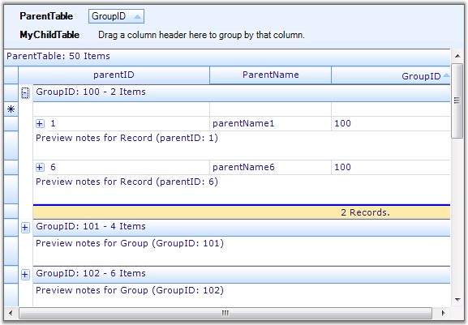
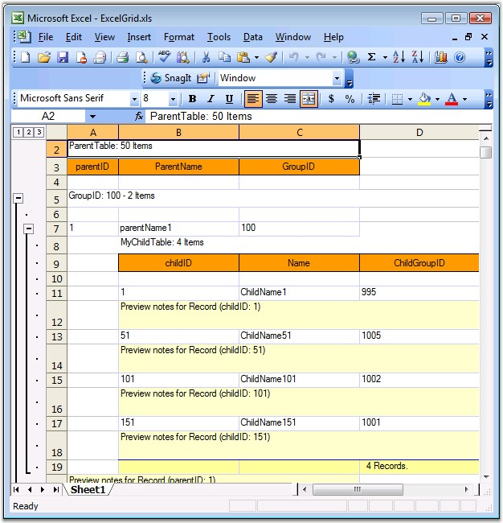

::: {style="DISPLAY: none"}
{#d2h_url_template}{#d2h_package_url style="WIDTH: 0px; DISPLAY: none; HEIGHT: 0px"}
:::

::::: {.d2h_secondary_topic style="PADDING-BOTTOM: 10pt; MARGIN: 0pt; PADDING-LEFT: 0pt; PADDING-RIGHT: 0pt; PADDING-TOP: 0pt"}
##### Excel Export {#excel-export style="tab-stops: 0pt"}

[]{style="FONT-FAMILY: 'Trebuchet MS','sans-serif'; COLOR: #15428b; FONT-SIZE: 9pt"} 

**Export to Excel** is one of the most common functionalities that are required in the .Net world. The Essential Grid Control has in-built support for **Excel Export**. Users can download the data from the Grouping Grid control into an Excel spreadsheet for offline verification and/or computation. This can be achieved by making use of the **GroupingGridExcelConverter** class. This section will walk you through the conversion of the contents of the grid to an excel file as well as discuss the various converter options.

**GroupingGridExcelConverter** class derives from **GridExcelConverterBase**. It contains a number of methods that helps in exporting different components of the grouping grid. It\'s properties will let you control the export of the grid schema like styles and grid elements. You can be able to export Styles, RecordPlusMinus, GroupCaptionPlusMinus, Borders and PreviewRows as well.

[]{style="FONT-SIZE: 8pt"} 

**ConverterOptions**

**[]{style="COLOR: #4a5c8c"}** 

Exporting of a Grouping Grid to Excel has two options: **Visible** and **Default**. **Visible** option will allow you to export only the visible contents of the grid whereas the **Default** option exports the entire elements of the grouping grid. Converter options are defined in **GridExcelConverter.ConverterOptions** enumeration.

 

The following table lists the properties offered by Grouping Grid Excel Converter. By setting these properties, you could be able to choose the elements you need to export.

[]{style="FONT-FAMILY: 'Trebuchet MS','sans-serif'; COLOR: #15428b; FONT-SIZE: 9pt"} 

::: {align="center"}
  ----------------------- ----------------------------------------------------------------------------
  Property                Description
  ExportBorders           Specifies if borders should be exported.
  ExportStyle             Indicates if style should be exported.
  ExportGroupPlusMinus    Specifies if GridGroup should be exported as Excel Group.
  ExportRecordPlusMinus   When true, the record with related tables will be exported as Excel Group.
  ExportPreviewRows       When enabled, PreviewRows will be exported.
  CaptionBackColor        Specifies the color to be used for Caption in the worksheet.
  HeaderBackColor         Indicates the color to be used for Header in the worksheet.
  ----------------------- ----------------------------------------------------------------------------
:::

[]{style="FONT-FAMILY: 'Trebuchet MS','sans-serif'; COLOR: #15428b; FONT-SIZE: 9pt"} 

Method

[]{style="FONT-FAMILY: 'Verdana','sans-serif'; FONT-SIZE: 8pt"} 

Grouping Grid Excel Converter control provides a method called GroupingGridToExcel. This is the method that does the conversion of grouping grid contents to an excel file. It accepts three parameters: grouping grid to be converted, filename of the destination worksheet and convert options.

[]{style="FONT-FAMILY: 'Verdana','sans-serif'; FONT-SIZE: 8pt"} 

Syntax

[]{style="FONT-FAMILY: 'Trebuchet MS','sans-serif'; COLOR: #15428b; FONT-SIZE: 9pt"} 

+-------------------------------------------------------------------------------------------------------------------------------------------------------------------------------------------------------------------------------------+
| **[\[C#\]]{style="FONT-FAMILY: 'Courier New'; COLOR: black"}**                                                                                                                                                                      |
|                                                                                                                                                                                                                                     |
| []{style="FONT-FAMILY: 'Courier New'; COLOR: black"}                                                                                                                                                                                |
|                                                                                                                                                                                                                                     |
| [GroupingGridExcelConverterControl]{style="FONT-FAMILY: 'Courier New'; COLOR: #2b91af"}[ converter = [new]{style="COLOR: blue"} [GroupingGridExcelConverterControl]{style="COLOR: #2b91af"}();]{style="FONT-FAMILY: 'Courier New'"} |
|                                                                                                                                                                                                                                     |
| [converter.GroupingGridToExcel([this]{style="COLOR: blue"}.gridGroupingControl1, [\"Grid.xls\"]{style="COLOR: #a31515"}, [ConverterOptions]{style="COLOR: #2b91af"}.Visible);]{style="FONT-FAMILY: 'Courier New'"}                  |
+-------------------------------------------------------------------------------------------------------------------------------------------------------------------------------------------------------------------------------------+

[]{style="FONT-FAMILY: 'Trebuchet MS','sans-serif'; COLOR: #15428b; FONT-SIZE: 9pt"} 

+-----------------------------------------------------------------------------------------------------------------------------------------------------------------------------------------------------------------------------------------------------------------------------------------------------------------------+
| **[\[VB.NET\]]{style="FONT-FAMILY: 'Courier New'; COLOR: black"}**                                                                                                                                                                                                                                                    |
|                                                                                                                                                                                                                                                                                                                       |
| []{style="FONT-FAMILY: 'Courier New'; COLOR: black"}                                                                                                                                                                                                                                                                  |
|                                                                                                                                                                                                                                                                                                                       |
| [Dim]{style="FONT-FAMILY: 'Courier New'; COLOR: blue"}[ [converter ]{style="COLOR: black"}[As]{style="COLOR: blue"}[ ]{style="COLOR: black"}GroupingGridExcelConverter [= ]{style="COLOR: black"}[New]{style="COLOR: blue"}[ ]{style="COLOR: black"}GroupingGridExcelConverter()]{style="FONT-FAMILY: 'Courier New'"} |
|                                                                                                                                                                                                                                                                                                                       |
| [converter.GroupingGridToExcel([Me]{style="COLOR: blue"}.gridGroupingControl1, [\"Grid.xls\"]{style="COLOR: #a31515"}, ConverterOptions.Visible)]{style="FONT-FAMILY: 'Courier New'"}                                                                                                                                 |
+-----------------------------------------------------------------------------------------------------------------------------------------------------------------------------------------------------------------------------------------------------------------------------------------------------------------------+

[]{style="FONT-SIZE: 8pt"} 

Events

 

QueryExportPreviewRowInfo is an event offered by the Grouping Grid Excel Converter control that aids in the conversion process. It occurs for each PreviewRow element before exporting the grid and lets you customize the preview row. It accepts two parameters: one contains the Element to export and the other is the GridStyleInfo object representing the style information.

 

Syntax

[]{style="FONT-FAMILY: 'Trebuchet MS','sans-serif'; COLOR: #15428b; FONT-SIZE: 9pt"} 

+---------------------------------------------------------------------------------------------------------------------------------------------------------------------------------------------------------------------------------------------------------------------------------------+
| **[\[C#\]]{style="FONT-FAMILY: 'Courier New'; COLOR: black"}**                                                                                                                                                                                                                        |
|                                                                                                                                                                                                                                                                                       |
| []{style="FONT-FAMILY: 'Courier New'; COLOR: black"}                                                                                                                                                                                                                                  |
|                                                                                                                                                                                                                                                                                       |
| [GroupingGridExcelConverter converter  = [new]{style="COLOR: blue"} GroupingGridExcelConverter();]{style="FONT-FAMILY: 'Courier New'"}                                                                                                                                                |
|                                                                                                                                                                                                                                                                                       |
| []{style="FONT-FAMILY: 'Courier New'"}                                                                                                                                                                                                                                                |
|                                                                                                                                                                                                                                                                                       |
| [converter.QueryExportPreviewRowInfo += [new]{style="COLOR: blue"} [GroupingGridExcelConverterControl]{style="COLOR: #2b91af"}.[GroupingGridExportPreviewRowQueryInfoEventHandler]{style="COLOR: #2b91af"}(converter_QueryExportPreviewRowInfo);]{style="FONT-FAMILY: 'Courier New'"} |
|                                                                                                                                                                                                                                                                                       |
| []{style="FONT-FAMILY: 'Courier New'"}                                                                                                                                                                                                                                                |
|                                                                                                                                                                                                                                                                                       |
| [void]{style="FONT-FAMILY: 'Courier New'; COLOR: blue"}[ converter_QueryExportPreviewRowInfo([object]{style="COLOR: blue"} sender, [GroupingGridExportPreviewRowQueryInfoEventArgs]{style="COLOR: #2b91af"} e)]{style="FONT-FAMILY: 'Courier New'"}                                   |
|                                                                                                                                                                                                                                                                                       |
| [{]{style="FONT-FAMILY: 'Courier New'"}                                                                                                                                                                                                                                               |
|                                                                                                                                                                                                                                                                                       |
| [}]{style="FONT-FAMILY: 'Courier New'"}                                                                                                                                                                                                                                               |
+---------------------------------------------------------------------------------------------------------------------------------------------------------------------------------------------------------------------------------------------------------------------------------------+

[]{style="FONT-FAMILY: 'Trebuchet MS','sans-serif'; COLOR: #15428b; FONT-SIZE: 9pt"} 

+-----------------------------------------------------------------------------------------------------------------------------------------------------------------------------------------------------------------------------------------------------------------------------------------------------------------------------------------------------------------------+
| **[\[VB.NET\]]{style="FONT-FAMILY: 'Courier New'; COLOR: black"}**                                                                                                                                                                                                                                                                                                    |
|                                                                                                                                                                                                                                                                                                                                                                       |
| []{style="FONT-FAMILY: 'Courier New'; COLOR: black"}                                                                                                                                                                                                                                                                                                                  |
|                                                                                                                                                                                                                                                                                                                                                                       |
| [Dim]{style="FONT-FAMILY: 'Courier New'; COLOR: blue"}[ [converter ]{style="COLOR: black"}[As]{style="COLOR: blue"}[ ]{style="COLOR: black"}GroupingGridExcelConverter [ = ]{style="COLOR: black"}[New]{style="COLOR: blue"}[ ]{style="COLOR: black"}GroupingGridExcelConverter()]{style="FONT-FAMILY: 'Courier New'"}                                                |
|                                                                                                                                                                                                                                                                                                                                                                       |
| []{style="FONT-FAMILY: 'Courier New'"}                                                                                                                                                                                                                                                                                                                                |
|                                                                                                                                                                                                                                                                                                                                                                       |
| [AddHandler converter.QueryExportPreviewRowInfo, AddressOf converter_QueryExportPreviewRowInfo]{style="FONT-FAMILY: 'Courier New'"}                                                                                                                                                                                                                                   |
|                                                                                                                                                                                                                                                                                                                                                                       |
| []{style="FONT-FAMILY: 'Courier New'"}                                                                                                                                                                                                                                                                                                                                |
|                                                                                                                                                                                                                                                                                                                                                                       |
| [Private]{style="FONT-FAMILY: 'Courier New'; COLOR: blue"}[ [Sub]{style="COLOR: blue"} converter_QueryExportPreviewRowInfo([ByVal]{style="COLOR: blue"} sender [As]{style="COLOR: blue"} [Object]{style="COLOR: blue"}, [ByVal]{style="COLOR: blue"} e [As]{style="COLOR: blue"} GroupingGridExportPreviewRowQueryInfoEventArgs)]{style="FONT-FAMILY: 'Courier New'"} |
|                                                                                                                                                                                                                                                                                                                                                                       |
| [End]{style="FONT-FAMILY: 'Courier New'; COLOR: blue"}[ [Sub]{style="COLOR: blue"}]{style="FONT-FAMILY: 'Courier New'"}                                                                                                                                                                                                                                               |
+-----------------------------------------------------------------------------------------------------------------------------------------------------------------------------------------------------------------------------------------------------------------------------------------------------------------------------------------------------------------------+

 

**Implementation**

**[]{style="FONT-FAMILY: 'Verdana','sans-serif'; COLOR: #4a5c8c"}** 

Here is an example that illustrates the conversion of a grouping grid to an Excel file.

[]{style="FONT-FAMILY: 'Trebuchet MS','sans-serif'; COLOR: #15428b; FONT-SIZE: 9pt"} 

1.   Include the required namespaces.

[]{style="FONT-FAMILY: 'Trebuchet MS','sans-serif'; COLOR: #15428b; FONT-SIZE: 9pt"} 

+----------------------------------------------------------------------------------------------------------------------------------------+
| **[\[C#\]]{style="FONT-FAMILY: 'Courier New'; COLOR: black"}**                                                                         |
|                                                                                                                                        |
| []{style="FONT-FAMILY: 'Courier New'; COLOR: black"}                                                                                   |
|                                                                                                                                        |
| [using]{style="FONT-FAMILY: 'Courier New'; COLOR: blue"}[ Syncfusion.XlsIO;]{style="FONT-FAMILY: 'Courier New'"}                       |
|                                                                                                                                        |
| [using]{style="FONT-FAMILY: 'Courier New'; COLOR: blue"}[ Syncfusion.GridExcelConverter;]{style="FONT-FAMILY: 'Courier New'"}          |
|                                                                                                                                        |
| [using]{style="FONT-FAMILY: 'Courier New'; COLOR: blue"}[ Syncfusion.GroupingGridExcelConverter;]{style="FONT-FAMILY: 'Courier New'"}  |
|                                                                                                                                        |
| []{style="FONT-FAMILY: 'Courier New'"}                                                                                                 |
|                                                                                                                                        |
| [using]{style="FONT-FAMILY: 'Courier New'; COLOR: blue"}[ Syncfusion.Grouping;]{style="FONT-FAMILY: 'Courier New'"}                    |
|                                                                                                                                        |
| [using]{style="FONT-FAMILY: 'Courier New'; COLOR: blue"}[ Syncfusion.Windows.Forms.Grid;]{style="FONT-FAMILY: 'Courier New'"}          |
|                                                                                                                                        |
| [using]{style="FONT-FAMILY: 'Courier New'; COLOR: blue"}[ Syncfusion.Windows.Forms.Grid.Grouping;]{style="FONT-FAMILY: 'Courier New'"} |
+----------------------------------------------------------------------------------------------------------------------------------------+

[]{style="FONT-FAMILY: 'Trebuchet MS','sans-serif'; COLOR: #15428b; FONT-SIZE: 9pt"} 

+-----------------------------------------------------------------------------------------------------------------------------------------+
| **[\[VB.NET\]]{style="FONT-FAMILY: 'Courier New'; COLOR: black"}**                                                                      |
|                                                                                                                                         |
| []{style="FONT-FAMILY: 'Courier New'; COLOR: black"}                                                                                    |
|                                                                                                                                         |
| [Imports]{style="FONT-FAMILY: 'Courier New'; COLOR: blue"}[ Syncfusion.XlsIO]{style="FONT-FAMILY: 'Courier New'"}                       |
|                                                                                                                                         |
| [Imports]{style="FONT-FAMILY: 'Courier New'; COLOR: blue"}[ Syncfusion.GridExcelConverter]{style="FONT-FAMILY: 'Courier New'"}          |
|                                                                                                                                         |
| [Imports]{style="FONT-FAMILY: 'Courier New'; COLOR: blue"}[ Syncfusion.GroupingGridExcelConverter]{style="FONT-FAMILY: 'Courier New'"}  |
|                                                                                                                                         |
| []{style="FONT-FAMILY: 'Courier New'"}                                                                                                  |
|                                                                                                                                         |
| []{style="FONT-FAMILY: 'Courier New'"}                                                                                                  |
|                                                                                                                                         |
| [Imports]{style="FONT-FAMILY: 'Courier New'; COLOR: blue"}[ Syncfusion.Grouping]{style="FONT-FAMILY: 'Courier New'"}                    |
|                                                                                                                                         |
| [Imports]{style="FONT-FAMILY: 'Courier New'; COLOR: blue"}[ Syncfusion.Windows.Forms.Grid]{style="FONT-FAMILY: 'Courier New'"}          |
|                                                                                                                                         |
| [Imports]{style="FONT-FAMILY: 'Courier New'; COLOR: blue"}[ Syncfusion.Windows.Forms.Grid.Grouping]{style="FONT-FAMILY: 'Courier New'"} |
+-----------------------------------------------------------------------------------------------------------------------------------------+

[]{style="FONT-FAMILY: 'Trebuchet MS','sans-serif'; COLOR: #15428b; FONT-SIZE: 9pt"} 

2.   Setup an hierarchical datasource.

[]{style="FONT-SIZE: 8pt"} 

+-----------------------------------------------------------------------------------------------------------------------------------------------------------------------------------------------+
| **[\[C#\]]{style="FONT-FAMILY: 'Courier New'; COLOR: black"}**                                                                                                                                |
|                                                                                                                                                                                               |
| []{style="FONT-FAMILY: 'Courier New'; COLOR: black"}                                                                                                                                          |
|                                                                                                                                                                                               |
| [private]{style="FONT-FAMILY: 'Courier New'; COLOR: blue"}[ [int]{style="COLOR: blue"} numberParentRows = 50;]{style="FONT-FAMILY: 'Courier New'"}                                            |
|                                                                                                                                                                                               |
| [private]{style="FONT-FAMILY: 'Courier New'; COLOR: blue"}[ [int]{style="COLOR: blue"} numberChildRows = 200;]{style="FONT-FAMILY: 'Courier New'"}                                            |
|                                                                                                                                                                                               |
| [private]{style="FONT-FAMILY: 'Courier New'; COLOR: blue"}[ [int]{style="COLOR: blue"} numberGrandChildRows = 500;]{style="FONT-FAMILY: 'Courier New'"}                                       |
|                                                                                                                                                                                               |
| []{style="FONT-FAMILY: 'Courier New'"}                                                                                                                                                        |
|                                                                                                                                                                                               |
| [private]{style="FONT-FAMILY: 'Courier New'; COLOR: blue"}[ [DataTable]{style="COLOR: #2b91af"} GetParentTable()]{style="FONT-FAMILY: 'Courier New'"}                                         |
|                                                                                                                                                                                               |
| [{]{style="FONT-FAMILY: 'Courier New'"}                                                                                                                                                       |
|                                                                                                                                                                                               |
| [    [DataTable]{style="COLOR: #2b91af"} dt = [new]{style="COLOR: blue"} [DataTable]{style="COLOR: #2b91af"}([\"ParentTable\"]{style="COLOR: #a31515"});]{style="FONT-FAMILY: 'Courier New'"} |
|                                                                                                                                                                                               |
| [    dt.Columns.Add([new]{style="COLOR: blue"} [DataColumn]{style="COLOR: #2b91af"}([\"parentID\"]{style="COLOR: #a31515"}));]{style="FONT-FAMILY: 'Courier New'"}                            |
|                                                                                                                                                                                               |
| [    dt.Columns.Add([new]{style="COLOR: blue"} [DataColumn]{style="COLOR: #2b91af"}([\"ParentName\"]{style="COLOR: #a31515"}));]{style="FONT-FAMILY: 'Courier New'"}                          |
|                                                                                                                                                                                               |
| [    dt.Columns.Add([new]{style="COLOR: blue"} [DataColumn]{style="COLOR: #2b91af"}([\"GroupID\"]{style="COLOR: #a31515"}));]{style="FONT-FAMILY: 'Courier New'"}                             |
|                                                                                                                                                                                               |
| []{style="FONT-FAMILY: 'Courier New'"}                                                                                                                                                        |
|                                                                                                                                                                                               |
| [    [Random]{style="COLOR: #2b91af"} r = [new]{style="COLOR: blue"} [Random]{style="COLOR: #2b91af"}();]{style="FONT-FAMILY: 'Courier New'"}                                                 |
|                                                                                                                                                                                               |
| [    [for]{style="COLOR: blue"} ([int]{style="COLOR: blue"} i = 0; i \< numberParentRows; i++)]{style="FONT-FAMILY: 'Courier New'"}                                                           |
|                                                                                                                                                                                               |
| [    {]{style="FONT-FAMILY: 'Courier New'"}                                                                                                                                                   |
|                                                                                                                                                                                               |
| [        [DataRow]{style="COLOR: #2b91af"} dr = dt.NewRow();]{style="FONT-FAMILY: 'Courier New'"}                                                                                             |
|                                                                                                                                                                                               |
| [        dr\[0\] = i;]{style="FONT-FAMILY: 'Courier New'"}                                                                                                                                    |
|                                                                                                                                                                                               |
| [        dr\[1\] = [string]{style="COLOR: blue"}.Format([\"parentName{0}\"]{style="COLOR: #a31515"}, i);]{style="FONT-FAMILY: 'Courier New'"}                                                 |
|                                                                                                                                                                                               |
| [        dr\[2\] = r.Next(99, 111);]{style="FONT-FAMILY: 'Courier New'"}                                                                                                                      |
|                                                                                                                                                                                               |
| [        dt.Rows.Add(dr);]{style="FONT-FAMILY: 'Courier New'"}                                                                                                                                |
|                                                                                                                                                                                               |
| [    }]{style="FONT-FAMILY: 'Courier New'"}                                                                                                                                                   |
|                                                                                                                                                                                               |
| [    [return]{style="COLOR: blue"} dt;]{style="FONT-FAMILY: 'Courier New'"}                                                                                                                   |
|                                                                                                                                                                                               |
| [}]{style="FONT-FAMILY: 'Courier New'"}                                                                                                                                                       |
|                                                                                                                                                                                               |
| []{style="FONT-FAMILY: 'Courier New'"}                                                                                                                                                        |
|                                                                                                                                                                                               |
| [private]{style="FONT-FAMILY: 'Courier New'; COLOR: blue"}[ [DataTable]{style="COLOR: #2b91af"} GetChildTable()]{style="FONT-FAMILY: 'Courier New'"}                                          |
|                                                                                                                                                                                               |
| [{]{style="FONT-FAMILY: 'Courier New'"}                                                                                                                                                       |
|                                                                                                                                                                                               |
| [    [DataTable]{style="COLOR: #2b91af"} dt = [new]{style="COLOR: blue"} [DataTable]{style="COLOR: #2b91af"}([\"ChildTable\"]{style="COLOR: #a31515"});]{style="FONT-FAMILY: 'Courier New'"}  |
|                                                                                                                                                                                               |
| []{style="FONT-FAMILY: 'Courier New'"}                                                                                                                                                        |
|                                                                                                                                                                                               |
| [    dt.Columns.Add([new]{style="COLOR: blue"} [DataColumn]{style="COLOR: #2b91af"}([\"childID\"]{style="COLOR: #a31515"}));]{style="FONT-FAMILY: 'Courier New'"}                             |
|                                                                                                                                                                                               |
| [    dt.Columns.Add([new]{style="COLOR: blue"} [DataColumn]{style="COLOR: #2b91af"}([\"Name\"]{style="COLOR: #a31515"}));]{style="FONT-FAMILY: 'Courier New'"}                                |
|                                                                                                                                                                                               |
| [    dt.Columns.Add([new]{style="COLOR: blue"} [DataColumn]{style="COLOR: #2b91af"}([\"ParentID\"]{style="COLOR: #a31515"}));]{style="FONT-FAMILY: 'Courier New'"}                            |
|                                                                                                                                                                                               |
| [    dt.Columns.Add([new]{style="COLOR: blue"} [DataColumn]{style="COLOR: #2b91af"}([\"ChildGroupID\"]{style="COLOR: #a31515"}));]{style="FONT-FAMILY: 'Courier New'"}                        |
|                                                                                                                                                                                               |
| []{style="FONT-FAMILY: 'Courier New'"}                                                                                                                                                        |
|                                                                                                                                                                                               |
| [    [Random]{style="COLOR: #2b91af"} r = [new]{style="COLOR: blue"} [Random]{style="COLOR: #2b91af"}();]{style="FONT-FAMILY: 'Courier New'"}                                                 |
|                                                                                                                                                                                               |
| [    [for]{style="COLOR: blue"} ([int]{style="COLOR: blue"} i = 0; i \< numberChildRows; i++)]{style="FONT-FAMILY: 'Courier New'"}                                                            |
|                                                                                                                                                                                               |
| [    {]{style="FONT-FAMILY: 'Courier New'"}                                                                                                                                                   |
|                                                                                                                                                                                               |
| [        [DataRow]{style="COLOR: #2b91af"} dr = dt.NewRow();]{style="FONT-FAMILY: 'Courier New'"}                                                                                             |
|                                                                                                                                                                                               |
| [        dr\[0\] = i.ToString();]{style="FONT-FAMILY: 'Courier New'"}                                                                                                                         |
|                                                                                                                                                                                               |
| [        dr\[1\] = [string]{style="COLOR: blue"}.Format([\"ChildName{0}\"]{style="COLOR: #a31515"}, i);]{style="FONT-FAMILY: 'Courier New'"}                                                  |
|                                                                                                                                                                                               |
| [        dr\[2\] = (i % numberParentRows).ToString();]{style="FONT-FAMILY: 'Courier New'"}                                                                                                    |
|                                                                                                                                                                                               |
| [        dr\[3\] = r.Next(994, 1006);]{style="FONT-FAMILY: 'Courier New'"}                                                                                                                    |
|                                                                                                                                                                                               |
| [        dt.Rows.Add(dr);]{style="FONT-FAMILY: 'Courier New'"}                                                                                                                                |
|                                                                                                                                                                                               |
| [    }]{style="FONT-FAMILY: 'Courier New'"}                                                                                                                                                   |
|                                                                                                                                                                                               |
| [    [return]{style="COLOR: blue"} dt;]{style="FONT-FAMILY: 'Courier New'"}                                                                                                                   |
|                                                                                                                                                                                               |
| [}]{style="FONT-FAMILY: 'Courier New'"}                                                                                                                                                       |
+-----------------------------------------------------------------------------------------------------------------------------------------------------------------------------------------------+

[]{style="FONT-FAMILY: 'Trebuchet MS','sans-serif'; COLOR: #15428b; FONT-SIZE: 9pt"} 

+-----------------------------------------------------------------------------------------------------------------------------------------------------------------------------------------------------------------------+
| **[\[VB.NET\]]{style="FONT-FAMILY: 'Courier New'; COLOR: black"}**                                                                                                                                                    |
|                                                                                                                                                                                                                       |
| []{style="FONT-FAMILY: 'Courier New'; COLOR: black"}                                                                                                                                                                  |
|                                                                                                                                                                                                                       |
| [Private]{style="FONT-FAMILY: 'Courier New'; COLOR: blue"}[ numberParentRows [As]{style="COLOR: blue"} [Integer]{style="COLOR: blue"} = 50]{style="FONT-FAMILY: 'Courier New'"}                                       |
|                                                                                                                                                                                                                       |
| [Private]{style="FONT-FAMILY: 'Courier New'; COLOR: blue"}[ numberChildRows [As]{style="COLOR: blue"} [Integer]{style="COLOR: blue"} = 200]{style="FONT-FAMILY: 'Courier New'"}                                       |
|                                                                                                                                                                                                                       |
| [Private]{style="FONT-FAMILY: 'Courier New'; COLOR: blue"}[ numberGrandChildRows [As]{style="COLOR: blue"} [Integer]{style="COLOR: blue"} = 500]{style="FONT-FAMILY: 'Courier New'"}                                  |
|                                                                                                                                                                                                                       |
| []{style="FONT-FAMILY: 'Courier New'"}                                                                                                                                                                                |
|                                                                                                                                                                                                                       |
| [Private]{style="FONT-FAMILY: 'Courier New'; COLOR: blue"}[ [Function]{style="COLOR: blue"} GetParentTable() [As]{style="COLOR: blue"} DataTable]{style="FONT-FAMILY: 'Courier New'"}                                 |
|                                                                                                                                                                                                                       |
| [Dim]{style="FONT-FAMILY: 'Courier New'; COLOR: blue"}[ dt [As]{style="COLOR: blue"} DataTable = [New]{style="COLOR: blue"} DataTable([\"ParentTable\"]{style="COLOR: #a31515"})]{style="FONT-FAMILY: 'Courier New'"} |
|                                                                                                                                                                                                                       |
| []{style="FONT-FAMILY: 'Courier New'"}                                                                                                                                                                                |
|                                                                                                                                                                                                                       |
| [dt.Columns.Add([New]{style="COLOR: blue"} DataColumn([\"parentID\"]{style="COLOR: #a31515"}))]{style="FONT-FAMILY: 'Courier New'"}                                                                                   |
|                                                                                                                                                                                                                       |
| [dt.Columns.Add([New]{style="COLOR: blue"} DataColumn([\"ParentName\"]{style="COLOR: #a31515"}))]{style="FONT-FAMILY: 'Courier New'"}                                                                                 |
|                                                                                                                                                                                                                       |
| [dt.Columns.Add([New]{style="COLOR: blue"} DataColumn([\"GroupID\"]{style="COLOR: #a31515"}))]{style="FONT-FAMILY: 'Courier New'"}                                                                                    |
|                                                                                                                                                                                                                       |
| []{style="FONT-FAMILY: 'Courier New'"}                                                                                                                                                                                |
|                                                                                                                                                                                                                       |
| [Dim]{style="FONT-FAMILY: 'Courier New'; COLOR: blue"}[ r [As]{style="COLOR: blue"} Random = [New]{style="COLOR: blue"} Random()]{style="FONT-FAMILY: 'Courier New'"}                                                 |
|                                                                                                                                                                                                                       |
| [Dim]{style="FONT-FAMILY: 'Courier New'; COLOR: blue"}[ i [As]{style="COLOR: blue"} [Integer]{style="COLOR: blue"} = 0]{style="FONT-FAMILY: 'Courier New'"}                                                           |
|                                                                                                                                                                                                                       |
| [Do]{style="FONT-FAMILY: 'Courier New'; COLOR: blue"}[ [While]{style="COLOR: blue"} i \< numberParentRows]{style="FONT-FAMILY: 'Courier New'"}                                                                        |
|                                                                                                                                                                                                                       |
| [Dim]{style="FONT-FAMILY: 'Courier New'; COLOR: blue"}[ dr [As]{style="COLOR: blue"} DataRow = dt.NewRow()]{style="FONT-FAMILY: 'Courier New'"}                                                                       |
|                                                                                                                                                                                                                       |
| [dr(0) = i]{style="FONT-FAMILY: 'Courier New'"}                                                                                                                                                                       |
|                                                                                                                                                                                                                       |
| [dr(1) = [String]{style="COLOR: blue"}.Format([\"parentName{0}\"]{style="COLOR: #a31515"}, i)]{style="FONT-FAMILY: 'Courier New'"}                                                                                    |
|                                                                                                                                                                                                                       |
| [dr(2) = r.Next(99, 111)]{style="FONT-FAMILY: 'Courier New'"}                                                                                                                                                         |
|                                                                                                                                                                                                                       |
| [dt.Rows.Add(dr)]{style="FONT-FAMILY: 'Courier New'"}                                                                                                                                                                 |
|                                                                                                                                                                                                                       |
| [i += 1]{style="FONT-FAMILY: 'Courier New'"}                                                                                                                                                                          |
|                                                                                                                                                                                                                       |
| [Loop]{style="FONT-FAMILY: 'Courier New'; COLOR: blue"}                                                                                                                                                               |
|                                                                                                                                                                                                                       |
| [Return]{style="FONT-FAMILY: 'Courier New'; COLOR: blue"}[ dt]{style="FONT-FAMILY: 'Courier New'"}                                                                                                                    |
|                                                                                                                                                                                                                       |
| [End]{style="FONT-FAMILY: 'Courier New'; COLOR: blue"}[ [Function]{style="COLOR: blue"}]{style="FONT-FAMILY: 'Courier New'"}                                                                                          |
|                                                                                                                                                                                                                       |
| []{style="FONT-FAMILY: 'Courier New'; COLOR: blue"}                                                                                                                                                                   |
|                                                                                                                                                                                                                       |
| [Private]{style="FONT-FAMILY: 'Courier New'; COLOR: blue"}[ [Function]{style="COLOR: blue"} GetChildTable() [As]{style="COLOR: blue"} DataTable]{style="FONT-FAMILY: 'Courier New'"}                                  |
|                                                                                                                                                                                                                       |
| [Dim]{style="FONT-FAMILY: 'Courier New'; COLOR: blue"}[ dt [As]{style="COLOR: blue"} DataTable = [New]{style="COLOR: blue"} DataTable([\"ChildTable\"]{style="COLOR: #a31515"})]{style="FONT-FAMILY: 'Courier New'"}  |
|                                                                                                                                                                                                                       |
| []{style="FONT-FAMILY: 'Courier New'"}                                                                                                                                                                                |
|                                                                                                                                                                                                                       |
| [dt.Columns.Add([New]{style="COLOR: blue"} DataColumn([\"childID\"]{style="COLOR: #a31515"}))]{style="FONT-FAMILY: 'Courier New'"}                                                                                    |
|                                                                                                                                                                                                                       |
| [dt.Columns.Add([New]{style="COLOR: blue"} DataColumn([\"Name\"]{style="COLOR: #a31515"}))]{style="FONT-FAMILY: 'Courier New'"}                                                                                       |
|                                                                                                                                                                                                                       |
| [dt.Columns.Add([New]{style="COLOR: blue"} DataColumn([\"ParentID\"]{style="COLOR: #a31515"}))]{style="FONT-FAMILY: 'Courier New'"}                                                                                   |
|                                                                                                                                                                                                                       |
| [dt.Columns.Add([New]{style="COLOR: blue"} DataColumn([\"ChildGroupID\"]{style="COLOR: #a31515"}))]{style="FONT-FAMILY: 'Courier New'"}                                                                               |
|                                                                                                                                                                                                                       |
| []{style="FONT-FAMILY: 'Courier New'"}                                                                                                                                                                                |
|                                                                                                                                                                                                                       |
| [Dim]{style="FONT-FAMILY: 'Courier New'; COLOR: blue"}[ r [As]{style="COLOR: blue"} Random = [New]{style="COLOR: blue"} Random()]{style="FONT-FAMILY: 'Courier New'"}                                                 |
|                                                                                                                                                                                                                       |
| [Dim]{style="FONT-FAMILY: 'Courier New'; COLOR: blue"}[ i [As]{style="COLOR: blue"} [Integer]{style="COLOR: blue"} = 0]{style="FONT-FAMILY: 'Courier New'"}                                                           |
|                                                                                                                                                                                                                       |
| []{style="FONT-FAMILY: 'Courier New'"}                                                                                                                                                                                |
|                                                                                                                                                                                                                       |
| [Do]{style="FONT-FAMILY: 'Courier New'; COLOR: blue"}[ [While]{style="COLOR: blue"} i \< numberChildRows]{style="FONT-FAMILY: 'Courier New'"}                                                                         |
|                                                                                                                                                                                                                       |
| [Dim]{style="FONT-FAMILY: 'Courier New'; COLOR: blue"}[ dr [As]{style="COLOR: blue"} DataRow = dt.NewRow()]{style="FONT-FAMILY: 'Courier New'"}                                                                       |
|                                                                                                                                                                                                                       |
| [dr(0) = i.ToString()]{style="FONT-FAMILY: 'Courier New'"}                                                                                                                                                            |
|                                                                                                                                                                                                                       |
| [dr(1) = [String]{style="COLOR: blue"}.Format([\"ChildName{0}\"]{style="COLOR: #a31515"}, i)]{style="FONT-FAMILY: 'Courier New'"}                                                                                     |
|                                                                                                                                                                                                                       |
| [dr(2) = (i [Mod]{style="COLOR: blue"} numberParentRows).ToString()]{style="FONT-FAMILY: 'Courier New'"}                                                                                                              |
|                                                                                                                                                                                                                       |
| [dr(3) = r.Next(994, 1006)]{style="FONT-FAMILY: 'Courier New'"}                                                                                                                                                       |
|                                                                                                                                                                                                                       |
| [dt.Rows.Add(dr)]{style="FONT-FAMILY: 'Courier New'"}                                                                                                                                                                 |
|                                                                                                                                                                                                                       |
| [i += 1]{style="FONT-FAMILY: 'Courier New'"}                                                                                                                                                                          |
|                                                                                                                                                                                                                       |
| [Loop]{style="FONT-FAMILY: 'Courier New'; COLOR: blue"}                                                                                                                                                               |
|                                                                                                                                                                                                                       |
| [Return]{style="FONT-FAMILY: 'Courier New'; COLOR: blue"}[ dt]{style="FONT-FAMILY: 'Courier New'"}                                                                                                                    |
|                                                                                                                                                                                                                       |
| [End]{style="FONT-FAMILY: 'Courier New'; COLOR: blue"}[ [Function]{style="COLOR: blue"}]{style="FONT-FAMILY: 'Courier New'"}                                                                                          |
+-----------------------------------------------------------------------------------------------------------------------------------------------------------------------------------------------------------------------+

[]{style="FONT-FAMILY: 'Trebuchet MS','sans-serif'; COLOR: #15428b; FONT-SIZE: 9pt"} 

3.   Setup a grouping grid and load it with data from a data source. Customize the grid by adding preview rows, groups, and the like as required.

[]{style="FONT-FAMILY: 'Trebuchet MS','sans-serif'; COLOR: #15428b; FONT-SIZE: 9pt"} 

+--------------------------------------------------------------------------------------------------------------------------------------------------------------------------------------------------------------------------------------------------------------------------------------------------------------------------------------------------------------------------------------------------+
| **[\[C#\]]{style="FONT-FAMILY: 'Courier New'; COLOR: black"}**                                                                                                                                                                                                                                                                                                                                   |
|                                                                                                                                                                                                                                                                                                                                                                                                  |
| []{style="FONT-FAMILY: 'Courier New'; COLOR: black"}                                                                                                                                                                                                                                                                                                                                             |
|                                                                                                                                                                                                                                                                                                                                                                                                  |
| [DataTable]{style="FONT-FAMILY: 'Courier New'; COLOR: #2b91af"}[ parentTable = GetParentTable();]{style="FONT-FAMILY: 'Courier New'"}                                                                                                                                                                                                                                                            |
|                                                                                                                                                                                                                                                                                                                                                                                                  |
| [DataTable]{style="FONT-FAMILY: 'Courier New'; COLOR: #2b91af"}[ childTable = GetChildTable();]{style="FONT-FAMILY: 'Courier New'"}                                                                                                                                                                                                                                                              |
|                                                                                                                                                                                                                                                                                                                                                                                                  |
| []{style="FONT-FAMILY: 'Courier New'"}                                                                                                                                                                                                                                                                                                                                                           |
|                                                                                                                                                                                                                                                                                                                                                                                                  |
| [// Add Summary row to parent table.]{style="FONT-FAMILY: 'Courier New'; COLOR: green"}                                                                                                                                                                                                                                                                                                          |
|                                                                                                                                                                                                                                                                                                                                                                                                  |
| [GridSummaryColumnDescriptor]{style="FONT-FAMILY: 'Courier New'; COLOR: #2b91af"}[ gridSummaryColumnDescriptor = [new]{style="COLOR: blue"} [GridSummaryColumnDescriptor]{style="COLOR: #2b91af"}();]{style="FONT-FAMILY: 'Courier New'"}                                                                                                                                                        |
|                                                                                                                                                                                                                                                                                                                                                                                                  |
| [gridSummaryColumnDescriptor.DisplayColumn = [\"GroupID\"]{style="COLOR: #a31515"};]{style="FONT-FAMILY: 'Courier New'"}                                                                                                                                                                                                                                                                         |
|                                                                                                                                                                                                                                                                                                                                                                                                  |
| [gridSummaryColumnDescriptor.Format = [\"  {Count} Records.\"]{style="COLOR: #a31515"};]{style="FONT-FAMILY: 'Courier New'"}                                                                                                                                                                                                                                                                     |
|                                                                                                                                                                                                                                                                                                                                                                                                  |
| [gridSummaryColumnDescriptor.Name = [\"SummaryColumn\"]{style="COLOR: #a31515"};]{style="FONT-FAMILY: 'Courier New'"}                                                                                                                                                                                                                                                                            |
|                                                                                                                                                                                                                                                                                                                                                                                                  |
| [gridSummaryColumnDescriptor.SummaryType = [SummaryType]{style="COLOR: #2b91af"}.Count;]{style="FONT-FAMILY: 'Courier New'"}                                                                                                                                                                                                                                                                     |
|                                                                                                                                                                                                                                                                                                                                                                                                  |
| [this]{style="FONT-FAMILY: 'Courier New'; COLOR: blue"}[.gridGroupingControl1.TableDescriptor.SummaryRows.Add([new]{style="COLOR: blue"} [GridSummaryRowDescriptor]{style="COLOR: #2b91af"}([\"SummaryRow\"]{style="COLOR: #a31515"}, [new]{style="COLOR: blue"} [GridSummaryColumnDescriptor]{style="COLOR: #2b91af"}\[\] {gridSummaryColumnDescriptor}));]{style="FONT-FAMILY: 'Courier New'"} |
|                                                                                                                                                                                                                                                                                                                                                                                                  |
| []{style="FONT-FAMILY: 'Courier New'"}                                                                                                                                                                                                                                                                                                                                                           |
|                                                                                                                                                                                                                                                                                                                                                                                                  |
| [// Manually specify relations in grouping engine.]{style="FONT-FAMILY: 'Courier New'; COLOR: green"}                                                                                                                                                                                                                                                                                            |
|                                                                                                                                                                                                                                                                                                                                                                                                  |
| [GridRelationDescriptor]{style="FONT-FAMILY: 'Courier New'; COLOR: #2b91af"}[ parentToChildRelationDescriptor = [new]{style="COLOR: blue"} [GridRelationDescriptor]{style="COLOR: #2b91af"}();]{style="FONT-FAMILY: 'Courier New'"}                                                                                                                                                              |
|                                                                                                                                                                                                                                                                                                                                                                                                  |
| [parentToChildRelationDescriptor.ChildTableName = [\"MyChildTable\"]{style="COLOR: #a31515"};[// same as SourceListSetEntry.Name for childTable ]{style="COLOR: green"}]{style="FONT-FAMILY: 'Courier New'"}                                                                                                                                                                                     |
|                                                                                                                                                                                                                                                                                                                                                                                                  |
| [parentToChildRelationDescriptor.RelationKind = [RelationKind]{style="COLOR: #2b91af"}.RelatedMasterDetails;]{style="FONT-FAMILY: 'Courier New'"}                                                                                                                                                                                                                                                |
|                                                                                                                                                                                                                                                                                                                                                                                                  |
| [parentToChildRelationDescriptor.RelationKeys.Add([\"parentID\"]{style="COLOR: #a31515"}, [\"ParentID\"]{style="COLOR: #a31515"});]{style="FONT-FAMILY: 'Courier New'"}                                                                                                                                                                                                                          |
|                                                                                                                                                                                                                                                                                                                                                                                                  |
| []{style="FONT-FAMILY: 'Courier New'"}                                                                                                                                                                                                                                                                                                                                                           |
|                                                                                                                                                                                                                                                                                                                                                                                                  |
| [// Add Summary Row to child table.]{style="FONT-FAMILY: 'Courier New'; COLOR: green"}                                                                                                                                                                                                                                                                                                           |
|                                                                                                                                                                                                                                                                                                                                                                                                  |
| [gridSummaryColumnDescriptor = [new]{style="COLOR: blue"} [GridSummaryColumnDescriptor]{style="COLOR: #2b91af"}();]{style="FONT-FAMILY: 'Courier New'"}                                                                                                                                                                                                                                          |
|                                                                                                                                                                                                                                                                                                                                                                                                  |
| [gridSummaryColumnDescriptor.DisplayColumn = [\"ChildGroupID\"]{style="COLOR: #a31515"};]{style="FONT-FAMILY: 'Courier New'"}                                                                                                                                                                                                                                                                    |
|                                                                                                                                                                                                                                                                                                                                                                                                  |
| [gridSummaryColumnDescriptor.Format = [\"  {Count} Records.\"]{style="COLOR: #a31515"};]{style="FONT-FAMILY: 'Courier New'"}                                                                                                                                                                                                                                                                     |
|                                                                                                                                                                                                                                                                                                                                                                                                  |
| [gridSummaryColumnDescriptor.Name = [\"SummaryColumn\"]{style="COLOR: #a31515"};]{style="FONT-FAMILY: 'Courier New'"}                                                                                                                                                                                                                                                                            |
|                                                                                                                                                                                                                                                                                                                                                                                                  |
| [gridSummaryColumnDescriptor.SummaryType = [SummaryType]{style="COLOR: #2b91af"}.Count;]{style="FONT-FAMILY: 'Courier New'"}                                                                                                                                                                                                                                                                     |
|                                                                                                                                                                                                                                                                                                                                                                                                  |
| [parentToChildRelationDescriptor.ChildTableDescriptor.SummaryRows.Add([new]{style="COLOR: blue"} [GridSummaryRowDescriptor]{style="COLOR: #2b91af"}([\"SummaryRow\"]{style="COLOR: #a31515"}, [new]{style="COLOR: blue"} Syncfusion.Windows.Forms.Grid.Grouping.[GridSummaryColumnDescriptor]{style="COLOR: #2b91af"}\[\] {gridSummaryColumnDescriptor}));]{style="FONT-FAMILY: 'Courier New'"}  |
|                                                                                                                                                                                                                                                                                                                                                                                                  |
| []{style="FONT-FAMILY: 'Courier New'"}                                                                                                                                                                                                                                                                                                                                                           |
|                                                                                                                                                                                                                                                                                                                                                                                                  |
| [// Add relation to parent table.]{style="FONT-FAMILY: 'Courier New'; COLOR: green"}                                                                                                                                                                                                                                                                                                             |
|                                                                                                                                                                                                                                                                                                                                                                                                  |
| [gridGroupingControl1.TableDescriptor.Relations.Add(parentToChildRelationDescriptor);]{style="FONT-FAMILY: 'Courier New'"}                                                                                                                                                                                                                                                                       |
|                                                                                                                                                                                                                                                                                                                                                                                                  |
| []{style="FONT-FAMILY: 'Courier New'"}                                                                                                                                                                                                                                                                                                                                                           |
|                                                                                                                                                                                                                                                                                                                                                                                                  |
| [// Register any DataTable/IList with SourceListSet, so that RelationDescriptor can resolve the name]{style="FONT-FAMILY: 'Courier New'; COLOR: green"}                                                                                                                                                                                                                                          |
|                                                                                                                                                                                                                                                                                                                                                                                                  |
| [this]{style="FONT-FAMILY: 'Courier New'; COLOR: blue"}[.gridGroupingControl1.Engine.SourceListSet.Add([\"MyParentTable\"]{style="COLOR: #a31515"}, parentTable);]{style="FONT-FAMILY: 'Courier New'"}                                                                                                                                                                                           |
|                                                                                                                                                                                                                                                                                                                                                                                                  |
| [this]{style="FONT-FAMILY: 'Courier New'; COLOR: blue"}[.gridGroupingControl1.Engine.SourceListSet.Add([\"MyChildTable\"]{style="COLOR: #a31515"}, childTable);]{style="FONT-FAMILY: 'Courier New'"}                                                                                                                                                                                             |
|                                                                                                                                                                                                                                                                                                                                                                                                  |
| []{style="FONT-FAMILY: 'Courier New'"}                                                                                                                                                                                                                                                                                                                                                           |
|                                                                                                                                                                                                                                                                                                                                                                                                  |
| [this]{style="FONT-FAMILY: 'Courier New'; COLOR: blue"}[.gridGroupingControl1.DataSource = parentTable;]{style="FONT-FAMILY: 'Courier New'"}                                                                                                                                                                                                                                                     |
|                                                                                                                                                                                                                                                                                                                                                                                                  |
| [this]{style="FONT-FAMILY: 'Courier New'; COLOR: blue"}[.gridGroupingControl1.ShowGroupDropArea = [true]{style="COLOR: blue"};]{style="FONT-FAMILY: 'Courier New'"}                                                                                                                                                                                                                              |
|                                                                                                                                                                                                                                                                                                                                                                                                  |
| [this]{style="FONT-FAMILY: 'Courier New'; COLOR: blue"}[.gridGroupingControl1.AddGroupDropArea([\"MyChildTable\"]{style="COLOR: #a31515"});]{style="FONT-FAMILY: 'Courier New'"}                                                                                                                                                                                                                 |
|                                                                                                                                                                                                                                                                                                                                                                                                  |
| []{style="FONT-FAMILY: 'Courier New'"}                                                                                                                                                                                                                                                                                                                                                           |
|                                                                                                                                                                                                                                                                                                                                                                                                  |
| [// The TrackWidthOfParentColumn property of a column descriptor ensures that ]{style="FONT-FAMILY: 'Courier New'; COLOR: green"}                                                                                                                                                                                                                                                                |
|                                                                                                                                                                                                                                                                                                                                                                                                  |
| [// columns are aligned and synchronized. ]{style="FONT-FAMILY: 'Courier New'; COLOR: green"}                                                                                                                                                                                                                                                                                                    |
|                                                                                                                                                                                                                                                                                                                                                                                                  |
| []{style="FONT-FAMILY: 'Courier New'; COLOR: green"}                                                                                                                                                                                                                                                                                                                                             |
|                                                                                                                                                                                                                                                                                                                                                                                                  |
| [this]{style="FONT-FAMILY: 'Courier New'; COLOR: blue"}[.gridGroupingControl1.TableDescriptor.Columns\[0\].Width = 200;]{style="FONT-FAMILY: 'Courier New'"}                                                                                                                                                                                                                                     |
|                                                                                                                                                                                                                                                                                                                                                                                                  |
| [this]{style="FONT-FAMILY: 'Courier New'; COLOR: blue"}[.gridGroupingControl1.TableDescriptor.Columns\[1\].Width = 150;]{style="FONT-FAMILY: 'Courier New'"}                                                                                                                                                                                                                                     |
|                                                                                                                                                                                                                                                                                                                                                                                                  |
| [this]{style="FONT-FAMILY: 'Courier New'; COLOR: blue"}[.gridGroupingControl1.TableDescriptor.Columns\[2\].Width = 150;]{style="FONT-FAMILY: 'Courier New'"}                                                                                                                                                                                                                                     |
|                                                                                                                                                                                                                                                                                                                                                                                                  |
| []{style="FONT-FAMILY: 'Courier New'"}                                                                                                                                                                                                                                                                                                                                                           |
|                                                                                                                                                                                                                                                                                                                                                                                                  |
| [// Synchronize width of columns in child record with width of column in parent record.]{style="FONT-FAMILY: 'Courier New'; COLOR: green"}                                                                                                                                                                                                                                                       |
|                                                                                                                                                                                                                                                                                                                                                                                                  |
| [for]{style="FONT-FAMILY: 'Courier New'; COLOR: blue"}[([int]{style="COLOR: blue"} n=0;n\<3;n++)]{style="FONT-FAMILY: 'Courier New'"}                                                                                                                                                                                                                                                            |
|                                                                                                                                                                                                                                                                                                                                                                                                  |
| [parentToChildRelationDescriptor.ChildTableDescriptor.Columns\[n\].TrackWidthOfParentColumn = gridGroupingControl1.TableDescriptor.Columns\[n\].Name;]{style="FONT-FAMILY: 'Courier New'"}                                                                                                                                                                                                       |
|                                                                                                                                                                                                                                                                                                                                                                                                  |
| []{style="FONT-FAMILY: 'Courier New'"}                                                                                                                                                                                                                                                                                                                                                           |
|                                                                                                                                                                                                                                                                                                                                                                                                  |
| [this]{style="FONT-FAMILY: 'Courier New'; COLOR: blue"}[.gridGroupingControl1.TableDescriptor.GroupedColumns.Add([\"GroupID\"]{style="COLOR: #a31515"});]{style="FONT-FAMILY: 'Courier New'"}                                                                                                                                                                                                    |
|                                                                                                                                                                                                                                                                                                                                                                                                  |
| [this]{style="FONT-FAMILY: 'Courier New'; COLOR: blue"}[.gridGroupingControl1.TableOptions.ShowRecordPreviewRow = [true]{style="COLOR: blue"};]{style="FONT-FAMILY: 'Courier New'"}                                                                                                                                                                                                              |
|                                                                                                                                                                                                                                                                                                                                                                                                  |
| [this]{style="FONT-FAMILY: 'Courier New'; COLOR: blue"}[.gridGroupingControl1.ChildGroupOptions.ShowGroupPreview = [true]{style="COLOR: blue"};]{style="FONT-FAMILY: 'Courier New'"}                                                                                                                                                                                                             |
|                                                                                                                                                                                                                                                                                                                                                                                                  |
| [            ]{style="FONT-FAMILY: 'Courier New'"}                                                                                                                                                                                                                                                                                                                                               |
|                                                                                                                                                                                                                                                                                                                                                                                                  |
| [this]{style="FONT-FAMILY: 'Courier New'; COLOR: blue"}[.gridGroupingControl1.TableDescriptor.Columns\[[\"GroupID\"]{style="COLOR: #a31515"}\].Appearance.AnyHeaderCell.HorizontalAlignment = [GridHorizontalAlignment]{style="COLOR: #2b91af"}.Right;]{style="FONT-FAMILY: 'Courier New'"}                                                                                                      |
|                                                                                                                                                                                                                                                                                                                                                                                                  |
| [this]{style="FONT-FAMILY: 'Courier New'; COLOR: blue"}[.gridGroupingControl1.TableDescriptor.Columns\[[\"GroupID\"]{style="COLOR: #a31515"}\].Appearance.AnyHeaderCell.VerticalAlignment = [GridVerticalAlignment]{style="COLOR: #2b91af"}.Bottom;]{style="FONT-FAMILY: 'Courier New'"}                                                                                                         |
|                                                                                                                                                                                                                                                                                                                                                                                                  |
| [this]{style="FONT-FAMILY: 'Courier New'; COLOR: blue"}[.gridGroupingControl1.Appearance.AnySummaryCell.Interior = [new]{style="COLOR: blue"} BrushInfo([Color]{style="COLOR: #2b91af"}.FromArgb(255, 231, 162));]{style="FONT-FAMILY: 'Courier New'"}                                                                                                                                           |
|                                                                                                                                                                                                                                                                                                                                                                                                  |
| []{style="FONT-FAMILY: 'Courier New'"}                                                                                                                                                                                                                                                                                                                                                           |
|                                                                                                                                                                                                                                                                                                                                                                                                  |
| [// Hook up this event to handle preview rows.]{style="FONT-FAMILY: 'Courier New'; COLOR: green"}                                                                                                                                                                                                                                                                                                |
|                                                                                                                                                                                                                                                                                                                                                                                                  |
| [this]{style="FONT-FAMILY: 'Courier New'; COLOR: blue"}[.gridGroupingControl1.QueryCellStyleInfo += [new]{style="COLOR: blue"} [GridTableCellStyleInfoEventHandler]{style="COLOR: #2b91af"}(gridGroupingControl1_QueryCellStyleInfo);]{style="FONT-FAMILY: 'Courier New'"}                                                                                                                       |
|                                                                                                                                                                                                                                                                                                                                                                                                  |
| []{style="FONT-FAMILY: 'Courier New'"}                                                                                                                                                                                                                                                                                                                                                           |
|                                                                                                                                                                                                                                                                                                                                                                                                  |
| [Private]{style="FONT-FAMILY: 'Courier New'; COLOR: blue"}[ [Sub]{style="COLOR: blue"} gridGroupingControl1_QueryCellStyleInfo([ByVal]{style="COLOR: blue"} sender [As]{style="COLOR: blue"} [Object]{style="COLOR: blue"}, [ByVal]{style="COLOR: blue"} e [As]{style="COLOR: blue"} GridTableCellStyleInfoEventArgs)]{style="FONT-FAMILY: 'Courier New'"}                                       |
|                                                                                                                                                                                                                                                                                                                                                                                                  |
| [If]{style="FONT-FAMILY: 'Courier New'; COLOR: blue"}[ e.TableCellIdentity.TableCellType = GridTableCellType.RecordPreviewCell [Then]{style="COLOR: blue"}]{style="FONT-FAMILY: 'Courier New'"}                                                                                                                                                                                                  |
|                                                                                                                                                                                                                                                                                                                                                                                                  |
| [Dim]{style="FONT-FAMILY: 'Courier New'; COLOR: blue"}[ el [As]{style="COLOR: blue"} Element = e.TableCellIdentity.DisplayElement]{style="FONT-FAMILY: 'Courier New'"}                                                                                                                                                                                                                           |
|                                                                                                                                                                                                                                                                                                                                                                                                  |
| [e.Style.CellValue = [\"Preview notes for Record (\"]{style="COLOR: #a31515"} & el.ParentTableDescriptor.Fields(0).Name & [\": \"]{style="COLOR: #a31515"} & el.ParentRecord.GetValue(el.ParentTableDescriptor.Fields(0).Name) & [\")\"]{style="COLOR: #a31515"}]{style="FONT-FAMILY: 'Courier New'"}                                                                                            |
|                                                                                                                                                                                                                                                                                                                                                                                                  |
| [End]{style="FONT-FAMILY: 'Courier New'; COLOR: blue"}[ [If]{style="COLOR: blue"}]{style="FONT-FAMILY: 'Courier New'"}                                                                                                                                                                                                                                                                           |
|                                                                                                                                                                                                                                                                                                                                                                                                  |
| [If]{style="FONT-FAMILY: 'Courier New'; COLOR: blue"}[ e.TableCellIdentity.TableCellType = GridTableCellType.GroupPreviewCell [Then]{style="COLOR: blue"}]{style="FONT-FAMILY: 'Courier New'"}                                                                                                                                                                                                   |
|                                                                                                                                                                                                                                                                                                                                                                                                  |
| [Dim]{style="FONT-FAMILY: 'Courier New'; COLOR: blue"}[ el [As]{style="COLOR: blue"} Element = e.TableCellIdentity.DisplayElement]{style="FONT-FAMILY: 'Courier New'"}                                                                                                                                                                                                                           |
|                                                                                                                                                                                                                                                                                                                                                                                                  |
| [e.Style.CellValue = [\"Preview notes for Group (\"]{style="COLOR: #a31515"} & el.ParentGroup.Name & [\": \"]{style="COLOR: #a31515"} & el.ParentGroup.Category.ToString() & [\")\"]{style="COLOR: #a31515"}]{style="FONT-FAMILY: 'Courier New'"}                                                                                                                                                |
|                                                                                                                                                                                                                                                                                                                                                                                                  |
| [End]{style="FONT-FAMILY: 'Courier New'; COLOR: blue"}[ [If]{style="COLOR: blue"}]{style="FONT-FAMILY: 'Courier New'"}                                                                                                                                                                                                                                                                           |
|                                                                                                                                                                                                                                                                                                                                                                                                  |
| [End]{style="FONT-FAMILY: 'Courier New'; COLOR: blue"}[ [Sub]{style="COLOR: blue"}]{style="FONT-FAMILY: 'Courier New'"}                                                                                                                                                                                                                                                                          |
+--------------------------------------------------------------------------------------------------------------------------------------------------------------------------------------------------------------------------------------------------------------------------------------------------------------------------------------------------------------------------------------------------+

[]{style="FONT-FAMILY: 'Trebuchet MS','sans-serif'; COLOR: #15428b; FONT-SIZE: 9pt"} 

+------------------------------------------------------------------------------------------------------------------------------------------------------------------------------------------------------------------------------------------------------------------------------------------------------------------------------------------+
| **[\[VB.NET\]]{style="FONT-FAMILY: 'Courier New'; COLOR: black"}**                                                                                                                                                                                                                                                                       |
|                                                                                                                                                                                                                                                                                                                                          |
| []{style="FONT-FAMILY: 'Courier New'; COLOR: black"}                                                                                                                                                                                                                                                                                     |
|                                                                                                                                                                                                                                                                                                                                          |
| [Dim]{style="FONT-FAMILY: 'Courier New'; COLOR: blue"}[ parentTable [As]{style="COLOR: blue"} DataTable = GetParentTable()]{style="FONT-FAMILY: 'Courier New'"}                                                                                                                                                                          |
|                                                                                                                                                                                                                                                                                                                                          |
| [Dim]{style="FONT-FAMILY: 'Courier New'; COLOR: blue"}[ childTable [As]{style="COLOR: blue"} DataTable = GetChildTable()]{style="FONT-FAMILY: 'Courier New'"}                                                                                                                                                                            |
|                                                                                                                                                                                                                                                                                                                                          |
| []{style="FONT-FAMILY: 'Courier New'"}                                                                                                                                                                                                                                                                                                   |
|                                                                                                                                                                                                                                                                                                                                          |
| [\' Add Summary row to parent table.]{style="FONT-FAMILY: 'Courier New'; COLOR: green"}                                                                                                                                                                                                                                                  |
|                                                                                                                                                                                                                                                                                                                                          |
| [Dim]{style="FONT-FAMILY: 'Courier New'; COLOR: blue"}[ gridSummaryColumnDescriptor [As]{style="COLOR: blue"} [New]{style="COLOR: blue"} GridSummaryColumnDescriptor()]{style="FONT-FAMILY: 'Courier New'"}                                                                                                                              |
|                                                                                                                                                                                                                                                                                                                                          |
| [gridSummaryColumnDescriptor.DisplayColumn = [\"GroupID\"]{style="COLOR: #a31515"}]{style="FONT-FAMILY: 'Courier New'"}                                                                                                                                                                                                                  |
|                                                                                                                                                                                                                                                                                                                                          |
| [gridSummaryColumnDescriptor.Format = [\"  {Count} Records.\"]{style="COLOR: #a31515"}]{style="FONT-FAMILY: 'Courier New'"}                                                                                                                                                                                                              |
|                                                                                                                                                                                                                                                                                                                                          |
| [gridSummaryColumnDescriptor.Name = [\"SummaryColumn\"]{style="COLOR: #a31515"}]{style="FONT-FAMILY: 'Courier New'"}                                                                                                                                                                                                                     |
|                                                                                                                                                                                                                                                                                                                                          |
| [gridSummaryColumnDescriptor.SummaryType = SummaryType.Count]{style="FONT-FAMILY: 'Courier New'"}                                                                                                                                                                                                                                        |
|                                                                                                                                                                                                                                                                                                                                          |
| [Me]{style="FONT-FAMILY: 'Courier New'; COLOR: blue"}[.gridGroupingControl1.TableDescriptor.SummaryRows.Add([New]{style="COLOR: blue"} GridSummaryRowDescriptor([\"SummaryRow\"]{style="COLOR: #a31515"}, [New]{style="COLOR: blue"} GridSummaryColumnDescriptor() {gridSummaryColumnDescriptor}))]{style="FONT-FAMILY: 'Courier New'"}  |
|                                                                                                                                                                                                                                                                                                                                          |
| []{style="FONT-FAMILY: 'Courier New'"}                                                                                                                                                                                                                                                                                                   |
|                                                                                                                                                                                                                                                                                                                                          |
| [\' Manually specify relations in grouping engine.]{style="FONT-FAMILY: 'Courier New'; COLOR: green"}                                                                                                                                                                                                                                    |
|                                                                                                                                                                                                                                                                                                                                          |
| [Dim]{style="FONT-FAMILY: 'Courier New'; COLOR: blue"}[ parentToChildRelationDescriptor [As]{style="COLOR: blue"} [New]{style="COLOR: blue"} GridRelationDescriptor()]{style="FONT-FAMILY: 'Courier New'"}                                                                                                                               |
|                                                                                                                                                                                                                                                                                                                                          |
| [parentToChildRelationDescriptor.ChildTableName = [\"MyChildTable\"]{style="COLOR: #a31515"} [\' same as SourceListSetEntry.Name for childTable]{style="COLOR: green"}]{style="FONT-FAMILY: 'Courier New'"}                                                                                                                              |
|                                                                                                                                                                                                                                                                                                                                          |
| [parentToChildRelationDescriptor.RelationKind = RelationKind.RelatedMasterDetails]{style="FONT-FAMILY: 'Courier New'"}                                                                                                                                                                                                                   |
|                                                                                                                                                                                                                                                                                                                                          |
| [parentToChildRelationDescriptor.RelationKeys.Add([\"parentID\"]{style="COLOR: #a31515"}, [\"ParentID\"]{style="COLOR: #a31515"})]{style="FONT-FAMILY: 'Courier New'"}                                                                                                                                                                   |
|                                                                                                                                                                                                                                                                                                                                          |
| []{style="FONT-FAMILY: 'Courier New'"}                                                                                                                                                                                                                                                                                                   |
|                                                                                                                                                                                                                                                                                                                                          |
| [\' Add Summary Row to child table.]{style="FONT-FAMILY: 'Courier New'; COLOR: green"}                                                                                                                                                                                                                                                   |
|                                                                                                                                                                                                                                                                                                                                          |
| [gridSummaryColumnDescriptor = [New]{style="COLOR: blue"} GridSummaryColumnDescriptor()]{style="FONT-FAMILY: 'Courier New'"}                                                                                                                                                                                                             |
|                                                                                                                                                                                                                                                                                                                                          |
| [gridSummaryColumnDescriptor.DisplayColumn = [\"ChildGroupID\"]{style="COLOR: #a31515"}]{style="FONT-FAMILY: 'Courier New'"}                                                                                                                                                                                                             |
|                                                                                                                                                                                                                                                                                                                                          |
| [gridSummaryColumnDescriptor.Format = [\"  {Count} Records.\"]{style="COLOR: #a31515"}]{style="FONT-FAMILY: 'Courier New'"}                                                                                                                                                                                                              |
|                                                                                                                                                                                                                                                                                                                                          |
| [gridSummaryColumnDescriptor.Name = [\"SummaryColumn\"]{style="COLOR: #a31515"}]{style="FONT-FAMILY: 'Courier New'"}                                                                                                                                                                                                                     |
|                                                                                                                                                                                                                                                                                                                                          |
| [gridSummaryColumnDescriptor.SummaryType = SummaryType.Count]{style="FONT-FAMILY: 'Courier New'"}                                                                                                                                                                                                                                        |
|                                                                                                                                                                                                                                                                                                                                          |
| [parentToChildRelationDescriptor.ChildTableDescriptor.SummaryRows.Add([New]{style="COLOR: blue"} GridSummaryRowDescriptor([\"SummaryRow\"]{style="COLOR: #a31515"}, [New]{style="COLOR: blue"} Syncfusion.Windows.Forms.Grid.Grouping.GridSummaryColumnDescriptor() {gridSummaryColumnDescriptor}))]{style="FONT-FAMILY: 'Courier New'"} |
|                                                                                                                                                                                                                                                                                                                                          |
| []{style="FONT-FAMILY: 'Courier New'"}                                                                                                                                                                                                                                                                                                   |
|                                                                                                                                                                                                                                                                                                                                          |
| [\' Add relation to parent table.]{style="FONT-FAMILY: 'Courier New'; COLOR: green"}                                                                                                                                                                                                                                                     |
|                                                                                                                                                                                                                                                                                                                                          |
| [gridGroupingControl1.TableDescriptor.Relations.Add(parentToChildRelationDescriptor)]{style="FONT-FAMILY: 'Courier New'"}                                                                                                                                                                                                                |
|                                                                                                                                                                                                                                                                                                                                          |
| []{style="FONT-FAMILY: 'Courier New'"}                                                                                                                                                                                                                                                                                                   |
|                                                                                                                                                                                                                                                                                                                                          |
| [\' Register any DataTable/IList with SourceListSet, so that RelationDescriptor can resolve the name]{style="FONT-FAMILY: 'Courier New'; COLOR: green"}                                                                                                                                                                                  |
|                                                                                                                                                                                                                                                                                                                                          |
| [Me]{style="FONT-FAMILY: 'Courier New'; COLOR: blue"}[.gridGroupingControl1.Engine.SourceListSet.Add([\"MyParentTable\"]{style="COLOR: #a31515"}, parentTable)]{style="FONT-FAMILY: 'Courier New'"}                                                                                                                                      |
|                                                                                                                                                                                                                                                                                                                                          |
| [Me]{style="FONT-FAMILY: 'Courier New'; COLOR: blue"}[.gridGroupingControl1.Engine.SourceListSet.Add([\"MyChildTable\"]{style="COLOR: #a31515"}, childTable)]{style="FONT-FAMILY: 'Courier New'"}                                                                                                                                        |
|                                                                                                                                                                                                                                                                                                                                          |
| []{style="FONT-FAMILY: 'Courier New'"}                                                                                                                                                                                                                                                                                                   |
|                                                                                                                                                                                                                                                                                                                                          |
| [Me]{style="FONT-FAMILY: 'Courier New'; COLOR: blue"}[.gridGroupingControl1.DataSource = parentTable]{style="FONT-FAMILY: 'Courier New'"}                                                                                                                                                                                                |
|                                                                                                                                                                                                                                                                                                                                          |
| [Me]{style="FONT-FAMILY: 'Courier New'; COLOR: blue"}[.gridGroupingControl1.ShowGroupDropArea = [True]{style="COLOR: blue"}]{style="FONT-FAMILY: 'Courier New'"}                                                                                                                                                                         |
|                                                                                                                                                                                                                                                                                                                                          |
| [Me]{style="FONT-FAMILY: 'Courier New'; COLOR: blue"}[.gridGroupingControl1.AddGroupDropArea([\"MyChildTable\"]{style="COLOR: #a31515"})]{style="FONT-FAMILY: 'Courier New'"}                                                                                                                                                            |
|                                                                                                                                                                                                                                                                                                                                          |
| []{style="FONT-FAMILY: 'Courier New'"}                                                                                                                                                                                                                                                                                                   |
|                                                                                                                                                                                                                                                                                                                                          |
| [\' The TrackWidthOfParentColumn property of a column descriptor ensures that ]{style="FONT-FAMILY: 'Courier New'; COLOR: green"}                                                                                                                                                                                                        |
|                                                                                                                                                                                                                                                                                                                                          |
| [\' columns are aligned and synchronized. ]{style="FONT-FAMILY: 'Courier New'; COLOR: green"}                                                                                                                                                                                                                                            |
|                                                                                                                                                                                                                                                                                                                                          |
| []{style="FONT-FAMILY: 'Courier New'; COLOR: green"}                                                                                                                                                                                                                                                                                     |
|                                                                                                                                                                                                                                                                                                                                          |
| [Me]{style="FONT-FAMILY: 'Courier New'; COLOR: blue"}[.gridGroupingControl1.TableDescriptor.Columns(0).Width = 200]{style="FONT-FAMILY: 'Courier New'"}                                                                                                                                                                                  |
|                                                                                                                                                                                                                                                                                                                                          |
| [Me]{style="FONT-FAMILY: 'Courier New'; COLOR: blue"}[.gridGroupingControl1.TableDescriptor.Columns(1).Width = 150]{style="FONT-FAMILY: 'Courier New'"}                                                                                                                                                                                  |
|                                                                                                                                                                                                                                                                                                                                          |
| [Me]{style="FONT-FAMILY: 'Courier New'; COLOR: blue"}[.gridGroupingControl1.TableDescriptor.Columns(2).Width = 150]{style="FONT-FAMILY: 'Courier New'"}                                                                                                                                                                                  |
|                                                                                                                                                                                                                                                                                                                                          |
| []{style="FONT-FAMILY: 'Courier New'"}                                                                                                                                                                                                                                                                                                   |
|                                                                                                                                                                                                                                                                                                                                          |
| [\' Synchronize width of columns in child record with width of column in parent record.]{style="FONT-FAMILY: 'Courier New'; COLOR: green"}                                                                                                                                                                                               |
|                                                                                                                                                                                                                                                                                                                                          |
| [For]{style="FONT-FAMILY: 'Courier New'; COLOR: blue"}[ n [As]{style="COLOR: blue"} [Integer]{style="COLOR: blue"} = 0 [To]{style="COLOR: blue"} 2]{style="FONT-FAMILY: 'Courier New'"}                                                                                                                                                  |
|                                                                                                                                                                                                                                                                                                                                          |
| [parentToChildRelationDescriptor.ChildTableDescriptor.Columns(n).TrackWidthOfParentColumn = gridGroupingControl1.TableDescriptor.Columns(n).Name]{style="FONT-FAMILY: 'Courier New'"}                                                                                                                                                    |
|                                                                                                                                                                                                                                                                                                                                          |
| [Next]{style="FONT-FAMILY: 'Courier New'; COLOR: blue"}[ n]{style="FONT-FAMILY: 'Courier New'"}                                                                                                                                                                                                                                          |
|                                                                                                                                                                                                                                                                                                                                          |
| []{style="FONT-FAMILY: 'Courier New'"}                                                                                                                                                                                                                                                                                                   |
|                                                                                                                                                                                                                                                                                                                                          |
| [Me]{style="FONT-FAMILY: 'Courier New'; COLOR: blue"}[.gridGroupingControl1.TableDescriptor.GroupedColumns.Add([\"GroupID\"]{style="COLOR: #a31515"})]{style="FONT-FAMILY: 'Courier New'"}                                                                                                                                               |
|                                                                                                                                                                                                                                                                                                                                          |
| [Me]{style="FONT-FAMILY: 'Courier New'; COLOR: blue"}[.gridGroupingControl1.TableOptions.ShowRecordPreviewRow = [True]{style="COLOR: blue"}]{style="FONT-FAMILY: 'Courier New'"}                                                                                                                                                         |
|                                                                                                                                                                                                                                                                                                                                          |
| [Me]{style="FONT-FAMILY: 'Courier New'; COLOR: blue"}[.gridGroupingControl1.ChildGroupOptions.ShowGroupPreview = [True]{style="COLOR: blue"}]{style="FONT-FAMILY: 'Courier New'"}                                                                                                                                                        |
|                                                                                                                                                                                                                                                                                                                                          |
| []{style="FONT-FAMILY: 'Courier New'; COLOR: blue"}                                                                                                                                                                                                                                                                                      |
|                                                                                                                                                                                                                                                                                                                                          |
| [Me]{style="FONT-FAMILY: 'Courier New'; COLOR: blue"}[.gridGroupingControl1.TableDescriptor.Columns([\"GroupID\"]{style="COLOR: #a31515"}).Appearance.AnyHeaderCell.HorizontalAlignment = GridHorizontalAlignment.Right]{style="FONT-FAMILY: 'Courier New'"}                                                                             |
|                                                                                                                                                                                                                                                                                                                                          |
| [Me]{style="FONT-FAMILY: 'Courier New'; COLOR: blue"}[.gridGroupingControl1.TableDescriptor.Columns([\"GroupID\"]{style="COLOR: #a31515"}).Appearance.AnyHeaderCell.VerticalAlignment = GridVerticalAlignment.Bottom]{style="FONT-FAMILY: 'Courier New'"}                                                                                |
|                                                                                                                                                                                                                                                                                                                                          |
| [Me]{style="FONT-FAMILY: 'Courier New'; COLOR: blue"}[.gridGroupingControl1.Appearance.AnySummaryCell.Interior = [New]{style="COLOR: blue"} BrushInfo(Color.FromArgb(255, 231, 162))]{style="FONT-FAMILY: 'Courier New'"}                                                                                                                |
|                                                                                                                                                                                                                                                                                                                                          |
| []{style="FONT-FAMILY: 'Courier New'"}                                                                                                                                                                                                                                                                                                   |
|                                                                                                                                                                                                                                                                                                                                          |
| [\' Hook up this event to handle preview rows.]{style="FONT-FAMILY: 'Courier New'; COLOR: green"}                                                                                                                                                                                                                                        |
|                                                                                                                                                                                                                                                                                                                                          |
| [AddHandler]{style="FONT-FAMILY: 'Courier New'; COLOR: blue"}[ gridGroupingControl1.QueryCellStyleInfo, [AddressOf]{style="COLOR: blue"} gridGroupingControl1_QueryCellStyleInfo]{style="FONT-FAMILY: 'Courier New'"}                                                                                                                    |
|                                                                                                                                                                                                                                                                                                                                          |
| []{style="FONT-FAMILY: 'Courier New'"}                                                                                                                                                                                                                                                                                                   |
|                                                                                                                                                                                                                                                                                                                                          |
| [private]{style="FONT-FAMILY: 'Courier New'; COLOR: blue"}[ void gridGroupingControl1_QueryCellStyleInfo([Object]{style="COLOR: blue"} sender,GridTableCellStyleInfoEventArgs e)]{style="FONT-FAMILY: 'Courier New'"}                                                                                                                    |
|                                                                                                                                                                                                                                                                                                                                          |
| [If]{style="FONT-FAMILY: 'Courier New'; COLOR: blue"}[ e.TableCellIdentity.TableCellType = GridTableCellType.RecordPreviewCell [Then]{style="COLOR: blue"}]{style="FONT-FAMILY: 'Courier New'"}                                                                                                                                          |
|                                                                                                                                                                                                                                                                                                                                          |
| [Dim]{style="FONT-FAMILY: 'Courier New'; COLOR: blue"}[ el [As]{style="COLOR: blue"} Element = e.TableCellIdentity.DisplayElement]{style="FONT-FAMILY: 'Courier New'"}                                                                                                                                                                   |
|                                                                                                                                                                                                                                                                                                                                          |
| [e.Style.CellValue = [\"Preview notes for Record (\"]{style="COLOR: #a31515"} & el.ParentTableDescriptor.Fields(0).Name & [\": \"]{style="COLOR: #a31515"} & el.ParentRecord.GetValue(el.ParentTableDescriptor.Fields(0).Name) & [\")\"]{style="COLOR: #a31515"}]{style="FONT-FAMILY: 'Courier New'"}                                    |
|                                                                                                                                                                                                                                                                                                                                          |
| [End]{style="FONT-FAMILY: 'Courier New'; COLOR: blue"}[ [If]{style="COLOR: blue"}]{style="FONT-FAMILY: 'Courier New'"}                                                                                                                                                                                                                   |
|                                                                                                                                                                                                                                                                                                                                          |
| [If]{style="FONT-FAMILY: 'Courier New'; COLOR: blue"}[ e.TableCellIdentity.TableCellType = GridTableCellType.GroupPreviewCell [Then]{style="COLOR: blue"}]{style="FONT-FAMILY: 'Courier New'"}                                                                                                                                           |
|                                                                                                                                                                                                                                                                                                                                          |
| [Dim]{style="FONT-FAMILY: 'Courier New'; COLOR: blue"}[ el [As]{style="COLOR: blue"} Element = e.TableCellIdentity.DisplayElement]{style="FONT-FAMILY: 'Courier New'"}                                                                                                                                                                   |
|                                                                                                                                                                                                                                                                                                                                          |
| [e.Style.CellValue = [\"Preview notes for Group (\"]{style="COLOR: #a31515"} & el.ParentGroup.Name & [\": \"]{style="COLOR: #a31515"} & el.ParentGroup.Category.ToString() & [\")\"]{style="COLOR: #a31515"}]{style="FONT-FAMILY: 'Courier New'"}                                                                                        |
|                                                                                                                                                                                                                                                                                                                                          |
| [End]{style="FONT-FAMILY: 'Courier New'; COLOR: blue"}[ [Sub]{style="COLOR: blue"}]{style="FONT-FAMILY: 'Courier New'"}                                                                                                                                                                                                                  |
+------------------------------------------------------------------------------------------------------------------------------------------------------------------------------------------------------------------------------------------------------------------------------------------------------------------------------------------+

[]{style="FONT-FAMILY: 'Trebuchet MS','sans-serif'; COLOR: #15428b; FONT-SIZE: 9pt"} 

4.   Set up a Grouping Grid Excel Converter and choose the elements you want to export by setting the appropriate properties.

[]{style="FONT-FAMILY: 'Trebuchet MS','sans-serif'; COLOR: #15428b; FONT-SIZE: 9pt"} 

+-------------------------------------------------------------------------------------------------------------------------------------------------------------------------------------------------------------------------------------+
| **[\[C#\]]{style="FONT-FAMILY: 'Courier New'; COLOR: black"}**                                                                                                                                                                      |
|                                                                                                                                                                                                                                     |
| []{style="FONT-FAMILY: 'Courier New'; COLOR: black"}                                                                                                                                                                                |
|                                                                                                                                                                                                                                     |
| [GroupingGridExcelConverterControl]{style="FONT-FAMILY: 'Courier New'; COLOR: #2b91af"}[ converter = [new]{style="COLOR: blue"} [GroupingGridExcelConverterControl]{style="COLOR: #2b91af"}();]{style="FONT-FAMILY: 'Courier New'"} |
|                                                                                                                                                                                                                                     |
| [converter.ExportBorders = [true]{style="COLOR: blue"};]{style="FONT-FAMILY: 'Courier New'"}                                                                                                                                        |
|                                                                                                                                                                                                                                     |
| [converter.ExportGroupPlusMinus = [true]{style="COLOR: blue"};]{style="FONT-FAMILY: 'Courier New'"}                                                                                                                                 |
|                                                                                                                                                                                                                                     |
| [converter.ExportPreviewRows = [true]{style="COLOR: blue"};]{style="FONT-FAMILY: 'Courier New'"}                                                                                                                                    |
|                                                                                                                                                                                                                                     |
| [converter.ExportRecordPlusMinus = [true]{style="COLOR: blue"};]{style="FONT-FAMILY: 'Courier New'"}                                                                                                                                |
|                                                                                                                                                                                                                                     |
| [converter.ExportStyle = [true]{style="COLOR: blue"};]{style="FONT-FAMILY: 'Courier New'"}                                                                                                                                          |
|                                                                                                                                                                                                                                     |
| [converter.HeaderBackColor = [Color]{style="COLOR: #2b91af"}.Orange;]{style="FONT-FAMILY: 'Courier New'"}                                                                                                                           |
|                                                                                                                                                                                                                                     |
| [converter.CaptionBackColor = [Color]{style="COLOR: #2b91af"}.Lavender;]{style="FONT-FAMILY: 'Courier New'"}                                                                                                                        |
+-------------------------------------------------------------------------------------------------------------------------------------------------------------------------------------------------------------------------------------+

[]{style="FONT-FAMILY: 'Trebuchet MS','sans-serif'; COLOR: #15428b; FONT-SIZE: 9pt"} 

+-------------------------------------------------------------------------------------------------------------------------------------------------------------------------------------------------------------------------------------+
| **[\[VB.NET\]]{style="FONT-FAMILY: 'Courier New'; COLOR: black"}**                                                                                                                                                                  |
|                                                                                                                                                                                                                                     |
| []{style="FONT-FAMILY: 'Courier New'; COLOR: #15428b"}                                                                                                                                                                              |
|                                                                                                                                                                                                                                     |
| [Dim]{style="FONT-FAMILY: 'Courier New'; COLOR: blue"}[ converter [As]{style="COLOR: blue"} GroupingGridExcelConverterControl = [New]{style="COLOR: blue"} GroupingGridExcelConverterControl()]{style="FONT-FAMILY: 'Courier New'"} |
|                                                                                                                                                                                                                                     |
| [converter.ExportBorders = [True]{style="COLOR: blue"}]{style="FONT-FAMILY: 'Courier New'"}                                                                                                                                         |
|                                                                                                                                                                                                                                     |
| [converter.ExportGroupPlusMinus = [True]{style="COLOR: blue"}]{style="FONT-FAMILY: 'Courier New'"}                                                                                                                                  |
|                                                                                                                                                                                                                                     |
| [converter.ExportPreviewRows = [True]{style="COLOR: blue"}]{style="FONT-FAMILY: 'Courier New'"}                                                                                                                                     |
|                                                                                                                                                                                                                                     |
| [converter.ExportRecordPlusMinus = [True]{style="COLOR: blue"}]{style="FONT-FAMILY: 'Courier New'"}                                                                                                                                 |
|                                                                                                                                                                                                                                     |
| [converter.ExportStyle = [True]{style="COLOR: blue"}]{style="FONT-FAMILY: 'Courier New'"}                                                                                                                                           |
|                                                                                                                                                                                                                                     |
| [converter.HeaderBackColor = Color.Orange]{style="FONT-FAMILY: 'Courier New'"}                                                                                                                                                      |
|                                                                                                                                                                                                                                     |
| [converter.CaptionBackColor = Color.Lavender]{style="FONT-FAMILY: 'Courier New'"}                                                                                                                                                   |
+-------------------------------------------------------------------------------------------------------------------------------------------------------------------------------------------------------------------------------------+

[]{style="FONT-FAMILY: 'Trebuchet MS','sans-serif'; COLOR: #15428b; FONT-SIZE: 9pt"} 

5.   Handle the QueryExportPreviewRowInfo event to customize the preview rows before export.

[]{style="FONT-FAMILY: 'Trebuchet MS','sans-serif'; COLOR: #15428b; FONT-SIZE: 9pt"} 

+----------------------------------------------------------------------------------------------------------------------------------------------------------------------------------------------------------------------------------------------------------------------------------------------------------------------------------------------------------+
| **[\[C#\]]{style="FONT-FAMILY: 'Courier New'; COLOR: black"}**                                                                                                                                                                                                                                                                                           |
|                                                                                                                                                                                                                                                                                                                                                          |
| []{style="FONT-FAMILY: 'Courier New'; COLOR: black"}                                                                                                                                                                                                                                                                                                     |
|                                                                                                                                                                                                                                                                                                                                                          |
| [converter.QueryExportPreviewRowInfo += [new]{style="COLOR: blue"} [GroupingGridExcelConverterControl]{style="COLOR: #2b91af"}.[GroupingGridExportPreviewRowQueryInfoEventHandler]{style="COLOR: #2b91af"}(converter_QueryExportPreviewRowInfo);]{style="FONT-FAMILY: 'Courier New'"}                                                                    |
|                                                                                                                                                                                                                                                                                                                                                          |
| []{style="FONT-FAMILY: 'Courier New'"}                                                                                                                                                                                                                                                                                                                   |
|                                                                                                                                                                                                                                                                                                                                                          |
| [void]{style="FONT-FAMILY: 'Courier New'; COLOR: blue"}[ converter_QueryExportPreviewRowInfo([object]{style="COLOR: blue"} sender, [GroupingGridExportPreviewRowQueryInfoEventArgs]{style="COLOR: #2b91af"} e)]{style="FONT-FAMILY: 'Courier New'"}                                                                                                      |
|                                                                                                                                                                                                                                                                                                                                                          |
| [{]{style="FONT-FAMILY: 'Courier New'"}                                                                                                                                                                                                                                                                                                                  |
|                                                                                                                                                                                                                                                                                                                                                          |
| [    [if]{style="COLOR: blue"} (e.Element.Kind == [DisplayElementKind]{style="COLOR: #2b91af"}.GroupPreview)]{style="FONT-FAMILY: 'Courier New'"}                                                                                                                                                                                                        |
|                                                                                                                                                                                                                                                                                                                                                          |
| [    {]{style="FONT-FAMILY: 'Courier New'"}                                                                                                                                                                                                                                                                                                              |
|                                                                                                                                                                                                                                                                                                                                                          |
| [        [Element]{style="COLOR: #2b91af"} el = e.Element;]{style="FONT-FAMILY: 'Courier New'"}                                                                                                                                                                                                                                                          |
|                                                                                                                                                                                                                                                                                                                                                          |
| [        e.Style.CellValue = [\"Preview notes for Group (\"]{style="COLOR: #a31515"} + el.ParentGroup.Name + [\": \"]{style="COLOR: #a31515"} + el.ParentGroup.Category.ToString() + [\")\"]{style="COLOR: #a31515"};]{style="FONT-FAMILY: 'Courier New'"}                                                                                               |
|                                                                                                                                                                                                                                                                                                                                                          |
| [        e.Style.BackColor = [Color]{style="COLOR: #2b91af"}.MistyRose;]{style="FONT-FAMILY: 'Courier New'"}                                                                                                                                                                                                                                             |
|                                                                                                                                                                                                                                                                                                                                                          |
| [        e.Handled = [true]{style="COLOR: blue"};]{style="FONT-FAMILY: 'Courier New'"}                                                                                                                                                                                                                                                                   |
|                                                                                                                                                                                                                                                                                                                                                          |
| [    }]{style="FONT-FAMILY: 'Courier New'"}                                                                                                                                                                                                                                                                                                              |
|                                                                                                                                                                                                                                                                                                                                                          |
| [    [if]{style="COLOR: blue"} (e.Element.Kind == [DisplayElementKind]{style="COLOR: #2b91af"}.RecordPreview)]{style="FONT-FAMILY: 'Courier New'"}                                                                                                                                                                                                       |
|                                                                                                                                                                                                                                                                                                                                                          |
| [    {]{style="FONT-FAMILY: 'Courier New'"}                                                                                                                                                                                                                                                                                                              |
|                                                                                                                                                                                                                                                                                                                                                          |
| [        [Element]{style="COLOR: #2b91af"} el = e.Element;]{style="FONT-FAMILY: 'Courier New'"}                                                                                                                                                                                                                                                          |
|                                                                                                                                                                                                                                                                                                                                                          |
| [        e.Style.CellValue = [\"Preview notes for Record (\"]{style="COLOR: #a31515"} + el.ParentTableDescriptor.Fields\[0\].Name + [\": \"]{style="COLOR: #a31515"} +                                       el.ParentRecord.GetValue(el.ParentTableDescriptor.Fields\[0\].Name) + [\")\"]{style="COLOR: #a31515"};]{style="FONT-FAMILY: 'Courier New'"} |
|                                                                                                                                                                                                                                                                                                                                                          |
| [        e.Style.BackColor = [Color]{style="COLOR: #2b91af"}.MistyRose;]{style="FONT-FAMILY: 'Courier New'"}                                                                                                                                                                                                                                             |
|                                                                                                                                                                                                                                                                                                                                                          |
| [        e.Handled = [true]{style="COLOR: blue"};]{style="FONT-FAMILY: 'Courier New'"}                                                                                                                                                                                                                                                                   |
|                                                                                                                                                                                                                                                                                                                                                          |
| [    }]{style="FONT-FAMILY: 'Courier New'"}                                                                                                                                                                                                                                                                                                              |
|                                                                                                                                                                                                                                                                                                                                                          |
| [}]{style="FONT-FAMILY: 'Courier New'"}                                                                                                                                                                                                                                                                                                                  |
+----------------------------------------------------------------------------------------------------------------------------------------------------------------------------------------------------------------------------------------------------------------------------------------------------------------------------------------------------------+

[]{style="FONT-FAMILY: 'Trebuchet MS','sans-serif'; COLOR: #15428b; FONT-SIZE: 9pt"} 

+-----------------------------------------------------------------------------------------------------------------------------------------------------------------------------------------------------------------------------------------------------------------------------------------------------------------------------------------------------------------------+
| **[\[VB.NET\]]{style="FONT-FAMILY: 'Courier New'; COLOR: black"}**                                                                                                                                                                                                                                                                                                    |
|                                                                                                                                                                                                                                                                                                                                                                       |
| []{style="FONT-FAMILY: 'Courier New'; COLOR: black"}                                                                                                                                                                                                                                                                                                                  |
|                                                                                                                                                                                                                                                                                                                                                                       |
| [AddHandler]{style="FONT-FAMILY: 'Courier New'; COLOR: blue"}[ converter.QueryExportPreviewRowInfo, [AddressOf]{style="COLOR: blue"} converter_QueryExportPreviewRowInfo)]{style="FONT-FAMILY: 'Courier New'"}                                                                                                                                                        |
|                                                                                                                                                                                                                                                                                                                                                                       |
| []{style="FONT-FAMILY: 'Courier New'"}                                                                                                                                                                                                                                                                                                                                |
|                                                                                                                                                                                                                                                                                                                                                                       |
| [Private]{style="FONT-FAMILY: 'Courier New'; COLOR: blue"}[ [Sub]{style="COLOR: blue"} converter_QueryExportPreviewRowInfo([ByVal]{style="COLOR: blue"} sender [As]{style="COLOR: blue"} [Object]{style="COLOR: blue"}, [ByVal]{style="COLOR: blue"} e [As]{style="COLOR: blue"} GroupingGridExportPreviewRowQueryInfoEventArgs)]{style="FONT-FAMILY: 'Courier New'"} |
|                                                                                                                                                                                                                                                                                                                                                                       |
| [If]{style="FONT-FAMILY: 'Courier New'; COLOR: blue"}[ e.Element.Kind = DisplayElementKind.GroupPreview [Then]{style="COLOR: blue"}]{style="FONT-FAMILY: 'Courier New'"}                                                                                                                                                                                              |
|                                                                                                                                                                                                                                                                                                                                                                       |
| [Dim]{style="FONT-FAMILY: 'Courier New'; COLOR: blue"}[ el [As]{style="COLOR: blue"} Element = e.Element]{style="FONT-FAMILY: 'Courier New'"}                                                                                                                                                                                                                         |
|                                                                                                                                                                                                                                                                                                                                                                       |
| [e.Style.CellValue = [\"Preview notes for Group (\"]{style="COLOR: #a31515"} & el.ParentGroup.Name & [\": \"]{style="COLOR: #a31515"} & el.ParentGroup.Category.ToString() & [\")\"]{style="COLOR: #a31515"}]{style="FONT-FAMILY: 'Courier New'"}                                                                                                                     |
|                                                                                                                                                                                                                                                                                                                                                                       |
| [e.Style.BackColor = Color.MistyRose]{style="FONT-FAMILY: 'Courier New'"}                                                                                                                                                                                                                                                                                             |
|                                                                                                                                                                                                                                                                                                                                                                       |
| [e.Handled = [True]{style="COLOR: blue"}]{style="FONT-FAMILY: 'Courier New'"}                                                                                                                                                                                                                                                                                         |
|                                                                                                                                                                                                                                                                                                                                                                       |
| [End]{style="FONT-FAMILY: 'Courier New'; COLOR: blue"}[ [If]{style="COLOR: blue"}]{style="FONT-FAMILY: 'Courier New'"}                                                                                                                                                                                                                                                |
|                                                                                                                                                                                                                                                                                                                                                                       |
| [If]{style="FONT-FAMILY: 'Courier New'; COLOR: blue"}[ e.Element.Kind = DisplayElementKind.RecordPreview [Then]{style="COLOR: blue"}]{style="FONT-FAMILY: 'Courier New'"}                                                                                                                                                                                             |
|                                                                                                                                                                                                                                                                                                                                                                       |
| [Dim]{style="FONT-FAMILY: 'Courier New'; COLOR: blue"}[ el [As]{style="COLOR: blue"} Element = e.Element]{style="FONT-FAMILY: 'Courier New'"}                                                                                                                                                                                                                         |
|                                                                                                                                                                                                                                                                                                                                                                       |
| [e.Style.CellValue = [\"Preview notes for Record (\"]{style="COLOR: #a31515"} & el.ParentTableDescriptor.Fields(0).Name & [\": \"]{style="COLOR: #a31515"} & el.ParentRecord.GetValue(el.ParentTableDescriptor.Fields(0).Name) & [\")\"]{style="COLOR: #a31515"}]{style="FONT-FAMILY: 'Courier New'"}                                                                 |
|                                                                                                                                                                                                                                                                                                                                                                       |
| [e.Style.BackColor = Color.MistyRose]{style="FONT-FAMILY: 'Courier New'"}                                                                                                                                                                                                                                                                                             |
|                                                                                                                                                                                                                                                                                                                                                                       |
| [e.Handled = [True]{style="COLOR: blue"}]{style="FONT-FAMILY: 'Courier New'"}                                                                                                                                                                                                                                                                                         |
|                                                                                                                                                                                                                                                                                                                                                                       |
| [End]{style="FONT-FAMILY: 'Courier New'; COLOR: blue"}[ [If]{style="COLOR: blue"}]{style="FONT-FAMILY: 'Courier New'"}                                                                                                                                                                                                                                                |
|                                                                                                                                                                                                                                                                                                                                                                       |
| [End]{style="FONT-FAMILY: 'Courier New'; COLOR: blue"}[ [Sub]{style="COLOR: blue"}]{style="FONT-FAMILY: 'Courier New'"}                                                                                                                                                                                                                                               |
+-----------------------------------------------------------------------------------------------------------------------------------------------------------------------------------------------------------------------------------------------------------------------------------------------------------------------------------------------------------------------+

[]{style="FONT-FAMILY: 'Trebuchet MS','sans-serif'; COLOR: #15428b; FONT-SIZE: 9pt"} 

6.   Export the grouping grid to an Excel file.

[]{style="FONT-SIZE: 8pt"} 

+-------------------------------------------------------------------------------------------------------------------------------------------------------------------------------------------------------------------------+
| **[\[C#\]]{style="FONT-FAMILY: 'Courier New'; COLOR: black"}**                                                                                                                                                          |
|                                                                                                                                                                                                                         |
| []{style="FONT-FAMILY: 'Courier New'; COLOR: black"}                                                                                                                                                                    |
|                                                                                                                                                                                                                         |
| [converter.GroupingGridToExcel([this]{style="COLOR: blue"}.gridGroupingControl1, [\"ExcelGrid.xls\"]{style="COLOR: #a31515"}, [ConverterOptions]{style="COLOR: #2b91af"}.Default);]{style="FONT-FAMILY: 'Courier New'"} |
+-------------------------------------------------------------------------------------------------------------------------------------------------------------------------------------------------------------------------+

[]{style="FONT-FAMILY: 'Trebuchet MS','sans-serif'; COLOR: #15428b; FONT-SIZE: 9pt"} 

+--------------------------------------------------------------------------------------------------------------------------------------------------------------------------------------------+
| **[\[VB.NET\]]{style="FONT-FAMILY: 'Courier New'; COLOR: black"}**                                                                                                                         |
|                                                                                                                                                                                            |
| []{style="FONT-FAMILY: 'Courier New'; COLOR: black"}                                                                                                                                       |
|                                                                                                                                                                                            |
| [converter.GroupingGridToExcel([Me]{style="COLOR: blue"}.gridGroupingControl1, [\"ExcelGrid.xls\"]{style="COLOR: #a31515"}, ConverterOptions.Default)]{style="FONT-FAMILY: 'Courier New'"} |
+--------------------------------------------------------------------------------------------------------------------------------------------------------------------------------------------+

[]{style="FONT-FAMILY: 'Trebuchet MS','sans-serif'; COLOR: #15428b; FONT-SIZE: 9pt"} 

7.   Here are screen shots showing grouping grid and the exported grid in Excel file.

[]{style="FONT-SIZE: 8pt"} 

{border="0"}

[]{style="FONT-FAMILY: 'Trebuchet MS','sans-serif'; COLOR: #15428b; FONT-SIZE: 9pt"} 

*[Figure ]{style="FONT-SIZE: 9pt"}[375]{style="FONT-SIZE: 9pt"}[: Grouping Grid]{style="FONT-SIZE: 9pt"}*

[]{style="FONT-FAMILY: 'Trebuchet MS','sans-serif'; COLOR: #15428b; FONT-SIZE: 9pt"} 

{border="0"}

**[]{style="FONT-FAMILY: 'Trebuchet MS','sans-serif'; COLOR: #15428b; FONT-SIZE: 9pt"}** 

*[Figure ]{style="FONT-SIZE: 9pt"}[376]{style="FONT-SIZE: 9pt"}[: Grid In Excel]{style="FONT-SIZE: 9pt"}*

**[]{style="FONT-FAMILY: 'Trebuchet MS','sans-serif'; COLOR: #15428b; FONT-SIZE: 9pt"}** 

::: {style="BORDER-BOTTOM: windowtext 1pt solid; BORDER-LEFT: medium none; PADDING-BOTTOM: 1pt; MARGIN-TOP: 9pt; PADDING-LEFT: 0pt; PADDING-RIGHT: 0pt; MARGIN-BOTTOM: 9pt; BORDER-TOP: windowtext 1pt solid; BORDER-RIGHT: medium none; PADDING-TOP: 1pt"}
{border="0"}Note: For more details, refer the following browser sample:

 

\<Install Location\>\\Syncfusion\\EssentialStudio\\\[Version Number\]\\Windows\\Grid.Grouping.Windows\\Samples\\2.0\\Export\\MS Excel Export Demo
:::

 

[]{#p470} 

 

[]{#related-topics}
:::::
