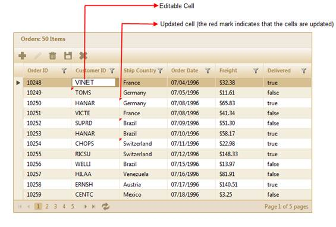
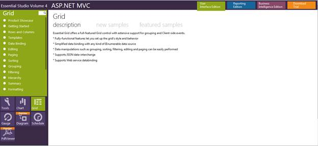

::: {style="DISPLAY: none"}
{#d2h_url_template}{#d2h_package_url style="WIDTH: 0px; DISPLAY: none; HEIGHT: 0px"}
:::

::::: {#nsbanner .d2h_main_nsbanner style="BORDER-BOTTOM: #999999 1px solid; POSITION: relative; PADDING-BOTTOM: 0px; BACKGROUND-COLOR: transparent; PADDING-LEFT: 0px; PADDING-RIGHT: 0px; DISPLAY: none; BORDER-TOP: #999999 1px solid; PADDING-TOP: 0px; LEFT: 0px"}
:::: {#TitleRow .d2h_main_titlerow style="PADDING-BOTTOM: 4px; BACKGROUND-COLOR: transparent; PADDING-LEFT: 22px; WIDTH: 100%; PADDING-RIGHT: 10px; DISPLAY: none; PADDING-TOP: 4px"}
::: {#ienav .d2h_main_ienav style="DISPLAY: none"}
{#D2HPrevious .D2HPreviousEnabled}  {#D2HNext .D2HNextEnabled}
:::
::::
:::::

:::: {#nstext .d2h_main_nstext style="PADDING-BOTTOM: 10px; BACKGROUND-COLOR: transparent; PADDING-LEFT: 22px; PADDING-RIGHT: 10px; HEIGHT: 100%; OVERFLOW: auto; PADDING-TOP: 5px" hasuserbackground="true" valign="bottom"}
::: {#d2h_breadcrumbs .d2h_breadcrumbs}
[Essential Studio User Guide Documentation](ms-xhelp:///?Id=12457748-09e3-4d74-a240-8e049cedf030){.d2h_breadcrumbsNormal}[ \> ]{.d2h_breadcrumbsLinkSeparator}[User Interface Edition](ms-xhelp:///?Id=c29296b7-531c-413b-a0ec-488ca1f7f669){.d2h_breadcrumbsNormal}[ \> ]{.d2h_breadcrumbsLinkSeparator}[Essential ASP.NET MVC](ms-xhelp:///?Id=4b14e7d1-65c4-4f67-b1aa-2c37709905a5){.d2h_breadcrumbsNormal}[ \> ]{.d2h_breadcrumbsLinkSeparator}[Essential Grid]{.d2h_breadcrumbsContentsOnly}[ \> ]{.d2h_breadcrumbsLinkSeparator}[Getting Started](ms-xhelp:///?Id=c7ed3902-b25b-4170-be58-1d3d0b57748a){.d2h_breadcrumbsNormal}[ \> ]{.d2h_breadcrumbsLinkSeparator}[Feature Summary](ms-xhelp:///?Id=1923e679-441a-44e0-9bca-e0e50988a857){.d2h_breadcrumbsNormal}[ \> ]{.d2h_breadcrumbsLinkSeparator}[Concepts and Features](ms-xhelp:///?Id=4a1657fa-4756-42b9-9153-aebf5dcfc503){.d2h_breadcrumbsNormal}[ \> ]{.d2h_breadcrumbsLinkSeparator}[Editing](ms-xhelp:///?Id=51ad902e-b7e5-44e5-ad71-814595e92bf0){.d2h_breadcrumbsNormal}
:::

### Excel-Like Editing in MVC Grid {#excel-like-editing-in-mvc-grid style="tab-stops: 0pt"}

This feature allows you to edit various fields of the grid at the same time, allowing you the ease of Excel-like functionality in editing data.

The edited data is stored in the client side temporarily before it is saved on the server side manually or at a fixed time interval.

Out of the two modes of grid editing (i.e. server mode and JSON mode), this feature is only supported in JSON mode.

 

Use Case Scenario

Users can edit large amounts of data all at the same time and then save it on to the server at once, instead of waiting for the server to save edited data before making another edit.

 

Feature Summary

The Excel-like edit feature allows you to edit data similarly to how one can edit it using Microsoft Excel. This is more suitable for extremely large edits, since it reduces the time required to save all the edited data to the server side.

This feature in Essential Grid for MVC has two modes:

[·      ]{style="FONT-FAMILY: Symbol"}Manual Excel---This allows you to edit large amounts of data and then save it on to the server side whenever you need to.

[·      ]{style="FONT-FAMILY: Symbol"}Auto Excel---This option automatically updates the server with edited information, at fixed time intervals.

Both of these modes allow you to keep editing as much data as required for as long as required.

Edited data is marked on the grid so that you know which fields or cells have been edited.\
These markers are not shown after the updated data is rendered.

The following figure gives you a basic idea of the appearance of a grid in the Excel-like edit mode:

 

{border="0"}[]{style="FONT-FAMILY: 'Calibri','sans-serif'; FONT-SIZE: 11pt"}

Figure 177: Excel-Like Editing in a Grid

 

Where do I view Samples?

To view the samples:

1.   Open the **ASP.NET MVC** Sample Browser from the dashboard (Refer to the Samples and Location[ ]{style="COLOR: #00487e"}chapter).

2.   Navigate to **Grid**\>**Editing**\>**Excel-Like Edit** demo.

 {border="0"}

Figure 178: MVC Grid Sample Browser

3.   Try the manual Excel-like editing and automatic Excel-like editing features by selecting them in the **Edit mode** drop-down in the sample browser.

 

Source Code Location

The full source code of the Grid control will be available on the purchase of the product. To navigate to the source code location, go to:

***\[Location where you have installed Syncfusion Products\]\\**Essential Studio\\vx.x.x.x\\MVC\\Grid.MVC\\Src***

 

Properties

 

+-------------+-------------------------------------------------------------------------+------------------+---------------------------------------------------+----------------------------------------------------------------------------------------+
| Property    | Description                                                             | Type of property | Value it accepts                                  | Dependencies                                                                           |
+-------------+-------------------------------------------------------------------------+------------------+---------------------------------------------------+----------------------------------------------------------------------------------------+
| EditMode    | Specifies the edit mode.                                                | GridEditMode     | [·      ]{style="FONT-FAMILY: Symbol"}AutoExcel   | Depends on **AllowEditing**---\                                                        |
|             |                                                                         |                  |                                                   | \                                                                                      |
|             |                                                                         | (Enum)           | [·      ]{style="FONT-FAMILY: Symbol"}ManualExcel |                                                                                        |
|             |                                                                         |                  |                                                   | If **AllowEditing** is set to **True**, the **EditMode** property is enabled.          |
+-------------+-------------------------------------------------------------------------+------------------+---------------------------------------------------+----------------------------------------------------------------------------------------+
| TimeSpan    | Used to specify the time interval at which data is saved to the server. | int              | Any integer value                                 | Depends on **EditMode**---                                                             |
|             |                                                                         |                  |                                                   |                                                                                        |
|             |                                                                         |                  |                                                   |                                                                                        |
|             |                                                                         |                  |                                                   |                                                                                        |
|             |                                                                         |                  |                                                   | Only if the **EditMode** is set to **AutoExcel** will this property will be activated. |
+-------------+-------------------------------------------------------------------------+------------------+---------------------------------------------------+----------------------------------------------------------------------------------------+

 

 

Events

 

+---------------------------------------+--------------------------------------------------------------------------------------------------------------------------+----------------------------------------------------------------------------------------------------------------------------------------------+
| Name[]{style="FONT-SIZE: 11pt"}       | Description[]{style="FONT-SIZE: 11pt"}                                                                                   | Arguments[]{style="FONT-SIZE: 11pt"}                                                                                                         |
+---------------------------------------+--------------------------------------------------------------------------------------------------------------------------+----------------------------------------------------------------------------------------------------------------------------------------------+
| OnCellEdit[]{style="FONT-SIZE: 11pt"} | Triggered before the edit form of the cell being edited is rendered.[]{style="FONT-SIZE: 11pt"}                          | [·      ]{style="FONT-FAMILY: Symbol"}colObj---columnObject contains information about column objects such as name, type, header text, etc.  |
|                                       |                                                                                                                          |                                                                                                                                              |
|                                       |                                                                                                                          |                                                                                                                                              |
|                                       |                                                                                                                          |                                                                                                                                              |
|                                       |                                                                                                                          | [·      ]{style="FONT-FAMILY: Symbol"}value---Contains the value of the cell being edited.                                                   |
+---------------------------------------+--------------------------------------------------------------------------------------------------------------------------+----------------------------------------------------------------------------------------------------------------------------------------------+
| OnCellSave[]{style="FONT-SIZE: 11pt"} | Triggered before the value of the particular cells being edited are saved in the client side.[]{style="FONT-SIZE: 11pt"} | [·      ]{style="FONT-FAMILY: Symbol"}colObj---columnObject contains information about column objects, such as name, type, header text, etc. |
|                                       |                                                                                                                          |                                                                                                                                              |
|                                       |                                                                                                                          |                                                                                                                                              |
|                                       |                                                                                                                          |                                                                                                                                              |
|                                       |                                                                                                                          | [·      ]{style="FONT-FAMILY: Symbol"}value---Contains the updated  value of the cell.                                                       |
+---------------------------------------+--------------------------------------------------------------------------------------------------------------------------+----------------------------------------------------------------------------------------------------------------------------------------------+
| OnBulkSave[]{style="FONT-SIZE: 11pt"} | Triggered before the updated records are saved in the server side.[]{style="FONT-SIZE: 11pt"}                            | [·      ]{style="FONT-FAMILY: Symbol"}updatedRecords---contains the list of updated records.                                                 |
|                                       |                                                                                                                          |                                                                                                                                              |
|                                       |                                                                                                                          |                                                                                                                                              |
|                                       |                                                                                                                          |                                                                                                                                              |
|                                       |                                                                                                                          | [·      ]{style="FONT-FAMILY: Symbol"}deletedRecords---contains the list of deleted records.                                                 |
|                                       |                                                                                                                          |                                                                                                                                              |
|                                       |                                                                                                                          |                                                                                                                                              |
|                                       |                                                                                                                          |                                                                                                                                              |
|                                       |                                                                                                                          | [·      ]{style="FONT-FAMILY: Symbol"}insertedRecords---contains the list of inserted records.                                               |
+---------------------------------------+--------------------------------------------------------------------------------------------------------------------------+----------------------------------------------------------------------------------------------------------------------------------------------+

[]{style="FONT-FAMILY: 'Calibri','sans-serif'; FONT-SIZE: 11pt"} 

More:

[ ]{#related-topics}

[{border="0" align="absMiddle"}Enabling Excel-Like Editing in MVC Grid](ms-xhelp:///?Id=6361216f-d231-424e-b001-4feb059e28ff){style="TEXT-DECORATION: none"}
::::
