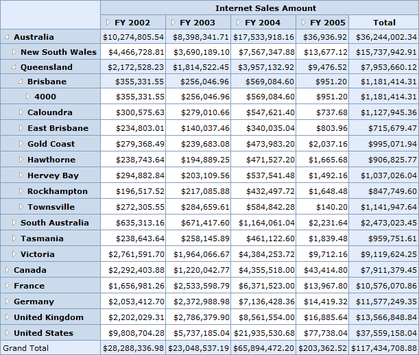

::: {style="DISPLAY: none"}
{#d2h_url_template}{#d2h_package_url style="WIDTH: 0px; DISPLAY: none; HEIGHT: 0px"}
:::

::: {.d2h_secondary_topic style="PADDING-BOTTOM: 10pt; MARGIN: 0pt; PADDING-LEFT: 0pt; PADDING-RIGHT: 0pt; PADDING-TOP: 0pt"}
#### Excel-like Layout {#excel-like-layout style="tab-stops: 0pt"}

In the **Excel-like** layout, the summary cells are positioned at the bottom and the child members appear below the parent member with a small indent space.

 

{border="0"}

Figure 11: OLAP Grid in Excel-like Layout

 

+---------------------------------------------------------------------------------------------------------------------------------------------------------------------------------------------------------------------------------------------+
| **[\[C#\]]{style="FONT-FAMILY: 'Courier New'"}**                                                                                                                                                                                            |
|                                                                                                                                                                                                                                             |
| [///]{style="FONT-FAMILY: 'Courier New'; COLOR: gray"}[ Excel-like Grid Layout]{style="FONT-FAMILY: 'Courier New'; COLOR: green"}                                                                                                           |
|                                                                                                                                                                                                                                             |
| [this]{style="FONT-STYLE: normal; FONT-FAMILY: 'Courier New'; COLOR: blue"}[.OlapGrid1.Layout = [GridLayout]{style="COLOR: #2b91af"}.ExceLikeLayout;]{style="FONT-STYLE: normal; FONT-FAMILY: 'Courier New'"}[]{style="FONT-STYLE: normal"} |
+---------------------------------------------------------------------------------------------------------------------------------------------------------------------------------------------------------------------------------------------+

 

+--------------------------------------------------------------------------------------------------------------------------------------------------------------------+
| **[\[VB\]]{style="FONT-FAMILY: 'Courier New'"}**                                                                                                                   |
|                                                                                                                                                                    |
| [\' Excel-like Grid Layout]{style="FONT-FAMILY: 'Courier New'; COLOR: green"}                                                                                      |
|                                                                                                                                                                    |
| [Me]{style="FONT-FAMILY: 'Courier New'; COLOR: blue"}[.OlapGrid1.Layout = [GridLayout]{style="COLOR: #2b91af"}.ExceLikeLayout]{style="FONT-FAMILY: 'Courier New'"} |
+--------------------------------------------------------------------------------------------------------------------------------------------------------------------+

 

[]{#related-topics}
:::
