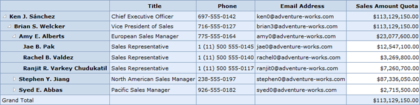

::: {style="DISPLAY: none"}
{#d2h_url_template}{#d2h_package_url style="WIDTH: 0px; DISPLAY: none; HEIGHT: 0px"}
:::

::: {.d2h_secondary_topic style="PADDING-BOTTOM: 10pt; MARGIN: 0pt; PADDING-LEFT: 0pt; PADDING-RIGHT: 0pt; PADDING-TOP: 0pt"}
#### Excel-like Layout with Member Properties {#excel-like-layout-with-member-properties style="tab-stops: 0pt"}

The **Excel-like with Member Properties** layout is used to display member properties along with dimension members. The properties appear adjacent to each member.

 

{border="0"}

Figure 12: OLAP Grid in Excel-like Layout with Member Properties

 

+------------------------------------------------------------------------------------------------------------------------------------------------------------------------------------------------------------------------------------------------------------------+
| **[\[C#\]]{style="FONT-FAMILY: 'Courier New'"}**                                                                                                                                                                                                                 |
|                                                                                                                                                                                                                                                                  |
| [///]{style="FONT-FAMILY: 'Courier New'; COLOR: gray"}[ Excel-like Grid Layout with Member Properties.]{style="FONT-FAMILY: 'Courier New'; COLOR: green"}                                                                                                        |
|                                                                                                                                                                                                                                                                  |
| [this]{style="FONT-STYLE: normal; FONT-FAMILY: 'Courier New'; COLOR: blue"}[.OlapGrid1.Layout = [GridLayout]{style="COLOR: #2b91af"}.ExcelLikeLayoutWithMemberProperties;]{style="FONT-STYLE: normal; FONT-FAMILY: 'Courier New'"}[]{style="FONT-STYLE: normal"} |
+------------------------------------------------------------------------------------------------------------------------------------------------------------------------------------------------------------------------------------------------------------------+

 

+-----------------------------------------------------------------------------------------------------------------------------------------------------------------------------------------+
| **[\[VB\]]{style="FONT-FAMILY: 'Courier New'"}**                                                                                                                                        |
|                                                                                                                                                                                         |
| [\' Excel-like Grid Layout with Member Properties.]{style="FONT-FAMILY: 'Courier New'; COLOR: green"}                                                                                   |
|                                                                                                                                                                                         |
| [Me]{style="FONT-FAMILY: 'Courier New'; COLOR: blue"}[.OlapGrid1.Layout = [GridLayout]{style="COLOR: #2b91af"}.ExcelLikeLayoutWithMemberProperties]{style="FONT-FAMILY: 'Courier New'"} |
+-----------------------------------------------------------------------------------------------------------------------------------------------------------------------------------------+

 

Sample Location

A sample demo is available at the following location:

**..\\Syncfusion\\EssentialStudio\\\<VersionNumber\>\\BI\\Web\\OlapGrid.Web\\Samples\\3.5\\Application Scenario\\Member Properties Demo**

 

[]{#related-topics}
:::
