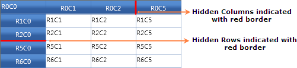
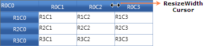
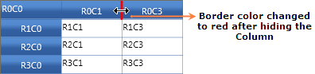
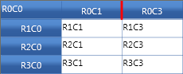
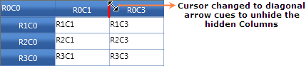
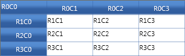

::: {style="DISPLAY: none"}
{#d2h_url_template}{#d2h_package_url style="WIDTH: 0px; DISPLAY: none; HEIGHT: 0px"}
:::

::: {.d2h_secondary_topic style="PADDING-BOTTOM: 10pt; MARGIN: 0pt; PADDING-LEFT: 0pt; PADDING-RIGHT: 0pt; PADDING-TOP: 0pt"}
#### Excel Like Resizing Support {#excel-like-resizing-support style="tab-stops: 0pt"}

Essential Grid control supports Excel like resizing to hide or unhide columns. It also acts as a visual marker to indicate hidden columns.

[]{style="FONT-FAMILY: 'Trebuchet MS','sans-serif'; COLOR: #15428b; FONT-SIZE: 9pt"} 

Use Case Scenarios

Excel like resizing support can be implemented in applications that contain more number of rows and columns. You can also make some rows or columns to be hidden.

[]{style="FONT-FAMILY: 'Trebuchet MS','sans-serif'; COLOR: #15428b; FONT-SIZE: 9pt"} 

Adding Resizing Support to an Application

The following steps explain the implementation of the Resizing support to an application.

[]{style="FONT-FAMILY: 'Trebuchet MS','sans-serif'; COLOR: #15428b; FONT-SIZE: 9pt"} 

1.   Set the Resizing border properties.

Resizing is a built-in property and there is no need to set any special property to enable it. But there are options to set the hidden border color and thickness. Set the **HiddenBorderBrush** Property to any of SolidColorBrush color for the GridModelOptions (Options Property) object.  The assigned color will be brushed in the border color of the hidden column or row. Set the **HiddenBorderThickness** property to an int value say 3.

[]{style="FONT-FAMILY: 'Trebuchet MS','sans-serif'; COLOR: #15428b; FONT-SIZE: 9pt"} 

The following code snippet explains the implementation of the **HiddenBorderBrush** and **HidderBorderThickness** properties.

3.  

+--------------------------------------------------------------------------------------------------------------------------------------------------------------------------------------------------------------------------------------------------------------------------------------------------------------------------------------------------+
| **[\[C#\]]{style="FONT-FAMILY: 'Courier New'"}**                                                                                                                                                                                                                                                                                                 |
|                                                                                                                                                                                                                                                                                                                                                  |
|                                                                                                                                                                                                                                                                                                                                                  |
|                                                                                                                                                                                                                                                                                                                                                  |
| [this]{style="FONT-FAMILY: 'Courier New'; COLOR: blue"}[.dataGrid.Model.Options.HiddenBorderBrush = ]{style="FONT-FAMILY: 'Courier New'"}[new]{style="FONT-FAMILY: Consolas; COLOR: blue; FONT-SIZE: 9.5pt"}[ [SolidColorBrush]{style="COLOR: #2b91af"}([Colors]{style="COLOR: #2b91af"}.Red);]{style="FONT-FAMILY: Consolas; FONT-SIZE: 9.5pt"} |
|                                                                                                                                                                                                                                                                                                                                                  |
| [this]{style="FONT-FAMILY: 'Courier New'; COLOR: blue"}[.dataGrid.Model.Options.HiddenBorderThickness = 3;]{style="FONT-FAMILY: 'Courier New'"}[ ]{style="FONT-FAMILY: 'Courier New'; FONT-SIZE: 9.5pt"}                                                                                                                                         |
|                                                                                                                                                                                                                                                                                                                                                  |
|                                                                                                                                                                                                                                                                                                                                                  |
+--------------------------------------------------------------------------------------------------------------------------------------------------------------------------------------------------------------------------------------------------------------------------------------------------------------------------------------------------+

[]{style="FONT-FAMILY: 'Calibri','sans-serif'"} 

+--------------------------------------------------------------------------------------------------------------------------------------------------------------------------------------------------------------------------------------------------------------------------------------------------------------------------------------------------------------------------------------------------------------------------------------------------------------------------------------------+
| **[\[VB\]]{style="FONT-FAMILY: 'Courier New'"}**                                                                                                                                                                                                                                                                                                                                                                                                                                           |
|                                                                                                                                                                                                                                                                                                                                                                                                                                                                                            |
|                                                                                                                                                                                                                                                                                                                                                                                                                                                                                            |
|                                                                                                                                                                                                                                                                                                                                                                                                                                                                                            |
| [Me]{style="FONT-FAMILY: 'Courier New'; COLOR: blue"}[.dataGrid.Model.Options.HiddenBorderBrush = [New]{style="COLOR: blue"} ]{style="FONT-FAMILY: 'Courier New'"}[SolidColorBrush]{style="FONT-FAMILY: Consolas; COLOR: #2b91af; FONT-SIZE: 9.5pt"}[(]{style="FONT-FAMILY: 'Courier New'"}[Colors]{style="FONT-FAMILY: Consolas; COLOR: #2b91af; FONT-SIZE: 9.5pt"}[.Red)[ Me]{style="COLOR: blue"}.dataGrid.Model.Options.HiddenBorderThickness = 3]{style="FONT-FAMILY: 'Courier New'"} |
|                                                                                                                                                                                                                                                                                                                                                                                                                                                                                            |
|                                                                                                                                                                                                                                                                                                                                                                                                                                                                                            |
+--------------------------------------------------------------------------------------------------------------------------------------------------------------------------------------------------------------------------------------------------------------------------------------------------------------------------------------------------------------------------------------------------------------------------------------------------------------------------------------------+

[]{style="FONT-FAMILY: 'Calibri','sans-serif'"} 

2.   Run the application.

To set the rows or columns as hidden by code, you can use the **SetHidden()** method. It has two int type parameters to get "from Index" and "to Index", a Boolean type which sets  True for hide and False for unhide to hide and unhide the column or row respectively. Run the application and you will find the given row or column to be hidden.

[]{style="FONT-FAMILY: 'Trebuchet MS','sans-serif'; COLOR: #15428b; FONT-SIZE: 9pt"} 

The following code snippet explains the implementation of the **SetHidden()** method of **ColumnWidths** and **RowHeights** property.

 

+----------------------------------------------------------------------------------------------------------------------------------------------------------------------------------------------------------------------------------------------------+
| **[\[C#\]]{style="FONT-FAMILY: 'Courier New'"}**                                                                                                                                                                                                   |
|                                                                                                                                                                                                                                                    |
| []{style="FONT-FAMILY: 'Courier New'"}                                                                                                                                                                                                             |
|                                                                                                                                                                                                                                                    |
| [// To hide columns and rows.]{style="FONT-FAMILY: 'Courier New'; COLOR: #09850f"}                                                                                                                                                                 |
|                                                                                                                                                                                                                                                    |
| [this]{style="FONT-FAMILY: 'Courier New'; COLOR: blue; FONT-SIZE: 9.5pt"}[.dataGrid.Model.ColumnWidths.SetHidden(3, 4, [true]{style="COLOR: blue"});]{style="FONT-FAMILY: 'Courier New'; FONT-SIZE: 9.5pt"}[]{style="FONT-FAMILY: 'Courier New'"}  |
|                                                                                                                                                                                                                                                    |
| [this]{style="FONT-FAMILY: 'Courier New'; COLOR: blue; FONT-SIZE: 9.5pt"}[.dataGrid.Model.RowHeights.SetHidden(3, 4, [true]{style="COLOR: blue"});]{style="FONT-FAMILY: 'Courier New'; FONT-SIZE: 9.5pt"}                                          |
|                                                                                                                                                                                                                                                    |
| []{style="FONT-FAMILY: 'Courier New'"}                                                                                                                                                                                                             |
|                                                                                                                                                                                                                                                    |
| [// To unhide columns and rows.]{style="FONT-FAMILY: 'Courier New'; COLOR: #09850f"}                                                                                                                                                               |
|                                                                                                                                                                                                                                                    |
| [this]{style="FONT-FAMILY: 'Courier New'; COLOR: blue; FONT-SIZE: 9.5pt"}[.dataGrid.Model.ColumnWidths.SetHidden(3, 4, [false]{style="COLOR: blue"});]{style="FONT-FAMILY: 'Courier New'; FONT-SIZE: 9.5pt"}[]{style="FONT-FAMILY: 'Courier New'"} |
|                                                                                                                                                                                                                                                    |
| [this]{style="FONT-FAMILY: 'Courier New'; COLOR: blue; FONT-SIZE: 9.5pt"}[.dataGrid.Model.RowHeights.SetHidden(3, 4, [false]{style="COLOR: blue"});]{style="FONT-FAMILY: 'Courier New'; FONT-SIZE: 9.5pt"}                                         |
|                                                                                                                                                                                                                                                    |
| []{style="FONT-FAMILY: Consolas; FONT-SIZE: 9.5pt"}                                                                                                                                                                                                |
|                                                                                                                                                                                                                                                    |
|                                                                                                                                                                                                                                                    |
+----------------------------------------------------------------------------------------------------------------------------------------------------------------------------------------------------------------------------------------------------+

[]{style="FONT-FAMILY: 'Calibri','sans-serif'"} 

+-----------------------------------------------------------------------------------------------------------------------------------------------------------------------+
| **[\[VB\]]{style="FONT-FAMILY: 'Courier New'"}**                                                                                                                      |
|                                                                                                                                                                       |
| []{style="FONT-FAMILY: 'Courier New'"}                                                                                                                                |
|                                                                                                                                                                       |
| [// To hide columns and rows.]{style="FONT-FAMILY: 'Courier New'; COLOR: #09850f"}                                                                                    |
|                                                                                                                                                                       |
| [Me]{style="FONT-FAMILY: 'Courier New'; COLOR: blue"}[.dataGrid.Model.ColumnWidths.SetHidden(3, 4, [True]{style="COLOR: blue"})]{style="FONT-FAMILY: 'Courier New'"}  |
|                                                                                                                                                                       |
| [Me]{style="FONT-FAMILY: 'Courier New'; COLOR: blue"}[.dataGrid.Model.RowHeights.SetHidden(3, 4, [True]{style="COLOR: blue"})]{style="FONT-FAMILY: 'Courier New'"}    |
|                                                                                                                                                                       |
| []{style="FONT-FAMILY: 'Courier New'; COLOR: #09850f"}                                                                                                                |
|                                                                                                                                                                       |
| [// To unhide columns and rows.]{style="FONT-FAMILY: 'Courier New'; COLOR: #09850f"}                                                                                  |
|                                                                                                                                                                       |
| [Me]{style="FONT-FAMILY: 'Courier New'; COLOR: blue"}[.dataGrid.Model.ColumnWidths.SetHidden(3, 4, [False]{style="COLOR: blue"})]{style="FONT-FAMILY: 'Courier New'"} |
|                                                                                                                                                                       |
| [Me]{style="FONT-FAMILY: 'Courier New'; COLOR: blue"}[.dataGrid.Model.RowHeights.SetHidden(3, 4, [False]{style="COLOR: blue"})]{style="FONT-FAMILY: 'Courier New'"}   |
|                                                                                                                                                                       |
|                                                                                                                                                                       |
+-----------------------------------------------------------------------------------------------------------------------------------------------------------------------+

 

The following is a sample output of Resizing support implementation.

 

{border="0"}

Figure 71: Row index and Column index for 3 and 4 are hidden

***[]{style="FONT-FAMILY: 'Trebuchet MS','sans-serif'; COLOR: #002060; FONT-SIZE: 9pt"}*** 

3.   Hide and unhide a row or column during run-time.

To hide a column or a row, hover at the line of the column or a row.  It shows a resizing cursor with a horizontal or a vertical arrow bar so that you can drag the line to its next header cell. After joining to the neighbor Header Cell, the line will be darkened which means that a column or a row is hidden. To unhide the hidden rows or columns, hover on the dark marked line. The cursor will then be changed to a diagonal arrow and by double clicking, the hidden rows or columns can be resized to its original size.

 

The following screenshot explains how to hide and unhide a column.

Hover over the header cell's border line. The cursor will be changed to horizontal arrow bar, as like in the following screenshot.

{border="0"}

Figure 72: Hover on the border line of a header

 

Drag it to Column 2 so that the Border color changes as like in the following screenshot.

{border="0"}

Figure 73: After dragging and joining the border line to the neighbor cell

 

The following image shows the output after hiding the row by Mouse Dragging.

{border="0"}

Figure 74: Output of the hidden column to the neighbor cell

 

To unhide the hidden row, hover the mouse on the hidden column border line. A diagonal arrow cursor will be displayed as in the following screenshot.

[]{style="FONT-FAMILY: 'Trebuchet MS','sans-serif'; COLOR: #15428b; FONT-SIZE: 9pt"} 

{border="0"}

Figure 75: Hover on the hidden Column the Cursor changes to diagonal arrow

 

Double click on it so that it unhides all the hidden columns in that particular hidden column.

{border="0"}

Figure 76: After double clicking the hidden column it unhides all the hidden Columns

 

Properties

Table 14: Resizing support Table

  ----------------------- -------------------------------------------------------------- ----------------- --------------- ------------------------------- ------------------
  Property                Description                                                    Data Type         Default value   Available inside the Property   Class Name
  HiddenBorderBrush       Sets the border brush color for the hidden rows  or columns.   SolidColorBrush   Black           RowHeights                      GridModelOptions
  HiddenBorderThickness   Sets the border thickness for the hidden rows or columns.      int               1               ColumnWidths                    GridModelOptions
  ----------------------- -------------------------------------------------------------- ----------------- --------------- ------------------------------- ------------------

[]{style="FONT-FAMILY: 'Trebuchet MS','sans-serif'; COLOR: #15428b; FONT-SIZE: 9pt"} 

Methods

Table 15: Resizing support Table

  Method        Description                                                    Parameters                    Available inside the Property   Return Type
  ------------- -------------------------------------------------------------- ----------------------------- ------------------------------- -------------
  SetHidden()   Sets the specified "from" rows to "to" rows as hidden.         int from, int to, bool hide   RowHeights                      void
  SetHidden()   Sets the specified "from" columns to "to" columns as Hidden.   int from, int to, bool hide   ColumnWidths                    void

[]{style="FONT-FAMILY: 'Trebuchet MS','sans-serif'; COLOR: #15428b; FONT-SIZE: 9pt"} 

Sample Link

Refer to the sample in the shipped Sample Browser.

Go to Essential Studio Silverlight Sample Browser [à]{style="FONT-FAMILY: Wingdings"} Grid [à]{style="FONT-FAMILY: Wingdings"} GridDataControl-Advanced[à]{style="FONT-FAMILY: Wingdings"} HiddenRowColDemo.

 

[]{#related-topics}
:::
