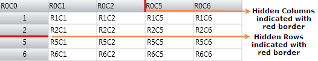
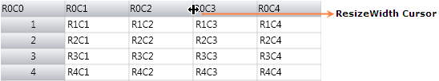
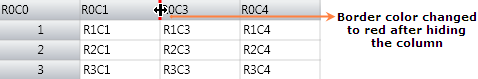
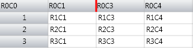
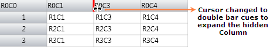
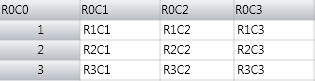

::: {style="DISPLAY: none"}
{#d2h_url_template}{#d2h_package_url style="WIDTH: 0px; DISPLAY: none; HEIGHT: 0px"}
:::

::::: {.d2h_secondary_topic style="PADDING-BOTTOM: 10pt; MARGIN: 0pt; PADDING-LEFT: 0pt; PADDING-RIGHT: 0pt; PADDING-TOP: 0pt"}
#### Excel like Resizing Support {#excel-like-resizing-support style="tab-stops: 0pt"}

Essential Grid control supports Excel like resizing to hide or unhide columns. It also acts as a visual marker to indicate hidden columns.

 

Use Case Scenarios

This feature can be implemented for application which contains more rows and columns. You can also make some rows and columns to be hidden.  

                                   

Adding Resizing Support to an Application

This topic explains how to implement the Resizing support to an application. The following steps explain the implementation of the Resizing support to an application.

**[]{style="COLOR: #15428b"}** 

1.   Set the Resizing border properties

2.   Resizing is a built-in property and there is no need to set any special property to enable it. But there are options to set the hidden border color and thickness. Set the HiddenBorderBrush property to any color of the brush for the Model object.  The assigned color will be brushed in the border color of the hidden column or row. Set the HiddenBorderThickness property to an int value say 3.

**[]{style="COLOR: #15428b"}** 

The following code snippet explains the implementation of the HiddenBorderBrush and HidderBorderThickness properties.

 

+----------------------------------------------------------------------------------------------------------------------------------------------------------------------------------------------------+
| [\[C#\]]{style="FONT-FAMILY: 'Courier New'; FONT-SIZE: 11pt"}                                                                                                                                      |
|                                                                                                                                                                                                    |
|                                                                                                                                                                                                    |
|                                                                                                                                                                                                    |
| [this]{style="FONT-FAMILY: 'Courier New'; COLOR: blue"}[.gridControl.Model.HiddenBorderBrush = [Brushes]{style="COLOR: #2b91af"}.Red ;]{style="FONT-FAMILY: 'Courier New'"}                        |
|                                                                                                                                                                                                    |
| [this]{style="FONT-FAMILY: 'Courier New'; COLOR: blue"}[.gridControl.Model.HiddenBorderThikness = 3;]{style="FONT-FAMILY: 'Courier New'"}[ ]{style="FONT-FAMILY: 'Courier New'; FONT-SIZE: 9.5pt"} |
|                                                                                                                                                                                                    |
|                                                                                                                                                                                                    |
+----------------------------------------------------------------------------------------------------------------------------------------------------------------------------------------------------+

**[]{style="FONT-FAMILY: 'Calibri','sans-serif'; FONT-SIZE: 11pt"}** 

+-------------------------------------------------------------------------------------------------------------------------------------------------------------------------+
| [\[VB\]]{style="FONT-FAMILY: 'Courier New'; FONT-SIZE: 11pt"}                                                                                                           |
|                                                                                                                                                                         |
|                                                                                                                                                                         |
|                                                                                                                                                                         |
| [Me]{style="FONT-FAMILY: 'Courier New'; COLOR: blue"}[.gridControl.Model.HiddenBorderBrush = [Brushes]{style="COLOR: #2b91af"}.Red]{style="FONT-FAMILY: 'Courier New'"} |
|                                                                                                                                                                         |
| [Me]{style="FONT-FAMILY: 'Courier New'; COLOR: blue"}[.gridControl.Model.HiddenBorderThikness = 3]{style="FONT-FAMILY: 'Courier New'"}                                  |
|                                                                                                                                                                         |
|                                                                                                                                                                         |
+-------------------------------------------------------------------------------------------------------------------------------------------------------------------------+

**[]{style="FONT-FAMILY: 'Calibri','sans-serif'; FONT-SIZE: 11pt"}** 

3.   Run the application

To set the rows or columns as hidden by code, you can use the SetHidden() method. It has two int type parameters to get "from Index" and "to Index", a Boolean type which sets True for hide and False for unhide. Run the application and you will find the given rows or columns to be hidden.

**[]{style="COLOR: #15428b"}** 

The following code snippet explains the implementation of the SetHidden() method of ColumnWidths and RowHeights property.

 

+-------------------------------------------------------------------------------------------------------------------------------------------------------------------------------------------------+
| [\[C#\]]{style="FONT-FAMILY: 'Courier New'; FONT-SIZE: 11pt"}                                                                                                                                   |
|                                                                                                                                                                                                 |
|                                                                                                                                                                                                 |
|                                                                                                                                                                                                 |
| [// ]{style="COLOR: #08962d"}[To hide columns and rows.]{style="FONT-FAMILY: 'Courier New'; COLOR: #08962d"}**[]{style="COLOR: #08962d"}**                                                      |
|                                                                                                                                                                                                 |
| [this]{style="FONT-FAMILY: Consolas; COLOR: blue; FONT-SIZE: 9.5pt"}[.gridControl.ColumnWidths.SetHidden(3, 4, [true]{style="COLOR: blue"});]{style="FONT-FAMILY: Consolas; FONT-SIZE: 9.5pt"}  |
|                                                                                                                                                                                                 |
| [this]{style="FONT-FAMILY: Consolas; COLOR: blue; FONT-SIZE: 9.5pt"}[.gridControl.RowHeights.SetHidden(3, 4, [true]{style="COLOR: blue"});]{style="FONT-FAMILY: Consolas; FONT-SIZE: 9.5pt"}    |
|                                                                                                                                                                                                 |
|                                                                                                                                                                                                 |
|                                                                                                                                                                                                 |
| [// ]{style="COLOR: #08962d"}[To unhide columns and rows.]{style="FONT-FAMILY: 'Courier New'; COLOR: #08962d"}**[]{style="COLOR: #08962d"}**                                                    |
|                                                                                                                                                                                                 |
| [this]{style="FONT-FAMILY: Consolas; COLOR: blue; FONT-SIZE: 9.5pt"}[.gridControl.ColumnWidths.SetHidden(3, 4, [false]{style="COLOR: blue"});]{style="FONT-FAMILY: Consolas; FONT-SIZE: 9.5pt"} |
|                                                                                                                                                                                                 |
| [this]{style="FONT-FAMILY: Consolas; COLOR: blue; FONT-SIZE: 9.5pt"}[.gridControl.RowHeights.SetHidden(3, 4, [false]{style="COLOR: blue"});]{style="FONT-FAMILY: Consolas; FONT-SIZE: 9.5pt"}   |
|                                                                                                                                                                                                 |
|                                                                                                                                                                                                 |
+-------------------------------------------------------------------------------------------------------------------------------------------------------------------------------------------------+

**[]{style="FONT-FAMILY: 'Calibri','sans-serif'; FONT-SIZE: 11pt"}** 

+----------------------------------------------------------------------------------------------------------------------------------------------------------------------------------------------+
| [\[VB\]]{style="FONT-FAMILY: 'Courier New'; FONT-SIZE: 11pt"}                                                                                                                                |
|                                                                                                                                                                                              |
|                                                                                                                                                                                              |
|                                                                                                                                                                                              |
| [// To hide columns and rows.]{style="COLOR: #08962d"}                                                                                                                                       |
|                                                                                                                                                                                              |
| [Me]{style="FONT-FAMILY: Consolas; COLOR: blue; FONT-SIZE: 9.5pt"}[.gridControl.ColumnWidths.SetHidden(3, 4, [True]{style="COLOR: blue"})]{style="FONT-FAMILY: Consolas; FONT-SIZE: 9.5pt"}  |
|                                                                                                                                                                                              |
| [Me]{style="FONT-FAMILY: Consolas; COLOR: blue; FONT-SIZE: 9.5pt"}[.gridControl.RowHeights.SetHidden(3, 4, [True]{style="COLOR: blue"})]{style="FONT-FAMILY: Consolas; FONT-SIZE: 9.5pt"}    |
|                                                                                                                                                                                              |
|                                                                                                                                                                                              |
|                                                                                                                                                                                              |
| [// To unhide columns and rows.]{style="COLOR: #08962d"}                                                                                                                                     |
|                                                                                                                                                                                              |
| [Me]{style="FONT-FAMILY: Consolas; COLOR: blue; FONT-SIZE: 9.5pt"}[.gridControl.ColumnWidths.SetHidden(3, 4, [False]{style="COLOR: blue"})]{style="FONT-FAMILY: Consolas; FONT-SIZE: 9.5pt"} |
|                                                                                                                                                                                              |
| [Me]{style="FONT-FAMILY: Consolas; COLOR: blue; FONT-SIZE: 9.5pt"}[.gridControl.RowHeights.SetHidden(3, 4, [False]{style="COLOR: blue"})]{style="FONT-FAMILY: Consolas; FONT-SIZE: 9.5pt"}   |
|                                                                                                                                                                                              |
|                                                                                                                                                                                              |
+----------------------------------------------------------------------------------------------------------------------------------------------------------------------------------------------+

 

The following is a sample output of Resizing support implementation.

 

{border="0"}

Figure 80: Row index and Column index for 3 and 4 are hidden

*[          ]{style="COLOR: #002060"}*

4.   Hide and unhide a rows or Columns during run-time.

To hide a column or a row, hover at the line of the column or row. It shows a resizing cursor with a single bar so that you can drag the line to its next header cell. After joining to the neighbor Header Cell, the line will be darkened which means that a column or a row is hidden. To unhide the hidden rows or columns, hover on the dark marked line. The cursor will then be changed to a double bar and by double clicking, l the hidden rows or columns can be resized to its original size.

The following screenshot explains how to hide and unhide a Column.

Hover over the header cell's border line. The cursor will be changed to single bar, as like in the following screenshot.

 

{border="0"}

Figure 81: Hover on the border line of a header

 

Drag it to Column 2 so that the Border color changes as like in the following screenshot.

 

{border="0"} 

Figure 82: After dragging and joining the border line to the neighbor cell

 

The following image shows the output after hiding the row by Mouse Dragging.

 

{border="0"}

Figure 83: Output of the hidden column to the neighbor cell

 

To unhide the hidden row, hover the mouse on the hidden column border line. A double bar cursor will then be displayed as in the following screenshot.

 

{border="0"}

Figure 84: Hover on the hidden Column the Cursor changes to double bar

 

Double clicking on it will unhide all the hidden columns in that particular hidden column.

 

{border="0"}

Figure 85: After double clicking the hidden column it unhides all the hidden Columns

 

Tables for Properties, Methods, and Events

Properties

Table 21: Resizing support Table

::: {align="center"}
  ----------------------- ------------------------------------------------------------- ----------- --------------- ------------
  Property                Description                                                   Data Type   Default value   Class Name
  HiddenBorderBrush       Sets the border brush color for the hidden rows or columns.   Brush       Black           GridModel
  HiddenBorderThickness   Sets the border thickness for the hidden rows or columns.     int         1               GridModel
  ----------------------- ------------------------------------------------------------- ----------- --------------- ------------
:::

[]{#_Tokens_to_filter} 

Methods

Table 22: Resizing support Table

::: {align="center"}
  Method        Description                                               Parameters                    Available inside the Property   Return Type
  ------------- --------------------------------------------------------- ----------------------------- ------------------------------- -------------
  SetHidden()   Sets the specified "from" rows to "to" rows as hidden.    int from, int to, bool hide   RowHeights                      void
  SetHidden()   Sets the specified "from" rows to "to" rows as hidden.    int from, int to, bool hide   ColumnWidths                    void
:::

 

Sample Link

Refer to the sample in the shipped Sample Browser.

Go to Essential Studio WPF Sample Browser [à]{style="FONT-FAMILY: Wingdings"} Grid [à]{style="FONT-FAMILY: Wingdings"} GridDataControl-Advanced[à]{style="FONT-FAMILY: Wingdings"} HiddenRowColDemo.

**[]{style="COLOR: #15428b"}** 

 

[]{style="COLOR: #15428b"} 

[]{#related-topics}
:::::
