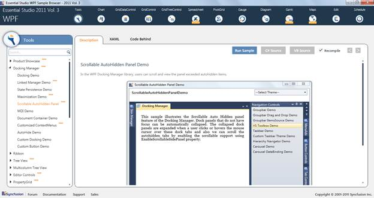

::: {style="DISPLAY: none"}
{#d2h_url_template}{#d2h_package_url style="WIDTH: 0px; DISPLAY: none; HEIGHT: 0px"}
:::

::: {.d2h_secondary_topic style="PADDING-BOTTOM: 10pt; MARGIN: 0pt; PADDING-LEFT: 0pt; PADDING-RIGHT: 0pt; PADDING-TOP: 0pt"}
#### Excel like Scrollable View for AutoHidden Panel {#excel-like-scrollable-view-for-autohidden-panel style="LINE-HEIGHT: 115%; TEXT-INDENT: -43.2pt; MARGIN: 10pt 0pt 0pt 43.2pt; tab-stops: 43.2pt"}

This feature allows you to scroll and view the AutoHidden items without resizing the header of the tabs.

Use Case Scenario

This feature helps the user to have a clear view of the AutoHidden items header without having to search or mouse over on each tab when the panel is resized to a smaller size.

 

{border="0"}

Figure 371: Excel-like Scrollable View

 

Samples Link

To view samples:

1.   Click **Start**\--\>**All Programs**\--\>**Syncfusion**\--\>**Essential Studio** \<version number\> \--\>**Dashboard**. (Refer section 2.2)

2.   In the Dashboard window, click Run Locally Installed Samples for WPF under User Interface Edition panel.

{border="0"}

Figure 372: Sample Browser

The WPF Sample Browser window is displayed.

More:

[ ]{#related-topics}

[{border="0" align="absMiddle"}Properties, Methods and Events tables](ms-xhelp:///?Id=9868d31e-01ea-4c55-ad65-d2059eb6ec8c){style="TEXT-DECORATION: none"}

[{border="0" align="absMiddle"}Features of Excel like Scrollable View](ms-xhelp:///?Id=b9cb378c-6750-4d42-b957-96b833fd47ef){style="TEXT-DECORATION: none"}
:::
