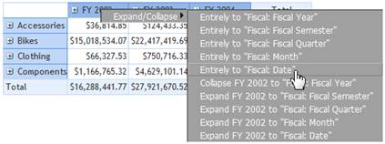
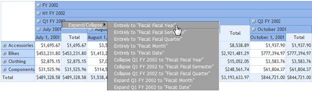
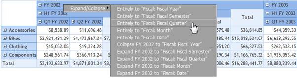
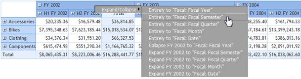
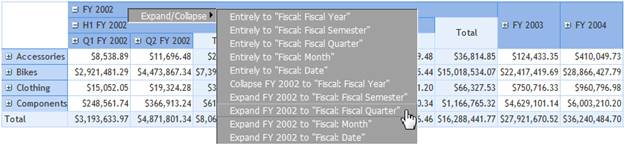
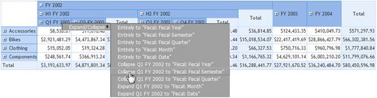

::: {style="DISPLAY: none"}
{#d2h_url_template}{#d2h_package_url style="WIDTH: 0px; DISPLAY: none; HEIGHT: 0px"}
:::

::::: {#nsbanner .d2h_main_nsbanner style="BORDER-BOTTOM: #999999 1px solid; POSITION: relative; PADDING-BOTTOM: 0px; BACKGROUND-COLOR: transparent; PADDING-LEFT: 0px; PADDING-RIGHT: 0px; DISPLAY: none; BORDER-TOP: #999999 1px solid; PADDING-TOP: 0px; LEFT: 0px"}
:::: {#TitleRow .d2h_main_titlerow style="PADDING-BOTTOM: 4px; BACKGROUND-COLOR: transparent; PADDING-LEFT: 22px; WIDTH: 100%; PADDING-RIGHT: 10px; DISPLAY: none; PADDING-TOP: 4px"}
::: {#ienav .d2h_main_ienav style="DISPLAY: none"}
{#D2HPrevious .D2HPreviousEnabled}  {#D2HNext .D2HNextEnabled}
:::
::::
:::::

:::: {#nstext .d2h_main_nstext style="PADDING-BOTTOM: 10px; BACKGROUND-COLOR: transparent; PADDING-LEFT: 22px; PADDING-RIGHT: 10px; HEIGHT: 100%; OVERFLOW: auto; PADDING-TOP: 5px" hasuserbackground="true" valign="bottom"}
::: {#d2h_breadcrumbs .d2h_breadcrumbs}
[Essential Studio User Guide Documentation](ms-xhelp:///?Id=12457748-09e3-4d74-a240-8e049cedf030){.d2h_breadcrumbsNormal}[ \> ]{.d2h_breadcrumbsLinkSeparator}[Business Intelligence Edition](ms-xhelp:///?Id=fdf33dd8-62b2-47b9-ad7b-fc50e590bca5){.d2h_breadcrumbsNormal}[ \> ]{.d2h_breadcrumbsLinkSeparator}[Essential BI ASP.NET](ms-xhelp:///?Id=99c6694e-59c3-4c59-abb5-ce9ce9a948bc){.d2h_breadcrumbsNormal}[ \> ]{.d2h_breadcrumbsLinkSeparator}[Essential BI Grid]{.d2h_breadcrumbsContentsOnly}[ \> ]{.d2h_breadcrumbsLinkSeparator}[Concepts and Features](ms-xhelp:///?Id=6745c49b-2e43-4f50-aaf9-6e9c42650969){.d2h_breadcrumbsNormal}
:::

## Expand/Collapse Members in a Dimension {#expandcollapse-members-in-a-dimension style="tab-stops: 0pt"}

This feature enables the user to view the members at different levels directly without any step-by-step drill up/down process. This can be achieved either through an API or the context menu (applicable only in the OlapGrid control).

The sub-features that enhanced this feature are:

Expand All

This feature expands all the members beneath the dimension. For example, when the **DrillState** is set to **ExpandAll**, the members at different levels of the dimension will expand.

The following code snippet illustrates the API implementation of the feature.       

 

+--------------------------------------------------------------------------------------------------------------------------------------------------------------------------------------------------------------------------------------------------------+
| **[\[C#\]]{style="FONT-FAMILY: 'Courier New'"}**                                                                                                                                                                                                       |
|                                                                                                                                                                                                                                                        |
| [DimensionElement]{style="FONT-FAMILY: 'Courier New'; COLOR: #2bb6e2"}[ dimensionElement = [new ]{style="COLOR: blue"}[DimensionElement]{style="COLOR: #2bb6e2"}() { Name = [\"Date\"]{style="COLOR: #c11515"} };]{style="FONT-FAMILY: 'Courier New'"} |
|                                                                                                                                                                                                                                                        |
| [dimensionElement.AddLevel([\"Fiscal\"]{style="COLOR: #c11515"}, [\"Fiscal Year\"]{style="COLOR: #c11515"});]{style="FONT-FAMILY: 'Courier New'"}                                                                                                      |
|                                                                                                                                                                                                                                                        |
| [dimensionElement.DrillState = [DrillState]{style="COLOR: #2bb6e2"}.ExpandAll;]{style="FONT-FAMILY: 'Courier New'"}                                                                                                                                    |
|                                                                                                                                                                                                                                                        |
| [olapReport.SeriesElements.Add(dimensionElement);]{style="FONT-FAMILY: 'Courier New'"}                                                                                                                                                                 |
+--------------------------------------------------------------------------------------------------------------------------------------------------------------------------------------------------------------------------------------------------------+

**[]{style="FONT-FAMILY: 'Courier New'; COLOR: black"}** 

+---------------------------------------------------------------------------------------------------------------------------------------------------------------------------------------------------------------------------------------------------------------------------------------------------------------------------------------+
| **[\[VB\]]{style="FONT-FAMILY: 'Courier New'"}**                                                                                                                                                                                                                                                                                      |
|                                                                                                                                                                                                                                                                                                                                       |
| [Dim ]{style="FONT-FAMILY: 'Courier New'; COLOR: blue"}[dimensionElement [As ]{style="COLOR: blue"}[DimensionElement ]{style="COLOR: #2bb6e2"}= [New ]{style="COLOR: blue"}[DimensionElement]{style="COLOR: #2bb6e2"}() [With ]{style="COLOR: blue"}{.Name = [\"Date\"]{style="COLOR: #c11515"}}]{style="FONT-FAMILY: 'Courier New'"} |
|                                                                                                                                                                                                                                                                                                                                       |
| [dimensionElement.AddLevel([\"Fiscal\"]{style="COLOR: #c11515"}, [\"Fiscal Year\"]{style="COLOR: #c11515"})]{style="FONT-FAMILY: 'Courier New'"}                                                                                                                                                                                      |
|                                                                                                                                                                                                                                                                                                                                       |
| [dimensionElement.DrillState = [DrillState]{style="COLOR: #2bb6e2"}.ExpandAll]{style="FONT-FAMILY: 'Courier New'"}                                                                                                                                                                                                                    |
|                                                                                                                                                                                                                                                                                                                                       |
| [olapReport.SeriesElements.Add(dimensionElement)]{style="FONT-FAMILY: 'Courier New'"}                                                                                                                                                                                                                                                 |
+---------------------------------------------------------------------------------------------------------------------------------------------------------------------------------------------------------------------------------------------------------------------------------------------------------------------------------------+

 

The following screenshot illustrates the **Expand All** option through the context menu:

 

{border="0"}

Figure 38: \"Expand All\" under "Fiscal" Hierarchy

 

On clicking **Entirely to Fiscal: Date**, which is the last level in the dimension, all the members beneath the "Fiscal Year," "Fiscal Semester," "Fiscal Quarter," "Month," and "Date" will expand.

 

Collapse All

This feature collapses all members beneath the dimension. For example, when the **DrillState** is set to **CollapseAll**, the members at different levels of the dimension will be collapsed.

The following code snippet illustrates the API implementation of the feature:   

 

+--------------------------------------------------------------------------------------------------------------------------------------------------------------------------------------------------------------------------------------------------------+
| **[\[C#\]]{style="FONT-FAMILY: 'Courier New'"}**                                                                                                                                                                                                       |
|                                                                                                                                                                                                                                                        |
| [DimensionElement ]{style="FONT-FAMILY: 'Courier New'; COLOR: #2bb6e2"}[dimensionElement = [new ]{style="COLOR: blue"}[DimensionElement]{style="COLOR: #2bb6e2"}() { Name = [\"Date\"]{style="COLOR: #c11515"} };]{style="FONT-FAMILY: 'Courier New'"} |
|                                                                                                                                                                                                                                                        |
| [dimensionElement.AddLevel([\"Fiscal\"]{style="COLOR: #c11515"},[ \"Fiscal Year\"]{style="COLOR: #c11515"});]{style="FONT-FAMILY: 'Courier New'"}                                                                                                      |
|                                                                                                                                                                                                                                                        |
| [dimensionElement.DrillState = [DrillState]{style="COLOR: #2bb6e2"}.CollapseAll;]{style="FONT-FAMILY: 'Courier New'"}                                                                                                                                  |
|                                                                                                                                                                                                                                                        |
| [olapReport.SeriesElements.Add(dimensionElement);]{style="FONT-FAMILY: 'Courier New'"}                                                                                                                                                                 |
+--------------------------------------------------------------------------------------------------------------------------------------------------------------------------------------------------------------------------------------------------------+

 

+---------------------------------------------------------------------------------------------------------------------------------------------------------------------------------------------------------------------------------------------------------------------------------------------------------------------------------------+
| **[\[VB\]]{style="FONT-FAMILY: 'Courier New'"}**                                                                                                                                                                                                                                                                                      |
|                                                                                                                                                                                                                                                                                                                                       |
| [Dim ]{style="FONT-FAMILY: 'Courier New'; COLOR: blue"}[dimensionElement [As ]{style="COLOR: blue"}[DimensionElement ]{style="COLOR: #2bb6e2"}= [New ]{style="COLOR: blue"}[DimensionElement]{style="COLOR: #2bb6e2"}() [With ]{style="COLOR: blue"}{.Name = [\"Date\"]{style="COLOR: #c11515"}}]{style="FONT-FAMILY: 'Courier New'"} |
|                                                                                                                                                                                                                                                                                                                                       |
| [dimensionElement.AddLevel([\"Fiscal\"]{style="COLOR: #c11515"}, [\"Fiscal Year\"]{style="COLOR: #c11515"})]{style="FONT-FAMILY: 'Courier New'"}                                                                                                                                                                                      |
|                                                                                                                                                                                                                                                                                                                                       |
| [dimensionElement.DrillState = [DrillState]{style="COLOR: #2bb6e2"}.CollapseAll]{style="FONT-FAMILY: 'Courier New'"}                                                                                                                                                                                                                  |
|                                                                                                                                                                                                                                                                                                                                       |
| [olapReport.SeriesElements.Add(dimensionElement)]{style="FONT-FAMILY: 'Courier New'"}                                                                                                                                                                                                                                                 |
+---------------------------------------------------------------------------------------------------------------------------------------------------------------------------------------------------------------------------------------------------------------------------------------------------------------------------------------+

 

The following screenshot illustrates the **Collapse All** option through the context menu:

 

{border="0"}

Figure 39: \"Collapse All\" under "Fiscal" Hierarchy

 

On clicking **Entirely to Fiscal: Fiscal Year**, which is the first level in the dimension, all the members beneath the "Fiscal Year," "Fiscal Semester," "Fiscal Quarter," "Month," and "Date" will collapse.

 

Expand to Level

This feature will expand all members to a specific level. For example, if the **DrillState** is set to **ExpandToLevel** and **DrillUpDownLevel** is set to any level name, the members up to the specified level will expand.

The following code snippet illustrates the API implementation of the feature:

+--------------------------------------------------------------------------------------------------------------------------------------------------------------------------------------------------------------------------------------------------------+
| **[\[C#\]]{style="FONT-FAMILY: 'Courier New'"}**                                                                                                                                                                                                       |
|                                                                                                                                                                                                                                                        |
| [DimensionElement ]{style="FONT-FAMILY: 'Courier New'; COLOR: #2bb6e2"}[dimensionElement = [new ]{style="COLOR: blue"}[DimensionElement]{style="COLOR: #2bb6e2"}() { Name = [\"Date\"]{style="COLOR: #c11515"} };]{style="FONT-FAMILY: 'Courier New'"} |
|                                                                                                                                                                                                                                                        |
| [dimensionElement.AddLevel([\"Fiscal\"]{style="COLOR: #c11515"}, [\"Fiscal Year\"]{style="COLOR: #c11515"});]{style="FONT-FAMILY: 'Courier New'"}                                                                                                      |
|                                                                                                                                                                                                                                                        |
| [dimensionElement.DrillState = [DrillState]{style="COLOR: #2bb6e2"}.ExpandToLevel;]{style="FONT-FAMILY: 'Courier New'"}                                                                                                                                |
|                                                                                                                                                                                                                                                        |
| [dimensionElement.DrillUpDownLevel = [\"Fiscal Quarter\"]{style="COLOR: #c11515"};]{style="FONT-FAMILY: 'Courier New'"}                                                                                                                                |
|                                                                                                                                                                                                                                                        |
| [olapReport.CategoricalElements.Add(dimensionElement);]{style="FONT-FAMILY: 'Courier New'"}                                                                                                                                                            |
+--------------------------------------------------------------------------------------------------------------------------------------------------------------------------------------------------------------------------------------------------------+

         

+---------------------------------------------------------------------------------------------------------------------------------------------------------------------------------------------------------------------------------------------------------------------------------------------------------------------------------------+
| **[\[VB\]]{style="FONT-FAMILY: 'Courier New'"}**                                                                                                                                                                                                                                                                                      |
|                                                                                                                                                                                                                                                                                                                                       |
| [Dim ]{style="FONT-FAMILY: 'Courier New'; COLOR: blue"}[dimensionElement [As ]{style="COLOR: blue"}[DimensionElement ]{style="COLOR: #2bb6e2"}= [New ]{style="COLOR: blue"}[DimensionElement]{style="COLOR: #2bb6e2"}() [With ]{style="COLOR: blue"}{.Name = [\"Date\"]{style="COLOR: #c11515"}}]{style="FONT-FAMILY: 'Courier New'"} |
|                                                                                                                                                                                                                                                                                                                                       |
| [dimensionElement.AddLevel([\"Fiscal\"]{style="COLOR: #c11515"}, [\"Fiscal Year\"]{style="COLOR: #c11515"})]{style="FONT-FAMILY: 'Courier New'"}                                                                                                                                                                                      |
|                                                                                                                                                                                                                                                                                                                                       |
| [dimensionElement.DrillState = [DrillState]{style="COLOR: #2bb6e2"}.ExpandToLevel]{style="FONT-FAMILY: 'Courier New'"}                                                                                                                                                                                                                |
|                                                                                                                                                                                                                                                                                                                                       |
| [dimensionElement.DrillUpDownLevel = [\"Fiscal Quarter\"]{style="COLOR: #c11515"}]{style="FONT-FAMILY: 'Courier New'"}                                                                                                                                                                                                                |
|                                                                                                                                                                                                                                                                                                                                       |
| [olapReport.CategoricalElements.Add(dimensionElement)]{style="FONT-FAMILY: 'Courier New'"}                                                                                                                                                                                                                                            |
+---------------------------------------------------------------------------------------------------------------------------------------------------------------------------------------------------------------------------------------------------------------------------------------------------------------------------------------+

 

The following screenshot illustrates the **Expand to Level** option through the context menu:

 

{border="0"}

Figure 40: Expand Members up to \"Fiscal Quarter\"

 

On clicking **Entirely to Fiscal: Fiscal Quarter**, which is the third level in the dimension, all the members beneath the "Fiscal Year," "Fiscal Semester," and "Fiscal Quarter" will expand

 

Collapse to Level

This feature will collapses all members to a specific level. For example, if the **DrillState** is set to **CollapseToLevel** and **DrillUpDownLevel** is set to any level name, the members up to the specified level will collapse.

[The following code snippets illustrate the API implementation of the feature:]{style="FONT-STYLE: normal"}

[]{style="FONT-STYLE: normal"} 

+------------------------------------------------------------------------------------------------------------------------------------------------------------------------------------------------------------------------------------------------------------------------------------------------+
| **[\[C#\]]{style="FONT-STYLE: normal; FONT-FAMILY: 'Courier New'"}**                                                                                                                                                                                                                           |
|                                                                                                                                                                                                                                                                                                |
| [DimensionElement ]{style="FONT-STYLE: normal; FONT-FAMILY: 'Courier New'; COLOR: #2bb6e2"}[dimensionElement = [new ]{style="COLOR: blue"}[DimensionElement]{style="COLOR: #2bb6e2"}() { Name = [\"Date\" ]{style="COLOR: #c11515"}};]{style="FONT-STYLE: normal; FONT-FAMILY: 'Courier New'"} |
|                                                                                                                                                                                                                                                                                                |
| [dimensionElement.AddLevel([\"Fiscal\"]{style="COLOR: #c11515"}, [\"Fiscal Year\"]{style="COLOR: #c11515"});]{style="FONT-STYLE: normal; FONT-FAMILY: 'Courier New'"}                                                                                                                          |
|                                                                                                                                                                                                                                                                                                |
| [dimensionElement.DrillState = [DrillState]{style="COLOR: #2bb6e2"}.CollapseToLevel;]{style="FONT-STYLE: normal; FONT-FAMILY: 'Courier New'"}                                                                                                                                                  |
|                                                                                                                                                                                                                                                                                                |
| [dimensionElement.DrillUpDownLevel = [\"Fiscal Semester\"]{style="COLOR: #c11515"};]{style="FONT-STYLE: normal; FONT-FAMILY: 'Courier New'"}                                                                                                                                                   |
|                                                                                                                                                                                                                                                                                                |
| [olapReport.CategoricalElements.Add(dimensionElement);]{style="FONT-STYLE: normal; FONT-FAMILY: 'Courier New'"}[]{style="FONT-STYLE: normal"}                                                                                                                                                  |
+------------------------------------------------------------------------------------------------------------------------------------------------------------------------------------------------------------------------------------------------------------------------------------------------+

[]{style="FONT-STYLE: normal"} 

+-------------------------------------------------------------------------------------------------------------------------------------------------------------------------------------------------------------------------------------------------------------------------------------------------------------------------------------------------------------------------------+
| **[\[VB\]]{style="FONT-STYLE: normal; FONT-FAMILY: 'Courier New'"}**                                                                                                                                                                                                                                                                                                          |
|                                                                                                                                                                                                                                                                                                                                                                               |
| [Dim ]{style="FONT-STYLE: normal; FONT-FAMILY: 'Courier New'; COLOR: blue"}[dimensionElement [As ]{style="COLOR: blue"}[DimensionElement ]{style="COLOR: #2bb6e2"}= [New ]{style="COLOR: blue"}[DimensionElement]{style="COLOR: #2bb6e2"}() [With ]{style="COLOR: blue"}{.Name = [\"Date\"]{style="COLOR: #c11515"}}]{style="FONT-STYLE: normal; FONT-FAMILY: 'Courier New'"} |
|                                                                                                                                                                                                                                                                                                                                                                               |
| [dimensionElement.AddLevel([\"Fiscal\"]{style="COLOR: #c11515"}, [\"Fiscal Year\"]{style="COLOR: #c11515"})]{style="FONT-STYLE: normal; FONT-FAMILY: 'Courier New'"}                                                                                                                                                                                                          |
|                                                                                                                                                                                                                                                                                                                                                                               |
| [dimensionElement.DrillState = [DrillState]{style="COLOR: #2bb6e2"}.CollapseToLevel]{style="FONT-STYLE: normal; FONT-FAMILY: 'Courier New'"}                                                                                                                                                                                                                                  |
|                                                                                                                                                                                                                                                                                                                                                                               |
| [dimensionElement.DrillUpDownLevel = [\"Fiscal Semester\"]{style="COLOR: #c11515"}]{style="FONT-STYLE: normal; FONT-FAMILY: 'Courier New'"}                                                                                                                                                                                                                                   |
|                                                                                                                                                                                                                                                                                                                                                                               |
| [olapReport.CategoricalElements.Add(dimensionElement)]{style="FONT-STYLE: normal; FONT-FAMILY: 'Courier New'"}[]{style="FONT-STYLE: normal"}                                                                                                                                                                                                                                  |
+-------------------------------------------------------------------------------------------------------------------------------------------------------------------------------------------------------------------------------------------------------------------------------------------------------------------------------------------------------------------------------+

[]{style="FONT-STYLE: normal"} 

[The following screen shot illustrates the **Collapse to Level** option through the context menu: ]{style="FONT-STYLE: normal"}

[]{style="FONT-STYLE: normal"} 

{border="0"}

Figure 41: Collapse Members up to \"Fiscal Semester\"

 

[On clicking **Entirely to Fiscal: Fiscal Semester**, which is the second level in the dimension, all members after "Fiscal Semester" will collapse if and only if they are available.]{style="FONT-STYLE: normal"}

[]{style="FONT-STYLE: normal"} 

Expand Specific Member

This feature expands the highlighted member to a specific level. For example, when the **DrillState** is set to **ExpandToLevel**, **DrillUpDownLevel** is set to any level name, and **DrillUpDownMember** is set to any member name, the specified member will expand up to the specified level.

The following code snippet illustrates the API implementation of the feature:

 

+--------------------------------------------------------------------------------------------------------------------------------------------------------------------------------------------------------------------------------------------------------+
| **[\[C#\]]{style="FONT-FAMILY: 'Courier New'"}**                                                                                                                                                                                                       |
|                                                                                                                                                                                                                                                        |
| [DimensionElement ]{style="FONT-FAMILY: 'Courier New'; COLOR: #2bb6e2"}[dimensionElement = [new ]{style="COLOR: blue"}[DimensionElement]{style="COLOR: #2bb6e2"}() { Name = [\"Date\"]{style="COLOR: #c11515"} };]{style="FONT-FAMILY: 'Courier New'"} |
|                                                                                                                                                                                                                                                        |
| [dimensionElement.AddLevel([\"Fiscal\"]{style="COLOR: #c11515"}, [\"Fiscal Year\"]{style="COLOR: #c11515"});]{style="FONT-FAMILY: 'Courier New'"}                                                                                                      |
|                                                                                                                                                                                                                                                        |
| [dimensionElement.DrillState = [DrillState]{style="COLOR: #2bb6e2"}.ExpandToLevel;]{style="FONT-FAMILY: 'Courier New'"}                                                                                                                                |
|                                                                                                                                                                                                                                                        |
| [dimensionElement.DrillUpDownLevel = [\"Fiscal Quarter\"]{style="COLOR: #c11515"};]{style="FONT-FAMILY: 'Courier New'"}                                                                                                                                |
|                                                                                                                                                                                                                                                        |
| [dimensionElement.DrillUpDownMember = [\"FY 2002\"]{style="COLOR: #c11515"};]{style="FONT-FAMILY: 'Courier New'"}                                                                                                                                      |
|                                                                                                                                                                                                                                                        |
| [ olapReport.CategoricalElements.Add(dimensionElement);]{style="FONT-FAMILY: 'Courier New'"}                                                                                                                                                           |
+--------------------------------------------------------------------------------------------------------------------------------------------------------------------------------------------------------------------------------------------------------+

 

+---------------------------------------------------------------------------------------------------------------------------------------------------------------------------------------------------------------------------------------------------------------------------------------------------------------------------------------+
| **[\[VB\]]{style="FONT-FAMILY: 'Courier New'"}**                                                                                                                                                                                                                                                                                      |
|                                                                                                                                                                                                                                                                                                                                       |
| [Dim ]{style="FONT-FAMILY: 'Courier New'; COLOR: blue"}[dimensionElement [As ]{style="COLOR: blue"}[DimensionElement ]{style="COLOR: #2bb6e2"}= [New ]{style="COLOR: blue"}[DimensionElement]{style="COLOR: #2bb6e2"}() [With ]{style="COLOR: blue"}{.Name = [\"Date\"]{style="COLOR: #c11515"}}]{style="FONT-FAMILY: 'Courier New'"} |
|                                                                                                                                                                                                                                                                                                                                       |
| [ dimensionElement.AddLevel([\"Fiscal\"]{style="COLOR: #c11515"}[,]{style="COLOR: black"}[ \"Fiscal Year\"]{style="COLOR: #c11515"})]{style="FONT-FAMILY: 'Courier New'"}                                                                                                                                                             |
|                                                                                                                                                                                                                                                                                                                                       |
| [dimensionElement.DrillState = [DrillState]{style="COLOR: #2bb6e2"}.ExpandToLevel]{style="FONT-FAMILY: 'Courier New'"}                                                                                                                                                                                                                |
|                                                                                                                                                                                                                                                                                                                                       |
| [dimensionElement.DrillUpDownLevel = [\"Fiscal Quarter\"]{style="COLOR: #c00000"}]{style="FONT-FAMILY: 'Courier New'"}                                                                                                                                                                                                                |
|                                                                                                                                                                                                                                                                                                                                       |
| [dimensionElement.DrillUpDownMember = [\"FY 2002\"]{style="COLOR: #c00000"}]{style="FONT-FAMILY: 'Courier New'"}                                                                                                                                                                                                                      |
|                                                                                                                                                                                                                                                                                                                                       |
| [olapReport.CategoricalElements.Add(dimensionElement)]{style="FONT-FAMILY: 'Courier New'"}                                                                                                                                                                                                                                            |
+---------------------------------------------------------------------------------------------------------------------------------------------------------------------------------------------------------------------------------------------------------------------------------------------------------------------------------------+

 

The following screenshot illustrates the **Expand to Level** option of a specific member through the context menu.

 

{border="0"}

Figure 42: Expand \"FY 2002\" up to \"Fiscal Quarter\"

 

On clicking **Expand FY 2002 to Fiscal: Fiscal Quarter**, which is the third level in the dimension, only the "FY 2002" member up to the "Fiscal Quarter" level will expand.

 

Collapse Specific Member

This feature collapses the highlighted member to a specific level. For example, when the **DrillState** is set to **CollapseToLevel**, **DrillUpDownLevel** is set to any level name, and **DrillUpDownMember** is set to any member name, the specified member will collapse to the specified level.

The following code snippet illustrates the API implementation of the feature:

 

+----------------------------------------------------------------------------------------------------------------------------------------------------------------------------------------------------------------------------------+
| **[\[C#\]]{style="FONT-FAMILY: 'Courier New'"}**                                                                                                                                                                                 |
|                                                                                                                                                                                                                                  |
| [      [DimensionElement ]{style="COLOR: #2bb6e2"}dimensionElement = [new ]{style="COLOR: blue"}[DimensionElement]{style="COLOR: #2bb6e2"}() { Name = [\"Date\"]{style="COLOR: #c00000"} };]{style="FONT-FAMILY: 'Courier New'"} |
|                                                                                                                                                                                                                                  |
| [      dimensionElement.AddLevel([\"Fiscal\"]{style="COLOR: #c00000"}, [\"Fiscal Year\"]{style="COLOR: #c00000"});]{style="FONT-FAMILY: 'Courier New'"}                                                                          |
|                                                                                                                                                                                                                                  |
| [      dimensionElement.DrillState = [DrillState]{style="COLOR: #2bb6e2"}.CollapseToLevel;]{style="FONT-FAMILY: 'Courier New'"}                                                                                                  |
|                                                                                                                                                                                                                                  |
| [      dimensionElement.DrillUpDownLevel = [\"Fiscal Semester\"]{style="COLOR: #c00000"};]{style="FONT-FAMILY: 'Courier New'"}                                                                                                   |
|                                                                                                                                                                                                                                  |
| [      dimensionElement.DrillUpDownMember = [\"Q1 FY 2002\"]{style="COLOR: #c00000"};]{style="FONT-FAMILY: 'Courier New'"}                                                                                                       |
|                                                                                                                                                                                                                                  |
| [      olapReport.CategoricalElements.Add(dimensionElement);]{style="FONT-FAMILY: 'Courier New'"}                                                                                                                                |
+----------------------------------------------------------------------------------------------------------------------------------------------------------------------------------------------------------------------------------+

 

+-----------------------------------------------------------------------------------------------------------------------------------------------------------------------------------------------------------------------------------------------------------------------------------------------------------------+
| **[\[VB\]]{style="FONT-FAMILY: 'Courier New'"}**                                                                                                                                                                                                                                                                |
|                                                                                                                                                                                                                                                                                                                 |
| [      [Dim ]{style="COLOR: blue"}dimensionElement [As ]{style="COLOR: blue"}[DimensionElement ]{style="COLOR: #2bb6e2"}= [New ]{style="COLOR: blue"}[DimensionElement]{style="COLOR: #2bb6e2"}() [With ]{style="COLOR: blue"}{.Name = [\"Date\"]{style="COLOR: #c00000"}}]{style="FONT-FAMILY: 'Courier New'"} |
|                                                                                                                                                                                                                                                                                                                 |
| [      dimensionElement.AddLevel([\"Fiscal\"]{style="COLOR: #c00000"}, [\"Fiscal Year\"]{style="COLOR: #c00000"})]{style="FONT-FAMILY: 'Courier New'"}                                                                                                                                                          |
|                                                                                                                                                                                                                                                                                                                 |
| [      dimensionElement.DrillState = [DrillState]{style="COLOR: #2bb6e2"}.CollapseToLevel]{style="FONT-FAMILY: 'Courier New'"}                                                                                                                                                                                  |
|                                                                                                                                                                                                                                                                                                                 |
| [      dimensionElement.DrillUpDownLevel = [\"Fiscal Semester\"]{style="COLOR: #c00000"}]{style="FONT-FAMILY: 'Courier New'"}                                                                                                                                                                                   |
|                                                                                                                                                                                                                                                                                                                 |
| [      dimensionElement.DrillUpDownMember = [\"Q1 FY 2002\"]{style="COLOR: #c00000"}]{style="FONT-FAMILY: 'Courier New'"}                                                                                                                                                                                       |
|                                                                                                                                                                                                                                                                                                                 |
| [      olapReport.CategoricalElements.Add(dimensionElement)]{style="FONT-FAMILY: 'Courier New'"}                                                                                                                                                                                                                |
+-----------------------------------------------------------------------------------------------------------------------------------------------------------------------------------------------------------------------------------------------------------------------------------------------------------------+

 

The following screenshot illustrates the **Collapse to Level** option of a specific member through the context menu.

 

{border="0"}

Figure 43: Collapse Q1 FY 2002 till \"Fiscal Semester\"

 

On clicking **Collapse Q1 FY 2002 to Fiscal: Fiscal Semester**, which is the second level in the dimension, the "Q1 FY 2002" member will collapse to the "Fiscal Semester" level.

 

Use Case Scenarios

The context menu support enhances the UI and also allows users to view the members of certain level expanded or collapsed with ease (preferred view rather than a step-by-step drill up/down).

Properties

[Table ]{style="COLOR: black"}[21]{style="COLOR: black"}[: Properties Table]{style="COLOR: black"}

  ------------------------------------------------------- ------------------------------------------------------------------------------------------------------------------------------- -------------------------------------------------------------- ----------------------------------
  **Property**                                            **Description**                                                                                                                 **Type**                                                       **Data Type**
  [EnableRowHeaderContextMenu]{style="COLOR: black"}      [Enables the context menu for the row header showing different sorts of expand and collapse options ]{style="COLOR: black"}     [Server side]{style="COLOR: black"}[ ]{style="COLOR: black"}   [boolean ]{style="COLOR: black"}
  [EnableColumnHeaderContextMenu]{style="COLOR: black"}   [Enables the context menu for the column header showing different sorts of expand and collapse options]{style="COLOR: black"}   [Server side]{style="COLOR: black"}                            [boolean]{style="COLOR: black"}
  [DrillState]{style="COLOR: black"}                      [Enables the type of expand and collapse options]{style="COLOR: black"}                                                         [Server side]{style="COLOR: black"}                            [enum]{style="COLOR: black"}
  [DrillUpDownLevel]{style="COLOR: black"}                [Indicates the level name until which expand or collapse should occur]{style="COLOR: black"}                                    [Server side]{style="COLOR: black"}                            [string]{style="COLOR: black"}
  [DrillUpDownMember]{style="COLOR: black"}               [Indicates the member name for which expand or collapse should occur]{style="COLOR: black"}                                     [Server side]{style="COLOR: black"}                            [string]{style="COLOR: black"}
  ------------------------------------------------------- ------------------------------------------------------------------------------------------------------------------------------- -------------------------------------------------------------- ----------------------------------

 

Sample Link[]{style="FONT-SIZE: 16pt"}

A sample of this feature is provided in the following location:

**[C:\\Users\\labuser\\AppData\\Local\\Syncfusion\\EssentialStudio\\\<Version Number\>\\BI\\Web\\OlapGrid.Web\\Samples\\3.5\\Data Relation\\Drill State Demo]{style="COLOR: black"}**

 

 

[]{#related-topics}
::::
