::: {style="DISPLAY: none"}
{#d2h_url_template}{#d2h_package_url style="WIDTH: 0px; DISPLAY: none; HEIGHT: 0px"}
:::

::::: {#nsbanner .d2h_main_nsbanner style="BORDER-BOTTOM: #999999 1px solid; POSITION: relative; PADDING-BOTTOM: 0px; BACKGROUND-COLOR: transparent; PADDING-LEFT: 0px; PADDING-RIGHT: 0px; DISPLAY: none; BORDER-TOP: #999999 1px solid; PADDING-TOP: 0px; LEFT: 0px"}
:::: {#TitleRow .d2h_main_titlerow style="PADDING-BOTTOM: 4px; BACKGROUND-COLOR: transparent; PADDING-LEFT: 22px; WIDTH: 100%; PADDING-RIGHT: 10px; DISPLAY: none; PADDING-TOP: 4px"}
::: {#ienav .d2h_main_ienav style="DISPLAY: none"}
{#D2HPrevious .D2HPreviousEnabled}  {#D2HNext .D2HNextEnabled}
:::
::::
:::::

:::: {#nstext .d2h_main_nstext style="PADDING-BOTTOM: 10px; BACKGROUND-COLOR: transparent; PADDING-LEFT: 22px; PADDING-RIGHT: 10px; HEIGHT: 100%; OVERFLOW: auto; PADDING-TOP: 5px" hasuserbackground="true" valign="bottom"}
::: {#d2h_breadcrumbs .d2h_breadcrumbs}
[Essential Studio User Guide Documentation](ms-xhelp:///?Id=12457748-09e3-4d74-a240-8e049cedf030){.d2h_breadcrumbsNormal}[ \> ]{.d2h_breadcrumbsLinkSeparator}[User Interface Edition](ms-xhelp:///?Id=c29296b7-531c-413b-a0ec-488ca1f7f669){.d2h_breadcrumbsNormal}[ \> ]{.d2h_breadcrumbsLinkSeparator}[Essential WPF](ms-xhelp:///?Id=7f4f82c5-151c-4262-94d0-75c4626c77bc){.d2h_breadcrumbsNormal}[ \> ]{.d2h_breadcrumbsLinkSeparator}[Essential Edit]{.d2h_breadcrumbsContentsOnly}[ \> ]{.d2h_breadcrumbsLinkSeparator}[Concepts and Features](ms-xhelp:///?Id=f61feb80-1940-4b18-ab36-1ab89df8b52a){.d2h_breadcrumbsNormal}[ \> ]{.d2h_breadcrumbsLinkSeparator}[Language Support](ms-xhelp:///?Id=25124e73-46d4-4eee-a5bb-f3c15c93e5b4){.d2h_breadcrumbsNormal}
:::

###   Expand-Collapse Support {#expand-collapse-support style="tab-stops: 0pt"}

EditControl provides built-in support for outlining. With this support, users can expand or collapse a block of text. EditControl provides expand-collapse support in **C#**, **Visual Basic**, **XAML** and **Xml** languages. It also provides expand-collapse support for custom languages based on the base class used for custom language (built-in expand and collapse support will be available if the custom language is implemented inheriting from **ProceduralLanguageBase** or **MarkupLanguageBase** class). Users can also implement their custom expand-collapse logic using **ApplyExpandCollapse** override method available in the custom language class. Refer to Creating a custom language topic for more information on expand-collapse implementations for custom languages.

[]{style="FONT-FAMILY: 'Trebuchet MS','sans-serif'; COLOR: #15428b; FONT-SIZE: 9pt"} 

EditControl automatically identify the collapsible blocks using the language configurations of the current **DocumentLanguage**. EditControl displays + or -- button in the expand collapse area of the EditControl to indicate that the lines under the block can be collapsed. The lines can be collapsed by pressing on the -- button and can be expanded using the + button.

[]{style="FONT-FAMILY: 'Trebuchet MS','sans-serif'; COLOR: #15428b; FONT-SIZE: 9pt"} 

Enabling Expand-Collapse Button

Expand-collapse feature can be enabled/disabled using **EnableOutlining** property of EditControl class. The following code can be used to set the **EnableOutlining** property[.]{style="FONT-FAMILY: 'Calibri','sans-serif'"}

[]{style="FONT-FAMILY: 'Calibri','sans-serif'"} 

+---------------------------------------------------------------------------------------------------------------------------------------------------------------------------------------------------------------------------------------------------------------------------------------------------------------------------------------------------------------------------------------------------------------------------------------------------------------------------------------------------------------------------------------------------------------------------------------------------------------------------------------------------------------------------------------------------------------------------------------------------------------------------------------------------------------------------------------------------------------------------------------------------------------------------------------------------------------------------------------------------------------------------------------------------+
| **[\[XAML\]\                                                                                                                                                                                                                                                                                                                                                                                                                                                                                                                                                                                                                                                                                                                                                                                                                                                                                                                                                                                                                                      |
| ]{style="FONT-FAMILY: 'Courier New'"}**[\<]{style="FONT-FAMILY: 'Courier New'; COLOR: blue"}[syncfusion]{style="FONT-FAMILY: 'Courier New'; COLOR: #a31515"}[:]{style="FONT-FAMILY: 'Courier New'; COLOR: blue"}[EditControl]{style="FONT-FAMILY: 'Courier New'; COLOR: #a31515"}[ x]{style="FONT-FAMILY: 'Courier New'; COLOR: red"}[:]{style="FONT-FAMILY: 'Courier New'; COLOR: blue"}[Name]{style="FONT-FAMILY: 'Courier New'; COLOR: red"}[=\"editControl1\"]{style="FONT-FAMILY: 'Courier New'; COLOR: blue"}[ DocumentLanguage]{style="FONT-FAMILY: 'Courier New'; COLOR: red"}[=\"CSharp\"]{style="FONT-FAMILY: 'Courier New'; COLOR: blue"}[ DocumentSource]{style="FONT-FAMILY: 'Courier New'; COLOR: red"}[=\"C:\\Source.cs\"]{style="FONT-FAMILY: 'Courier New'; COLOR: blue"}[ FontSize]{style="FONT-FAMILY: 'Courier New'; COLOR: red"}[=\"13\"]{style="FONT-FAMILY: 'Courier New'; COLOR: blue"}[ EnableOutlining]{style="FONT-FAMILY: 'Courier New'; COLOR: red"}[=\"False\"/\>]{style="FONT-FAMILY: 'Courier New'; COLOR: blue"} |
+---------------------------------------------------------------------------------------------------------------------------------------------------------------------------------------------------------------------------------------------------------------------------------------------------------------------------------------------------------------------------------------------------------------------------------------------------------------------------------------------------------------------------------------------------------------------------------------------------------------------------------------------------------------------------------------------------------------------------------------------------------------------------------------------------------------------------------------------------------------------------------------------------------------------------------------------------------------------------------------------------------------------------------------------------+

[]{style="FONT-FAMILY: 'Calibri','sans-serif'"} 

[]{style="FONT-FAMILY: 'Segoe UI','sans-serif'; COLOR: blue; FONT-SIZE: 9pt"} 

+----------------------------------------------------------------------------------------------------+
| **[\[C#\]]{style="FONT-FAMILY: 'Courier New'"}**                                                   |
|                                                                                                    |
| [editControl1.EnableOutlining = [false]{style="COLOR: blue"};]{style="FONT-FAMILY: 'Courier New'"} |
+----------------------------------------------------------------------------------------------------+

[]{style="FONT-FAMILY: 'Calibri','sans-serif'; FONT-SIZE: 9pt"} 

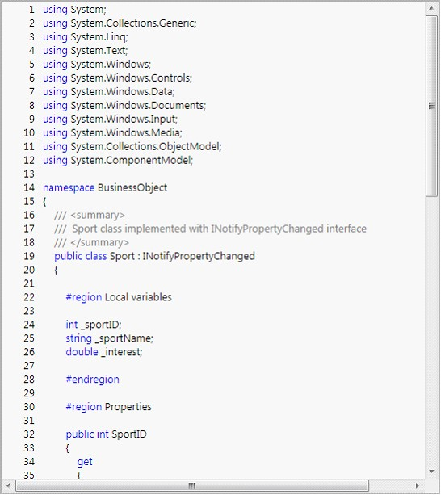{border="0"}

Figure 31: EnableOutlining Is Set to False.

*[]{style="FONT-FAMILY: 'Calibri','sans-serif'"}* 

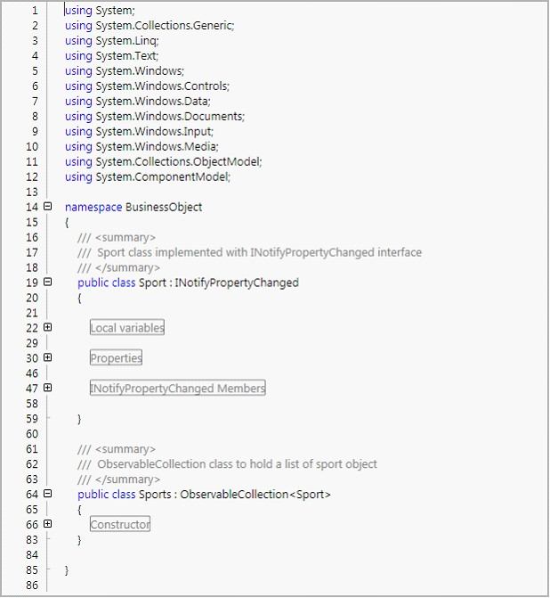{border="0"}

Figure 32: EnableOutlining Set To True and Some of the Blocks Collapsed[]{style="FONT-STYLE: normal"}

***[]{style="FONT-FAMILY: 'Trebuchet MS','sans-serif'; COLOR: #15428b; FONT-SIZE: 9pt"}*** 

***[]{style="FONT-FAMILY: 'Trebuchet MS','sans-serif'; COLOR: #15428b; FONT-SIZE: 9pt"}*** 

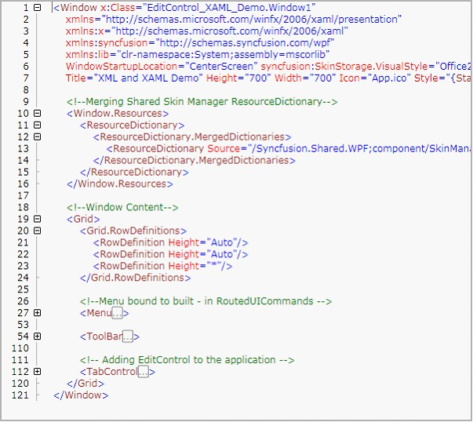{border="0"}

Figure 33: Expand-Collapse in XAML[]{style="FONT-STYLE: normal"}

***[]{style="FONT-FAMILY: 'Trebuchet MS','sans-serif'; COLOR: #15428b; FONT-SIZE: 9pt"}*** 

ToolTip and Selection Support

EditControl is enhanced with ToolTip displaying the collapsed lines of text when mouse is hovered on a collapsed region or ellipses. It also enables the users to select the entire collapsed area by clicking on collapsed region or ellipses.

[]{style="FONT-FAMILY: 'Trebuchet MS','sans-serif'; COLOR: #15428b; FONT-SIZE: 9pt"} 

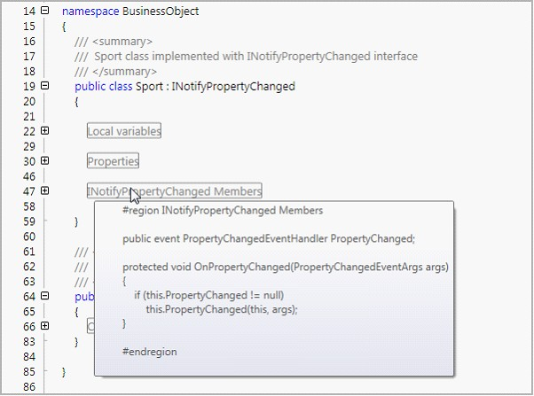{border="0"}

Figure 34: Tooltip is Displayed When Mouse is Hovered on a Collapsed Region.

*[]{style="FONT-FAMILY: 'Calibri','sans-serif'"}* 

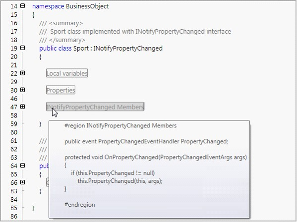{border="0"}

Figure 35: Selecting Collapsed Text by Clicking on the Collapsed Region.[]{style="FONT-STYLE: normal"}

*[]{style="FONT-FAMILY: 'Calibri','sans-serif'"}* 

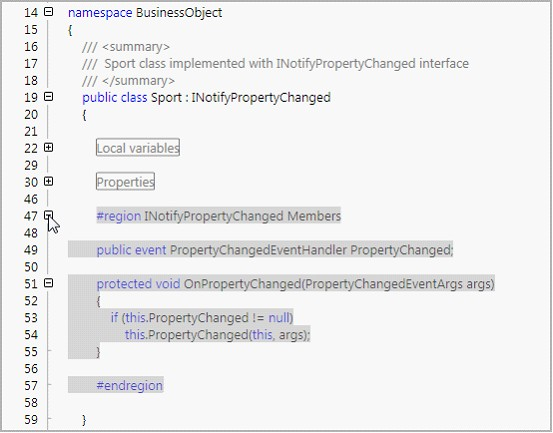{border="0"}

Figure 36: Displays the Text Selection after the Selected Block was Expanded[]{style="FONT-STYLE: normal"}

***[]{style="FONT-FAMILY: 'Trebuchet MS','sans-serif'; COLOR: #15428b; FONT-SIZE: 9pt"}*** 

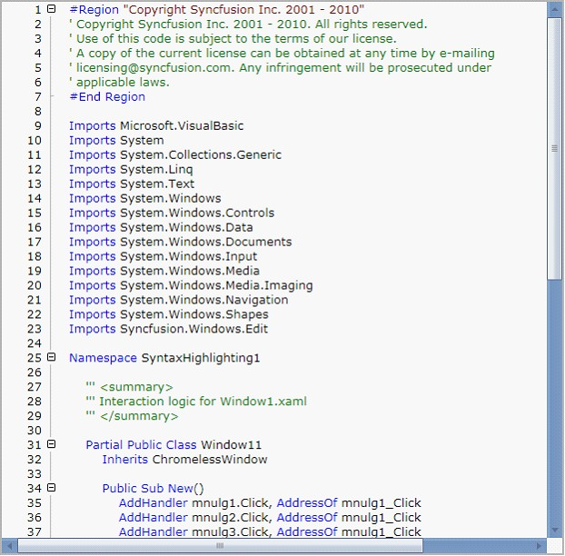{border="0"}

Figure 37: EditControl with DocumentLanguage as VisualBasic[]{style="FONT-STYLE: normal"}

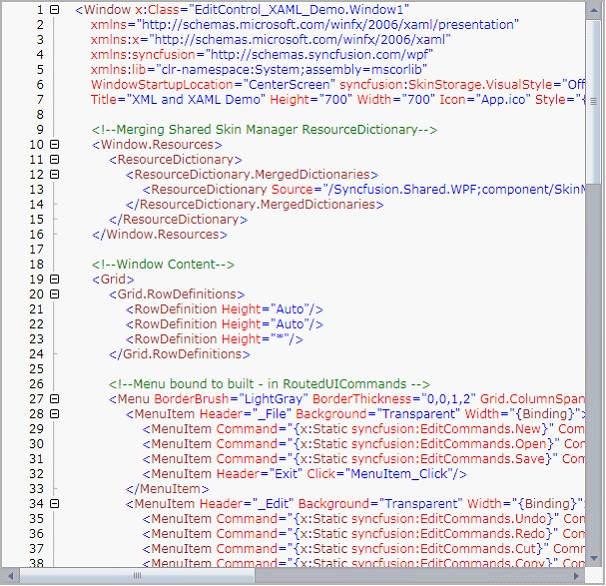{border="0"}

Figure 38: EditControl with DocumentLanguage as XAML[]{style="FONT-STYLE: normal"}

***[]{style="FONT-FAMILY: 'Trebuchet MS','sans-serif'; COLOR: #15428b; FONT-SIZE: 9pt"}*** 

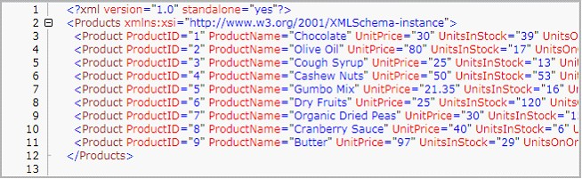{border="0"}

Figure 39: EditControl with DocumentLanguage as XML[]{style="FONT-STYLE: normal"}

***[]{style="FONT-FAMILY: 'Trebuchet MS','sans-serif'; COLOR: #15428b; FONT-SIZE: 9pt"}*** 

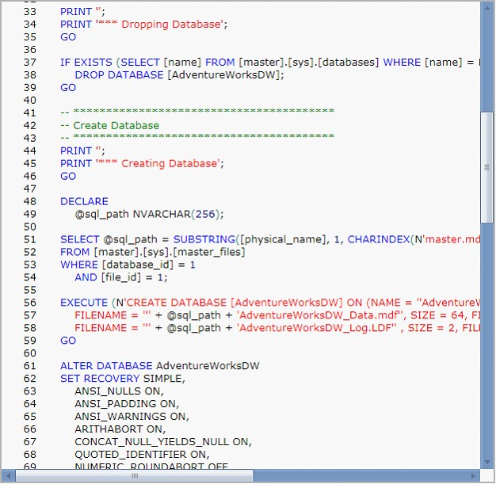{border="0"}

Figure 40: EditControl with DocumentLanguage as SQL

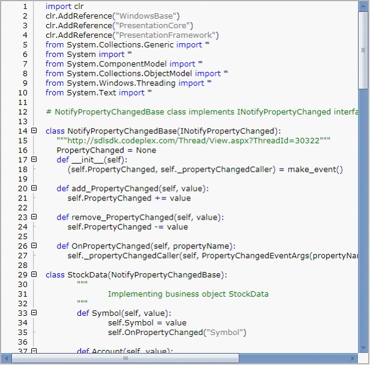{border="0"}

Figure 41: : EditControl with DocumentLanguage as Custom with custom language for IronPython[]{style="FONT-STYLE: normal"}

***[]{style="FONT-FAMILY: 'Trebuchet MS','sans-serif'; COLOR: #15428b; FONT-SIZE: 9pt"}*** 

Text Outlining

Essential Edit enables the users to expand or collapse regions or blocks of content by using the \"+\" and \"-\" in the Edit Control respectively. It also enables the user to collapse or expand all the blocks or regions in the Edit Control content. Expand all or collapse all operations can be performed by using the **Outlining** menu item in the context menu of the Edit Control. It also enables the users to perform expand all or collapse all operations by using external controls by using the built in **RoutedUICommands**.

[]{style="FONT-FAMILY: 'Trebuchet MS','sans-serif'; COLOR: #15428b; FONT-SIZE: 9pt"} 

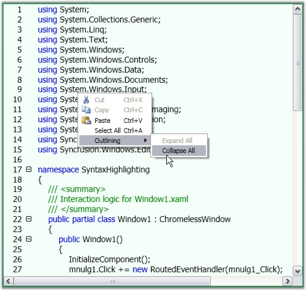{border="0"}

Figure 42: : \"Collapse All\" operation selected from the Context Menu

[]{style="FONT-FAMILY: 'Trebuchet MS','sans-serif'; COLOR: #15428b; FONT-SIZE: 9pt"} 

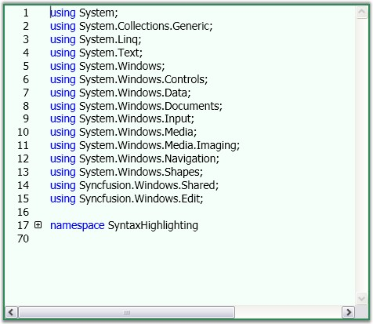{border="0"}

Figure 43: EditControl with Collapsed Blocks of Content

 

[]{#p30} 

 

[]{#related-topics}
::::
