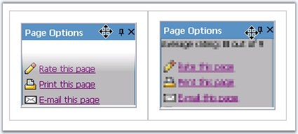

::: {style="DISPLAY: none"}
{#d2h_url_template}{#d2h_package_url style="WIDTH: 0px; DISPLAY: none; HEIGHT: 0px"}
:::

:::::: {.d2h_secondary_topic style="PADDING-BOTTOM: 10pt; MARGIN: 0pt; PADDING-LEFT: 0pt; PADDING-RIGHT: 0pt; PADDING-TOP: 0pt"}
##### Expand/Collapse Transition Settings {#expandcollapse-transition-settings style="tab-stops: 0pt"}

 

[]{style="FONT-FAMILY: 'Trebuchet MS','sans-serif'; COLOR: #15428b; FONT-SIZE: 9pt"} 

Transition and slide effects can be applied to enhance and provide a rich interface for the snap elements on expand and collapse.

The transition effects can be set for expand and collapse action of a parent item. These effects can be applied just by setting the **ExpandTransition** and **CollapseTransition** to one of the effects.

[]{style="FONT-FAMILY: 'Trebuchet MS','sans-serif'; COLOR: #15428b; FONT-SIZE: 9pt"} 

::: {align="center"}
+-----------------------------------+------------------------------------------------------------------------------------------+
| Property                          | Description                                                                              |
+-----------------------------------+------------------------------------------------------------------------------------------+
| ExpandTransition                  | Specifies the visual effect used for snap expand. The options included are as follows:   |
|                                   |                                                                                          |
|                                   | [·      ]{style="FONT-FAMILY: Symbol"}None                                               |
|                                   |                                                                                          |
|                                   | [·      ]{style="FONT-FAMILY: Symbol"}Fade                                               |
|                                   |                                                                                          |
|                                   | [·      ]{style="FONT-FAMILY: Symbol"}Dissolve                                           |
|                                   |                                                                                          |
|                                   | [·      ]{style="FONT-FAMILY: Symbol"}Pixelate                                           |
|                                   |                                                                                          |
|                                   | [·      ]{style="FONT-FAMILY: Symbol"}WipeDown                                           |
|                                   |                                                                                          |
|                                   | [·      ]{style="FONT-FAMILY: Symbol"}WipeLeft                                           |
|                                   |                                                                                          |
|                                   | [·      ]{style="FONT-FAMILY: Symbol"}WipeRight                                          |
|                                   |                                                                                          |
|                                   | [·      ]{style="FONT-FAMILY: Symbol"}WipeUp                                             |
+-----------------------------------+------------------------------------------------------------------------------------------+
| CollapseTransition                | Specifies the visual effect used for snap collapse. The options included are as follows: |
|                                   |                                                                                          |
|                                   | [·      ]{style="FONT-FAMILY: Symbol"}None                                               |
|                                   |                                                                                          |
|                                   | [·      ]{style="FONT-FAMILY: Symbol"}Fade                                               |
|                                   |                                                                                          |
|                                   | [·      ]{style="FONT-FAMILY: Symbol"}Dissolve                                           |
|                                   |                                                                                          |
|                                   | [·      ]{style="FONT-FAMILY: Symbol"}Pixelate                                           |
|                                   |                                                                                          |
|                                   | [·      ]{style="FONT-FAMILY: Symbol"}WipeDown                                           |
|                                   |                                                                                          |
|                                   | [·      ]{style="FONT-FAMILY: Symbol"}WipeLeft                                           |
|                                   |                                                                                          |
|                                   | [·      ]{style="FONT-FAMILY: Symbol"}WipeRight                                          |
|                                   |                                                                                          |
|                                   | [·      ]{style="FONT-FAMILY: Symbol"}WipeUp                                             |
+-----------------------------------+------------------------------------------------------------------------------------------+
:::

*[]{style="FONT-FAMILY: 'Trebuchet MS','sans-serif'; COLOR: black; FONT-SIZE: 9pt"}* 

{border="0"}

**[]{style="FONT-FAMILY: 'Trebuchet MS','sans-serif'; COLOR: #15428b; FONT-SIZE: 9pt"}** 

Figure 381: Expand Transition set to WipeUp and Collapse Transition set to Fade

[]{style="FONT-FAMILY: 'Trebuchet MS','sans-serif'; COLOR: #15428b; FONT-SIZE: 9pt"} 

The visual effect can be enhanced for expand and collapse animation by setting the **ExpandType** and **CollapseType** properties respectively.

[]{style="FONT-FAMILY: 'Trebuchet MS','sans-serif'; COLOR: #15428b; FONT-SIZE: 9pt"} 

::: {align="center"}
+-----------------------------------+------------------------------------------------------------------------------------------------+
| Property                          | Description                                                                                    |
+-----------------------------------+------------------------------------------------------------------------------------------------+
| ExpandType                        | Specifies the type of slide effect used on snap expand. The options included are as follows:   |
|                                   |                                                                                                |
|                                   | [·      ]{style="FONT-FAMILY: Symbol"}None                                                     |
|                                   |                                                                                                |
|                                   | [·      ]{style="FONT-FAMILY: Symbol"}Accelerate                                               |
|                                   |                                                                                                |
|                                   | [·      ]{style="FONT-FAMILY: Symbol"}Constant                                                 |
|                                   |                                                                                                |
|                                   | [·      ]{style="FONT-FAMILY: Symbol"}Decelerate                                               |
+-----------------------------------+------------------------------------------------------------------------------------------------+
| CollapseType                      | Specifies the type of slide effect used on snap collapse. The options included are as follows: |
|                                   |                                                                                                |
|                                   | [·      ]{style="FONT-FAMILY: Symbol"}None                                                     |
|                                   |                                                                                                |
|                                   | [·      ]{style="FONT-FAMILY: Symbol"}Accelerate                                               |
|                                   |                                                                                                |
|                                   | [·      ]{style="FONT-FAMILY: Symbol"}Constant                                                 |
|                                   |                                                                                                |
|                                   | [·      ]{style="FONT-FAMILY: Symbol"}Decelerate                                               |
+-----------------------------------+------------------------------------------------------------------------------------------------+
:::

*[]{style="COLOR: black; FONT-SIZE: 8pt"}* 

Duration can be set for the expand and collapse action using the **ExpandDuration** and **CollapseDuration** properties.

[]{style="FONT-FAMILY: 'Trebuchet MS','sans-serif'; COLOR: #15428b; FONT-SIZE: 9pt"} 

::: {align="center"}
  ------------------ ----------------------------------------------------------------------------------
  Property           Description
  CollapseDuration   Specifies the time span of collapse effect, in milliseconds.
  ExpandDuration     Specifies the time span of expand effect, in milliseconds. Default value is 100.
  ------------------ ----------------------------------------------------------------------------------
:::

[]{style="FONT-FAMILY: 'Trebuchet MS','sans-serif'; COLOR: #15428b; FONT-SIZE: 9pt"} 

The html view of the properties settings and the code snippets are show below.

[]{style="FONT-FAMILY: 'Trebuchet MS','sans-serif'; COLOR: #15428b; FONT-SIZE: 9pt"} 

+-----------------------------------------------------------------------------------------------------------------------------------------------------------------------------------------------------------------------------------------------------------------------------------------------------------------------------------------------------------------------------------------------------------------------------------------------------------------------------------------------------------------------------------------------------------------------------------------------------------------------------------------------------------------------------------------------------------------------------------------------------------------------------------------------------------------------------------------------------------------------------------------------------------------------------------------------------------------------------------------------------------------------+
| **[\[aspx\]]{style="FONT-FAMILY: 'Courier New'"}**                                                                                                                                                                                                                                                                                                                                                                                                                                                                                                                                                                                                                                                                                                                                                                                                                                                                                                                                                                    |
|                                                                                                                                                                                                                                                                                                                                                                                                                                                                                                                                                                                                                                                                                                                                                                                                                                                                                                                                                                                                                       |
| []{style="FONT-FAMILY: 'Courier New'; COLOR: blue"}                                                                                                                                                                                                                                                                                                                                                                                                                                                                                                                                                                                                                                                                                                                                                                                                                                                                                                                                                                   |
|                                                                                                                                                                                                                                                                                                                                                                                                                                                                                                                                                                                                                                                                                                                                                                                                                                                                                                                                                                                                                       |
| [\<]{style="FONT-FAMILY: 'Courier New'; COLOR: blue"}[cc1]{style="FONT-FAMILY: 'Courier New'; COLOR: maroon"}[:]{style="FONT-FAMILY: 'Courier New'; COLOR: blue"}[Snap]{style="FONT-FAMILY: 'Courier New'; COLOR: maroon"}[ [ID]{style="COLOR: red"}[=\"Snap1\"]{style="COLOR: blue"} [runat]{style="COLOR: red"}[=\"server\"]{style="COLOR: blue"} [IsCollapsed]{style="COLOR: red"}[=\"true\"]{style="COLOR: blue"} **[ExpandCollapseElementIDs]{style="COLOR: red"}**[=\"header\"]{style="COLOR: blue"} **[ExpandTransition]{style="COLOR: red"}**[=\"WipeUp\"]{style="COLOR: blue"} **[ExpandDuration]{style="COLOR: red"}**[=\"10\"]{style="COLOR: blue"} **[ExpandType]{style="COLOR: red"}**[=\"Constant\"]{style="COLOR: blue"} **[CollapseTransition]{style="COLOR: red"}**[=\"Pixelate\"]{style="COLOR: blue"} **[CollapseDuration]{style="COLOR: red"}**[=\"10\"]{style="COLOR: blue"} **[CollapseType]{style="COLOR: red"}**[=\"Accelerate\"\>]{style="COLOR: blue"}]{style="FONT-FAMILY: 'Courier New'"} |
|                                                                                                                                                                                                                                                                                                                                                                                                                                                                                                                                                                                                                                                                                                                                                                                                                                                                                                                                                                                                                       |
| [\.....]{style="FONT-FAMILY: 'Courier New'; COLOR: blue"}                                                                                                                                                                                                                                                                                                                                                                                                                                                                                                                                                                                                                                                                                                                                                                                                                                                                                                                                                             |
|                                                                                                                                                                                                                                                                                                                                                                                                                                                                                                                                                                                                                                                                                                                                                                                                                                                                                                                                                                                                                       |
| [\</]{style="FONT-FAMILY: 'Courier New'; COLOR: blue"}[cc1]{style="FONT-FAMILY: 'Courier New'; COLOR: maroon"}[:]{style="FONT-FAMILY: 'Courier New'; COLOR: blue"}[snap]{style="FONT-FAMILY: 'Courier New'; COLOR: maroon"}[\>]{style="FONT-FAMILY: 'Courier New'; COLOR: blue"}                                                                                                                                                                                                                                                                                                                                                                                                                                                                                                                                                                                                                                                                                                                                      |
+-----------------------------------------------------------------------------------------------------------------------------------------------------------------------------------------------------------------------------------------------------------------------------------------------------------------------------------------------------------------------------------------------------------------------------------------------------------------------------------------------------------------------------------------------------------------------------------------------------------------------------------------------------------------------------------------------------------------------------------------------------------------------------------------------------------------------------------------------------------------------------------------------------------------------------------------------------------------------------------------------------------------------+

[]{style="FONT-FAMILY: 'Trebuchet MS','sans-serif'; COLOR: black"} 

+------------------------------------------------------------------------------------------------------------------------------------------------------------------------+
| **[\[C#\]]{style="FONT-FAMILY: 'Courier New'"}**                                                                                                                       |
|                                                                                                                                                                        |
| **[]{style="FONT-FAMILY: 'Courier New'"}**                                                                                                                             |
|                                                                                                                                                                        |
| [this]{style="FONT-FAMILY: 'Courier New'; COLOR: blue"}[.Snap1.ExpandDuration = 1000;]{style="FONT-FAMILY: 'Courier New'"}                                             |
|                                                                                                                                                                        |
| [this]{style="FONT-FAMILY: 'Courier New'; COLOR: blue"}[.Snap1.ExpandTransition = [TransitionFilter]{style="COLOR: teal"}.WipeUp;]{style="FONT-FAMILY: 'Courier New'"} |
|                                                                                                                                                                        |
| [this]{style="FONT-FAMILY: 'Courier New'; COLOR: blue"}[.Snap1.ExpandType = [PanelSlideType]{style="COLOR: teal"}.Constant;]{style="FONT-FAMILY: 'Courier New'"}       |
|                                                                                                                                                                        |
| []{style="FONT-FAMILY: 'Courier New'"}                                                                                                                                 |
|                                                                                                                                                                        |
| [this]{style="FONT-FAMILY: 'Courier New'; COLOR: blue"}[.Snap1.CollapseDuration = 1000;]{style="FONT-FAMILY: 'Courier New'"}                                           |
|                                                                                                                                                                        |
| [this]{style="FONT-FAMILY: 'Courier New'; COLOR: blue"}[.Snap1.CollapseTransition = [TransitionFilter]{style="COLOR: teal"}.Fade;]{style="FONT-FAMILY: 'Courier New'"} |
|                                                                                                                                                                        |
| [this]{style="FONT-FAMILY: 'Courier New'; COLOR: blue"}[.Snap1.CollapseType = [PanelSlideType]{style="COLOR: teal"}.Accelerate;]{style="FONT-FAMILY: 'Courier New'"}   |
+------------------------------------------------------------------------------------------------------------------------------------------------------------------------+

[]{style="FONT-FAMILY: 'Trebuchet MS','sans-serif'; COLOR: #15428b; FONT-SIZE: 9pt"} 

+-----------------------------------------------------------------------------------------------------------------------------------------------------------------------------+
| **[\[VB\]]{style="FONT-FAMILY: 'Courier New'"}**                                                                                                                            |
|                                                                                                                                                                             |
| **[]{style="FONT-FAMILY: 'Courier New'"}**                                                                                                                                  |
|                                                                                                                                                                             |
| [Private]{style="FONT-FAMILY: 'Courier New'; COLOR: blue"}[ [Me]{style="COLOR: blue"}.Snap1.ExpandDuration = 1000]{style="FONT-FAMILY: 'Courier New'"}                      |
|                                                                                                                                                                             |
| [Private]{style="FONT-FAMILY: 'Courier New'; COLOR: blue"}[ [Me]{style="COLOR: blue"}.Snap1.ExpandTransition = TransitionFilter.WipeUp]{style="FONT-FAMILY: 'Courier New'"} |
|                                                                                                                                                                             |
| [Private]{style="FONT-FAMILY: 'Courier New'; COLOR: blue"}[ [Me]{style="COLOR: blue"}.Snap1.ExpandType = PanelSlideType.Constant]{style="FONT-FAMILY: 'Courier New'"}       |
|                                                                                                                                                                             |
| []{style="FONT-FAMILY: 'Courier New'"}                                                                                                                                      |
|                                                                                                                                                                             |
| [Private]{style="FONT-FAMILY: 'Courier New'; COLOR: blue"}[ [Me]{style="COLOR: blue"}.Snap1.CollapseDuration = 1000]{style="FONT-FAMILY: 'Courier New'"}                    |
|                                                                                                                                                                             |
| [Private]{style="FONT-FAMILY: 'Courier New'; COLOR: blue"}[ [Me]{style="COLOR: blue"}.Snap1.CollapseTransition = TransitionFilter.Fade]{style="FONT-FAMILY: 'Courier New'"} |
|                                                                                                                                                                             |
| [Private]{style="FONT-FAMILY: 'Courier New'; COLOR: blue"}[ [Me]{style="COLOR: blue"}.Snap1.CollapseType = PanelSlideType.Accelerate]{style="FONT-FAMILY: 'Courier New'"}   |
+-----------------------------------------------------------------------------------------------------------------------------------------------------------------------------+

[]{style="FONT-FAMILY: 'Trebuchet MS','sans-serif'; COLOR: #15428b; FONT-SIZE: 9pt"} 

See Also

[]{style="FONT-FAMILY: 'Trebuchet MS','sans-serif'; COLOR: #15428b; FONT-SIZE: 9pt"} 

[Expand/Collapse Settings]{.UGHyperlink}[]{.UGHyperlink}

[]{#related-topics}
::::::
