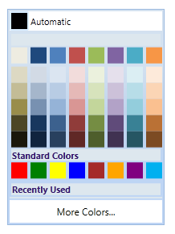

::: {style="DISPLAY: none"}
{#d2h_url_template}{#d2h_package_url style="WIDTH: 0px; DISPLAY: none; HEIGHT: 0px"}
:::

:::: {.d2h_secondary_topic style="PADDING-BOTTOM: 10pt; MARGIN: 0pt; PADDING-LEFT: 0pt; PADDING-RIGHT: 0pt; PADDING-TOP: 0pt"}
#### Expanded Mode {#expanded-mode style="tab-stops: 0pt"}

Expanded Mode allows you to pick colors from the ColorPickerPalette. By setting IsExpanded Property to True, the ColorPickerPalette control can be hosted in Expanded Mode. By default, this mode is set to False.

 

Use Case Scenarios

Expanded Mode can be used when you want to have the ColorPickerPalette without drop down.

[]{style="FONT-FAMILY: 'Trebuchet MS','sans-serif'; COLOR: #15428b; FONT-SIZE: 9pt"} 

Adding Expanded Mode to an Application

Expanded Mode can be added to an application by using XAML or C# code.

 

The following code example illustrates how to add the Expanded Mode to an application.

 

+-------------------------------------------------------------------------------------------------------------------------------------------------------------------------------------------------------------------------------------------------------------------------------------------------------------------------------------------------------------------------+
| **[\[XAML\]]{style="FONT-FAMILY: 'Courier New'"}**                                                                                                                                                                                                                                                                                                                      |
|                                                                                                                                                                                                                                                                                                                                                                         |
| **[]{style="FONT-FAMILY: 'Courier New'"}**                                                                                                                                                                                                                                                                                                                              |
|                                                                                                                                                                                                                                                                                                                                                                         |
| [\<]{style="FONT-FAMILY: 'Courier New'; COLOR: blue"}[sync]{style="FONT-FAMILY: 'Courier New'; COLOR: #a31515"}[:]{style="FONT-FAMILY: 'Courier New'; COLOR: blue"}[ColorPickerPalette]{style="FONT-FAMILY: 'Courier New'; COLOR: #a31515"}[ IsExpanded]{style="FONT-FAMILY: 'Courier New'; COLOR: red"}[=\"True\"/\>]{style="FONT-FAMILY: 'Courier New'; COLOR: blue"} |
|                                                                                                                                                                                                                                                                                                                                                                         |
| []{style="FONT-FAMILY: 'Courier New'"}                                                                                                                                                                                                                                                                                                                                  |
+-------------------------------------------------------------------------------------------------------------------------------------------------------------------------------------------------------------------------------------------------------------------------------------------------------------------------------------------------------------------------+

 

+-----------------------------------------------------------------------------------------------------------------------------------------------------------------------------------+
| **[\[C#\]]{style="FONT-FAMILY: 'Courier New'"}**                                                                                                                                  |
|                                                                                                                                                                                   |
| **[]{style="FONT-FAMILY: 'Courier New'"}**                                                                                                                                        |
|                                                                                                                                                                                   |
| [      [ColorPickerPalette]{style="COLOR: #2b91af"} colorpicker = [new]{style="COLOR: blue"} [ColorPickerPalette]{style="COLOR: #2b91af"}();]{style="FONT-FAMILY: 'Courier New'"} |
|                                                                                                                                                                                   |
| [      ]{style="FONT-FAMILY: 'Courier New'; COLOR: #2b91af"}[colorpicker.IsExpanded = true;]{style="FONT-FAMILY: 'Courier New'"}                                                  |
|                                                                                                                                                                                   |
| [      ]{style="FONT-FAMILY: 'Courier New'"}                                                                                                                                      |
+-----------------------------------------------------------------------------------------------------------------------------------------------------------------------------------+

 

{border="0"}

Figure 200: ColorPickerPalette with IsExpanded is set to True

 

Properties

Table 21: IsExpanded Property Table

::: {align="center"}
  ------------ ---------------------------------------------------------------------- -------------------- ----------- -----------------
  Property     Description                                                            Type                 Data Type   Reference links
  IsExpanded   Enables or disables the Expanded Mode property of ColorPickerPalette   DependencyProperty   False       
  ------------ ---------------------------------------------------------------------- -------------------- ----------- -----------------
:::

**[]{style="FONT-FAMILY: 'Trebuchet MS','sans-serif'; COLOR: #15428b; FONT-SIZE: 9pt"}** 

Sample Link

To view samples:

1.   Select Start -\> Programs -\> Syncfusion -\> Essential Studio x.x.xx -\> Dashboard.

2.   Select Run Locally Installed Samples in WPF Button.

3.   Now expand the DragAndDropManagerDemo tree-view item in the Sample Browser.

4.   Choose any one of the samples listed under it to launch.

[]{style="FONT-FAMILY: 'Trebuchet MS','sans-serif'; COLOR: #15428b; FONT-SIZE: 9pt"} 

[]{#related-topics}
::::
