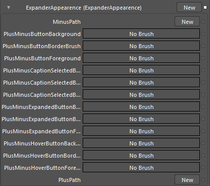

::: {style="DISPLAY: none"}
{#d2h_url_template}{#d2h_package_url style="WIDTH: 0px; DISPLAY: none; HEIGHT: 0px"}
:::

::: {.d2h_secondary_topic style="PADDING-BOTTOM: 10pt; MARGIN: 0pt; PADDING-LEFT: 0pt; PADDING-RIGHT: 0pt; PADDING-TOP: 0pt"}
##### Expander Appearance {#expander-appearance style="tab-stops: 0pt"}

In Expander Appearance group, properties are required to customize expand and collapse button. The following screenshot shows the properties defined in this group.

 

{border="0"}

Figure 169: Expander Appearance Properties

In Group Appearance, properties required to customize the Group Area will be defined. The following screen shot shows the properties defined in this group.

 

{border="0"}

Figure 170: Group Area Appearance Properties

[]{#related-topics}
:::
