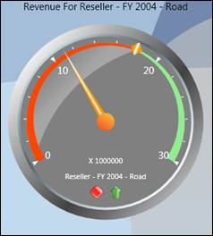
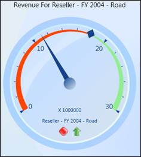
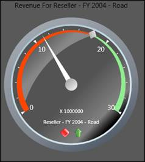
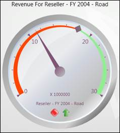
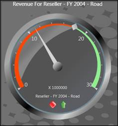
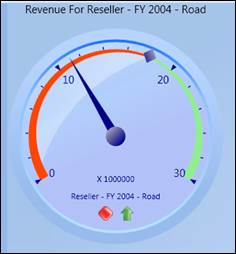
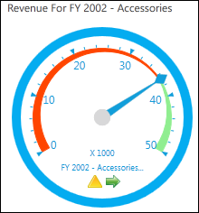
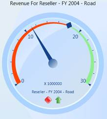

::: {style="DISPLAY: none"}
{#d2h_url_template} {#d2h_package_url style="WIDTH: 0px; DISPLAY: none; HEIGHT: 0px"}
:::

::::: {#nsbanner .d2h_main_nsbanner style="BORDER-BOTTOM: #999999 1px solid; POSITION: relative; PADDING-BOTTOM: 0px; BACKGROUND-COLOR: transparent; PADDING-LEFT: 0px; PADDING-RIGHT: 0px; DISPLAY: none; BORDER-TOP: #999999 1px solid; PADDING-TOP: 0px; LEFT: 0px"}
:::: {#TitleRow .d2h_main_titlerow style="PADDING-BOTTOM: 4px; BACKGROUND-COLOR: transparent; PADDING-LEFT: 22px; WIDTH: 100%; PADDING-RIGHT: 10px; DISPLAY: none; PADDING-TOP: 4px"}
::: {#ienav .d2h_main_ienav style="DISPLAY: none"}
{#D2HPrevious .D2HPreviousEnabled}  {#D2HNext .D2HNextEnabled}
:::
::::
:::::

:::: {#nstext .d2h_main_nstext style="PADDING-BOTTOM: 10px; BACKGROUND-COLOR: transparent; PADDING-LEFT: 22px; PADDING-RIGHT: 10px; HEIGHT: 100%; OVERFLOW: auto; PADDING-TOP: 5px" hasuserbackground="true" valign="bottom"}
::: {#d2h_breadcrumbs .d2h_breadcrumbs}
[Essential Studio User Guide Documentation](ms-xhelp:///?Id=12457748-09e3-4d74-a240-8e049cedf030){.d2h_breadcrumbsNormal} [ \> ]{.d2h_breadcrumbsLinkSeparator} [Business Intelligence Edition](ms-xhelp:///?Id=fdf33dd8-62b2-47b9-ad7b-fc50e590bca5){.d2h_breadcrumbsNormal} [ \> ]{.d2h_breadcrumbsLinkSeparator} [Essential BI WPF](ms-xhelp:///?Id=41e3d586-d922-4a01-8272-679fe4ae7343){.d2h_breadcrumbsNormal} [ \> ]{.d2h_breadcrumbsLinkSeparator} [Essential BI Gauge]{.d2h_breadcrumbsContentsOnly} [ \> ]{.d2h_breadcrumbsLinkSeparator} [Concepts and Features](ms-xhelp:///?Id=b21891c2-ee4b-41e6-a92d-29a3ab4cd8c5){.d2h_breadcrumbsNormal} [ \> ]{.d2h_breadcrumbsLinkSeparator} [Appearance](ms-xhelp:///?Id=d242b2cf-659c-4d79-bb1c-67165b8468d1){.d2h_breadcrumbsNormal}
:::

### Explain the skin types that are available for Gauge control. {#explain-the-skin-types-that-are-available-for-gauge-control. style="tab-stops: 0pt"}

The OLAP Gauge control allows you to present your data using different built-in-skins. These skins allow you to theme and style the look and feel of the control in various rich color schemes. You can use *Skin Manager* Framework to apply a wide range of skins to the *Essential OLAP Gauge*. These skins have been designed to suit the needs of a wide range of audience. The following are the types of skins available:

[]{style="FONT-FAMILY: 'Trebuchet MS','sans-serif'; COLOR: #15428b; FONT-SIZE: 9pt"} 

[·      ]{style="FONT-FAMILY: Symbol"} ***Default*** -The visual style of this skin depends upon the operating System used.

[·      ]{style="FONT-FAMILY: Symbol"} ***Office2007Blue*** -This skin is similar to the Microsoft Office2007Blue skin.

[·      ]{style="FONT-FAMILY: Symbol"} ***Office2007Black*** -This skin is similar to the Microsoft Office2007Black skin.

[·      ]{style="FONT-FAMILY: Symbol"} ***Office2007Silver*** -This skin is similar to the Microsoft Office2007Silver skin.

[·      ]{style="FONT-FAMILY: Symbol"} ***Office2003Blue*** -This skin is similar to the Microsoft Office2003 skin.

[·      ]{style="FONT-FAMILY: Symbol"} ***Blend*** -This skin is similar to the Microsoft Blend skin.

[·      ]{style="FONT-FAMILY: Symbol"} ***Metro*** -This skin is similar to the Windows 8 Metro Style.

 

 

{border="0"}

Figure 22: Default Theme

 

{border="0"}

Figure 23: Office2007Blue Theme

 

 

{border="0"}

Figure 24: Office2007Black Theme

 

{border="0"}

Figure 25: Office2007Silver Theme

 

{border="0"}

Figure 26: Blend Theme

 

{border="0"}

Figure 27: Office2003Blue Theme

{border="0"}

Figure 28: Metro Theme

 

 

Applying Skins

The various skin themes available can be applied to the control using the *SkinStorage.VisualStyle* property.

To set the visual style for the controls, use the code given below.

[]{style="FONT-FAMILY: 'Trebuchet MS','sans-serif'; COLOR: #15428b; FONT-SIZE: 9pt"} 

+-------------------------------------------------------------------------------------------------------------------------------------------------------------------------------------------------------------------------------------------------------------------------------------------------------------------------------------------------------------------------------------------------------------------------------------------------------------------------------------------------------------------------------------------------------------------------------------------------------------------------------------------------------------------------------------------------------------------------------------------------------------------------------------------------------+
| [\[XAML\]]{style="FONT-FAMILY: 'Courier New'"}                                                                                                                                                                                                                                                                                                                                                                                                                                                                                                                                                                                                                                                                                                                                                        |
|                                                                                                                                                                                                                                                                                                                                                                                                                                                                                                                                                                                                                                                                                                                                                                                                       |
| []{style="FONT-FAMILY: 'Courier New'"}                                                                                                                                                                                                                                                                                                                                                                                                                                                                                                                                                                                                                                                                                                                                                                |
|                                                                                                                                                                                                                                                                                                                                                                                                                                                                                                                                                                                                                                                                                                                                                                                                       |
| [\<!---To set Office2007Blue ]{style="FONT-FAMILY: 'Courier New'; COLOR: green"} [visual]{style="FONT-FAMILY: 'Courier New'; COLOR: #006c00"} [ style for OLAP Gauge\--\>]{style="FONT-FAMILY: 'Courier New'; COLOR: green"} []{style="FONT-FAMILY: 'Courier New'"}                                                                                                                                                                                                                                                                                                                                                                                                                                                                                                                                   |
|                                                                                                                                                                                                                                                                                                                                                                                                                                                                                                                                                                                                                                                                                                                                                                                                       |
| [\<]{style="FONT-FAMILY: 'Courier New'; COLOR: blue"} [gauge]{style="FONT-FAMILY: 'Courier New'; COLOR: #a31515"} [:]{style="FONT-FAMILY: 'Courier New'; COLOR: blue"} [OlapGauge]{style="FONT-FAMILY: 'Courier New'; COLOR: #a31515"} [ Name]{style="FONT-FAMILY: 'Courier New'; COLOR: red"} [=\"olapGauge1\"]{style="FONT-FAMILY: 'Courier New'; COLOR: blue"} [ Radius]{style="FONT-FAMILY: 'Courier New'; COLOR: red"} [=\"120\"]{style="FONT-FAMILY: 'Courier New'; COLOR: blue"} [ syncfusion]{style="FONT-FAMILY: 'Courier New'; COLOR: red"} [:]{style="FONT-FAMILY: 'Courier New'; COLOR: blue"} [SkinStorage.VisualStyle]{style="FONT-FAMILY: 'Courier New'; COLOR: red"} [=\"Office2007Blue\"/\>]{style="FONT-FAMILY: 'Courier New'; COLOR: blue"} []{style="FONT-FAMILY: 'Courier New'"} |
+-------------------------------------------------------------------------------------------------------------------------------------------------------------------------------------------------------------------------------------------------------------------------------------------------------------------------------------------------------------------------------------------------------------------------------------------------------------------------------------------------------------------------------------------------------------------------------------------------------------------------------------------------------------------------------------------------------------------------------------------------------------------------------------------------------+

 

+---------------------------------------------------------------------------------------------------------------------------------------------------------------------------------------------------------------------------+
| [\[C#\]]{style="FONT-FAMILY: 'Courier New'"}                                                                                                                                                                              |
|                                                                                                                                                                                                                           |
| []{style="FONT-FAMILY: 'Courier New'"}                                                                                                                                                                                    |
|                                                                                                                                                                                                                           |
| [//To set Office2007Blue visual style for Olap Gauge]{style="FONT-FAMILY: 'Courier New'; COLOR: green"}                                                                                                                   |
|                                                                                                                                                                                                                           |
| [SkinStorage]{style="FONT-FAMILY: 'Courier New'; COLOR: #2b91af"} [.SetVisualStyle(olapGauge1, [\"Office2007Blue\"]{style="COLOR: #a31515"});]{style="FONT-FAMILY: 'Courier New'"} []{style="FONT-FAMILY: 'Courier New'"} |
+---------------------------------------------------------------------------------------------------------------------------------------------------------------------------------------------------------------------------+

 

+---------------------------------------------------------------------------------------------------------------------------------------------------------------------------------------------------------------------------+
| [\[VB\]]{style="FONT-FAMILY: 'Courier New'"}                                                                                                                                                                              |
|                                                                                                                                                                                                                           |
| []{style="FONT-FAMILY: 'Courier New'"}                                                                                                                                                                                    |
|                                                                                                                                                                                                                           |
| [\'To set Office2007Blue visual style for Olap Gauge]{style="FONT-FAMILY: 'Courier New'; COLOR: green"}                                                                                                                   |
|                                                                                                                                                                                                                           |
| [SkinStorage]{style="FONT-FAMILY: 'Courier New'; COLOR: #2b91af"} [.SetVisualStyle(olapGauge1, [\"Office2007Blue\"]{style="COLOR: #a31515"});]{style="FONT-FAMILY: 'Courier New'"} []{style="FONT-FAMILY: 'Courier New'"} |
+---------------------------------------------------------------------------------------------------------------------------------------------------------------------------------------------------------------------------+

 

Run the code. The following output is obtained.

[]{style="FONT-FAMILY: 'Trebuchet MS','sans-serif'; COLOR: #15428b; FONT-SIZE: 9pt"} 

{border="0"}

Figure 29: Office2007Blue Theme

Sample Location

**[]{style="FONT-FAMILY: 'Trebuchet MS','sans-serif'; COLOR: #15428b; FONT-SIZE: 9pt"}**  

A sample demo is available at the following location:

**..\\Syncfusion\\EssentialStudio\\\<Version Number\>\\BI\\WPF\\OlapGauge.WPF\\Samples\\Gauge Customization\\Customization Demo\\**

 

 

 

[]{#related-topics}
::::
