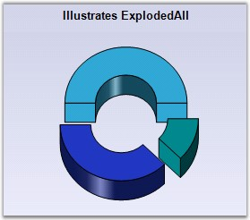

::: {style="DISPLAY: none"}
{#d2h_url_template}{#d2h_package_url style="WIDTH: 0px; DISPLAY: none; HEIGHT: 0px"}
:::

:::: {.d2h_secondary_topic style="PADDING-BOTTOM: 10pt; MARGIN: 0pt; PADDING-LEFT: 0pt; PADDING-RIGHT: 0pt; PADDING-TOP: 0pt"}
#### ExplodedAll {#explodedall style="tab-stops: 0pt"}

 

Indicates whether to explode all slice in the Pie or Doughnut chart.

 

::: {align="center"}
+------------------------------+---------------------------+
| Details                                                  |
+------------------------------+---------------------------+
| **Possible Values**          | True, False               |
+------------------------------+---------------------------+
| **Default Value    **        | **False**                 |
+------------------------------+---------------------------+
| **2D / 3D Limitations**      | No                        |
+------------------------------+---------------------------+
| **Applies to Chart Element** | All series                |
+------------------------------+---------------------------+
| **Applies to Chart Types**   | Pie Chart, Doughnut Chart |
+------------------------------+---------------------------+
:::

 

Here is some sample code.

 

+--------------------------------------------------------------------------------------------------------------------------------------------------------------------+
| **[\[C#\]]{style="FONT-FAMILY: 'Courier New'; COLOR: black"}**                                                                                                     |
|                                                                                                                                                                    |
| **[]{style="FONT-FAMILY: 'Courier New'; COLOR: black"}**                                                                                                           |
|                                                                                                                                                                    |
| [this]{style="FONT-FAMILY: 'Courier New'; COLOR: blue"}[.chartControl1.Series\[0\].ExplodedAll = [true]{style="COLOR: blue"};]{style="FONT-FAMILY: 'Courier New'"} |
+--------------------------------------------------------------------------------------------------------------------------------------------------------------------+

 

+---------------------------------------------------------------------------------------------------------------------------------------------------------------+
| **[\[VB.NET\]]{style="FONT-FAMILY: 'Courier New'; COLOR: black"}**                                                                                            |
|                                                                                                                                                               |
| **[]{style="FONT-FAMILY: 'Courier New'; COLOR: black"}**                                                                                                      |
|                                                                                                                                                               |
| [Me]{style="FONT-FAMILY: 'Courier New'; COLOR: blue"}[.chartControl1.Series(0).ExplodedAll =[ True]{style="COLOR: blue"}]{style="FONT-FAMILY: 'Courier New'"} |
+---------------------------------------------------------------------------------------------------------------------------------------------------------------+

 

{border="0"}

 

Figure 125: Exploded Pie Chart

**[]{style="FONT-SIZE: 8pt"}** 

See Also

[[]{style="TEXT-DECORATION: none"}]{.UGHyperlink} 

[Doughnut Chart]{.UGHyperlink}[,]{style="COLOR: blue"}[ ]{.UGHyperlink}[Pie Chart]{.UGHyperlink}[]{style="COLOR: black"}

[]{#p99} 

[]{#related-topics}
::::
