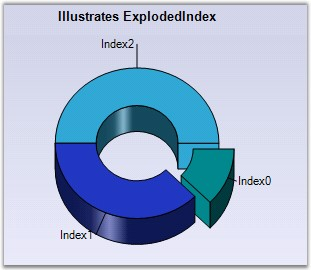

::: {style="DISPLAY: none"}
{#d2h_url_template}{#d2h_package_url style="WIDTH: 0px; DISPLAY: none; HEIGHT: 0px"}
:::

:::: {.d2h_secondary_topic style="PADDING-BOTTOM: 10pt; MARGIN: 0pt; PADDING-LEFT: 0pt; PADDING-RIGHT: 0pt; PADDING-TOP: 0pt"}
#### ExplodedIndex {#explodedindex style="tab-stops: 0pt"}

**[]{style="FONT-FAMILY: 'Trebuchet MS','sans-serif'; FONT-SIZE: 9pt"}** 

Gets / sets the Index point that is to be used when a point is to be exploded from the main display.

[]{style="FONT-FAMILY: 'Trebuchet MS','sans-serif'; FONT-SIZE: 9pt"} 

::: {align="center"}
+-------------------------------------+--------------------------------------------------------------+
|                                                                                                    |
|                                                                                                    |
| Details                                                                                            |
+-------------------------------------+--------------------------------------------------------------+
| Possible Values                     | An integer indicating the index of the slice to be exploded. |
+-------------------------------------+--------------------------------------------------------------+
| Default Value                       | -1                                                           |
+-------------------------------------+--------------------------------------------------------------+
| 2D / 3D Limitations                 | No                                                           |
+-------------------------------------+--------------------------------------------------------------+
| Applies to Chart Element            | All series                                                   |
+-------------------------------------+--------------------------------------------------------------+
| Applies to Chart Types              | Pie Chart, Doughnut Chart                                    |
+-------------------------------------+--------------------------------------------------------------+
:::

**[]{style="FONT-FAMILY: 'Trebuchet MS','sans-serif'; FONT-SIZE: 9pt"}** 

Here is some sample code.

[]{style="FONT-FAMILY: 'Trebuchet MS','sans-serif'; FONT-SIZE: 9pt"} 

+-----------------------------------------------------------------------------------------------------------------------------------------------+
| **[\[C#\]]{style="FONT-FAMILY: 'Courier New'; COLOR: black"}**                                                                                |
|                                                                                                                                               |
| []{style="FONT-FAMILY: 'Courier New'"}                                                                                                        |
|                                                                                                                                               |
| [this]{style="FONT-FAMILY: 'Courier New'; COLOR: blue"}[.ChartWebControl1.Series\[0\].ExplodedIndex = 0;]{style="FONT-FAMILY: 'Courier New'"} |
+-----------------------------------------------------------------------------------------------------------------------------------------------+

[]{style="FONT-FAMILY: 'Trebuchet MS','sans-serif'; FONT-SIZE: 9pt"} 

+------------------------------------------------------------------------------------------------------------------------------------------+
| **[\[VB.NET\]]{style="FONT-FAMILY: 'Courier New'; COLOR: black"}**                                                                       |
|                                                                                                                                          |
| []{style="FONT-FAMILY: 'Courier New'"}                                                                                                   |
|                                                                                                                                          |
| [Me]{style="FONT-FAMILY: 'Courier New'; COLOR: blue"}[.ChartWebControl1.Series(0).ExplodedIndex = 0]{style="FONT-FAMILY: 'Courier New'"} |
+------------------------------------------------------------------------------------------------------------------------------------------+

**[]{style="FONT-FAMILY: 'Trebuchet MS','sans-serif'; FONT-SIZE: 9pt"}** 

**[{border="0"}]{style="FONT-FAMILY: 'Trebuchet MS','sans-serif'; FONT-SIZE: 9pt"}[]{style="FONT-FAMILY: 'Trebuchet MS','sans-serif'; FONT-SIZE: 9pt"}**

**[]{style="FONT-FAMILY: 'Trebuchet MS','sans-serif'; FONT-SIZE: 9pt"}** 

Figure 121: Pie Chart with Exploded Index

**[]{style="FONT-FAMILY: 'Courier New'; COLOR: black; FONT-SIZE: 9pt"}** 

See Also

**[]{style="FONT-FAMILY: 'Trebuchet MS','sans-serif'; FONT-SIZE: 9pt"}** 

[Pie Chart]{.UGHyperlink}[, ]{.UGHyperlink}[Doughnut Chart]{.UGHyperlink}[]{.UGHyperlink}

[]{#p101} 

[]{#related-topics}
::::
