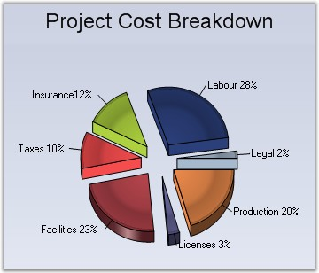

::: {style="DISPLAY: none"}
{#d2h_url_template}{#d2h_package_url style="WIDTH: 0px; DISPLAY: none; HEIGHT: 0px"}
:::

:::: {.d2h_secondary_topic style="PADDING-BOTTOM: 10pt; MARGIN: 0pt; PADDING-LEFT: 0pt; PADDING-RIGHT: 0pt; PADDING-TOP: 0pt"}
#### ExplosionOffset {#explosionoffset style="tab-stops: 0pt"}

 

Gets / sets the offset value that is to be used when slices are to be exploded in a pie chart.

 

::: {align="center"}
+-------------------------------------+-------------------------------------+
|                                                                           |
|                                                                           |
| Details                                                                   |
+-------------------------------------+-------------------------------------+
| **Possible Values**                 | Float type values                   |
+-------------------------------------+-------------------------------------+
| **Default Value    **               | **20**                              |
+-------------------------------------+-------------------------------------+
| **2D / 3D Limitations**             | No                                  |
+-------------------------------------+-------------------------------------+
| **Applies to Chart Element**        | All series                          |
+-------------------------------------+-------------------------------------+
| **Applies to Chart Types**          | Pie Chart, Doughnut Chart           |
+-------------------------------------+-------------------------------------+
:::

 

Here is some sample code.

 

+--------------------------------------------------------------------------------------------------------------------------------------------------------------------+
| **[\[C#\]]{style="FONT-FAMILY: 'Courier New'; COLOR: black"}**                                                                                                     |
|                                                                                                                                                                    |
| **[]{style="FONT-FAMILY: 'Courier New'; COLOR: black"}**                                                                                                           |
|                                                                                                                                                                    |
| [this]{style="FONT-FAMILY: 'Courier New'; COLOR: blue"}[.chartControl1.Series\[0\].ExplodedAll = [true]{style="COLOR: blue"};]{style="FONT-FAMILY: 'Courier New'"} |
|                                                                                                                                                                    |
| [this]{style="FONT-FAMILY: 'Courier New'; COLOR: blue"}[.chartControl1.Series\[0\].ExplosionOffset = 30f;]{style="FONT-FAMILY: 'Courier New'"}                     |
+--------------------------------------------------------------------------------------------------------------------------------------------------------------------+

 

+-----------------------------------------------------------------------------------------------------------------------------------------------------------------+
| **[\[VB.NET\]]{style="FONT-FAMILY: 'Courier New'; COLOR: black"}**                                                                                              |
|                                                                                                                                                                 |
| **[]{style="FONT-FAMILY: 'Courier New'; COLOR: black"}**                                                                                                        |
|                                                                                                                                                                 |
| [Me]{style="FONT-FAMILY: 'Courier New'; COLOR: blue"}[.chartControl1.Series\[0\].ExplodedAll = [True]{style="COLOR: blue"}]{style="FONT-FAMILY: 'Courier New'"} |
|                                                                                                                                                                 |
| [Me]{style="FONT-FAMILY: 'Courier New'; COLOR: blue"}[.chartControl1.Series(0).ExplosionOffset = 30f]{style="FONT-FAMILY: 'Courier New'"}                       |
+-----------------------------------------------------------------------------------------------------------------------------------------------------------------+

 

{border="0"}

 

Figure 127: Exploded Pie Chart

**[]{style="COLOR: black; FONT-SIZE: 8pt"}** 

**See Also**

 

[Doughnut Chart]{.UGHyperlink},[ ]{style="COLOR: blue"}[Pie Chart]{.UGHyperlink}[]{style="COLOR: black"}

[]{#p101} 

 

[]{#related-topics}
::::
