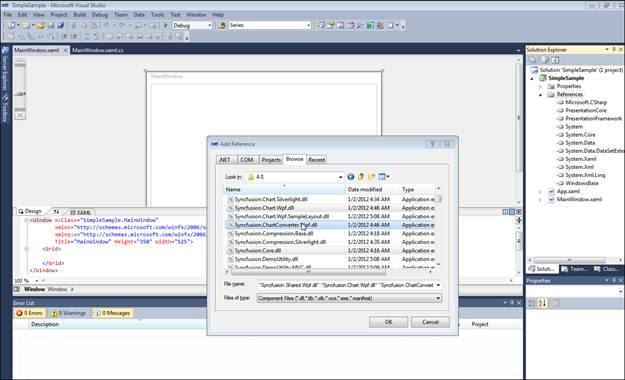
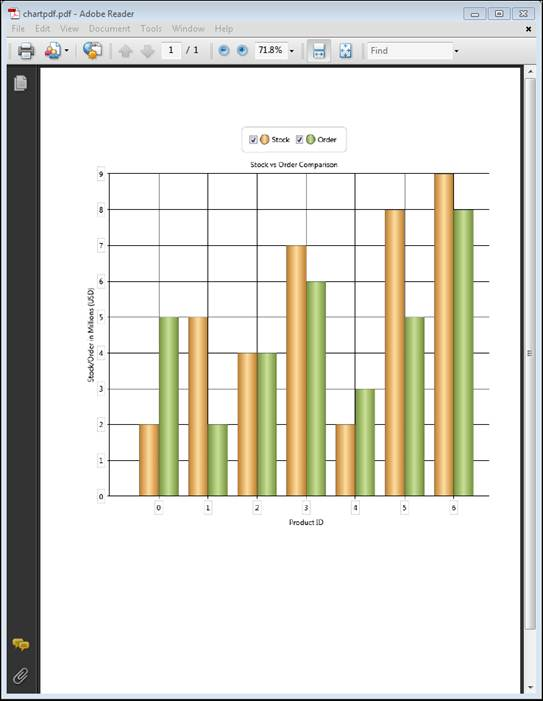

::: {style="DISPLAY: none"}
{#d2h_url_template}{#d2h_package_url style="WIDTH: 0px; DISPLAY: none; HEIGHT: 0px"}
:::

::: {.d2h_secondary_topic style="PADDING-BOTTOM: 10pt; MARGIN: 0pt; PADDING-LEFT: 0pt; PADDING-RIGHT: 0pt; PADDING-TOP: 0pt"}
#### Export Chart to PDF {#export-chart-to-pdf style="tab-stops: 0pt"}

Essential Chart for WPF now comes with the support to export the chart to a PDF file; this conversion can be done using the Syncfusion.ChartConversion.WPF assembly.

Methods

+-------------------------------------------------------------+------------------------------------------------------------------+-----------------------------------------------------------------+-----------------------------------------------------------+------------------------------------------------------------------+
| **[Method ]{style="COLOR: black"}**[]{style="COLOR: black"} | **[Description ]{style="COLOR: black"}**[]{style="COLOR: black"} | **[Parameters ]{style="COLOR: black"}**[]{style="COLOR: black"} | **[Type ]{style="COLOR: black"}**[]{style="COLOR: black"} | **[Return Type ]{style="COLOR: black"}**[]{style="COLOR: black"} |
+-------------------------------------------------------------+------------------------------------------------------------------+-----------------------------------------------------------------+-----------------------------------------------------------+------------------------------------------------------------------+
| ChartPdfConverter                                           | Converts chart to PDF file.                                      | Chart,                                                          | Chart                                                     | Void                                                             |
|                                                             |                                                                  |                                                                 |                                                           |                                                                  |
|                                                             |                                                                  | Filename                                                        | String                                                    |                                                                  |
+=============================================================+==================================================================+=================================================================+===========================================================+==================================================================+

[]{style="FONT-FAMILY: 'Calibri','sans-serif'; COLOR: black"} 

Sample Link

1.  Open the WPF sample browser

2.  Select the Chart product

3.  Select **Chart** \> **Export and Import** \> **Chart to PDF**

Adding Support to Convert a Chart to PDF to an Application

The following steps explain how to convert a chart to PDF.

1.  Create a new Visual Studio 2010 or 2008 project.

2.  Add the following assemblies to the project:

**Syncfusion.Chart.WPF.dll**

**Syncfusion.ChartConverter.WPF.dll**

{border="0"}

Figure 268: Adding Syncfusion Assemblies

 

3.  Create a chart to be exported to PDF.

4.  Use the following code to convert the chart to a PDF file.

***           ***

+-------------------------------------------------------------------------------------------------------------------------------------------------------------------------------------------------------------------------------------------+
| **[\[C#\]]{style="FONT-FAMILY: 'Courier New'"}**                                                                                                                                                                                          |
|                                                                                                                                                                                                                                           |
| [ChartPdfConverterControl]{style="FONT-FAMILY: Consolas; COLOR: #2b91af; FONT-SIZE: 9.5pt"}[ control = [new]{style="COLOR: blue"} [ChartPdfConverterControl]{style="COLOR: #2b91af"}();]{style="FONT-FAMILY: Consolas; FONT-SIZE: 9.5pt"} |
|                                                                                                                                                                                                                                           |
| [control.ChartPdfConverter(Chart1, [\"chartpdf.pdf\"]{style="COLOR: #a31515"});]{style="FONT-FAMILY: Consolas; FONT-SIZE: 9.5pt"}                                                                                                         |
|                                                                                                                                                                                                                                           |
|                                                                                                                                                                                                                                           |
+-------------------------------------------------------------------------------------------------------------------------------------------------------------------------------------------------------------------------------------------+

 

5.  The PDF file is generated as shown below.

{border="0"}

Figure 269: Chart Converted to PDF

[]{#related-topics}
:::
