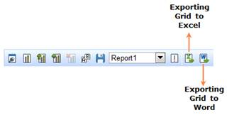

::: {style="DISPLAY: none"}
{#d2h_url_template}{#d2h_package_url style="WIDTH: 0px; DISPLAY: none; HEIGHT: 0px"}
:::

::::: {#nsbanner .d2h_main_nsbanner style="BORDER-BOTTOM: #999999 1px solid; POSITION: relative; PADDING-BOTTOM: 0px; BACKGROUND-COLOR: transparent; PADDING-LEFT: 0px; PADDING-RIGHT: 0px; DISPLAY: none; BORDER-TOP: #999999 1px solid; PADDING-TOP: 0px; LEFT: 0px"}
:::: {#TitleRow .d2h_main_titlerow style="PADDING-BOTTOM: 4px; BACKGROUND-COLOR: transparent; PADDING-LEFT: 22px; WIDTH: 100%; PADDING-RIGHT: 10px; DISPLAY: none; PADDING-TOP: 4px"}
::: {#ienav .d2h_main_ienav style="DISPLAY: none"}
{#D2HPrevious .D2HPreviousEnabled}  {#D2HNext .D2HNextEnabled}
:::
::::
:::::

::::::: {#nstext .d2h_main_nstext style="PADDING-BOTTOM: 10px; BACKGROUND-COLOR: transparent; PADDING-LEFT: 22px; PADDING-RIGHT: 10px; HEIGHT: 100%; OVERFLOW: auto; PADDING-TOP: 5px" hasuserbackground="true" valign="bottom"}
::: {#d2h_breadcrumbs .d2h_breadcrumbs}
[Essential Studio User Guide Documentation](ms-xhelp:///?Id=12457748-09e3-4d74-a240-8e049cedf030){.d2h_breadcrumbsNormal}[ \> ]{.d2h_breadcrumbsLinkSeparator}[Business Intelligence Edition](ms-xhelp:///?Id=fdf33dd8-62b2-47b9-ad7b-fc50e590bca5){.d2h_breadcrumbsNormal}[ \> ]{.d2h_breadcrumbsLinkSeparator}[Essential BI ASP.NET](ms-xhelp:///?Id=99c6694e-59c3-4c59-abb5-ce9ce9a948bc){.d2h_breadcrumbsNormal}[ \> ]{.d2h_breadcrumbsLinkSeparator}[Essential BI Client]{.d2h_breadcrumbsContentsOnly}[ \> ]{.d2h_breadcrumbsLinkSeparator}[Concepts and Features](ms-xhelp:///?Id=01073408-6fb5-4943-a653-da9fd3358a53){.d2h_breadcrumbsNormal}
:::

## Exporting {#exporting style="tab-stops: 0pt"}

 

The grid and chart control can be exported to the following formats:

[·      ]{style="FONT-FAMILY: Symbol"}Excel and

[·      ]{style="FONT-FAMILY: Symbol"}Word

 

The user can perform selective export by applying any one of the below options:

1.   ChartOnly

2.   GridOnly

3.   ChartAndGrid

 

The OLAP Client toolbar provides the option to perform the export operation on grid and chart control. By clicking any one of the export buttons, the user can export the grid and chart to the corresponding format.

 

{border="0"}

 

Figure 46: Exporting grid to excel and word

 

 

Table 16: Export options in OLAP Client Toolbar

 

::: {align="center"}
  -------------------- -----------------------------------------------------------------------
  Name                 Description
  Exporting to Excel   This option is used to export the grid and chart data to excel format
  Exporting to word    This option is to export the grid and chart to word format
  -------------------- -----------------------------------------------------------------------
:::

 

There are three options available to perform selective export.

 

Table 17: Selective export options

 

::: {align="center"}
  -------------- -------------------------------------
  Options        Description
  ChartOnly      Exports only chart control
  GridOnly       Exports only grid control
  ChartAndGrid   Exports both grid and chart control
  -------------- -------------------------------------
:::

 

The following code snippet describes the selective export.

+-----------------------------------------------------------------------------------------------------------------------------------------------------------------------------------------------------------------------------------------------------------------------------------------------------------------------------------------------------------------------------------------+
| **[\[C#\]  ]{style="FONT-FAMILY: 'Courier New'"}**                                                                                                                                                                                                                                                                                                                                      |
|                                                                                                                                                                                                                                                                                                                                                                                         |
| [this]{style="FONT-FAMILY: 'Courier New'; COLOR: blue"}[.OlapClient1.ExportMode = [ExportMode]{style="COLOR: #2b91af"}.ChartOnly; [// Exports only chart control. ]{style="COLOR: green"}[this]{style="COLOR: blue"}.OlapClient1.ExportMode = [ExportMode]{style="COLOR: #2b91af"}.GridOnly; [// Exports only grid control.]{style="COLOR: green"}]{style="FONT-FAMILY: 'Courier New'"} |
|                                                                                                                                                                                                                                                                                                                                                                                         |
| [this]{style="FONT-FAMILY: 'Courier New'; COLOR: blue"}[.OlapClient1.ExportMode = [ExportMode]{style="COLOR: #2b91af"}.ChartAndGrid; [// Exports both grid and chart control.]{style="COLOR: green"}]{style="FONT-FAMILY: 'Courier New'"}[]{style="FONT-FAMILY: 'Courier New'"}                                                                                                         |
+-----------------------------------------------------------------------------------------------------------------------------------------------------------------------------------------------------------------------------------------------------------------------------------------------------------------------------------------------------------------------------------------+

 

+----------------------------------------------------------------------------------------------------------------------------------------------------------------------------------------------------------------------------------------------------------------------------------+
| [\[VB\]]{style="FONT-FAMILY: 'Courier New'"}                                                                                                                                                                                                                                     |
|                                                                                                                                                                                                                                                                                  |
| [Me]{style="FONT-FAMILY: 'Courier New'; COLOR: blue"}[.OlapClient1.ExportMode = [ExportMode]{style="COLOR: #2b91af"}.ChartOnly [\' Exports only chart control.]{style="COLOR: green"}]{style="FONT-FAMILY: 'Courier New'"}                                                       |
|                                                                                                                                                                                                                                                                                  |
| [Me]{style="FONT-FAMILY: 'Courier New'; COLOR: blue"}[.OlapClient1.ExportMode = [ExportMode]{style="COLOR: #2b91af"}.GridOnly [\' Exports only grid control.]{style="COLOR: green"}]{style="FONT-FAMILY: 'Courier New'"}                                                         |
|                                                                                                                                                                                                                                                                                  |
| [Me]{style="FONT-FAMILY: 'Courier New'; COLOR: blue"}[.OlapClient1.ExportMode = [ExportMode]{style="COLOR: #2b91af"}.ChartAndGrid [\' Exports both grid and chart control.]{style="COLOR: green"}]{style="FONT-FAMILY: 'Courier New'"}**[]{style="FONT-FAMILY: 'Courier New'"}** |
+----------------------------------------------------------------------------------------------------------------------------------------------------------------------------------------------------------------------------------------------------------------------------------+

 

Table 18: ExportMode Property

::: {align="center"}
  ------------ ----------------------------------------------------------------------------------------------------------------------- ------------- ----------- ----------------
  Property     Description                                                                                                             Type          Data type   Reference link
  ExportMode   This option would allow the user to export selective controls. It may be either chart or grid or both chart and grid.   Server side   enum        \-
  ------------ ----------------------------------------------------------------------------------------------------------------------- ------------- ----------- ----------------
:::

 

Sample Link

A sample demo is available at the following link:

**..\\Syncfusion\\EssentialStudio\\\<Version Number\>\\BI\\Web\\OlapClient.Web\\Samples\\3.5\\OlapClient\\ OlapClientDemo**

[]{#related-topics}
:::::::
