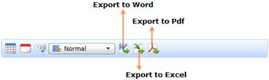

::: {style="DISPLAY: none"}
{#d2h_url_template}{#d2h_package_url style="WIDTH: 0px; DISPLAY: none; HEIGHT: 0px"}
:::

::::: {#nsbanner .d2h_main_nsbanner style="BORDER-BOTTOM: #999999 1px solid; POSITION: relative; PADDING-BOTTOM: 0px; BACKGROUND-COLOR: transparent; PADDING-LEFT: 0px; PADDING-RIGHT: 0px; DISPLAY: none; BORDER-TOP: #999999 1px solid; PADDING-TOP: 0px; LEFT: 0px"}
:::: {#TitleRow .d2h_main_titlerow style="PADDING-BOTTOM: 4px; BACKGROUND-COLOR: transparent; PADDING-LEFT: 22px; WIDTH: 100%; PADDING-RIGHT: 10px; DISPLAY: none; PADDING-TOP: 4px"}
::: {#ienav .d2h_main_ienav style="DISPLAY: none"}
{#D2HPrevious .D2HPreviousEnabled}  {#D2HNext .D2HNextEnabled}
:::
::::
:::::

::::: {#nstext .d2h_main_nstext style="PADDING-BOTTOM: 10px; BACKGROUND-COLOR: transparent; PADDING-LEFT: 22px; PADDING-RIGHT: 10px; HEIGHT: 100%; OVERFLOW: auto; PADDING-TOP: 5px" hasuserbackground="true" valign="bottom"}
::: {#d2h_breadcrumbs .d2h_breadcrumbs}
[Essential Studio User Guide Documentation](ms-xhelp:///?Id=12457748-09e3-4d74-a240-8e049cedf030){.d2h_breadcrumbsNormal}[ \> ]{.d2h_breadcrumbsLinkSeparator}[Business Intelligence Edition](ms-xhelp:///?Id=fdf33dd8-62b2-47b9-ad7b-fc50e590bca5){.d2h_breadcrumbsNormal}[ \> ]{.d2h_breadcrumbsLinkSeparator}[Essential BI Silverlight](ms-xhelp:///?Id=c006b39c-6aa2-4637-b7de-3e7b6cb3f9f9){.d2h_breadcrumbsNormal}[ \> ]{.d2h_breadcrumbsLinkSeparator}[Essential BI Client]{.d2h_breadcrumbsContentsOnly}[ \> ]{.d2h_breadcrumbsLinkSeparator}[Features](ms-xhelp:///?Id=4ae10797-e3a8-4270-b8ba-34441d2e1a3d){.d2h_breadcrumbsNormal}
:::

## Exporting {#exporting style="tab-stops: 0pt"}

When creating OLAP Report in OLAP Client, the report will be previewed in the OLAP Chart and OLAP Grid. OLAP Client has the option to export the current visual of the Grid to various forms.

Export Options in Grid

The Grid can be exported to the following form:

[·      ]{style="FONT-FAMILY: Symbol"}Word

[·      ]{style="FONT-FAMILY: Symbol"}PDF

[·      ]{style="FONT-FAMILY: Symbol"}Excel

Users can perform these exports in two ways:

[·      ]{style="FONT-FAMILY: Symbol"}Through OLAPGrid Tool Bar menu

[·      ]{style="FONT-FAMILY: Symbol"}Through APIs

Using OLAPGrid Tool Bar Menu

The OLAPGrid Toolbar provides the menu to perform export operations. By clicking any one of the Export buttons, the user can export the grid to the corresponding format.

 

{border="0"}

 

Figure 37: Export Menus in OLAP Grid Tool Bar

 

Export menus in OlapGrid Toolbar

Table 8: Export Options in Grid

 

::: {align="center"}
  ------------------------------------------- ----------------- --------------------------
  Icon                                        Name              Description
  {border="0"}   Export to Excel   Export the Grid to Excel
  {border="0"}   Export to Word    Export the Grid to Word
  {border="0"}   Export to PDF     Export the Grid to PDF
  ------------------------------------------- ----------------- --------------------------
:::

 

Using APIs

You can achieve the Export feature of OLAPGrid, using the following APIs.

The code snippet for the Export feature of OLAPGrid in OLAP Client is shown below:

 

+----------------------------------------------------------------------------------+
| **[\[C#\]]{style="FONT-FAMILY: 'Courier New'"}**                                 |
|                                                                                  |
| []{style="FONT-FAMILY: 'Courier New'"}                                           |
|                                                                                  |
| [// Export an OlapGrid into an Excel Format]{style="FONT-FAMILY: 'Courier New'"} |
|                                                                                  |
| [this.OlapClient.OlapGrid.ExportToExcel();]{style="FONT-FAMILY: 'Courier New'"}  |
|                                                                                  |
| []{style="FONT-FAMILY: 'Courier New'"}                                           |
|                                                                                  |
| [// Export an OlapGrid into a Word Format]{style="FONT-FAMILY: 'Courier New'"}   |
|                                                                                  |
| [this.OlapClient.OlapGrid.ExportToWord();]{style="FONT-FAMILY: 'Courier New'"}   |
|                                                                                  |
| []{style="FONT-FAMILY: 'Courier New'"}                                           |
|                                                                                  |
| [// Export an OlapGrid into a PDF Format]{style="FONT-FAMILY: 'Courier New'"}    |
|                                                                                  |
| [this.OlapClient.OlapGrid.ExportToPdf();]{style="FONT-FAMILY: 'Courier New'"}    |
|                                                                                  |
| []{style="FONT-FAMILY: 'Courier New'"}                                           |
+----------------------------------------------------------------------------------+

 

+----------------------------------------------------------------------------------+
| **[\[VB\]]{style="FONT-FAMILY: 'Courier New'"}**                                 |
|                                                                                  |
| []{style="FONT-FAMILY: 'Courier New'"}                                           |
|                                                                                  |
| [\' Export an OlapGrid into an Excel Format]{style="FONT-FAMILY: 'Courier New'"} |
|                                                                                  |
| [Me.OlapClient.OlapGrid.ExportToExcel()]{style="FONT-FAMILY: 'Courier New'"}     |
|                                                                                  |
| []{style="FONT-FAMILY: 'Courier New'"}                                           |
|                                                                                  |
| [\' Export an OlapGrid into a Word Format]{style="FONT-FAMILY: 'Courier New'"}   |
|                                                                                  |
| [Me.OlapClient.OlapGrid.ExportToWord()]{style="FONT-FAMILY: 'Courier New'"}      |
|                                                                                  |
| []{style="FONT-FAMILY: 'Courier New'"}                                           |
|                                                                                  |
| [\' Export an OlapGrid into a PDF Format]{style="FONT-FAMILY: 'Courier New'"}    |
|                                                                                  |
| [Me.OlapClient.OlapGrid.ExportToPdf()]{style="FONT-FAMILY: 'Courier New'"}       |
|                                                                                  |
| []{style="FONT-FAMILY: 'Courier New'"}                                           |
+----------------------------------------------------------------------------------+

 

[]{#related-topics}
:::::
