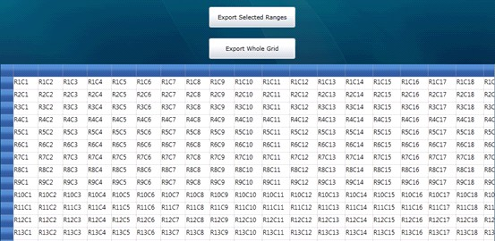
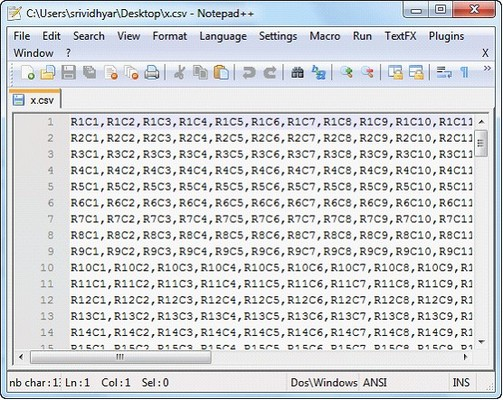
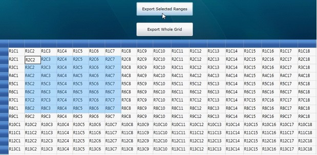
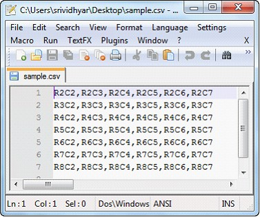

::: {style="DISPLAY: none"}
{#d2h_url_template}{#d2h_package_url style="WIDTH: 0px; DISPLAY: none; HEIGHT: 0px"}
:::

::::: {#nsbanner .d2h_main_nsbanner style="BORDER-BOTTOM: #999999 1px solid; POSITION: relative; PADDING-BOTTOM: 0px; BACKGROUND-COLOR: transparent; PADDING-LEFT: 0px; PADDING-RIGHT: 0px; DISPLAY: none; BORDER-TOP: #999999 1px solid; PADDING-TOP: 0px; LEFT: 0px"}
:::: {#TitleRow .d2h_main_titlerow style="PADDING-BOTTOM: 4px; BACKGROUND-COLOR: transparent; PADDING-LEFT: 22px; WIDTH: 100%; PADDING-RIGHT: 10px; DISPLAY: none; PADDING-TOP: 4px"}
::: {#ienav .d2h_main_ienav style="DISPLAY: none"}
{#D2HPrevious .D2HPreviousEnabled}  {#D2HNext .D2HNextEnabled}
:::
::::
:::::

:::: {#nstext .d2h_main_nstext style="PADDING-BOTTOM: 10px; BACKGROUND-COLOR: transparent; PADDING-LEFT: 22px; PADDING-RIGHT: 10px; HEIGHT: 100%; OVERFLOW: auto; PADDING-TOP: 5px" hasuserbackground="true" valign="bottom"}
::: {#d2h_breadcrumbs .d2h_breadcrumbs}
[Essential Studio User Guide Documentation](ms-xhelp:///?Id=12457748-09e3-4d74-a240-8e049cedf030){.d2h_breadcrumbsNormal}[ \> ]{.d2h_breadcrumbsLinkSeparator}[User Interface Edition](ms-xhelp:///?Id=c29296b7-531c-413b-a0ec-488ca1f7f669){.d2h_breadcrumbsNormal}[ \> ]{.d2h_breadcrumbsLinkSeparator}[Essential Silverlight](ms-xhelp:///?Id=66221bd1-ba2e-43c2-94a7-618f50e01d24){.d2h_breadcrumbsNormal}[ \> ]{.d2h_breadcrumbsLinkSeparator}[Essential Grid]{.d2h_breadcrumbsContentsOnly}[ \> ]{.d2h_breadcrumbsLinkSeparator}[Concepts and Features](ms-xhelp:///?Id=8126789d-b192-4c3c-9e36-f0119f12b8b9){.d2h_breadcrumbsNormal}[ \> ]{.d2h_breadcrumbsLinkSeparator}[Export Option](ms-xhelp:///?Id=aeda6615-30ce-40f1-92b5-5c4cd6a2e82e){.d2h_breadcrumbsNormal}
:::

### Exporting a Grid Control to CSV Format {#exporting-a-grid-control-to-csv-format style="tab-stops: 0pt"}

[]{style="FONT-FAMILY: 'Trebuchet MS','sans-serif'; COLOR: #15428b; FONT-SIZE: 9pt"} 

The **ExportToCSV** method of the **GridModelExportExtensions** class enables a grid control to be easily exported to CSV format. This method also allows you to select what data will be exported.

 

To enable exporting, the following .dll files must be added along with the default .dll files in the reference folder:

[]{style="FONT-FAMILY: 'Trebuchet MS','sans-serif'; COLOR: #15428b; FONT-SIZE: 9pt"} 

[·      ]{style="FONT-FAMILY: Symbol"}Syncfusion.XlsIO.Base

[·      ]{style="FONT-FAMILY: Symbol"}Syncfusion.XlsIO.WPF 

[·      ]{style="FONT-FAMILY: Symbol"}Syncfusion.GridConverter.WPF

[]{style="FONT-FAMILY: 'Trebuchet MS','sans-serif'; COLOR: #15428b; FONT-SIZE: 9pt"} 

Exporting Options

[]{style="FONT-FAMILY: 'Calibri','sans-serif'; BACKGROUND: white; COLOR: black"} 

There are two options for exporting a grid control:

[]{style="FONT-FAMILY: 'Trebuchet MS','sans-serif'; COLOR: #15428b; FONT-SIZE: 9pt"} 

1.   **Export Whole Grid** -- which exports an entire grid to CSV format.

2.   **Export Selected Range** -- which exports only a selected range to CSV format.

[]{style="FONT-FAMILY: 'Trebuchet MS','sans-serif'; COLOR: #15428b; FONT-SIZE: 9pt"} 

Export Whole Grid

You can convert the entire content of a grid control to a CSV file by using the following code:

[]{style="FONT-FAMILY: 'Trebuchet MS','sans-serif'; COLOR: #15428b; FONT-SIZE: 9pt"} 

+---------------------------------------------------------------------------------------------------------------------------------------------------------------+
| **[\[C#\]]{style="FONT-FAMILY: 'Courier New'"}**                                                                                                              |
|                                                                                                                                                               |
| **[]{style="FONT-FAMILY: 'Courier New'"}**                                                                                                                    |
|                                                                                                                                                               |
| [this]{style="FONT-FAMILY: 'Courier New'; COLOR: blue"}[.gc.Model.ExportToCSV([\"Sample.csv\"]{style="COLOR: #a31515"});]{style="FONT-FAMILY: 'Courier New'"} |
+---------------------------------------------------------------------------------------------------------------------------------------------------------------+

[]{style="FONT-FAMILY: 'Trebuchet MS','sans-serif'; COLOR: #15428b; FONT-SIZE: 9pt"} 

When the code runs, the output in Figure 1 will display.

[]{style="FONT-FAMILY: 'Trebuchet MS','sans-serif'; COLOR: #15428b; FONT-SIZE: 9pt"} 

{border="0"}

Figure 191: GridControl to be Exported

***[]{style="FONT-FAMILY: 'Trebuchet MS','sans-serif'; COLOR: #15428b; FONT-SIZE: 9pt"}*** 

When you are ready to export the entire grid, click **Export Whole Grid**; the grid content will then be converted to CSV format as seen in Figure 2.

***[]{style="FONT-FAMILY: 'Calibri','sans-serif'; BACKGROUND: white; COLOR: black"}*** 

[{border="0"}]{style="BACKGROUND: white"}

Figure 192: Exported Grid Content in CSV Format

**[]{style="FONT-FAMILY: 'Trebuchet MS','sans-serif'; COLOR: #15428b; FONT-SIZE: 9pt"}** 

Export Selected Range

You can convert selected grid content to CSV format by using the following code:

[]{style="FONT-FAMILY: 'Trebuchet MS','sans-serif'; COLOR: #15428b; FONT-SIZE: 9pt"} 

+----------------------------------------------------------------------------------------------------------------------------------------------------+
| **[\[C#\]]{style="FONT-FAMILY: 'Courier New'"}**                                                                                                   |
|                                                                                                                                                    |
| [GridRangeInfoList]{style="FONT-FAMILY: 'Courier New'; COLOR: #2b91af"}[ rangeList = gc.Model.SelectedRanges;]{style="FONT-FAMILY: 'Courier New'"} |
|                                                                                                                                                    |
| [            [if]{style="COLOR: blue"} (rangeList.Count \> 0)]{style="FONT-FAMILY: 'Courier New'"}                                                 |
|                                                                                                                                                    |
| [            {]{style="FONT-FAMILY: 'Courier New'"}                                                                                                |
|                                                                                                                                                    |
| [                [GridRangeInfo]{style="COLOR: #2b91af"} range = rangeList\[0\];]{style="FONT-FAMILY: 'Courier New'"}                              |
|                                                                                                                                                    |
| [                gc.Model.ExportToCSV(range, [\"Sample.csv\"]{style="COLOR: #a31515"});]{style="FONT-FAMILY: 'Courier New'"}                       |
|                                                                                                                                                    |
| [           }]{style="FONT-FAMILY: 'Courier New'"}                                                                                                 |
|                                                                                                                                                    |
| []{style="FONT-FAMILY: 'Calibri','sans-serif'; BACKGROUND: white; COLOR: black"}                                                                   |
+----------------------------------------------------------------------------------------------------------------------------------------------------+

[]{style="FONT-FAMILY: 'Calibri','sans-serif'; BACKGROUND: white; COLOR: black"} 

When the code runs, the output in will be displayed.

[]{style="FONT-FAMILY: 'Calibri','sans-serif'; BACKGROUND: white; COLOR: black"} 

[{border="0"}]{style="BACKGROUND: white"}

Figure 193: Selection to be Exported

[]{style="FONT-FAMILY: 'Calibri','sans-serif'; BACKGROUND: white"} 

To export a selection, highlight the portion of the grid you want to export, and then click **Export Selected Range**; the selected grid content will then be exported to a CSV file.

[]{style="FONT-FAMILY: 'Calibri','sans-serif'"} 

{border="0"}

Figure 194: Grid selection Exported to CSV Format

[]{#p276} 

[]{#related-topics}
::::
