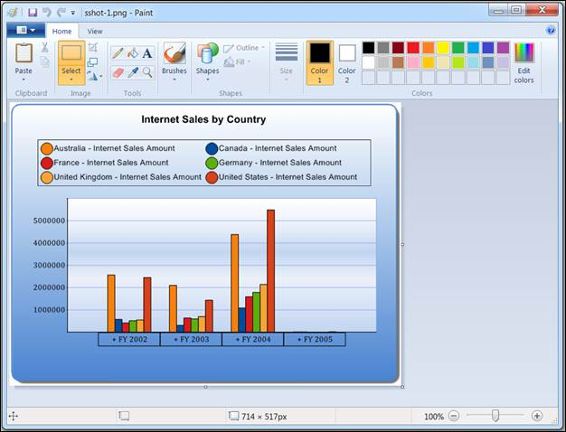

::: {style="DISPLAY: none"}
{#d2h_url_template}{#d2h_package_url style="WIDTH: 0px; DISPLAY: none; HEIGHT: 0px"}
:::

::::: {#nsbanner .d2h_main_nsbanner style="BORDER-BOTTOM: #999999 1px solid; POSITION: relative; PADDING-BOTTOM: 0px; BACKGROUND-COLOR: transparent; PADDING-LEFT: 0px; PADDING-RIGHT: 0px; DISPLAY: none; BORDER-TOP: #999999 1px solid; PADDING-TOP: 0px; LEFT: 0px"}
:::: {#TitleRow .d2h_main_titlerow style="PADDING-BOTTOM: 4px; BACKGROUND-COLOR: transparent; PADDING-LEFT: 22px; WIDTH: 100%; PADDING-RIGHT: 10px; DISPLAY: none; PADDING-TOP: 4px"}
::: {#ienav .d2h_main_ienav style="DISPLAY: none"}
{#D2HPrevious .D2HPreviousEnabled}  {#D2HNext .D2HNextEnabled}
:::
::::
:::::

:::::: {#nstext .d2h_main_nstext style="PADDING-BOTTOM: 10px; BACKGROUND-COLOR: transparent; PADDING-LEFT: 22px; PADDING-RIGHT: 10px; HEIGHT: 100%; OVERFLOW: auto; PADDING-TOP: 5px" hasuserbackground="true" valign="bottom"}
::: {#d2h_breadcrumbs .d2h_breadcrumbs}
[Essential Studio User Guide Documentation](ms-xhelp:///?Id=12457748-09e3-4d74-a240-8e049cedf030){.d2h_breadcrumbsNormal}[ \> ]{.d2h_breadcrumbsLinkSeparator}[Business Intelligence Edition](ms-xhelp:///?Id=fdf33dd8-62b2-47b9-ad7b-fc50e590bca5){.d2h_breadcrumbsNormal}[ \> ]{.d2h_breadcrumbsLinkSeparator}[Essential BI ASP.NET](ms-xhelp:///?Id=99c6694e-59c3-4c59-abb5-ce9ce9a948bc){.d2h_breadcrumbsNormal}[ \> ]{.d2h_breadcrumbsLinkSeparator}[Essential BI Chart]{.d2h_breadcrumbsContentsOnly}[ \> ]{.d2h_breadcrumbsLinkSeparator}[Concepts and Features](ms-xhelp:///?Id=be4e11fe-e0a1-44d7-aa3a-05cf8b78bdb8){.d2h_breadcrumbsNormal}[ \> ]{.d2h_breadcrumbsLinkSeparator}[Exporting](ms-xhelp:///?Id=2394b447-8cde-44a1-935b-351fb00f1582){.d2h_breadcrumbsNormal}
:::

### Exporting as Image {#exporting-as-image style="tab-stops: 0pt"}

The OLAP Chart can be exported easily as an image file in several different formats.

 

Programmatically:

[]{style="COLOR: black"} 

+----------------------------------------------------------------------------------------------------------------------------------------------------------------------------------------------------------------------+
| **[\[C#\]]{style="FONT-FAMILY: 'Courier New'; COLOR: black"}**[]{style="FONT-FAMILY: 'Courier New'; COLOR: black"}                                                                                                   |
|                                                                                                                                                                                                                      |
| [//Exporting OlapChart in \".gif\" format]{style="FONT-FAMILY: 'Courier New'; COLOR: black"}                                                                                                                         |
|                                                                                                                                                                                                                      |
| [private string exportFileName, file = null;]{style="FONT-FAMILY: 'Courier New'; COLOR: black"}                                                                                                                      |
|                                                                                                                                                                                                                      |
| [private string fileName = \"Sample\";]{style="FONT-FAMILY: 'Courier New'; COLOR: black"}                                                                                                                            |
|                                                                                                                                                                                                                      |
| [exportFileName = fileName + \".gif\";                    ]{style="FONT-FAMILY: 'Courier New'; COLOR: black"}                                                                                                        |
|                                                                                                                                                                                                                      |
| [this.]{style="FONT-FAMILY: 'Courier New'; COLOR: black"}[olapChart1[.ExportToImage(exportFileName);]{style="COLOR: black"}]{style="FONT-FAMILY: 'Courier New'"}[]{style="FONT-FAMILY: 'Courier New'; COLOR: black"} |
+----------------------------------------------------------------------------------------------------------------------------------------------------------------------------------------------------------------------+

[]{style="COLOR: black"} 

+-------------------------------------------------------------------------------------------------------------------------------------------------------------------------------------------------------------------+
| **[\[VB\]]{style="FONT-FAMILY: 'Courier New'; COLOR: black"}**[]{style="FONT-FAMILY: 'Courier New'; COLOR: black"}                                                                                                |
|                                                                                                                                                                                                                   |
| [\'Exporting OlapChart in \".gif\" format]{style="FONT-FAMILY: 'Courier New'; COLOR: black"}                                                                                                                      |
|                                                                                                                                                                                                                   |
| [Private exportFileName As String, file As String = Nothing]{style="FONT-FAMILY: 'Courier New'; COLOR: black"}                                                                                                    |
|                                                                                                                                                                                                                   |
| [Private fileName As String = \"Sample\"]{style="FONT-FAMILY: 'Courier New'; COLOR: black"}                                                                                                                       |
|                                                                                                                                                                                                                   |
| [exportFileName = fileName & \".gif\"]{style="FONT-FAMILY: 'Courier New'; COLOR: black"}                                                                                                                          |
|                                                                                                                                                                                                                   |
| [Me.]{style="FONT-FAMILY: 'Courier New'; COLOR: black"}[olapChart1[.ExportToImage(exportFileName)]{style="COLOR: black"}]{style="FONT-FAMILY: 'Courier New'"}[]{style="FONT-FAMILY: 'Courier New'; COLOR: black"} |
+-------------------------------------------------------------------------------------------------------------------------------------------------------------------------------------------------------------------+

[]{style="COLOR: black"} 

Based on the filename extension, the chart has built-in support to save the image in the following formats.

[]{style="COLOR: black"} 

::: {align="center"}
  ---------------- -------------------------------
  File Extension   File Type
  .bmp             BMP
  .jpg             JPG
  .jpeg            JPEG
  .gif             GIF
  .tiff            TIFF
  .wmf             WMF(Windows Meta File)
  .emf             EMF
  .svg             SVG(Scalable Vector Graphics)
  ---------------- -------------------------------
:::

[]{style="COLOR: black"} 

 

If the specified extension is none of the above, then the chart is exported as a bitmap.

[]{style="COLOR: black"} 

{border="0"}

 

Figure 45: Exported to Image Format

 

 

 

Table 24: ExportToImage

 

::: {align="center"}
  -------------------------------- ---------------------------------------------------------------------------------------------------------- ------------ ------------- ------------- ----------------
  Methods                          Description                                                                                                Parameters   Type          Return Type   Reference Link
  ExportToImage(String fileName)   Exports a chart into a new image file with the specified file name. It takes the file name as parameter.   string       Server side   void          \-
  -------------------------------- ---------------------------------------------------------------------------------------------------------- ------------ ------------- ------------- ----------------
:::

 

Sample Location

 

A sample demo is available at the following location:

 

..\\Syncfusion\\EssentialStudio\\\<Version Number\>\\BI\\Web\\OlapChart.Web\\Samples\\3.5\\ Exporting\\Exporting Chart Demo\\[]{style="FONT-FAMILY: 'Cambria','serif'; COLOR: black; FONT-SIZE: 12pt"}

[]{#related-topics}
::::::
