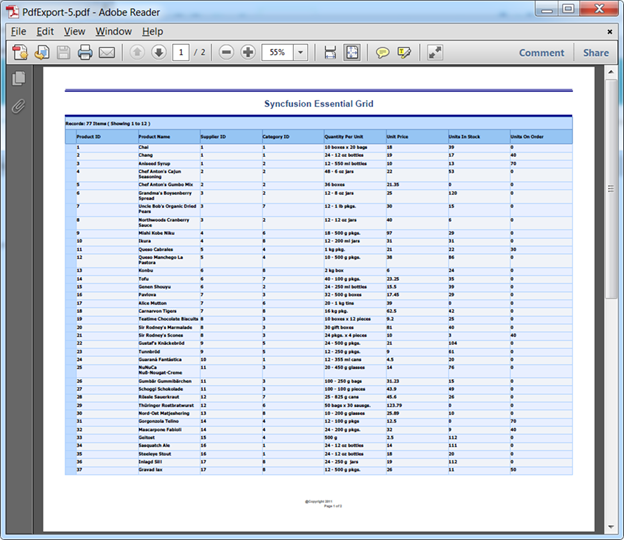
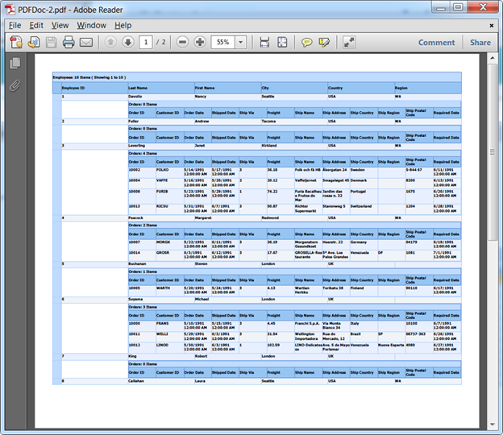
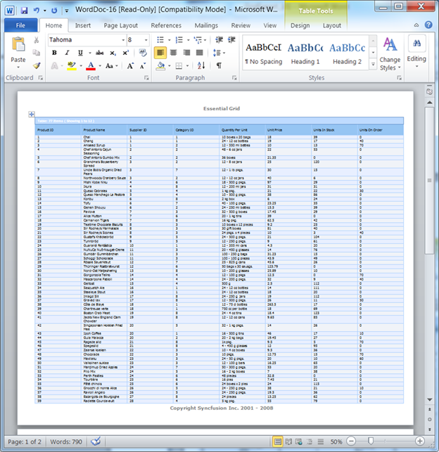
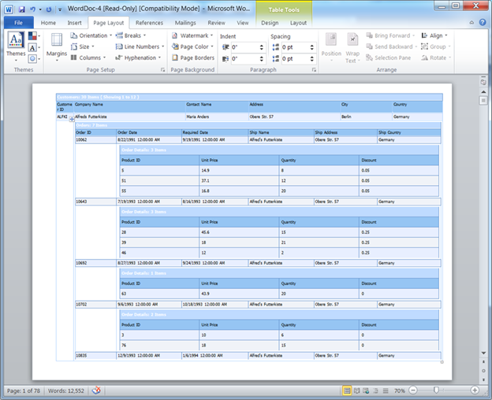
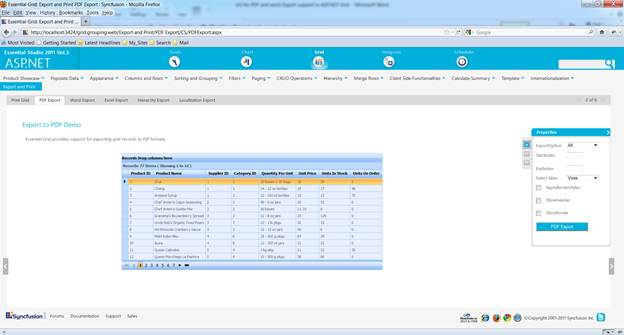

::: {style="DISPLAY: none"}
{#d2h_url_template}{#d2h_package_url style="WIDTH: 0px; DISPLAY: none; HEIGHT: 0px"}
:::

::::: {#nsbanner .d2h_main_nsbanner style="BORDER-BOTTOM: #999999 1px solid; POSITION: relative; PADDING-BOTTOM: 0px; BACKGROUND-COLOR: transparent; PADDING-LEFT: 0px; PADDING-RIGHT: 0px; DISPLAY: none; BORDER-TOP: #999999 1px solid; PADDING-TOP: 0px; LEFT: 0px"}
:::: {#TitleRow .d2h_main_titlerow style="PADDING-BOTTOM: 4px; BACKGROUND-COLOR: transparent; PADDING-LEFT: 22px; WIDTH: 100%; PADDING-RIGHT: 10px; DISPLAY: none; PADDING-TOP: 4px"}
::: {#ienav .d2h_main_ienav style="DISPLAY: none"}
{#D2HPrevious .D2HPreviousEnabled}  {#D2HNext .D2HNextEnabled}
:::
::::
:::::

:::: {#nstext .d2h_main_nstext style="PADDING-BOTTOM: 10px; BACKGROUND-COLOR: transparent; PADDING-LEFT: 22px; PADDING-RIGHT: 10px; HEIGHT: 100%; OVERFLOW: auto; PADDING-TOP: 5px" hasuserbackground="true" valign="bottom"}
::: {#d2h_breadcrumbs .d2h_breadcrumbs}
[Essential Studio User Guide Documentation](ms-xhelp:///?Id=12457748-09e3-4d74-a240-8e049cedf030){.d2h_breadcrumbsNormal}[ \> ]{.d2h_breadcrumbsLinkSeparator}[User Interface Edition](ms-xhelp:///?Id=c29296b7-531c-413b-a0ec-488ca1f7f669){.d2h_breadcrumbsNormal}[ \> ]{.d2h_breadcrumbsLinkSeparator}[Essential ASP.NET](ms-xhelp:///?Id=25c35330-c127-4dad-9a92-ed79dc7261a6){.d2h_breadcrumbsNormal}[ \> ]{.d2h_breadcrumbsLinkSeparator}[Essential Grid]{.d2h_breadcrumbsContentsOnly}[ \> ]{.d2h_breadcrumbsLinkSeparator}[Concepts and Features](ms-xhelp:///?Id=9e489974-524d-457c-9881-e458b1321685){.d2h_breadcrumbsNormal}[ \> ]{.d2h_breadcrumbsLinkSeparator}[Exporting](ms-xhelp:///?Id=dec2dfac-ea66-4b4c-bac3-bd0c2b6cd6d6){.d2h_breadcrumbsNormal}
:::

### Exporting Grid to PDF and Word {#exporting-grid-to-pdf-and-word style="tab-stops: 0pt"}

You can export Grid data to a PDF or Word format using this feature, and can customize the exported Grid in any way that you might require\-- formatting the cells of the exported Grid, adding a header and footer to the exported Grid, changing its styles, etc.

This feature supports the export of both normal and nested (Hierarchical) grids as well.

Exporting is done through server-side**[ ]{style="COLOR: black"}Export** method.

Use Case Scenarios

This feature allows you to perform the following actions in Grid:

[·      ]{style="FONT-FAMILY: Symbol"}Export Grouped tables

[·      ]{style="FONT-FAMILY: Symbol"}Export Nested tables

[·      ]{style="FONT-FAMILY: Symbol"}Export a grid with a MultiRow record

[·      ]{style="FONT-FAMILY: Symbol"}Export Summary rows

[·      ]{style="FONT-FAMILY: Symbol"}Add Header and Footer to the Exported word file

[·      ]{style="FONT-FAMILY: Symbol"}The styles applied for the grid can also be exported to the Word/PDF file

[·      ]{style="FONT-FAMILY: Symbol"}Export choice of Grid contents- i.e. Visible, All or Custom

 

The following figures give you a basic idea of the appearance of the output of the feature.

This feature allows you to export Normal and Nested Grids to Word and PDF formats, as you can see in the below screenshots:

 

{border="0"}

Figure 110: Normal Grid in PDF**[]{style="FONT-STYLE: normal"}**

 

{border="0"}

Figure 111: Hierarchical (Nested) Grid in PDF**[]{style="FONT-STYLE: normal"}**

 

 

{border="0"}

Figure 112: Normal Grid in Word**[]{style="FONT-STYLE: normal"}**

 

 

{border="0"}

Figure 113: Hierarchical Grid in Word**[]{style="FONT-STYLE: normal"}**

The output will be similar when you export a grid with MultiRow records, summary rows or

Grouped tables.

 

You can also apply styles to the exported Grid, and choose which content you want to export- all content, just the visible content, or custom content(which could include portion of content that wasn't visible).

 

 

Where do I find Installed samples?

To view the samples:

1.   Click **Dashboard**.

The **Essential Studio Enterprise Edition** window is displayed, and the **User Interface Edition** panel is displayed by default.

2.   Click the **Run Locally Installed Samples** link.

 The Essential Studio ASP.NET Edition sample browser is displayed.

3.   Select **Grid** from the drop-down.[]{style="FONT-SIZE: 9pt"}

4.   Select any sample from the **Export and Print** tab provided and browse through the features.

       {border="0"}

Figure 114: ASP.NET Grid browser with the Export and Print tab selected

**** 

 

More:

[ ]{#related-topics}

[{border="0" align="absMiddle"}Constructors, Properties, Methods and Events tables](ms-xhelp:///?Id=600294b8-4978-478a-b43f-1db568ae684f){style="TEXT-DECORATION: none"}

[{border="0" align="absMiddle"}Adding PDF or Word Export Support to GridGroupingControl](ms-xhelp:///?Id=080f05f0-585c-47e2-9188-b07932a6d3e5){style="TEXT-DECORATION: none"}

[{border="0" align="absMiddle"}How to add the header and footer to an exported Grid in PDF or Word format?](ms-xhelp:///?Id=b10fcd59-d676-4ca3-985d-db05d2a1234a){style="TEXT-DECORATION: none"}

[{border="0" align="absMiddle"}How to format cells and rows in a Grid that was exported to Word or PDF?](ms-xhelp:///?Id=f4fc7b4c-9d83-4528-a650-5202eb02924f){style="TEXT-DECORATION: none"}
::::
