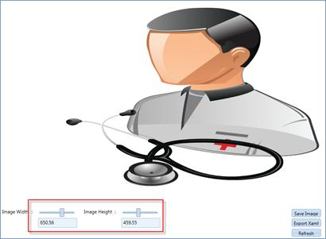
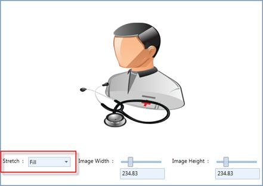
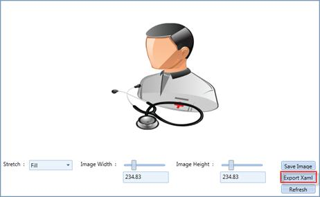
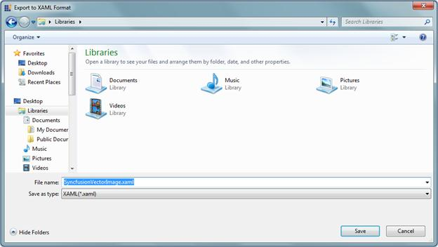

::: {style="DISPLAY: none"}
{#d2h_url_template}{#d2h_package_url style="WIDTH: 0px; DISPLAY: none; HEIGHT: 0px"}
:::

::: {.d2h_secondary_topic style="PADDING-BOTTOM: 10pt; MARGIN: 0pt; PADDING-LEFT: 0pt; PADDING-RIGHT: 0pt; PADDING-TOP: 0pt"}
#### Exporting Images as XAML {#exporting-images-as-xaml style="tab-stops: 0pt"}

 

Vector Images can be exported as a xaml file, by using the Vector Image utility. These xaml files can be merged into the application, so that you can use the icons in the application by referring the Resource Key. The selected image will be displayed on the right pane. Using the Sliders, the images can be resized as expected. The resized image will not deviate from its clarity.

 

{border="0"}

Figure 1180: Resizing the image

*[]{style="COLOR: black"}* 

The Stretch mode can also be applied to the selected image using the Combo Box as shown in following illustration.

 

{border="0"}

Figure 1181: Stretch Mode

 

A selected image can be exported as XAML by clicking the Export XAML button.

{border="0"}

Figure 1182: Exporting XAML

 

A Save dialog will prompt you for the Save location.

[]{style="FONT-FAMILY: 'Trebuchet MS','sans-serif'; COLOR: #15428b; FONT-SIZE: 9pt"} 

{border="0"}

Figure 1183: Save xaml file

 

By selecting the Save option, Vector Image will be saved as a xaml file.

 

 

[]{#related-topics}
:::
