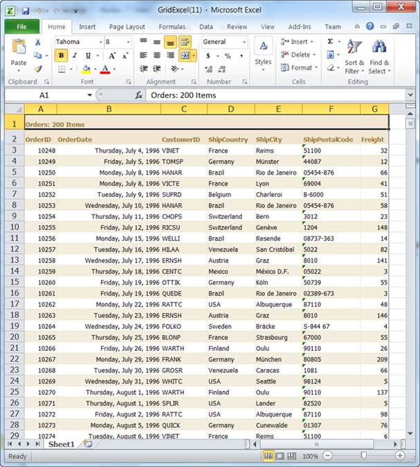

::: {style="DISPLAY: none"}
{#d2h_url_template}{#d2h_package_url style="WIDTH: 0px; DISPLAY: none; HEIGHT: 0px"}
:::

::: {.d2h_secondary_topic style="PADDING-BOTTOM: 10pt; MARGIN: 0pt; PADDING-LEFT: 0pt; PADDING-RIGHT: 0pt; PADDING-TOP: 0pt"}
#### Exporting through Custom Buttons {#exporting-through-custom-buttons style="tab-stops: 0pt"}

 

The steps to export through custom buttons are as follows:

1.   Create a model in the application. Refer to [[GettingStarted\>Adding a model to the Application]{style="COLOR: blue"}]{.underline}.

2.   Create a strongly typed view. Refer to [[How to\>Strongly Typed View]{style="COLOR: blue"}]{.underline}.

3.   In the view, use the **Model** property in the **DataSource** to bind the data source.

 

+------------------------------------------------------------------------------------------------------------------------------------------------------------------------------------------------------------------------------------------------------------+
| **[View \[ASPX\][]{style="BACKGROUND: yellow"}]{style="FONT-FAMILY: 'Courier New'"}**                                                                                                                                                                      |
|                                                                                                                                                                                                                                                            |
| [\<%]{style="FONT-FAMILY: 'Courier New'; BACKGROUND: yellow"}[=]{style="FONT-FAMILY: 'Courier New'; COLOR: blue"}[Html.Syncfusion().Grid\<[Order]{style="COLOR: #2b91af"}\>([\"OrdersGrid\"]{style="COLOR: #a31515"})]{style="FONT-FAMILY: 'Courier New'"} |
|                                                                                                                                                                                                                                                            |
| [            .Datasource(Model)]{style="FONT-FAMILY: 'Courier New'"}                                                                                                                                                                                       |
|                                                                                                                                                                                                                                                            |
| [            .Caption([\"Orders\"]{style="COLOR: #a31515"})            ]{style="FONT-FAMILY: 'Courier New'"}                                                                                                                                               |
|                                                                                                                                                                                                                                                            |
| [            .Column(column =\>]{style="FONT-FAMILY: 'Courier New'"}                                                                                                                                                                                       |
|                                                                                                                                                                                                                                                            |
| [            {]{style="FONT-FAMILY: 'Courier New'"}                                                                                                                                                                                                        |
|                                                                                                                                                                                                                                                            |
| [                column.Add(c =\> c.OrderID).HeaderText([\"Order ID\"]{style="COLOR: #a31515"});]{style="FONT-FAMILY: 'Courier New'"}                                                                                                                      |
|                                                                                                                                                                                                                                                            |
| [                column.Add(c =\> c.OrderDate).HeaderText([\"Order Date\"]{style="COLOR: #a31515"}).Format([\"{0:dddd, MMMM d, yyyy}\"]{style="COLOR: #a31515"});                ]{style="FONT-FAMILY: 'Courier New'"}                                     |
|                                                                                                                                                                                                                                                            |
| [                column.Add(c =\> c.CustomerID).HeaderText([\"Customer ID\"]{style="COLOR: #a31515"});]{style="FONT-FAMILY: 'Courier New'"}                                                                                                                |
|                                                                                                                                                                                                                                                            |
| [                column.Add(c =\> c.ShipCountry).HeaderText([\"Ship Country\"]{style="COLOR: #a31515"});]{style="FONT-FAMILY: 'Courier New'"}                                                                                                              |
|                                                                                                                                                                                                                                                            |
| [                column.Add(c =\> c.ShipCity).HeaderText([\"Ship City\"]{style="COLOR: #a31515"});]{style="FONT-FAMILY: 'Courier New'"}                                                                                                                    |
|                                                                                                                                                                                                                                                            |
| [                column.Add(c =\> c.ShipPostalCode).HeaderText([\"Ship postal Code\"]{style="COLOR: #a31515"});]{style="FONT-FAMILY: 'Courier New'"}                                                                                                       |
|                                                                                                                                                                                                                                                            |
| [                column.Add(c =\> c.Freight).HeaderText([\"Frieght\"]{style="COLOR: #a31515"}).Format([\"{Freight:#,#}\"]{style="COLOR: #a31515"});]{style="FONT-FAMILY: 'Courier New'"}                                                                   |
|                                                                                                                                                                                                                                                            |
| [            })]{style="FONT-FAMILY: 'Courier New'"}                                                                                                                                                                                                       |
|                                                                                                                                                                                                                                                            |
| [                .EnablePaging()]{style="FONT-FAMILY: 'Courier New'"}                                                                                                                                                                                      |
|                                                                                                                                                                                                                                                            |
| [                .EnableSorting()]{style="FONT-FAMILY: 'Courier New'"}                                                                                                                                                                                     |
|                                                                                                                                                                                                                                                            |
| [                .AutoFormat([Skins]{style="COLOR: #2b91af"}.Sandune)]{style="FONT-FAMILY: 'Courier New'"}                                                                                                                                                 |
|                                                                                                                                                                                                                                                            |
| [         [%\>]{style="BACKGROUND: yellow"}]{style="FONT-FAMILY: 'Courier New'"}                                                                                                                                                                           |
+------------------------------------------------------------------------------------------------------------------------------------------------------------------------------------------------------------------------------------------------------------+

 

 

+------------------------------------------------------------------------------------------------------------------------------------------------------------------------------------------------------------------------------------------------------------+
| **[View \[cshtml\][]{style="BACKGROUND: yellow"}]{style="FONT-FAMILY: 'Courier New'"}**                                                                                                                                                                    |
|                                                                                                                                                                                                                                                            |
| [\@{]{style="FONT-FAMILY: 'Courier New'; BACKGROUND: yellow"}[ ]{style="FONT-FAMILY: 'Courier New'; COLOR: blue"}[Html.Syncfusion().Grid\<[Order]{style="COLOR: #2b91af"}\>([\"OrdersGrid\"]{style="COLOR: #a31515"})]{style="FONT-FAMILY: 'Courier New'"} |
|                                                                                                                                                                                                                                                            |
| [            .Datasource(Model)]{style="FONT-FAMILY: 'Courier New'"}                                                                                                                                                                                       |
|                                                                                                                                                                                                                                                            |
| [            .Caption([\"Orders\"]{style="COLOR: #a31515"})            ]{style="FONT-FAMILY: 'Courier New'"}                                                                                                                                               |
|                                                                                                                                                                                                                                                            |
| [            .Column(column =\>]{style="FONT-FAMILY: 'Courier New'"}                                                                                                                                                                                       |
|                                                                                                                                                                                                                                                            |
| [            {]{style="FONT-FAMILY: 'Courier New'"}                                                                                                                                                                                                        |
|                                                                                                                                                                                                                                                            |
| [                column.Add(c =\> c.OrderID).HeaderText([\"Order ID\"]{style="COLOR: #a31515"});]{style="FONT-FAMILY: 'Courier New'"}                                                                                                                      |
|                                                                                                                                                                                                                                                            |
| [                column.Add(c =\> c.OrderDate).HeaderText([\"Order Date\"]{style="COLOR: #a31515"}).Format([\"{0:dddd, MMMM d, yyyy}\"]{style="COLOR: #a31515"});                ]{style="FONT-FAMILY: 'Courier New'"}                                     |
|                                                                                                                                                                                                                                                            |
| [                column.Add(c =\> c.CustomerID).HeaderText([\"Customer ID\"]{style="COLOR: #a31515"});]{style="FONT-FAMILY: 'Courier New'"}                                                                                                                |
|                                                                                                                                                                                                                                                            |
| [                column.Add(c =\> c.ShipCountry).HeaderText([\"Ship Country\"]{style="COLOR: #a31515"});]{style="FONT-FAMILY: 'Courier New'"}                                                                                                              |
|                                                                                                                                                                                                                                                            |
| [                column.Add(c =\> c.ShipCity).HeaderText([\"Ship City\"]{style="COLOR: #a31515"});]{style="FONT-FAMILY: 'Courier New'"}                                                                                                                    |
|                                                                                                                                                                                                                                                            |
| [                column.Add(c =\> c.ShipPostalCode).HeaderText([\"Ship postal Code\"]{style="COLOR: #a31515"});]{style="FONT-FAMILY: 'Courier New'"}                                                                                                       |
|                                                                                                                                                                                                                                                            |
| [                column.Add(c =\> c.Freight).HeaderText([\"Frieght\"]{style="COLOR: #a31515"}).Format([\"{Freight:#,#}\"]{style="COLOR: #a31515"});]{style="FONT-FAMILY: 'Courier New'"}                                                                   |
|                                                                                                                                                                                                                                                            |
| [            })]{style="FONT-FAMILY: 'Courier New'"}                                                                                                                                                                                                       |
|                                                                                                                                                                                                                                                            |
| [                .EnablePaging()]{style="FONT-FAMILY: 'Courier New'"}                                                                                                                                                                                      |
|                                                                                                                                                                                                                                                            |
| [                .EnableSorting()]{style="FONT-FAMILY: 'Courier New'"}                                                                                                                                                                                     |
|                                                                                                                                                                                                                                                            |
| [                .AutoFormat([Skins]{style="COLOR: #2b91af"}.Sandune)]{style="FONT-FAMILY: 'Courier New'"}                                                                                                                                                 |
|                                                                                                                                                                                                                                                            |
| [                .Render();]{style="FONT-FAMILY: 'Courier New'"}                                                                                                                                                                                           |
|                                                                                                                                                                                                                                                            |
| [         [}]{style="BACKGROUND: yellow"}]{style="FONT-FAMILY: 'Courier New'"}                                                                                                                                                                             |
+------------------------------------------------------------------------------------------------------------------------------------------------------------------------------------------------------------------------------------------------------------+

 

 

4.   Create a button element in the view page and write the code displayed below for the button click event.

[]{style="FONT-FAMILY: Consolas; COLOR: blue; FONT-SIZE: 9.5pt"} 

+---------------------------------------------------------------------------------------------------------------------------------------------------------------------------------------------------------------------------------+
| [\<]{style="FONT-FAMILY: 'Courier New'; COLOR: blue"}[sscript]{style="FONT-FAMILY: 'Courier New'; COLOR: maroon"}[ [type]{style="COLOR: red"}[=\"text/javascript\"\>]{style="COLOR: blue"}]{style="FONT-FAMILY: 'Courier New'"} |
|                                                                                                                                                                                                                                 |
| [               \$(document).ready([function]{style="COLOR: blue"} () {]{style="FONT-FAMILY: 'Courier New'"}                                                                                                                    |
|                                                                                                                                                                                                                                 |
| [                   \$([\"#export\"]{style="COLOR: maroon"}).bind([\'click\']{style="COLOR: maroon"}, [function]{style="COLOR: blue"} () {                   ]{style="FONT-FAMILY: 'Courier New'"}                              |
|                                                                                                                                                                                                                                 |
| [                       [// Find the gridobject;]{style="COLOR: darkgreen"}]{style="FONT-FAMILY: 'Courier New'"}                                                                                                                |
|                                                                                                                                                                                                                                 |
| [                       [var]{style="COLOR: blue"} gridObj = \$find([\"OrdersGrid\"]{style="COLOR: maroon"});]{style="FONT-FAMILY: 'Courier New'"}                                                                              |
|                                                                                                                                                                                                                                 |
| [                       [// Set the ExcelExport action mapper using Set_ExcelExportMapper().]{style="COLOR: darkgreen"}]{style="FONT-FAMILY: 'Courier New'"}                                                                    |
|                                                                                                                                                                                                                                 |
| [                       gridObj.set_ExcelExportMapper([\"ExportToExcel\"]{style="COLOR: maroon"});]{style="FONT-FAMILY: 'Courier New'"}                                                                                         |
|                                                                                                                                                                                                                                 |
| [                       ]{style="FONT-FAMILY: 'Courier New'"}                                                                                                                                                                   |
|                                                                                                                                                                                                                                 |
| [                       [// Call the SendExcelExportRequest().]{style="COLOR: darkgreen"}]{style="FONT-FAMILY: 'Courier New'"}                                                                                                  |
|                                                                                                                                                                                                                                 |
| [                       gridObj.sendExcelExportRequest();]{style="FONT-FAMILY: 'Courier New'"}                                                                                                                                  |
|                                                                                                                                                                                                                                 |
| [                   });]{style="FONT-FAMILY: 'Courier New'"}                                                                                                                                                                    |
|                                                                                                                                                                                                                                 |
| [               });]{style="FONT-FAMILY: 'Courier New'"}                                                                                                                                                                        |
|                                                                                                                                                                                                                                 |
| [               ]{style="FONT-FAMILY: 'Courier New'"}                                                                                                                                                                           |
|                                                                                                                                                                                                                                 |
| [         [\</]{style="COLOR: blue"}[script]{style="COLOR: maroon"}[\>]{style="COLOR: blue"}]{style="FONT-FAMILY: 'Courier New'"}                                                                                               |
+---------------------------------------------------------------------------------------------------------------------------------------------------------------------------------------------------------------------------------+

[]{style="FONT-FAMILY: Consolas; COLOR: blue; FONT-SIZE: 9.5pt"} 

[]{style="FONT-FAMILY: Consolas; COLOR: blue; FONT-SIZE: 9.5pt"} 

5.   Specify the file name and Excel version details in the **ExportToExcel()** method.

[]{style="FONT-FAMILY: Consolas; FONT-SIZE: 9.5pt"} 

+----------------------------------------------------------------------------------------------------------------------------------------------------------------------------------------------------------------------------------------------------------------------+
| [///]{style="FONT-FAMILY: 'Courier New'; COLOR: gray"}[ ]{style="FONT-FAMILY: 'Courier New'; COLOR: green"}[\<summary\>]{style="FONT-FAMILY: 'Courier New'; COLOR: gray"}[]{style="FONT-FAMILY: 'Courier New'"}                                                      |
|                                                                                                                                                                                                                                                                      |
| [        [///]{style="COLOR: gray"}[ Used to export the grid as an Excel worksheet.]{style="COLOR: green"}]{style="FONT-FAMILY: 'Courier New'"}                                                                                                                      |
|                                                                                                                                                                                                                                                                      |
| [        [///]{style="COLOR: gray"}[ ]{style="COLOR: green"}[\</summary\>]{style="COLOR: gray"}]{style="FONT-FAMILY: 'Courier New'"}                                                                                                                                 |
|                                                                                                                                                                                                                                                                      |
| [        [///]{style="COLOR: gray"}[ ]{style="COLOR: green"}[\<param name=\"grid\"\>]{style="COLOR: gray"}[Grid object.]{style="COLOR: green"}[\</param\>]{style="COLOR: gray"}]{style="FONT-FAMILY: 'Courier New'"}                                                 |
|                                                                                                                                                                                                                                                                      |
| [        [///]{style="COLOR: gray"}[ ]{style="COLOR: green"}[\<returns\>]{style="COLOR: gray"}[Excel file.]{style="COLOR: green"}[\</returns\>]{style="COLOR: gray"}]{style="FONT-FAMILY: 'Courier New'"}                                                            |
|                                                                                                                                                                                                                                                                      |
| [        [public]{style="COLOR: blue"} [ActionResult]{style="COLOR: #2b91af"} ExportToExcel()]{style="FONT-FAMILY: 'Courier New'"}                                                                                                                                   |
|                                                                                                                                                                                                                                                                      |
| [        {]{style="FONT-FAMILY: 'Courier New'"}                                                                                                                                                                                                                      |
|                                                                                                                                                                                                                                                                      |
| [            [var]{style="COLOR: blue"} data = [new]{style="COLOR: blue"} [NorthwindDataContext]{style="COLOR: #2b91af"}().Orders.Take(200).ToList();]{style="FONT-FAMILY: 'Courier New'"}                                                                           |
|                                                                                                                                                                                                                                                                      |
| [  **return**]{style="FONT-FAMILY: 'Courier New'; COLOR: blue"}**[ data.GridExportToExcel\<[Order]{style="COLOR: #2b91af"}\>([\"GridExcel.xlsx\"]{style="COLOR: #a31515"}, [ExcelVersion]{style="COLOR: #2b91af"}.Excel2007);]{style="FONT-FAMILY: 'Courier New'"}** |
|                                                                                                                                                                                                                                                                      |
| [        }]{style="FONT-FAMILY: 'Courier New'"}                                                                                                                                                                                                                      |
+----------------------------------------------------------------------------------------------------------------------------------------------------------------------------------------------------------------------------------------------------------------------+

 

6.   Run the application and click the **Export** button. The grid will appear as displayed below.

 

{border="0"}

Figure 199: Exported Grid Content

 

[]{#related-topics}
:::
