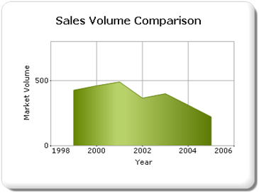

::: {style="DISPLAY: none"}
{#d2h_url_template}{#d2h_package_url style="WIDTH: 0px; DISPLAY: none; HEIGHT: 0px"}
:::

::::: {#nsbanner .d2h_main_nsbanner style="BORDER-BOTTOM: #999999 1px solid; POSITION: relative; PADDING-BOTTOM: 0px; BACKGROUND-COLOR: transparent; PADDING-LEFT: 0px; PADDING-RIGHT: 0px; DISPLAY: none; BORDER-TOP: #999999 1px solid; PADDING-TOP: 0px; LEFT: 0px"}
:::: {#TitleRow .d2h_main_titlerow style="PADDING-BOTTOM: 4px; BACKGROUND-COLOR: transparent; PADDING-LEFT: 22px; WIDTH: 100%; PADDING-RIGHT: 10px; DISPLAY: none; PADDING-TOP: 4px"}
::: {#ienav .d2h_main_ienav style="DISPLAY: none"}
{#D2HPrevious .D2HPreviousEnabled}  {#D2HNext .D2HNextEnabled}
:::
::::
:::::

:::::: {#nstext .d2h_main_nstext style="PADDING-BOTTOM: 10px; BACKGROUND-COLOR: transparent; PADDING-LEFT: 22px; PADDING-RIGHT: 10px; HEIGHT: 100%; OVERFLOW: auto; PADDING-TOP: 5px" hasuserbackground="true" valign="bottom"}
::: {#d2h_breadcrumbs .d2h_breadcrumbs}
[Essential Studio User Guide Documentation](ms-xhelp:///?Id=12457748-09e3-4d74-a240-8e049cedf030){.d2h_breadcrumbsNormal}[ \> ]{.d2h_breadcrumbsLinkSeparator}[User Interface Edition](ms-xhelp:///?Id=c29296b7-531c-413b-a0ec-488ca1f7f669){.d2h_breadcrumbsNormal}[ \> ]{.d2h_breadcrumbsLinkSeparator}[Essential ASP.NET MVC](ms-xhelp:///?Id=4b14e7d1-65c4-4f67-b1aa-2c37709905a5){.d2h_breadcrumbsNormal}[ \> ]{.d2h_breadcrumbsLinkSeparator}[Essential Chart]{.d2h_breadcrumbsContentsOnly}[ \> ]{.d2h_breadcrumbsLinkSeparator}[Concepts and Features](ms-xhelp:///?Id=696f5666-8b81-4685-9bd9-12198f06f3ad){.d2h_breadcrumbsNormal}[ \> ]{.d2h_breadcrumbsLinkSeparator}[Exporting](ms-xhelp:///?Id=6ebb1818-ba28-4765-a17f-b54de9f06f7a){.d2h_breadcrumbsNormal}
:::

### Exporting to an Image {#exporting-to-an-image style="tab-stops: 0pt"}

Exporting a chart to an image format enhances its portability, i.e., to an Excel sheet, Word document, PDF document, etc. By default, the chart is exported in the Bitmap format. The following table lists the file formats a chart can be exported to:

[]{style="FONT-FAMILY: 'Calibri','sans-serif'"} 

::: {align="center"}
  ---------------- -------------
  File Extension   File Type
  .bmp             BMP
  .jpg             JPEG
  .jpeg            JPEG
  .gif             GIF
  .tiff            TIFF
  .Wmf             WMF
  .Png             PNG
  .emf             EMF
  .eps             Post Script
  ---------------- -------------
:::

[]{style="FONT-FAMILY: 'Calibri','sans-serif'"} 

You can export the chart image as an image file in several different formats mentioned above, by determining the ChartImageFormat argument in the ExporttoImage function.

If the specified extension is none of the above listed formats, then the chart is exported as a Bitmap.

The chart can easily be exported as an image file in several different formats by determining the **[ChartImageFormat ]{style="COLOR: #2b91af"}**argument in the **ExporttoImage** function.

 

::: {style="BORDER-BOTTOM: #c8c8c8 1pt solid; BORDER-LEFT: #c8c8c8 1pt solid; PADDING-BOTTOM: 1pt; MARGIN-TOP: 0pt; PADDING-LEFT: 4pt; PADDING-RIGHT: 4pt; MARGIN-BOTTOM: 0pt; BACKGROUND: #f0f0f0; BORDER-TOP: #c8c8c8 1pt solid; BORDER-RIGHT: #c8c8c8 1pt solid; PADDING-TOP: 1pt"}
\[C#\]

**[]{style="FONT-FAMILY: 'Calibri','sans-serif'"}** 

[chartModel.ExportToImage(FileName, [ChartImageFormat]{style="COLOR: #2b91af"}.Jpeg);]{style="FONT-FAMILY: 'Courier New'"}
:::

[]{style="FONT-FAMILY: 'Calibri','sans-serif'"} 

[]{style="FONT-FAMILY: 'Calibri','sans-serif'"} 

[]{style="FONT-FAMILY: 'Calibri','sans-serif'"} 

**[]{style="FONT-FAMILY: 'Calibri','sans-serif'"}** 

\
 Figure 340: Exported JPEG image

[]{style="FONT-FAMILY: 'Calibri','sans-serif'; COLOR: black"} 

[]{#related-topics}
::::::
