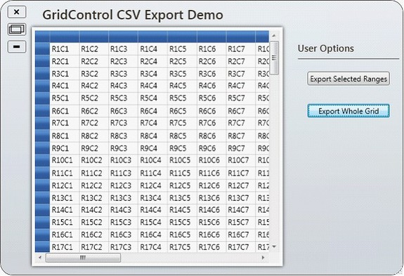
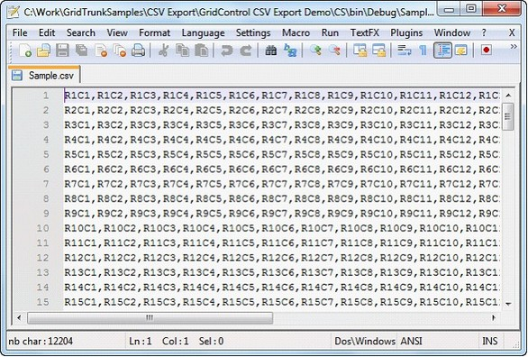
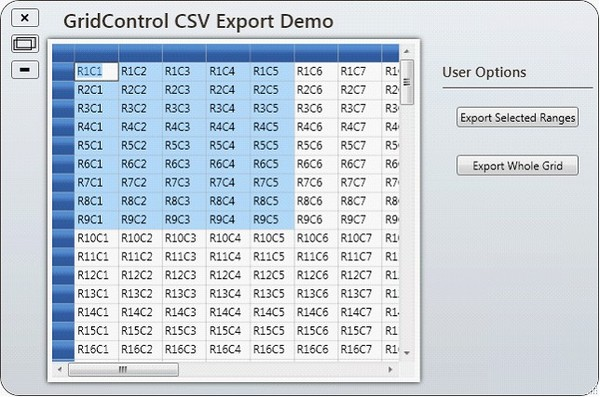
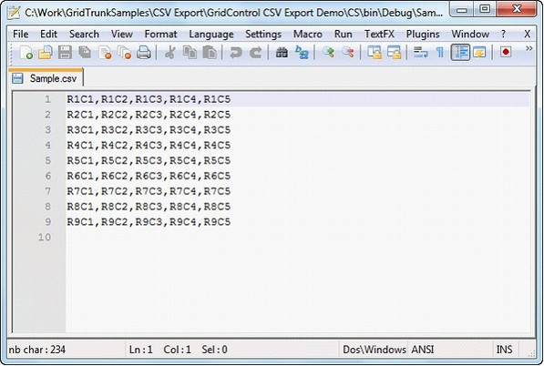

::: {style="DISPLAY: none"}
{#d2h_url_template}{#d2h_package_url style="WIDTH: 0px; DISPLAY: none; HEIGHT: 0px"}
:::

::: {.d2h_secondary_topic style="PADDING-BOTTOM: 10pt; MARGIN: 0pt; PADDING-LEFT: 0pt; PADDING-RIGHT: 0pt; PADDING-TOP: 0pt"}
#### Exporting to CSV[]{style="BACKGROUND: white"} {#exporting-to-csv style="tab-stops: 0pt"}

[The ExportToCSV method of the GridModelExportExtensions class enables a grid control to be easily exported to CSV format.]{style="BACKGROUND: white"}

**[]{style="BACKGROUND: white"}** 

[To enable exporting, ]{style="FONT-FAMILY: 'Calibri','sans-serif'"}[the following .dll files must be added along with the default .dll files in the reference folder:]{style="BACKGROUND: white"}

**[]{style="BACKGROUND: white"}** 

[·      ]{style="FONT-FAMILY: Symbol"}[Syncfusion.XlsIO.Base]{style="BACKGROUND: white"}

[·      ]{style="FONT-FAMILY: Symbol"}[Syncfusion.XlsIO.WPF ]{style="BACKGROUND: white"}

[·      ]{style="FONT-FAMILY: Symbol"}[Syncfusion.GridConverter.Wpf]{style="BACKGROUND: white"}

**[]{style="BACKGROUND: white; COLOR: #15428b"}** 

**[]{style="BACKGROUND: white; COLOR: #15428b"}** 

[Export Options]{style="BACKGROUND: white"}

[There are two options for exporting a grid control:]{style="BACKGROUND: white"}

1.   Export Whole Grid -- which exports an entire grid to CSV format.

2.   Export Selected Range -- which exports only a selected range to CSV format.

**[]{style="BACKGROUND: white; COLOR: #15428b"}** 

Export Whole Grid

You can convert the entire content of a grid control to a CSV file by using the following code:

 

+---------------------------------------------------------------------------------------------------------------------------------------------------------------+
| [\[C#\]]{style="FONT-FAMILY: 'Courier New'; BACKGROUND: white; COLOR: black"}                                                                                 |
|                                                                                                                                                               |
| []{style="FONT-FAMILY: 'Courier New'; BACKGROUND: white; COLOR: black"}                                                                                       |
|                                                                                                                                                               |
| [this]{style="FONT-FAMILY: 'Courier New'; COLOR: blue"}[.gc.Model.ExportToCSV([\"Sample.csv\"]{style="COLOR: #a31515"});]{style="FONT-FAMILY: 'Courier New'"} |
|                                                                                                                                                               |
| []{style="FONT-FAMILY: 'Courier New'; BACKGROUND: white; COLOR: black"}                                                                                       |
|                                                                                                                                                               |
| [\[VB\]]{style="FONT-FAMILY: 'Courier New'; BACKGROUND: white; COLOR: black"}                                                                                 |
|                                                                                                                                                               |
| []{style="FONT-FAMILY: 'Courier New'; BACKGROUND: white; COLOR: black"}                                                                                       |
|                                                                                                                                                               |
| [Me]{style="FONT-FAMILY: 'Courier New'; COLOR: blue"}[.gc.Model.ExportToCSV([\"Sample.csv\"]{style="COLOR: #a31515"})]{style="FONT-FAMILY: 'Courier New'"}    |
+---------------------------------------------------------------------------------------------------------------------------------------------------------------+

 

When the code runs, the following output displays.

 

{border="0"}

Figure 131: [GridControl to Be Exported]{style="BACKGROUND: white"}

 

When you are ready to export the entire grid, click Export Whole Grid; the grid content will then be converted to CSV format.

 

 

[{border="0"}]{style="BACKGROUND: white"}

Figure 132: [Exported Grid Content In CSV Format]{style="BACKGROUND: white"}

 

Export Selected Range

You can convert selected grid content to CSV format by using the following code:

 

+----------------------------------------------------------------------------------------------------------------------------------------------------+
| [\[C#\]]{style="FONT-FAMILY: 'Calibri','sans-serif'; BACKGROUND: white; COLOR: black"}                                                             |
|                                                                                                                                                    |
| []{style="FONT-FAMILY: 'Calibri','sans-serif'; BACKGROUND: white; COLOR: black"}                                                                   |
|                                                                                                                                                    |
| [GridRangeInfoList]{style="FONT-FAMILY: 'Courier New'; COLOR: #2b91af"}[ rangeList = gc.Model.SelectedRanges;]{style="FONT-FAMILY: 'Courier New'"} |
|                                                                                                                                                    |
| [            [if]{style="COLOR: blue"} (rangeList.Count \> 0)]{style="FONT-FAMILY: 'Courier New'"}                                                 |
|                                                                                                                                                    |
| [            {]{style="FONT-FAMILY: 'Courier New'"}                                                                                                |
|                                                                                                                                                    |
| [                [GridRangeInfo]{style="COLOR: #2b91af"} range = rangeList\[0\];]{style="FONT-FAMILY: 'Courier New'"}                              |
|                                                                                                                                                    |
| [                gc.Model.ExportToCSV(range, [\"Sample.csv\"]{style="COLOR: #a31515"});]{style="FONT-FAMILY: 'Courier New'"}                       |
|                                                                                                                                                    |
| [           }]{style="FONT-FAMILY: 'Courier New'"}                                                                                                 |
+----------------------------------------------------------------------------------------------------------------------------------------------------+

[]{style="FONT-FAMILY: 'Calibri','sans-serif'; BACKGROUND: white; COLOR: black"} 

[]{style="FONT-FAMILY: 'Calibri','sans-serif'; BACKGROUND: white; COLOR: black"} 

+------------------------------------------------------------------------------------------------------------------------------------------------------------------------------+
| []{style="FONT-FAMILY: 'Calibri','sans-serif'; BACKGROUND: white; COLOR: black"}                                                                                             |
|                                                                                                                                                                              |
| [\[VB\]]{style="FONT-FAMILY: 'Calibri','sans-serif'; BACKGROUND: white; COLOR: black"}                                                                                       |
|                                                                                                                                                                              |
| []{style="FONT-FAMILY: 'Calibri','sans-serif'; BACKGROUND: white; COLOR: black"}                                                                                             |
|                                                                                                                                                                              |
| [Dim]{style="FONT-FAMILY: 'Courier New'; COLOR: blue"}[ rangeList [As]{style="COLOR: blue"} GridRangeInfoList = gc.Model.SelectedRanges]{style="FONT-FAMILY: 'Courier New'"} |
|                                                                                                                                                                              |
| [                  [If]{style="COLOR: blue"} rangeList.Count \> 0 [Then]{style="COLOR: blue"}]{style="FONT-FAMILY: 'Courier New'"}                                           |
|                                                                                                                                                                              |
| [                        [Dim]{style="COLOR: blue"} range [As]{style="COLOR: blue"} GridRangeInfo = rangeList(0)]{style="FONT-FAMILY: 'Courier New'"}                        |
|                                                                                                                                                                              |
| [                       gc.Model.ExportToCSV(range, [\"Sample.csv\"]{style="COLOR: #a31515"})]{style="FONT-FAMILY: 'Courier New'"}                                           |
|                                                                                                                                                                              |
| [                 [End]{style="COLOR: blue"} [If]{style="COLOR: blue"}]{style="FONT-FAMILY: 'Courier New'"}                                                                  |
+------------------------------------------------------------------------------------------------------------------------------------------------------------------------------+

[]{style="BACKGROUND: white"} 

When the code runs, the following output displays.

**[]{style="BACKGROUND: white"}** 

[{border="0"}]{style="BACKGROUND: white"}

Figure 133: [Grid Selection to Be Exported]{style="BACKGROUND: white"}

 

To export a selection, highlight the portion of the grid you want to export, and then click Export Selected Range; the selected grid content will then be exported to a CSV file.

 

{border="0"}

Figure 134: [Grid Selection Exported Into CSV Format]{style="BACKGROUND: white"}

[]{style="COLOR: #15428b"} 

 

[]{#related-topics}
:::
