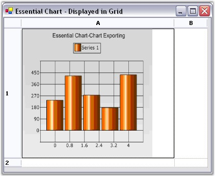

::: {style="DISPLAY: none"}
{#d2h_url_template}{#d2h_package_url style="WIDTH: 0px; DISPLAY: none; HEIGHT: 0px"}
:::

::::: {#nsbanner .d2h_main_nsbanner style="BORDER-BOTTOM: #999999 1px solid; POSITION: relative; PADDING-BOTTOM: 0px; BACKGROUND-COLOR: transparent; PADDING-LEFT: 0px; PADDING-RIGHT: 0px; DISPLAY: none; BORDER-TOP: #999999 1px solid; PADDING-TOP: 0px; LEFT: 0px"}
:::: {#TitleRow .d2h_main_titlerow style="PADDING-BOTTOM: 4px; BACKGROUND-COLOR: transparent; PADDING-LEFT: 22px; WIDTH: 100%; PADDING-RIGHT: 10px; DISPLAY: none; PADDING-TOP: 4px"}
::: {#ienav .d2h_main_ienav style="DISPLAY: none"}
{#D2HPrevious .D2HPreviousEnabled}  {#D2HNext .D2HNextEnabled}
:::
::::
:::::

:::: {#nstext .d2h_main_nstext style="PADDING-BOTTOM: 10px; BACKGROUND-COLOR: transparent; PADDING-LEFT: 22px; PADDING-RIGHT: 10px; HEIGHT: 100%; OVERFLOW: auto; PADDING-TOP: 5px" hasuserbackground="true" valign="bottom"}
::: {#d2h_breadcrumbs .d2h_breadcrumbs}
[Essential Studio User Guide Documentation](ms-xhelp:///?Id=12457748-09e3-4d74-a240-8e049cedf030){.d2h_breadcrumbsNormal}[ \> ]{.d2h_breadcrumbsLinkSeparator}[User Interface Edition](ms-xhelp:///?Id=c29296b7-531c-413b-a0ec-488ca1f7f669){.d2h_breadcrumbsNormal}[ \> ]{.d2h_breadcrumbsLinkSeparator}[Essential Windows](ms-xhelp:///?Id=e60759d8-47a4-4570-9d7a-16a68d63f2ea){.d2h_breadcrumbsNormal}[ \> ]{.d2h_breadcrumbsLinkSeparator}[Essential Chart]{.d2h_breadcrumbsContentsOnly}[ \> ]{.d2h_breadcrumbsLinkSeparator}[Concepts and Features](ms-xhelp:///?Id=71321e9c-336c-4c1c-a127-be9f135ad4bb){.d2h_breadcrumbsNormal}[ \> ]{.d2h_breadcrumbsLinkSeparator}[Exporting](ms-xhelp:///?Id=586ac123-522d-4a6d-988b-b5f39b5b3a36){.d2h_breadcrumbsNormal}
:::

### Exporting to Grid {#exporting-to-grid style="tab-stops: 0pt"}

 

The chart control can be exported into a grid cell (in Essential Grid) as an image using Essential Grid. The chart control provides APIs to convert it to an image, while the Grid will let you insert this image into any specific cell.

 

{border="0"}

Figure 351: Exporting Chart to Grid

 

**** 

 

The steps that are given below will guide you through the process.

 

1.   Add the Syncfusion.Grid.Base and Syncfusion.Grid.Windows assemblies

 

2.   Add a form (Form2) to hold the Grid control in which the chart is to be exported.

 

3.   Drag a grid control onto the Form2.

 

4.   Add the namespace Syncfusion.Windows.forms.Grid in Form2.

 

+---------------------------------------------------------------------------------------------------------------------------------------------+
| **[\[C#\]]{style="FONT-FAMILY: 'Courier New'; COLOR: black"}**                                                                              |
|                                                                                                                                             |
| **[]{style="FONT-FAMILY: 'Courier New'; COLOR: black"}**                                                                                    |
|                                                                                                                                             |
| [using]{style="FONT-FAMILY: 'Courier New'; COLOR: blue"}[ Syncfusion.Windows.Forms.Grid;]{style="FONT-FAMILY: 'Courier New'; COLOR: black"} |
+---------------------------------------------------------------------------------------------------------------------------------------------+

 

+----------------------------------------------------------------------------------------------------------------------------------------------------------------------------+
| **[\[VB]{style="FONT-FAMILY: 'Courier New'; COLOR: black"}[.NET]{style="FONT-FAMILY: 'Courier New'; COLOR: black"}[\]]{style="FONT-FAMILY: 'Courier New'; COLOR: black"}** |
|                                                                                                                                                                            |
| **[]{style="FONT-FAMILY: 'Courier New'; COLOR: black"}**                                                                                                                   |
|                                                                                                                                                                            |
| [Imports]{style="FONT-FAMILY: 'Courier New'; COLOR: blue"}[ Syncfusion.Windows.Forms.Grid]{style="FONT-FAMILY: 'Courier New'; COLOR: black"}                               |
+----------------------------------------------------------------------------------------------------------------------------------------------------------------------------+

 

5.   Add the code snippet that is given below in Form2 to get the chart data into the grid.

 

+-------------------------------------------------------------------------------------------------------------------------------------------------------------------------------------------------------+
| **[\[C#\]]{style="FONT-FAMILY: 'Courier New'; COLOR: black"}**                                                                                                                                        |
|                                                                                                                                                                                                       |
| **[]{style="FONT-FAMILY: 'Courier New'; COLOR: black"}**                                                                                                                                              |
|                                                                                                                                                                                                       |
| [// Creates a new instance of the Imagelist class.]{style="FONT-FAMILY: 'Courier New'; COLOR: green"}                                                                                                 |
|                                                                                                                                                                                                       |
| [ImageList img = new ImageList();]{style="FONT-FAMILY: 'Courier New'; COLOR: black"}                                                                                                                  |
|                                                                                                                                                                                                       |
| []{style="FONT-FAMILY: 'Courier New'; COLOR: black"}                                                                                                                                                  |
|                                                                                                                                                                                                       |
| [// Adds the image to the Image collection of the Imagelist.]{style="FONT-FAMILY: 'Courier New'; COLOR: green"}                                                                                       |
|                                                                                                                                                                                                       |
| [img.Images.Add(Image.FromFile(]{style="FONT-FAMILY: 'Courier New'; COLOR: black"}[this]{style="FONT-FAMILY: 'Courier New'; COLOR: blue"}[.Name));]{style="FONT-FAMILY: 'Courier New'; COLOR: black"} |
|                                                                                                                                                                                                       |
| []{style="FONT-FAMILY: 'Courier New'; COLOR: black"}                                                                                                                                                  |
|                                                                                                                                                                                                       |
| [// Specify the size of the image.]{style="FONT-FAMILY: 'Courier New'; COLOR: green"}                                                                                                                 |
|                                                                                                                                                                                                       |
| [img.ImageSize = ]{style="FONT-FAMILY: 'Courier New'; COLOR: black"}[new]{style="FONT-FAMILY: 'Courier New'; COLOR: blue"}[ Size(256, 256);]{style="FONT-FAMILY: 'Courier New'; COLOR: black"}        |
|                                                                                                                                                                                                       |
| [            ]{style="FONT-FAMILY: 'Courier New'; COLOR: black"}                                                                                                                                      |
|                                                                                                                                                                                                       |
| [// Set the imagelist of the cell.]{style="FONT-FAMILY: 'Courier New'; COLOR: green"}                                                                                                                 |
|                                                                                                                                                                                                       |
| [this]{style="FONT-FAMILY: 'Courier New'; COLOR: blue"}[.gridControl1\[1,1\].ImageList = img;]{style="FONT-FAMILY: 'Courier New'; COLOR: black"}                                                      |
|                                                                                                                                                                                                       |
| []{style="FONT-FAMILY: 'Courier New'; COLOR: black"}                                                                                                                                                  |
|                                                                                                                                                                                                       |
| [// Specify the index for the image to be displayed.]{style="FONT-FAMILY: 'Courier New'; COLOR: green"}                                                                                               |
|                                                                                                                                                                                                       |
| [this]{style="FONT-FAMILY: 'Courier New'; COLOR: blue"}[.gridControl1\[1, 1\].ImageIndex = 0;]{style="FONT-FAMILY: 'Courier New'; COLOR: black"}                                                      |
|                                                                                                                                                                                                       |
| [            ]{style="FONT-FAMILY: 'Courier New'; COLOR: black"}                                                                                                                                      |
|                                                                                                                                                                                                       |
| [// Specify the row and column height of the cell.]{style="FONT-FAMILY: 'Courier New'; COLOR: green"}                                                                                                 |
|                                                                                                                                                                                                       |
| [this]{style="FONT-FAMILY: 'Courier New'; COLOR: blue"}[.gridControl1.RowHeights\[1\] = 300;]{style="FONT-FAMILY: 'Courier New'; COLOR: black"}                                                       |
|                                                                                                                                                                                                       |
| [this]{style="FONT-FAMILY: 'Courier New'; COLOR: blue"}[.gridControl1.ColWidths\[1\] = 300;]{style="FONT-FAMILY: 'Courier New'; COLOR: black"}                                                        |
|                                                                                                                                                                                                       |
| []{style="FONT-FAMILY: 'Courier New'; COLOR: black"}                                                                                                                                                  |
|                                                                                                                                                                                                       |
| [// Specify the image size mode.]{style="FONT-FAMILY: 'Courier New'; COLOR: green"}                                                                                                                   |
|                                                                                                                                                                                                       |
| [this]{style="FONT-FAMILY: 'Courier New'; COLOR: blue"}[.gridControl1\[1, 1\].ImageSizeMode = GridImageSizeMode.CenterImage;]{style="FONT-FAMILY: 'Courier New'; COLOR: black"}                       |
+-------------------------------------------------------------------------------------------------------------------------------------------------------------------------------------------------------+

 

+-------------------------------------------------------------------------------------------------------------------------------------------------------------------------------------------------------------------------------------------------------------------------------------------------------------------------------------------------------------+
| **[\[VB]{style="FONT-FAMILY: 'Courier New'; COLOR: black"}[.NET]{style="FONT-FAMILY: 'Courier New'; COLOR: black"}[\]]{style="FONT-FAMILY: 'Courier New'; COLOR: black"}**                                                                                                                                                                                  |
|                                                                                                                                                                                                                                                                                                                                                             |
| **[]{style="FONT-FAMILY: 'Courier New'; COLOR: black"}**                                                                                                                                                                                                                                                                                                    |
|                                                                                                                                                                                                                                                                                                                                                             |
| [\' Creates a new instance of the Imagelist class.]{style="FONT-FAMILY: 'Courier New'; COLOR: green"}                                                                                                                                                                                                                                                       |
|                                                                                                                                                                                                                                                                                                                                                             |
| [Dim]{style="FONT-FAMILY: 'Courier New'; COLOR: blue"}[ img ]{style="FONT-FAMILY: 'Courier New'; COLOR: black"}[As]{style="FONT-FAMILY: 'Courier New'; COLOR: blue"}[ ImageList = ]{style="FONT-FAMILY: 'Courier New'; COLOR: black"}[New]{style="FONT-FAMILY: 'Courier New'; COLOR: blue"}[ ImageList()]{style="FONT-FAMILY: 'Courier New'; COLOR: black"} |
|                                                                                                                                                                                                                                                                                                                                                             |
| []{style="FONT-FAMILY: 'Courier New'; COLOR: black"}                                                                                                                                                                                                                                                                                                        |
|                                                                                                                                                                                                                                                                                                                                                             |
| [\' Adds the image to the Image collection of the Imagelist.]{style="FONT-FAMILY: 'Courier New'; COLOR: green"}                                                                                                                                                                                                                                             |
|                                                                                                                                                                                                                                                                                                                                                             |
| [img.Images.Add(Image.FromFile(]{style="FONT-FAMILY: 'Courier New'; COLOR: black"}[Me]{style="FONT-FAMILY: 'Courier New'; COLOR: blue"}[.Name))]{style="FONT-FAMILY: 'Courier New'; COLOR: black"}                                                                                                                                                          |
|                                                                                                                                                                                                                                                                                                                                                             |
| []{style="FONT-FAMILY: 'Courier New'; COLOR: black"}                                                                                                                                                                                                                                                                                                        |
|                                                                                                                                                                                                                                                                                                                                                             |
| [\' Specify the size of the image.]{style="FONT-FAMILY: 'Courier New'; COLOR: green"}                                                                                                                                                                                                                                                                       |
|                                                                                                                                                                                                                                                                                                                                                             |
| [img.ImageSize = ]{style="FONT-FAMILY: 'Courier New'; COLOR: black"}[New]{style="FONT-FAMILY: 'Courier New'; COLOR: blue"}[ Size(256, 256)]{style="FONT-FAMILY: 'Courier New'; COLOR: black"}                                                                                                                                                               |
|                                                                                                                                                                                                                                                                                                                                                             |
| []{style="FONT-FAMILY: 'Courier New'; COLOR: black"}                                                                                                                                                                                                                                                                                                        |
|                                                                                                                                                                                                                                                                                                                                                             |
| [\']{style="FONT-FAMILY: 'Courier New'; COLOR: black"}[ Set the imagelist of the cell.]{style="FONT-FAMILY: 'Courier New'; COLOR: green"}                                                                                                                                                                                                                   |
|                                                                                                                                                                                                                                                                                                                                                             |
| [Me]{style="FONT-FAMILY: 'Courier New'; COLOR: blue"}[.gridControl1(1,1).ImageList = img]{style="FONT-FAMILY: 'Courier New'; COLOR: black"}                                                                                                                                                                                                                 |
|                                                                                                                                                                                                                                                                                                                                                             |
| []{style="FONT-FAMILY: 'Courier New'; COLOR: black"}                                                                                                                                                                                                                                                                                                        |
|                                                                                                                                                                                                                                                                                                                                                             |
| [\' Specify the index for the image to be displayed.]{style="FONT-FAMILY: 'Courier New'; COLOR: green"}                                                                                                                                                                                                                                                     |
|                                                                                                                                                                                                                                                                                                                                                             |
| [Me]{style="FONT-FAMILY: 'Courier New'; COLOR: blue"}[.gridControl1(1, 1).ImageIndex = 0]{style="FONT-FAMILY: 'Courier New'; COLOR: black"}                                                                                                                                                                                                                 |
|                                                                                                                                                                                                                                                                                                                                                             |
| []{style="FONT-FAMILY: 'Courier New'; COLOR: black"}                                                                                                                                                                                                                                                                                                        |
|                                                                                                                                                                                                                                                                                                                                                             |
| [\' Specify the row and column height of the cell.]{style="FONT-FAMILY: 'Courier New'; COLOR: green"}                                                                                                                                                                                                                                                       |
|                                                                                                                                                                                                                                                                                                                                                             |
| [Me]{style="FONT-FAMILY: 'Courier New'; COLOR: blue"}[.gridControl1.RowHeights(1) = 300]{style="FONT-FAMILY: 'Courier New'; COLOR: black"}                                                                                                                                                                                                                  |
|                                                                                                                                                                                                                                                                                                                                                             |
| [Me]{style="FONT-FAMILY: 'Courier New'; COLOR: blue"}[.gridControl1.ColWidths(1) = 300]{style="FONT-FAMILY: 'Courier New'; COLOR: black"}                                                                                                                                                                                                                   |
|                                                                                                                                                                                                                                                                                                                                                             |
| []{style="FONT-FAMILY: 'Courier New'; COLOR: black"}                                                                                                                                                                                                                                                                                                        |
|                                                                                                                                                                                                                                                                                                                                                             |
| [\' Specify the image size mode.]{style="FONT-FAMILY: 'Courier New'; COLOR: green"}                                                                                                                                                                                                                                                                         |
|                                                                                                                                                                                                                                                                                                                                                             |
| [Me]{style="FONT-FAMILY: 'Courier New'; COLOR: blue"}[.gridControl1(1, 1).ImageSizeMode = GridImageSizeMode.CenterImage]{style="FONT-FAMILY: 'Courier New'; COLOR: black"}                                                                                                                                                                                  |
+-------------------------------------------------------------------------------------------------------------------------------------------------------------------------------------------------------------------------------------------------------------------------------------------------------------------------------------------------------------+

 

6.   Add the code that is given below in the form with the chart control to be exported.

 

+-------------------------------------------------------------------------------------------------------------------------------------------------------------------------------------------------------------------------------------------+
| **[\[C#\]]{style="FONT-FAMILY: 'Courier New'; COLOR: black"}**                                                                                                                                                                            |
|                                                                                                                                                                                                                                           |
| **[]{style="FONT-FAMILY: 'Courier New'; COLOR: black"}**                                                                                                                                                                                  |
|                                                                                                                                                                                                                                           |
| [private]{style="FONT-FAMILY: 'Courier New'; COLOR: blue"}[ Form2 gridForm;]{style="FONT-FAMILY: 'Courier New'; COLOR: black"}                                                                                                            |
|                                                                                                                                                                                                                                           |
| [this]{style="FONT-FAMILY: 'Courier New'; COLOR: blue"}[.gridForm= ]{style="FONT-FAMILY: 'Courier New'; COLOR: black"}[new]{style="FONT-FAMILY: 'Courier New'; COLOR: blue"}[ Form2();]{style="FONT-FAMILY: 'Courier New'; COLOR: black"} |
|                                                                                                                                                                                                                                           |
| []{style="FONT-FAMILY: 'Courier New'; COLOR: black"}                                                                                                                                                                                      |
|                                                                                                                                                                                                                                           |
| [string]{style="FONT-FAMILY: 'Courier New'; COLOR: blue"}[ fileName=Application.StartupPath+\"\\\\chartexport\";]{style="FONT-FAMILY: 'Courier New'; COLOR: black"}                                                                       |
|                                                                                                                                                                                                                                           |
| [string]{style="FONT-FAMILY: 'Courier New'; COLOR: blue"}[ file = fileName + \".gif\";]{style="FONT-FAMILY: 'Courier New'; COLOR: black"}                                                                                                 |
|                                                                                                                                                                                                                                           |
| []{style="FONT-FAMILY: 'Courier New'; COLOR: black"}                                                                                                                                                                                      |
|                                                                                                                                                                                                                                           |
| [if]{style="FONT-FAMILY: 'Courier New'; COLOR: blue"}[(!System.IO.File.Exists(file))]{style="FONT-FAMILY: 'Courier New'; COLOR: black"}                                                                                                   |
|                                                                                                                                                                                                                                           |
| [this]{style="FONT-FAMILY: 'Courier New'; COLOR: blue"}[.chartControl1.SaveImage(file);]{style="FONT-FAMILY: 'Courier New'; COLOR: black"}                                                                                                |
|                                                                                                                                                                                                                                           |
| []{style="FONT-FAMILY: 'Courier New'; COLOR: black"}                                                                                                                                                                                      |
|                                                                                                                                                                                                                                           |
| [// Specify the filename as the name of the form.]{style="FONT-FAMILY: 'Courier New'; COLOR: green"}                                                                                                                                      |
|                                                                                                                                                                                                                                           |
| [gridForm.Name = file;]{style="FONT-FAMILY: 'Courier New'; COLOR: black"}                                                                                                                                                                 |
|                                                                                                                                                                                                                                           |
| []{style="FONT-FAMILY: 'Courier New'; COLOR: black"}                                                                                                                                                                                      |
|                                                                                                                                                                                                                                           |
| [// Shows the form with grid control with the chart exported.]{style="FONT-FAMILY: 'Courier New'; COLOR: green"}                                                                                                                          |
|                                                                                                                                                                                                                                           |
| [gridForm.ShowDialog();]{style="FONT-FAMILY: 'Courier New'; COLOR: black"}                                                                                                                                                                |
+-------------------------------------------------------------------------------------------------------------------------------------------------------------------------------------------------------------------------------------------+

 

+------------------------------------------------------------------------------------------------------------------------------------------------------------------------------------------------------------------------------------------------------------------------------------------------------------+
| **[\[VB]{style="FONT-FAMILY: 'Courier New'; COLOR: black"}[.NET]{style="FONT-FAMILY: 'Courier New'; COLOR: black"}[\]]{style="FONT-FAMILY: 'Courier New'; COLOR: black"}**                                                                                                                                 |
|                                                                                                                                                                                                                                                                                                            |
| **[]{style="FONT-FAMILY: 'Courier New'; COLOR: black"}**                                                                                                                                                                                                                                                   |
|                                                                                                                                                                                                                                                                                                            |
| [Private]{style="FONT-FAMILY: 'Courier New'; COLOR: blue"}[ gridForm ]{style="FONT-FAMILY: 'Courier New'; COLOR: black"}[As]{style="FONT-FAMILY: 'Courier New'; COLOR: blue"}[ Form2]{style="FONT-FAMILY: 'Courier New'; COLOR: black"}                                                                    |
|                                                                                                                                                                                                                                                                                                            |
| [Me]{style="FONT-FAMILY: 'Courier New'; COLOR: blue"}[.gridForm= ]{style="FONT-FAMILY: 'Courier New'; COLOR: black"}[New]{style="FONT-FAMILY: 'Courier New'; COLOR: blue"}[ Form2()]{style="FONT-FAMILY: 'Courier New'; COLOR: black"}                                                                     |
|                                                                                                                                                                                                                                                                                                            |
| [                        ]{style="FONT-FAMILY: 'Courier New'; COLOR: black"}                                                                                                                                                                                                                               |
|                                                                                                                                                                                                                                                                                                            |
| [Dim]{style="FONT-FAMILY: 'Courier New'; COLOR: blue"}[ fileName ]{style="FONT-FAMILY: 'Courier New'; COLOR: black"}[As String]{style="FONT-FAMILY: 'Courier New'; COLOR: blue"}[ =Application.StartupPath & \"\\chartexport\"]{style="FONT-FAMILY: 'Courier New'; COLOR: black"}                          |
|                                                                                                                                                                                                                                                                                                            |
| [Dim]{style="FONT-FAMILY: 'Courier New'; COLOR: blue"}[ file ]{style="FONT-FAMILY: 'Courier New'; COLOR: black"}[As String]{style="FONT-FAMILY: 'Courier New'; COLOR: blue"}[ = fileName & \".gif\"]{style="FONT-FAMILY: 'Courier New'; COLOR: black"}                                                     |
|                                                                                                                                                                                                                                                                                                            |
| []{style="FONT-FAMILY: 'Courier New'; COLOR: black"}                                                                                                                                                                                                                                                       |
|                                                                                                                                                                                                                                                                                                            |
| [If]{style="FONT-FAMILY: 'Courier New'; COLOR: blue"}[ (]{style="FONT-FAMILY: 'Courier New'; COLOR: black"}[Not]{style="FONT-FAMILY: 'Courier New'; COLOR: blue"}[ System.IO.File.Exists(file)) ]{style="FONT-FAMILY: 'Courier New'; COLOR: black"}[Then]{style="FONT-FAMILY: 'Courier New'; COLOR: blue"} |
|                                                                                                                                                                                                                                                                                                            |
| [    ]{style="FONT-FAMILY: 'Courier New'; COLOR: black"}[Me]{style="FONT-FAMILY: 'Courier New'; COLOR: blue"}[.chartControl1.SaveImage(file)]{style="FONT-FAMILY: 'Courier New'; COLOR: black"}                                                                                                            |
|                                                                                                                                                                                                                                                                                                            |
| [End If]{style="FONT-FAMILY: 'Courier New'; COLOR: blue"}                                                                                                                                                                                                                                                  |
|                                                                                                                                                                                                                                                                                                            |
| []{style="FONT-FAMILY: 'Courier New'; COLOR: black"}                                                                                                                                                                                                                                                       |
|                                                                                                                                                                                                                                                                                                            |
| [\' Specify the filename as the name of the form.]{style="FONT-FAMILY: 'Courier New'; COLOR: green"}                                                                                                                                                                                                       |
|                                                                                                                                                                                                                                                                                                            |
| [gridForm.Name = file]{style="FONT-FAMILY: 'Courier New'; COLOR: black"}                                                                                                                                                                                                                                   |
|                                                                                                                                                                                                                                                                                                            |
| []{style="FONT-FAMILY: 'Courier New'; COLOR: black"}                                                                                                                                                                                                                                                       |
|                                                                                                                                                                                                                                                                                                            |
| [\' Shows the form with grid control with the chart exported.]{style="FONT-FAMILY: 'Courier New'; COLOR: green"}                                                                                                                                                                                           |
|                                                                                                                                                                                                                                                                                                            |
| [gridForm.ShowDialog()]{style="FONT-FAMILY: 'Courier New'; COLOR: black"}                                                                                                                                                                                                                                  |
+------------------------------------------------------------------------------------------------------------------------------------------------------------------------------------------------------------------------------------------------------------------------------------------------------------+

 

A sample demonstrating the above is available in our installation at the following location:

 

\"[My Documents\\Syncfusion\\EssentialStudio\\Version Number\\Windows\\Chart.Windows\\Samples\\2.0\\Export\\Chart Export Data]{.UGHyperlink}\"

[]{#p255} 

[]{#related-topics}
::::
