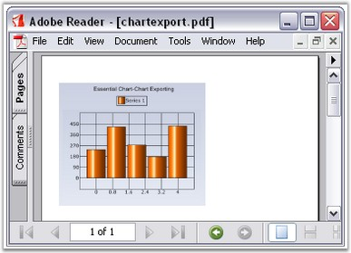

::: {style="DISPLAY: none"}
{#d2h_url_template}{#d2h_package_url style="WIDTH: 0px; DISPLAY: none; HEIGHT: 0px"}
:::

::::: {#nsbanner .d2h_main_nsbanner style="BORDER-BOTTOM: #999999 1px solid; POSITION: relative; PADDING-BOTTOM: 0px; BACKGROUND-COLOR: transparent; PADDING-LEFT: 0px; PADDING-RIGHT: 0px; DISPLAY: none; BORDER-TOP: #999999 1px solid; PADDING-TOP: 0px; LEFT: 0px"}
:::: {#TitleRow .d2h_main_titlerow style="PADDING-BOTTOM: 4px; BACKGROUND-COLOR: transparent; PADDING-LEFT: 22px; WIDTH: 100%; PADDING-RIGHT: 10px; DISPLAY: none; PADDING-TOP: 4px"}
::: {#ienav .d2h_main_ienav style="DISPLAY: none"}
{#D2HPrevious .D2HPreviousEnabled}  {#D2HNext .D2HNextEnabled}
:::
::::
:::::

:::: {#nstext .d2h_main_nstext style="PADDING-BOTTOM: 10px; BACKGROUND-COLOR: transparent; PADDING-LEFT: 22px; PADDING-RIGHT: 10px; HEIGHT: 100%; OVERFLOW: auto; PADDING-TOP: 5px" hasuserbackground="true" valign="bottom"}
::: {#d2h_breadcrumbs .d2h_breadcrumbs}
[Essential Studio User Guide Documentation](ms-xhelp:///?Id=12457748-09e3-4d74-a240-8e049cedf030){.d2h_breadcrumbsNormal}[ \> ]{.d2h_breadcrumbsLinkSeparator}[User Interface Edition](ms-xhelp:///?Id=c29296b7-531c-413b-a0ec-488ca1f7f669){.d2h_breadcrumbsNormal}[ \> ]{.d2h_breadcrumbsLinkSeparator}[Essential Windows](ms-xhelp:///?Id=e60759d8-47a4-4570-9d7a-16a68d63f2ea){.d2h_breadcrumbsNormal}[ \> ]{.d2h_breadcrumbsLinkSeparator}[Essential Chart]{.d2h_breadcrumbsContentsOnly}[ \> ]{.d2h_breadcrumbsLinkSeparator}[Concepts and Features](ms-xhelp:///?Id=71321e9c-336c-4c1c-a127-be9f135ad4bb){.d2h_breadcrumbsNormal}[ \> ]{.d2h_breadcrumbsLinkSeparator}[Exporting](ms-xhelp:///?Id=586ac123-522d-4a6d-988b-b5f39b5b3a36){.d2h_breadcrumbsNormal}
:::

### Exporting to PDF {#exporting-to-pdf style="tab-stops: 0pt"}

 

The chart control can be exported into a PDF file as an image using Essential PDF. The chart control provides APIs to convert it to an image, while Essential PDF lets you insert this image into a Word Document file programmatically.

 

{border="0"}

 

Figure 353: Exporting Chart to PDF

 

1.   1. Add the Syncfusion.Pdf.Base and Syncfusion.Pdf.Windows assemblies.

 

2.   2. Add the namespace **Syncfusion.Pdf** in your form.

 

+---------------------------------------------------------------------------------------------------------------------------------------+
| **[\[C#\]]{style="FONT-FAMILY: 'Courier New'; COLOR: black"}**                                                                        |
|                                                                                                                                       |
| **[]{style="FONT-FAMILY: 'Courier New'; COLOR: black"}**                                                                              |
|                                                                                                                                       |
| [using]{style="FONT-FAMILY: 'Courier New'; COLOR: blue"}[ Syncfusion.Pdf;]{style="FONT-FAMILY: 'Courier New'; COLOR: black"}          |
|                                                                                                                                       |
| [using]{style="FONT-FAMILY: 'Courier New'; COLOR: blue"}[ Syncfusion.Pdf.Graphics;]{style="FONT-FAMILY: 'Courier New'; COLOR: black"} |
+---------------------------------------------------------------------------------------------------------------------------------------+

 

+----------------------------------------------------------------------------------------------------------------------------------------------------------------------------+
| **[\[VB]{style="FONT-FAMILY: 'Courier New'; COLOR: black"}[.NET]{style="FONT-FAMILY: 'Courier New'; COLOR: black"}[\]]{style="FONT-FAMILY: 'Courier New'; COLOR: black"}** |
|                                                                                                                                                                            |
| **[]{style="FONT-FAMILY: 'Courier New'; COLOR: black"}**                                                                                                                   |
|                                                                                                                                                                            |
| [Imports]{style="FONT-FAMILY: 'Courier New'; COLOR: blue"}[ Syncfusion.Pdf]{style="FONT-FAMILY: 'Courier New'; COLOR: black"}                                              |
|                                                                                                                                                                            |
| [Imports]{style="FONT-FAMILY: 'Courier New'; COLOR: blue"}[ Syncfusion.Pdf.Graphics]{style="FONT-FAMILY: 'Courier New'; COLOR: black"}                                     |
+----------------------------------------------------------------------------------------------------------------------------------------------------------------------------+

 

3.   3. Add the code snippet that is given below in your form.

 

+--------------------------------------------------------------------------------------------------------------------------------------------------------------------------------+
| **[\[C#\]]{style="FONT-FAMILY: 'Courier New'; COLOR: black"}**                                                                                                                 |
|                                                                                                                                                                                |
| **[]{style="FONT-FAMILY: 'Courier New'; COLOR: black"}**                                                                                                                       |
|                                                                                                                                                                                |
| [string]{style="FONT-FAMILY: 'Courier New'; COLOR: blue"}[ fileName=Application.StartupPath+[\"\\\\chartexport\"]{style="COLOR: maroon"};]{style="FONT-FAMILY: 'Courier New'"} |
|                                                                                                                                                                                |
| [string]{style="FONT-FAMILY: 'Courier New'; COLOR: blue"}[ exportFileName = fileName + [\".pdf\"]{style="COLOR: maroon"};]{style="FONT-FAMILY: 'Courier New'"}                 |
|                                                                                                                                                                                |
| [string]{style="FONT-FAMILY: 'Courier New'; COLOR: blue"}[ file = fileName + [\".gif\"]{style="COLOR: maroon"};]{style="FONT-FAMILY: 'Courier New'"}                           |
|                                                                                                                                                                                |
| [this]{style="FONT-FAMILY: 'Courier New'; COLOR: blue"}[.chartControl1.SaveImage(file);]{style="FONT-FAMILY: 'Courier New'"}                                                   |
|                                                                                                                                                                                |
| []{style="FONT-FAMILY: 'Courier New'"}                                                                                                                                         |
|                                                                                                                                                                                |
| [//Create a PDF document]{style="FONT-FAMILY: 'Courier New'; COLOR: green"}                                                                                                    |
|                                                                                                                                                                                |
| [PdfDocument pdfDoc = [new]{style="COLOR: blue"} PdfDocument();]{style="FONT-FAMILY: 'Courier New'"}                                                                           |
|                                                                                                                                                                                |
| []{style="FONT-FAMILY: 'Courier New'"}                                                                                                                                         |
|                                                                                                                                                                                |
| [//Add a page to the empty PDF document]{style="FONT-FAMILY: 'Courier New'; COLOR: green"}                                                                                     |
|                                                                                                                                                                                |
| [pdfDoc.Pages.Add();                   ]{style="FONT-FAMILY: 'Courier New'"}                                                                                                   |
|                                                                                                                                                                                |
| [                                                                                ]{style="FONT-FAMILY: 'Courier New'"}                                                         |
|                                                                                                                                                                                |
| [//Draw chart image in the first page]{style="FONT-FAMILY: 'Courier New'; COLOR: green"}                                                                                       |
|                                                                                                                                                                                |
| [pdfDoc.Pages\[0\].Graphics.DrawImage(PdfImage.FromFile(file), [new]{style="COLOR: blue"} PointF(10, 30));]{style="FONT-FAMILY: 'Courier New'"}                                |
|                                                                                                                                                                                |
| []{style="FONT-FAMILY: 'Courier New'"}                                                                                                                                         |
|                                                                                                                                                                                |
| [//Save the PDF Document to disk.]{style="FONT-FAMILY: 'Courier New'; COLOR: green"}                                                                                           |
|                                                                                                                                                                                |
| [pdfDoc.Save(exportFileName);]{style="FONT-FAMILY: 'Courier New'"}                                                                                                             |
|                                                                                                                                                                                |
| []{style="FONT-FAMILY: 'Courier New'"}                                                                                                                                         |
|                                                                                                                                                                                |
| [  [// Launches the file.                         ]{style="COLOR: green"}]{style="FONT-FAMILY: 'Courier New'"}                                                                 |
|                                                                                                                                                                                |
| [System.Diagnostics.Process.Start(exportFileName);]{style="FONT-FAMILY: 'Courier New'"}                                                                                        |
+--------------------------------------------------------------------------------------------------------------------------------------------------------------------------------+

 

+--------------------------------------------------------------------------------------------------------------------------------------------------------------------------------------------------------------------------------------+
| **[\[VB]{style="FONT-FAMILY: 'Courier New'; COLOR: black"}[.NET]{style="FONT-FAMILY: 'Courier New'; COLOR: black"}[\]]{style="FONT-FAMILY: 'Courier New'; COLOR: black"}**                                                           |
|                                                                                                                                                                                                                                      |
| **[]{style="FONT-FAMILY: 'Courier New'; COLOR: black"}**                                                                                                                                                                             |
|                                                                                                                                                                                                                                      |
| [Dim]{style="FONT-FAMILY: 'Courier New'; COLOR: blue"}[ fileName [As]{style="COLOR: blue"} [String]{style="COLOR: blue"} = Application.StartupPath & [\"\\chartexport\"]{style="COLOR: maroon"}]{style="FONT-FAMILY: 'Courier New'"} |
|                                                                                                                                                                                                                                      |
| [Dim]{style="FONT-FAMILY: 'Courier New'; COLOR: blue"}[ exportFileName [As]{style="COLOR: blue"} [String]{style="COLOR: blue"} = fileName & [\".pdf\"]{style="COLOR: maroon"}]{style="FONT-FAMILY: 'Courier New'"}                   |
|                                                                                                                                                                                                                                      |
| [Dim]{style="FONT-FAMILY: 'Courier New'; COLOR: blue"}[ file [As]{style="COLOR: blue"} [String]{style="COLOR: blue"} = fileName & [\".gif\"]{style="COLOR: maroon"}]{style="FONT-FAMILY: 'Courier New'"}                             |
|                                                                                                                                                                                                                                      |
| [Me]{style="FONT-FAMILY: 'Courier New'; COLOR: blue"}[.chartControl1.SaveImage(file)]{style="FONT-FAMILY: 'Courier New'"}                                                                                                            |
|                                                                                                                                                                                                                                      |
| []{style="FONT-FAMILY: 'Courier New'"}                                                                                                                                                                                               |
|                                                                                                                                                                                                                                      |
| [\'Create a PDF document]{style="FONT-FAMILY: 'Courier New'; COLOR: green"}                                                                                                                                                          |
|                                                                                                                                                                                                                                      |
| [Dim]{style="FONT-FAMILY: 'Courier New'; COLOR: blue"}[ pdfDoc [As]{style="COLOR: blue"} PdfDocument = [New]{style="COLOR: blue"} PdfDocument()]{style="FONT-FAMILY: 'Courier New'"}                                                 |
|                                                                                                                                                                                                                                      |
| []{style="FONT-FAMILY: 'Courier New'"}                                                                                                                                                                                               |
|                                                                                                                                                                                                                                      |
| [\'Add a page to the empty PDF document]{style="FONT-FAMILY: 'Courier New'; COLOR: green"}                                                                                                                                           |
|                                                                                                                                                                                                                                      |
| [pdfDoc.Pages.Add()]{style="FONT-FAMILY: 'Courier New'"}                                                                                                                                                                             |
|                                                                                                                                                                                                                                      |
| []{style="FONT-FAMILY: 'Courier New'"}                                                                                                                                                                                               |
|                                                                                                                                                                                                                                      |
| [\'Draw chart image in the first page]{style="FONT-FAMILY: 'Courier New'; COLOR: green"}                                                                                                                                             |
|                                                                                                                                                                                                                                      |
| [pdfDoc.Pages(0).Graphics.DrawImage(PdfImage.FromFile(file), [New]{style="COLOR: blue"} PointF(10, 30))]{style="FONT-FAMILY: 'Courier New'"}                                                                                         |
|                                                                                                                                                                                                                                      |
| []{style="FONT-FAMILY: 'Courier New'"}                                                                                                                                                                                               |
|                                                                                                                                                                                                                                      |
| [\'Save the PDF Document to disk.]{style="FONT-FAMILY: 'Courier New'; COLOR: green"}                                                                                                                                                 |
|                                                                                                                                                                                                                                      |
| [pdfDoc.Save(exportFileName)]{style="FONT-FAMILY: 'Courier New'"}                                                                                                                                                                    |
|                                                                                                                                                                                                                                      |
| []{style="FONT-FAMILY: 'Courier New'"}                                                                                                                                                                                               |
|                                                                                                                                                                                                                                      |
| [\' Launches the file.                         ]{style="FONT-FAMILY: 'Courier New'; COLOR: green"}                                                                                                                                   |
|                                                                                                                                                                                                                                      |
| [System.Diagnostics.Process.Start(exportFileName)]{style="FONT-FAMILY: 'Courier New'"}                                                                                                                                               |
+--------------------------------------------------------------------------------------------------------------------------------------------------------------------------------------------------------------------------------------+

 

A sample demonstrating the above is available in our installation at the following location:

 

[\"My Documents\\Syncfusion\\EssentialStudio\\Version Number\\Windows\\Chart.Windows\\Samples\\2.0\\Export\\Chart Export Data\"]{.UGHyperlink}

 

[]{#related-topics}
::::
