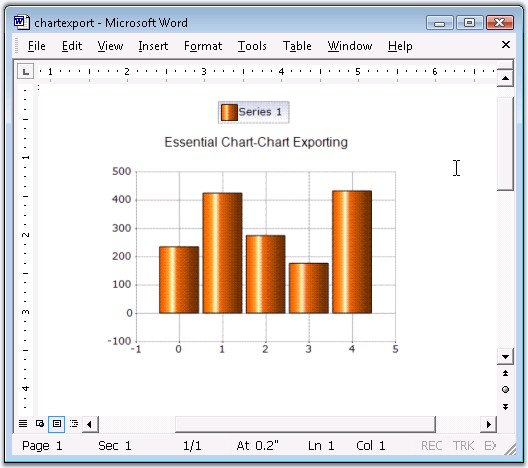

::: {style="DISPLAY: none"}
{#d2h_url_template}{#d2h_package_url style="WIDTH: 0px; DISPLAY: none; HEIGHT: 0px"}
:::

::::: {#nsbanner .d2h_main_nsbanner style="BORDER-BOTTOM: #999999 1px solid; POSITION: relative; PADDING-BOTTOM: 0px; BACKGROUND-COLOR: transparent; PADDING-LEFT: 0px; PADDING-RIGHT: 0px; DISPLAY: none; BORDER-TOP: #999999 1px solid; PADDING-TOP: 0px; LEFT: 0px"}
:::: {#TitleRow .d2h_main_titlerow style="PADDING-BOTTOM: 4px; BACKGROUND-COLOR: transparent; PADDING-LEFT: 22px; WIDTH: 100%; PADDING-RIGHT: 10px; DISPLAY: none; PADDING-TOP: 4px"}
::: {#ienav .d2h_main_ienav style="DISPLAY: none"}
{#D2HPrevious .D2HPreviousEnabled}  {#D2HNext .D2HNextEnabled}
:::
::::
:::::

:::: {#nstext .d2h_main_nstext style="PADDING-BOTTOM: 10px; BACKGROUND-COLOR: transparent; PADDING-LEFT: 22px; PADDING-RIGHT: 10px; HEIGHT: 100%; OVERFLOW: auto; PADDING-TOP: 5px" hasuserbackground="true" valign="bottom"}
::: {#d2h_breadcrumbs .d2h_breadcrumbs}
[Essential Studio User Guide Documentation](ms-xhelp:///?Id=12457748-09e3-4d74-a240-8e049cedf030){.d2h_breadcrumbsNormal}[ \> ]{.d2h_breadcrumbsLinkSeparator}[User Interface Edition](ms-xhelp:///?Id=c29296b7-531c-413b-a0ec-488ca1f7f669){.d2h_breadcrumbsNormal}[ \> ]{.d2h_breadcrumbsLinkSeparator}[Essential ASP.NET](ms-xhelp:///?Id=25c35330-c127-4dad-9a92-ed79dc7261a6){.d2h_breadcrumbsNormal}[ \> ]{.d2h_breadcrumbsLinkSeparator}[Essential Chart]{.d2h_breadcrumbsContentsOnly}[ \> ]{.d2h_breadcrumbsLinkSeparator}[Concepts and Features](ms-xhelp:///?Id=100687ce-82f2-4424-9d16-0949ea76cf15){.d2h_breadcrumbsNormal}[ \> ]{.d2h_breadcrumbsLinkSeparator}[Exporting](ms-xhelp:///?Id=7807ddfa-c63b-48f5-92a7-ab2d219a35c5){.d2h_breadcrumbsNormal}
:::

### Exporting to Word Doc {#exporting-to-word-doc style="tab-stops: 0pt"}

[]{style="FONT-FAMILY: 'Trebuchet MS','sans-serif'; FONT-SIZE: 9pt"} 

The chart control can be exported to a Word doc file as an image using Essential DocIO. The chart control provides APIs to convert it to an image, while DocIO lets you insert this image into a Word Document file programmatically.

[]{style="FONT-FAMILY: 'Trebuchet MS','sans-serif'; FONT-SIZE: 9pt"} 

{border="0"}

[]{style="FONT-FAMILY: 'Trebuchet MS','sans-serif'; FONT-SIZE: 9pt"} 

Figure 315: Exporting Chart to DocIO

[]{style="FONT-FAMILY: 'Trebuchet MS','sans-serif'; FONT-SIZE: 9pt"} 

Given below are the steps that will guide you through this process.

[]{style="FONT-FAMILY: 'Trebuchet MS','sans-serif'; FONT-SIZE: 9pt"} 

1.   Add the Syncfusion.DocIO.Base and Syncfusion.DocIO.Windows assemblies.

 

2.   Add the namespace Syncfusion.DocIO and Syncfusion.DocIO.DLS in your form.

[]{style="FONT-FAMILY: 'Trebuchet MS','sans-serif'; FONT-SIZE: 9pt"} 

+------------------------------------------------------------------------------------------------------------------------------------+
| **[\[C#\]]{style="FONT-FAMILY: 'Courier New'; COLOR: black"}**                                                                     |
|                                                                                                                                    |
| **[]{style="FONT-FAMILY: 'Courier New'; COLOR: black"}**                                                                           |
|                                                                                                                                    |
| [using]{style="FONT-FAMILY: 'Courier New'; COLOR: blue"}[ Syncfusion.DocIO;]{style="FONT-FAMILY: 'Courier New'; COLOR: black"}     |
|                                                                                                                                    |
| [using]{style="FONT-FAMILY: 'Courier New'; COLOR: blue"}[ Syncfusion.DocIO.DLS;]{style="FONT-FAMILY: 'Courier New'; COLOR: black"} |
+------------------------------------------------------------------------------------------------------------------------------------+

[]{style="FONT-FAMILY: 'Trebuchet MS','sans-serif'; FONT-SIZE: 9pt"} 

+-------------------------------------------------------------------------------------------------------------------------------------+
| **[\[VB.NET\]]{style="FONT-FAMILY: 'Courier New'; COLOR: black"}**                                                                  |
|                                                                                                                                     |
| **[]{style="FONT-FAMILY: 'Courier New'; COLOR: black"}**                                                                            |
|                                                                                                                                     |
| [Imports]{style="FONT-FAMILY: 'Courier New'; COLOR: blue"}[ Syncfusion.DocIO]{style="FONT-FAMILY: 'Courier New'; COLOR: black"}     |
|                                                                                                                                     |
| [Imports]{style="FONT-FAMILY: 'Courier New'; COLOR: blue"}[ Syncfusion.DocIO.DLS]{style="FONT-FAMILY: 'Courier New'; COLOR: black"} |
+-------------------------------------------------------------------------------------------------------------------------------------+

[]{style="FONT-FAMILY: 'Trebuchet MS','sans-serif'; FONT-SIZE: 9pt"} 

3.   Add the code snippet that is given below in your form.

[]{style="FONT-FAMILY: 'Trebuchet MS','sans-serif'; FONT-SIZE: 9pt"} 

+--------------------------------------------------------------------------------------------------------------------------------------------------------------------------------------------------------+
| **[\[C#\]]{style="FONT-FAMILY: 'Courier New'; COLOR: black"}**                                                                                                                                         |
|                                                                                                                                                                                                        |
| **[]{style="FONT-FAMILY: 'Courier New'; COLOR: black"}**                                                                                                                                               |
|                                                                                                                                                                                                        |
| [string]{style="FONT-FAMILY: 'Courier New'; COLOR: blue"}[ fileName=Application.StartupPath+\"\\\\chartexport\";]{style="FONT-FAMILY: 'Courier New'; COLOR: black"}                                    |
|                                                                                                                                                                                                        |
| [string]{style="FONT-FAMILY: 'Courier New'; COLOR: blue"}[ exportFileName = fileName + \".doc\";]{style="FONT-FAMILY: 'Courier New'; COLOR: black"}                                                    |
|                                                                                                                                                                                                        |
| [string]{style="FONT-FAMILY: 'Courier New'; COLOR: blue"}[ file = fileName + \".gif\";]{style="FONT-FAMILY: 'Courier New'; COLOR: black"}                                                              |
|                                                                                                                                                                                                        |
| []{style="FONT-FAMILY: 'Courier New'; COLOR: black"}                                                                                                                                                   |
|                                                                                                                                                                                                        |
| [this]{style="FONT-FAMILY: 'Courier New'; COLOR: blue"}[.ChartWebControl1.SaveImage(file);]{style="FONT-FAMILY: 'Courier New'; COLOR: black"}                                                          |
|                                                                                                                                                                                                        |
| []{style="FONT-FAMILY: 'Courier New'; COLOR: black"}                                                                                                                                                   |
|                                                                                                                                                                                                        |
| [ // Create a new document.]{style="FONT-FAMILY: 'Courier New'; COLOR: green"}                                                                                                                         |
|                                                                                                                                                                                                        |
| [WordDocument document = ]{style="FONT-FAMILY: 'Courier New'; COLOR: black"}[new]{style="FONT-FAMILY: 'Courier New'; COLOR: blue"}[ WordDocument();]{style="FONT-FAMILY: 'Courier New'; COLOR: black"} |
|                                                                                                                                                                                                        |
| [                        ]{style="FONT-FAMILY: 'Courier New'; COLOR: black"}                                                                                                                           |
|                                                                                                                                                                                                        |
| [  // Adding a new section to the document.]{style="FONT-FAMILY: 'Courier New'; COLOR: green"}                                                                                                         |
|                                                                                                                                                                                                        |
| [IWSection section = document.AddSection();]{style="FONT-FAMILY: 'Courier New'; COLOR: black"}                                                                                                         |
|                                                                                                                                                                                                        |
| [// Adding a paragraph to the section.]{style="FONT-FAMILY: 'Courier New'; COLOR: green"}                                                                                                              |
|                                                                                                                                                                                                        |
| [IWParagraph paragraph = section.AddParagraph();                                                ]{style="FONT-FAMILY: 'Courier New'; COLOR: black"}                                                    |
|                                                                                                                                                                                                        |
| [                        ]{style="FONT-FAMILY: 'Courier New'; COLOR: black"}                                                                                                                           |
|                                                                                                                                                                                                        |
| [ // Writing text.]{style="FONT-FAMILY: 'Courier New'; COLOR: green"}                                                                                                                                  |
|                                                                                                                                                                                                        |
| [paragraph.AppendText( \"Essential Chart\" );]{style="FONT-FAMILY: 'Courier New'; COLOR: black"}                                                                                                       |
|                                                                                                                                                                                                        |
| []{style="FONT-FAMILY: 'Courier New'; COLOR: black"}                                                                                                                                                   |
|                                                                                                                                                                                                        |
| [ // Adding a new paragraph.       ]{style="FONT-FAMILY: 'Courier New'; COLOR: green"}[         ]{style="FONT-FAMILY: 'Courier New'; COLOR: black"}                                                    |
|                                                                                                                                                                                                        |
| [paragraph = section.AddParagraph();]{style="FONT-FAMILY: 'Courier New'; COLOR: black"}                                                                                                                |
|                                                                                                                                                                                                        |
| [paragraph.ParagraphFormat.HorizontalAlignment = Syncfusion.DLS.HorizontalAlignment.Center;]{style="FONT-FAMILY: 'Courier New'; COLOR: black"}                                                         |
|                                                                                                                                                                                                        |
| []{style="FONT-FAMILY: 'Courier New'; COLOR: black"}                                                                                                                                                   |
|                                                                                                                                                                                                        |
| [ // Inserting chart.]{style="FONT-FAMILY: 'Courier New'; COLOR: green"}                                                                                                                               |
|                                                                                                                                                                                                        |
| [paragraph.AppendPicture( Image.FromFile(file));]{style="FONT-FAMILY: 'Courier New'; COLOR: black"}                                                                                                    |
|                                                                                                                                                                                                        |
| [ // Save the Document to disk.]{style="FONT-FAMILY: 'Courier New'; COLOR: green"}                                                                                                                     |
|                                                                                                                                                                                                        |
| [document.Save(exportFileName , Syncfusion.DocIO.FormatType.Doc );]{style="FONT-FAMILY: 'Courier New'; COLOR: black"}                                                                                  |
|                                                                                                                                                                                                        |
| [                      ]{style="FONT-FAMILY: 'Courier New'; COLOR: black"}                                                                                                                             |
|                                                                                                                                                                                                        |
| [  // Launches the file.     ]{style="FONT-FAMILY: 'Courier New'; COLOR: green"}[                    ]{style="FONT-FAMILY: 'Courier New'; COLOR: black"}                                               |
|                                                                                                                                                                                                        |
| [System.Diagnostics.Process.Start(exportFileName);]{style="FONT-FAMILY: 'Courier New'; COLOR: black"}                                                                                                  |
+--------------------------------------------------------------------------------------------------------------------------------------------------------------------------------------------------------+

[]{style="FONT-FAMILY: 'Trebuchet MS','sans-serif'; FONT-SIZE: 9pt"} 

+------------------------------------------------------------------------------------------------------------------------------------------------------------------------------------------------------------------------------------------------------------------------------------------------------------------------------------------------------------------------+
| **[\[VB.NET\]]{style="FONT-FAMILY: 'Courier New'; COLOR: black"}**                                                                                                                                                                                                                                                                                                     |
|                                                                                                                                                                                                                                                                                                                                                                        |
| **[]{style="FONT-FAMILY: 'Courier New'; COLOR: black"}**                                                                                                                                                                                                                                                                                                               |
|                                                                                                                                                                                                                                                                                                                                                                        |
| [Dim]{style="FONT-FAMILY: 'Courier New'; COLOR: blue"}[ fileName ]{style="FONT-FAMILY: 'Courier New'; COLOR: black"}[As String]{style="FONT-FAMILY: 'Courier New'; COLOR: blue"}[ =Application.StartupPath & \"\\chartexport\"]{style="FONT-FAMILY: 'Courier New'; COLOR: black"}                                                                                      |
|                                                                                                                                                                                                                                                                                                                                                                        |
| [Dim]{style="FONT-FAMILY: 'Courier New'; COLOR: blue"}[ exportFileName ]{style="FONT-FAMILY: 'Courier New'; COLOR: black"}[As String]{style="FONT-FAMILY: 'Courier New'; COLOR: blue"}[ = fileName & \".doc\"]{style="FONT-FAMILY: 'Courier New'; COLOR: black"}                                                                                                       |
|                                                                                                                                                                                                                                                                                                                                                                        |
| [Dim]{style="FONT-FAMILY: 'Courier New'; COLOR: blue"}[ file ]{style="FONT-FAMILY: 'Courier New'; COLOR: black"}[As String]{style="FONT-FAMILY: 'Courier New'; COLOR: blue"}[ = fileName & \".gif\"]{style="FONT-FAMILY: 'Courier New'; COLOR: black"}                                                                                                                 |
|                                                                                                                                                                                                                                                                                                                                                                        |
| []{style="FONT-FAMILY: 'Courier New'; COLOR: black"}                                                                                                                                                                                                                                                                                                                   |
|                                                                                                                                                                                                                                                                                                                                                                        |
| [Me]{style="FONT-FAMILY: 'Courier New'; COLOR: blue"}[.ChartWebControl1.SaveImage(file)]{style="FONT-FAMILY: 'Courier New'; COLOR: black"}                                                                                                                                                                                                                             |
|                                                                                                                                                                                                                                                                                                                                                                        |
| []{style="FONT-FAMILY: 'Courier New'; COLOR: black"}                                                                                                                                                                                                                                                                                                                   |
|                                                                                                                                                                                                                                                                                                                                                                        |
| [ \' Create a new document.]{style="FONT-FAMILY: 'Courier New'; COLOR: green"}                                                                                                                                                                                                                                                                                         |
|                                                                                                                                                                                                                                                                                                                                                                        |
| [Dim]{style="FONT-FAMILY: 'Courier New'; COLOR: blue"}[ document ]{style="FONT-FAMILY: 'Courier New'; COLOR: black"}[As]{style="FONT-FAMILY: 'Courier New'; COLOR: blue"}[ WordDocument = ]{style="FONT-FAMILY: 'Courier New'; COLOR: black"}[New]{style="FONT-FAMILY: 'Courier New'; COLOR: blue"}[ WordDocument()]{style="FONT-FAMILY: 'Courier New'; COLOR: black"} |
|                                                                                                                                                                                                                                                                                                                                                                        |
| [ \' Adding a new section to the document.]{style="FONT-FAMILY: 'Courier New'; COLOR: green"}                                                                                                                                                                                                                                                                          |
|                                                                                                                                                                                                                                                                                                                                                                        |
| [Dim]{style="FONT-FAMILY: 'Courier New'; COLOR: blue"}[ section ]{style="FONT-FAMILY: 'Courier New'; COLOR: black"}[As]{style="FONT-FAMILY: 'Courier New'; COLOR: blue"}[ IWSection = document.AddSection()]{style="FONT-FAMILY: 'Courier New'; COLOR: black"}                                                                                                         |
|                                                                                                                                                                                                                                                                                                                                                                        |
| [ \' Adding a paragraph to the section.]{style="FONT-FAMILY: 'Courier New'; COLOR: green"}                                                                                                                                                                                                                                                                             |
|                                                                                                                                                                                                                                                                                                                                                                        |
| [Dim]{style="FONT-FAMILY: 'Courier New'; COLOR: blue"}[ paragraph ]{style="FONT-FAMILY: 'Courier New'; COLOR: black"}[As]{style="FONT-FAMILY: 'Courier New'; COLOR: blue"}[ IWParagraph = section.AddParagraph()]{style="FONT-FAMILY: 'Courier New'; COLOR: black"}                                                                                                    |
|                                                                                                                                                                                                                                                                                                                                                                        |
| [\' Writing text.]{style="FONT-FAMILY: 'Courier New'; COLOR: green"}                                                                                                                                                                                                                                                                                                   |
|                                                                                                                                                                                                                                                                                                                                                                        |
| [paragraph.AppendText(\"Essential Chart\")]{style="FONT-FAMILY: 'Courier New'; COLOR: black"}                                                                                                                                                                                                                                                                          |
|                                                                                                                                                                                                                                                                                                                                                                        |
| [ \' Adding a new paragraph.      ]{style="FONT-FAMILY: 'Courier New'; COLOR: green"}[          ]{style="FONT-FAMILY: 'Courier New'; COLOR: black"}                                                                                                                                                                                                                    |
|                                                                                                                                                                                                                                                                                                                                                                        |
| [paragraph = section.AddParagraph()]{style="FONT-FAMILY: 'Courier New'; COLOR: black"}                                                                                                                                                                                                                                                                                 |
|                                                                                                                                                                                                                                                                                                                                                                        |
| [paragraph.ParagraphFormat.HorizontalAlignment = Syncfusion.DLS.HorizontalAlignment.Center]{style="FONT-FAMILY: 'Courier New'; COLOR: black"}                                                                                                                                                                                                                          |
|                                                                                                                                                                                                                                                                                                                                                                        |
| []{style="FONT-FAMILY: 'Courier New'; COLOR: black"}                                                                                                                                                                                                                                                                                                                   |
|                                                                                                                                                                                                                                                                                                                                                                        |
| [ \' Inserting chart.]{style="FONT-FAMILY: 'Courier New'; COLOR: green"}                                                                                                                                                                                                                                                                                               |
|                                                                                                                                                                                                                                                                                                                                                                        |
| [paragraph.AppendPicture(Image.FromFile(file))]{style="FONT-FAMILY: 'Courier New'; COLOR: black"}                                                                                                                                                                                                                                                                      |
|                                                                                                                                                                                                                                                                                                                                                                        |
| []{style="FONT-FAMILY: 'Courier New'; COLOR: black"}                                                                                                                                                                                                                                                                                                                   |
|                                                                                                                                                                                                                                                                                                                                                                        |
| [\' Save the Document to disk.]{style="FONT-FAMILY: 'Courier New'; COLOR: green"}                                                                                                                                                                                                                                                                                      |
|                                                                                                                                                                                                                                                                                                                                                                        |
| [document.Save(exportFileName, Syncfusion.DocIO.FormatType.Doc)]{style="FONT-FAMILY: 'Courier New'; COLOR: black"}                                                                                                                                                                                                                                                     |
|                                                                                                                                                                                                                                                                                                                                                                        |
| [        ]{style="FONT-FAMILY: 'Courier New'; COLOR: black"}                                                                                                                                                                                                                                                                                                           |
|                                                                                                                                                                                                                                                                                                                                                                        |
| [\' Launches the file. ]{style="FONT-FAMILY: 'Courier New'; COLOR: green"}[                        ]{style="FONT-FAMILY: 'Courier New'; COLOR: black"}                                                                                                                                                                                                                 |
|                                                                                                                                                                                                                                                                                                                                                                        |
| [System.Diagnostics.Process.Start(exportFileName)]{style="FONT-FAMILY: 'Courier New'; COLOR: black"}                                                                                                                                                                                                                                                                   |
+------------------------------------------------------------------------------------------------------------------------------------------------------------------------------------------------------------------------------------------------------------------------------------------------------------------------------------------------------------------------+

**[]{style="FONT-FAMILY: 'Trebuchet MS','sans-serif'; FONT-SIZE: 9pt"}** 

Sample

**[]{style="FONT-FAMILY: 'Trebuchet MS','sans-serif'"}** 

A sample demonstrating the above functionality is available in our installation at the following location:

Web Forms: \"My Documents\\Syncfusion\\EssentialStudio\\***Version Number***\\Web\\chart.web\\Samples\\3.5\\Exporting\\ChartExportData\"

[]{#p255} 

[]{#related-topics}
::::
