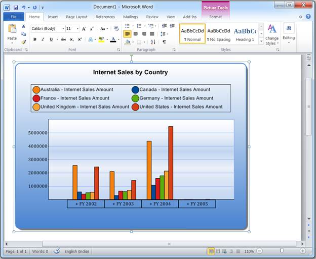

::: {style="DISPLAY: none"}
{#d2h_url_template}{#d2h_package_url style="WIDTH: 0px; DISPLAY: none; HEIGHT: 0px"}
:::

::::: {#nsbanner .d2h_main_nsbanner style="BORDER-BOTTOM: #999999 1px solid; POSITION: relative; PADDING-BOTTOM: 0px; BACKGROUND-COLOR: transparent; PADDING-LEFT: 0px; PADDING-RIGHT: 0px; DISPLAY: none; BORDER-TOP: #999999 1px solid; PADDING-TOP: 0px; LEFT: 0px"}
:::: {#TitleRow .d2h_main_titlerow style="PADDING-BOTTOM: 4px; BACKGROUND-COLOR: transparent; PADDING-LEFT: 22px; WIDTH: 100%; PADDING-RIGHT: 10px; DISPLAY: none; PADDING-TOP: 4px"}
::: {#ienav .d2h_main_ienav style="DISPLAY: none"}
{#D2HPrevious .D2HPreviousEnabled}  {#D2HNext .D2HNextEnabled}
:::
::::
:::::

::::: {#nstext .d2h_main_nstext style="PADDING-BOTTOM: 10px; BACKGROUND-COLOR: transparent; PADDING-LEFT: 22px; PADDING-RIGHT: 10px; HEIGHT: 100%; OVERFLOW: auto; PADDING-TOP: 5px" hasuserbackground="true" valign="bottom"}
::: {#d2h_breadcrumbs .d2h_breadcrumbs}
[Essential Studio User Guide Documentation](ms-xhelp:///?Id=12457748-09e3-4d74-a240-8e049cedf030){.d2h_breadcrumbsNormal}[ \> ]{.d2h_breadcrumbsLinkSeparator}[Business Intelligence Edition](ms-xhelp:///?Id=fdf33dd8-62b2-47b9-ad7b-fc50e590bca5){.d2h_breadcrumbsNormal}[ \> ]{.d2h_breadcrumbsLinkSeparator}[Essential BI ASP.NET](ms-xhelp:///?Id=99c6694e-59c3-4c59-abb5-ce9ce9a948bc){.d2h_breadcrumbsNormal}[ \> ]{.d2h_breadcrumbsLinkSeparator}[Essential BI Chart]{.d2h_breadcrumbsContentsOnly}[ \> ]{.d2h_breadcrumbsLinkSeparator}[Concepts and Features](ms-xhelp:///?Id=be4e11fe-e0a1-44d7-aa3a-05cf8b78bdb8){.d2h_breadcrumbsNormal}[ \> ]{.d2h_breadcrumbsLinkSeparator}[Exporting](ms-xhelp:///?Id=2394b447-8cde-44a1-935b-351fb00f1582){.d2h_breadcrumbsNormal}
:::

### Exporting to Word Document {#exporting-to-word-document style="tab-stops: 0pt"}

The **Olap Chart** control can be exported to a Word doc file as an image using Essential DocIO. The chart control provides APIs to convert it to an image, while DocIO lets you insert this image into a Word document file programmatically.

The chart can be exported in five different formats namely:

[]{style="COLOR: black"} 

4.   Create a new file and simply insert the image and save it as given in the following code snippets:

[]{style="COLOR: black"} 

+--------------------------------------------------------------------------------------------------------------------------------------------------------------------------------------------+
| **[\[C#\]]{style="FONT-FAMILY: 'Courier New'; COLOR: black"}**[]{style="FONT-FAMILY: 'Courier New'; COLOR: black"}                                                                         |
|                                                                                                                                                                                            |
| [this.]{style="FONT-FAMILY: 'Courier New'; COLOR: black"}[olapChart1]{style="FONT-FAMILY: 'Courier New'"}[.ExportToDoc(\"Sample.doc\");]{style="FONT-FAMILY: 'Courier New'; COLOR: black"} |
+--------------------------------------------------------------------------------------------------------------------------------------------------------------------------------------------+

[]{style="COLOR: black"} 

+-----------------------------------------------------------------------------------------------------------------------------------------------------------------------------------------+
| **[\[VB\]]{style="FONT-FAMILY: 'Courier New'; COLOR: black"}**[]{style="FONT-FAMILY: 'Courier New'; COLOR: black"}                                                                      |
|                                                                                                                                                                                         |
| [Me.]{style="FONT-FAMILY: 'Courier New'; COLOR: black"}[olapChart1]{style="FONT-FAMILY: 'Courier New'"}[.ExportToDoc(\"Sample.doc\")]{style="FONT-FAMILY: 'Courier New'; COLOR: black"} |
+-----------------------------------------------------------------------------------------------------------------------------------------------------------------------------------------+

[]{style="COLOR: black"} 

2.   Look for the default marker and insert the image there.  If the marker is not found, then insert it at the end of the document.

[]{style="COLOR: black"} 

+----------------------------------------------------------------------------------------------------------------------------------------------------------------------------------------------------+
| **[\[C#\]]{style="FONT-FAMILY: 'Courier New'; COLOR: black"}**[]{style="FONT-FAMILY: 'Courier New'; COLOR: black"}                                                                                 |
|                                                                                                                                                                                                    |
| [this.]{style="FONT-FAMILY: 'Courier New'; COLOR: black"}[olapChart1]{style="FONT-FAMILY: 'Courier New'"}[.ExportToTemplateDoc(\"Sample.doc\");]{style="FONT-FAMILY: 'Courier New'; COLOR: black"} |
+----------------------------------------------------------------------------------------------------------------------------------------------------------------------------------------------------+

[]{style="COLOR: black"} 

+-------------------------------------------------------------------------------------------------------------------------------------------------------------------------------------------------+
| **[\[VB\]]{style="FONT-FAMILY: 'Courier New'; COLOR: black"}**[]{style="FONT-FAMILY: 'Courier New'; COLOR: black"}                                                                              |
|                                                                                                                                                                                                 |
| [Me.]{style="FONT-FAMILY: 'Courier New'; COLOR: black"}[olapChart1]{style="FONT-FAMILY: 'Courier New'"}[.ExportToTemplateDoc(\"Sample.doc\")]{style="FONT-FAMILY: 'Courier New'; COLOR: black"} |
+-------------------------------------------------------------------------------------------------------------------------------------------------------------------------------------------------+

[]{style="COLOR: black"} 

3.   Look for this custom marker string and replace it with the image.

[]{style="COLOR: black"} 

+------------------------------------------------------------------------------------------------------------------------------------------------------------------------------------------------------------------------+
| **[\[C#\]]{style="FONT-FAMILY: 'Courier New'; COLOR: black"}**[]{style="FONT-FAMILY: 'Courier New'; COLOR: black"}                                                                                                     |
|                                                                                                                                                                                                                        |
| [this.]{style="FONT-FAMILY: 'Courier New'; COLOR: black"}[olapChart1]{style="FONT-FAMILY: 'Courier New'"}[.ExportToTemplateDoc(\"Sample.doc\", \"Exported Chart\");]{style="FONT-FAMILY: 'Courier New'; COLOR: black"} |
+------------------------------------------------------------------------------------------------------------------------------------------------------------------------------------------------------------------------+

[]{style="COLOR: black"} 

  -----------------------------------------------------------------------------------------------------------------------------------------------------------------------------------------------------------------------------------------------------------------------------------
  **[\[VB\]]{style="FONT-FAMILY: 'Courier New'; COLOR: black"}**[Me.]{style="FONT-FAMILY: 'Courier New'; COLOR: black"}[olapChart1]{style="FONT-FAMILY: 'Courier New'"}[.ExportToTemplateDoc(\"Sample.doc\", \"Exported Chart\")]{style="FONT-FAMILY: 'Courier New'; COLOR: black"}
  -----------------------------------------------------------------------------------------------------------------------------------------------------------------------------------------------------------------------------------------------------------------------------------

[]{style="COLOR: black"} 

4.   Export the chart in the given document file.

[]{style="COLOR: black"} 

+------------------------------------------------------------------------------------------------------------------------------------------------------------------------------------------------+
| **[\[C#\]]{style="FONT-FAMILY: 'Courier New'; COLOR: black"}**[]{style="FONT-FAMILY: 'Courier New'; COLOR: black"}                                                                             |
|                                                                                                                                                                                                |
| [WordDocument m_document = new WordDocument(\"Sample.doc\");]{style="FONT-FAMILY: 'Courier New'; COLOR: black"}                                                                                |
|                                                                                                                                                                                                |
| [this.]{style="FONT-FAMILY: 'Courier New'; COLOR: black"}[olapChart1]{style="FONT-FAMILY: 'Courier New'"}[.ExportToTemplateDoc(m_document);]{style="FONT-FAMILY: 'Courier New'; COLOR: black"} |
+------------------------------------------------------------------------------------------------------------------------------------------------------------------------------------------------+

[]{style="COLOR: black"} 

+---------------------------------------------------------------------------------------------------------------------------------------------------------------------------------------------+
| **[\[VB\]]{style="FONT-FAMILY: 'Courier New'; COLOR: black"}**[]{style="FONT-FAMILY: 'Courier New'; COLOR: black"}                                                                          |
|                                                                                                                                                                                             |
| [Dim m_document As WordDocument = New WordDocument(\"Sample.doc\")]{style="FONT-FAMILY: 'Courier New'; COLOR: black"}                                                                       |
|                                                                                                                                                                                             |
| [Me.]{style="FONT-FAMILY: 'Courier New'; COLOR: black"}[olapChart1]{style="FONT-FAMILY: 'Courier New'"}[.ExportToTemplateDoc(m_document)]{style="FONT-FAMILY: 'Courier New'; COLOR: black"} |
+---------------------------------------------------------------------------------------------------------------------------------------------------------------------------------------------+

[]{style="COLOR: black"} 

5.   Export the chart in the given document file, in which the chart can be replaced by the custom marker string.

[]{style="COLOR: black"} 

+--------------------------------------------------------------------------------------------------------------------------------------------------------------------------------------------------------------------+
| **[\[C#\]]{style="FONT-FAMILY: 'Courier New'; COLOR: black"}**[]{style="FONT-FAMILY: 'Courier New'; COLOR: black"}                                                                                                 |
|                                                                                                                                                                                                                    |
| [WordDocument m_document = new WordDocument(\"Sample.doc\");]{style="FONT-FAMILY: 'Courier New'; COLOR: black"}                                                                                                    |
|                                                                                                                                                                                                                    |
| [this.]{style="FONT-FAMILY: 'Courier New'; COLOR: black"}[olapChart1]{style="FONT-FAMILY: 'Courier New'"}[.ExportToTemplateDoc(m_document, \"Exported Chart\");]{style="FONT-FAMILY: 'Courier New'; COLOR: black"} |
+--------------------------------------------------------------------------------------------------------------------------------------------------------------------------------------------------------------------+

[]{style="COLOR: black"} 

+-----------------------------------------------------------------------------------------------------------------------------------------------------------------------------------------------------------------+
| **[\[VB\]]{style="FONT-FAMILY: 'Courier New'; COLOR: black"}**[]{style="FONT-FAMILY: 'Courier New'; COLOR: black"}                                                                                              |
|                                                                                                                                                                                                                 |
| [Dim m_document As WordDocument = New WordDocument(\"Sample.doc\")]{style="FONT-FAMILY: 'Courier New'; COLOR: black"}                                                                                           |
|                                                                                                                                                                                                                 |
| [Me.]{style="FONT-FAMILY: 'Courier New'; COLOR: black"}[olapChart1]{style="FONT-FAMILY: 'Courier New'"}[.ExportToTemplateDoc(m_document, \"Exported Chart\")]{style="FONT-FAMILY: 'Courier New'; COLOR: black"} |
+-----------------------------------------------------------------------------------------------------------------------------------------------------------------------------------------------------------------+

[]{style="COLOR: black"} 

{border="0"}

 

Figure 47: Exported to word document

 

 

 

 

Table 26: Exporting to Word Document

 

::: {align="center"}
  ----------------------------------------------------------- ---------------------------------------------------------------------------------------------------------------------------- ---------------- ------------- ------------- ----------------
  Methods                                                     Description                                                                                                                  Parameters       Type          Return Type   Reference Link
  ExportToDoc(String fileName)                                Exports a chart into a new Word document file with the specified file name. It takes the file name as a parameter.           string           Server side   void          \-
  ExportToTemplateDoc(String fileName)                        Exports a chart into a new document file with the specified file name.                                                       string           Server side   void          \-
  ExportToTemplateDoc(String filename, String markerString)   Exports a chart into a new document file with the specified file name and also adds the marker string within the document.   string, string   Server side   void          \-
  ----------------------------------------------------------- ---------------------------------------------------------------------------------------------------------------------------- ---------------- ------------- ------------- ----------------
:::

 

Sample Location

 

A sample demo is available at the followinglocation:

 

..\\Syncfusion\\EssentialStudio\\\<Version Number\>\\BI\\Web\\OlapChart.Web\\Samples\\3.5\\ Exporting\\Exporting Chart Demo\\[]{style="FONT-FAMILY: 'Cambria','serif'; COLOR: black; FONT-SIZE: 12pt"}

[]{#related-topics}
:::::
