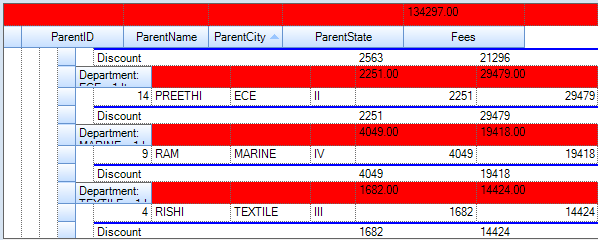

::: {style="DISPLAY: none"}
{#d2h_url_template}{#d2h_package_url style="WIDTH: 0px; DISPLAY: none; HEIGHT: 0px"}
:::

:::: {.d2h_secondary_topic style="PADDING-BOTTOM: 10pt; MARGIN: 0pt; PADDING-LEFT: 0pt; PADDING-RIGHT: 0pt; PADDING-TOP: 0pt"}
#### Export Summary as Caption {#export-summary-as-caption style="tab-stops: 0pt"}

This feature enables you to export the summary as caption, while exporting GridGroupingControl to Excel.

 

Properties

Table 10: Property Table

::: {align="center"}
  ------------------------------------------------ -------------------------------------------- ---------------------- --------------- ---------------------
  **Property**                                     **Description**                              **Type**               **Data Type**   **Reference links**
  ExportCaptionSummary[]{style="COLOR: #c00000"}   This property exports summary as caption.     GridGroupingControl   Boolean         NA
  ------------------------------------------------ -------------------------------------------- ---------------------- --------------- ---------------------
:::

[]{style="FONT-FAMILY: 'Calibri','sans-serif'; COLOR: black"} 

Exporting Summary as Caption

You can export summary as caption using the *ExportCaptionSummary* property. The following code illustrates this:

 

+-----------------------------------------------------------------------------------------------------------------------+
| \[C#\]                                                                                                                |
|                                                                                                                       |
| []{style="FONT-FAMILY: 'Courier New'; FONT-SIZE: 9.5pt"}                                                              |
|                                                                                                                       |
| [converter.ExportCaptionSummary = [true]{style="COLOR: blue"};]{style="FONT-FAMILY: 'Courier New'; FONT-SIZE: 9.5pt"} |
+-----------------------------------------------------------------------------------------------------------------------+

 

{border="0"}

Figure 419: Summary as Caption

 

 

[]{#related-topics}
::::
