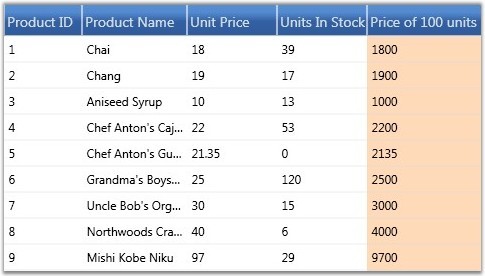

::: {style="DISPLAY: none"}
{#d2h_url_template}{#d2h_package_url style="WIDTH: 0px; DISPLAY: none; HEIGHT: 0px"}
:::

:::: {.d2h_secondary_topic style="PADDING-BOTTOM: 10pt; MARGIN: 0pt; PADDING-LEFT: 0pt; PADDING-RIGHT: 0pt; PADDING-TOP: 0pt"}
#### Expression Fields {#expression-fields style="tab-stops: 0pt"}

Expression Fields enable you to add a column that holds calculated values based on other fields in the same record. These expression columns are created in the same way as any unbound column, by using the GridDataUnboundVisibleColumn class. This contains the Expression property which needs to be set with a non-null value for an expression column. Expressions can include arithmetic, logical, relational, and few string operators, which will finally get translated into LINQ expressions for evaluation.

 

The following table lists the supported operators and examples for each.

 

::: {align="center"}
  -------------------------- ------------ ---------------------------------------------------------------------------------------- -----------------------------------------
  Expression                 Syntax       Description                                                                              Example Usage
  Mod                        \%           Divides first argument by second argument and returns remainder.                         \[UnitPrice\] % 10
  Multiplication, Division   \*,/         Multiplies/Divides first argument by second argument.                                    \[QunatityPerUnit\] \* \[UnitsInStock\]
  Addition, Subtraction      +,-          Adds first argument with second argument/Subtracts second argument from the first one.   \[UnitsInStock\]+\[Quantity\]
  Or                         OR           Returns 1 if either the first argument or the second one returns true.                   \[Val\]=50 OR \[Val\]=100
  And                        AND          Returns 1 if both parameters return true.                                                \[Val\]\< 50 AND \[Val\]\>100
  Less than                  \<** **      Returns true if first parameter is less than the second one.                             \[OrderID\] \< 2000
  Greater than               \>** **      Returns true if first parameter is greater than the second one.                          \[OrderID\] \> 2500
  Less than Or Equal to      \<=          Returns true if first parameter is less than or equal to the second one.                 \[OrderID\] \<= 2050
  Greater than Or Equal to   \>=          Returns true if first parameter is greater than or equal to the second one.              \[OrderID\] \>= 2056
  Equal                      =            Returns true if both arguments have same value.                                          \[CustomerID\] = 90
  Not Equal to               \<\>** **    Returns true if both arguments does not have same value.                                 \[CustomerID\] \<\> 95
  StartsWith                 StartsWith   Returns true if the value starts with the given string.                                  ProductName StartsWith Chai
  EndsWith                   EndsWith     Returns true if the value ends with the specified string.                                PruductName EndsWith i
  Contains                   Contains     Returns true if the value contains the specified string.                                 ProductName Contains hai
  -------------------------- ------------ ---------------------------------------------------------------------------------------- -----------------------------------------
:::

 

Example

 

1.   Instantiate a GridDataControl and bind it to a data source.

[]{style="COLOR: #15428b"} 

+---------------------------------------------------------------------------------------------------------------------------------------------------------------------------------------------------------------------------------------------------------------------------------------------------------------------------------------------------------------------------------------------------------------------------------------------------------------------------------------------------------------------------------------------------------------------------------------------------------------------------------------------------------------------------------------------------------------------------------------+
| [\[XAML\]]{style="FONT-FAMILY: 'Courier New'; COLOR: black"}                                                                                                                                                                                                                                                                                                                                                                                                                                                                                                                                                                                                                                                                          |
|                                                                                                                                                                                                                                                                                                                                                                                                                                                                                                                                                                                                                                                                                                                                       |
| []{style="FONT-FAMILY: 'Courier New'"}                                                                                                                                                                                                                                                                                                                                                                                                                                                                                                                                                                                                                                                                                                |
|                                                                                                                                                                                                                                                                                                                                                                                                                                                                                                                                                                                                                                                                                                                                       |
| [\<]{style="FONT-FAMILY: 'Courier New'; COLOR: blue"}[syncfusion]{style="FONT-FAMILY: 'Courier New'; COLOR: #a31515"}[:]{style="FONT-FAMILY: 'Courier New'; COLOR: blue"}[GridDataControl]{style="FONT-FAMILY: 'Courier New'; COLOR: #a31515"}[ x]{style="FONT-FAMILY: 'Courier New'; COLOR: red"}[:]{style="FONT-FAMILY: 'Courier New'; COLOR: blue"}[Name]{style="FONT-FAMILY: 'Courier New'; COLOR: red"}[=\"dataGrid\"]{style="FONT-FAMILY: 'Courier New'; COLOR: blue"}[ [ShowAddNewRow]{style="COLOR: red"}[=\"False\" ]{style="COLOR: blue"}[ShowFilters]{style="COLOR: red"}[=\"False\" ]{style="COLOR: blue"}[AutoPopulateColumns]{style="COLOR: red"}[=\"False\"]{style="COLOR: blue"}]{style="FONT-FAMILY: 'Courier New'"} |
|                                                                                                                                                                                                                                                                                                                                                                                                                                                                                                                                                                                                                                                                                                                                       |
| [AutoPopulateRelations]{style="FONT-FAMILY: 'Courier New'; COLOR: red"}[=\"False\" ]{style="FONT-FAMILY: 'Courier New'; COLOR: blue"}[ItemsSource]{style="FONT-FAMILY: 'Courier New'; COLOR: red"}[=\"{]{style="FONT-FAMILY: 'Courier New'; COLOR: blue"}[StaticResource]{style="FONT-FAMILY: 'Courier New'; COLOR: #a31515"}[ productsSource]{style="FONT-FAMILY: 'Courier New'; COLOR: red"}[}\" ]{style="FONT-FAMILY: 'Courier New'; COLOR: blue"}[ShowGroupDropArea]{style="FONT-FAMILY: 'Courier New'; COLOR: red"}[=\"True\"\>]{style="FONT-FAMILY: 'Courier New'; COLOR: blue"}                                                                                                                                                |
|                                                                                                                                                                                                                                                                                                                                                                                                                                                                                                                                                                                                                                                                                                                                       |
| [\</]{style="FONT-FAMILY: 'Courier New'; COLOR: blue"}[syncfusion]{style="FONT-FAMILY: 'Courier New'; COLOR: #a31515"}[:]{style="FONT-FAMILY: 'Courier New'; COLOR: blue"}[GridDataControl]{style="FONT-FAMILY: 'Courier New'; COLOR: #a31515"}[\>]{style="FONT-FAMILY: 'Courier New'; COLOR: blue"}                                                                                                                                                                                                                                                                                                                                                                                                                                  |
+---------------------------------------------------------------------------------------------------------------------------------------------------------------------------------------------------------------------------------------------------------------------------------------------------------------------------------------------------------------------------------------------------------------------------------------------------------------------------------------------------------------------------------------------------------------------------------------------------------------------------------------------------------------------------------------------------------------------------------------+

[]{style="COLOR: #15428b"} 

2.   Add an unbound visible column and set its Expression property to the desired formula expression. The unbound visible column also contains the CaseSensitive property, which makes the column names specified in the expression, case sensitive, when set to true. If necessary, you can also customize the expression like any other visible column.

**[]{style="COLOR: #15428b"}** 

+---------------------------------------------------------------------------------------------------------------------------------------------------------------------------------------------------------------------------------------------------------------------------------------------------------------------------------------------------------------------------------------------------------------------------------------------------------------------------------------------------------------------------------------------------------------------------------------------------------------------------------------------------------------------------------------------------------------------------------------+
| [\[XAML\]]{style="FONT-FAMILY: 'Courier New'; COLOR: black"}                                                                                                                                                                                                                                                                                                                                                                                                                                                                                                                                                                                                                                                                          |
|                                                                                                                                                                                                                                                                                                                                                                                                                                                                                                                                                                                                                                                                                                                                       |
| []{style="FONT-FAMILY: 'Courier New'"}                                                                                                                                                                                                                                                                                                                                                                                                                                                                                                                                                                                                                                                                                                |
|                                                                                                                                                                                                                                                                                                                                                                                                                                                                                                                                                                                                                                                                                                                                       |
| [\<]{style="FONT-FAMILY: 'Courier New'; COLOR: blue"}[syncfusion]{style="FONT-FAMILY: 'Courier New'; COLOR: #a31515"}[:]{style="FONT-FAMILY: 'Courier New'; COLOR: blue"}[GridDataControl.VisibleColumns]{style="FONT-FAMILY: 'Courier New'; COLOR: #a31515"}[\>]{style="FONT-FAMILY: 'Courier New'; COLOR: blue"}                                                                                                                                                                                                                                                                                                                                                                                                                    |
|                                                                                                                                                                                                                                                                                                                                                                                                                                                                                                                                                                                                                                                                                                                                       |
| [    ]{style="FONT-FAMILY: 'Courier New'; COLOR: #a31515"}[\<]{style="FONT-FAMILY: 'Courier New'; COLOR: blue"}[syncfusion]{style="FONT-FAMILY: 'Courier New'; COLOR: #a31515"}[:]{style="FONT-FAMILY: 'Courier New'; COLOR: blue"}[GridDataUnboundVisibleColumn]{style="FONT-FAMILY: 'Courier New'; COLOR: #a31515"}[ MappingName]{style="FONT-FAMILY: 'Courier New'; COLOR: red"}[=\"100UnitPrice\"]{style="FONT-FAMILY: 'Courier New'; COLOR: blue"}[ HeaderText]{style="FONT-FAMILY: 'Courier New'; COLOR: red"}[=\"Price of 100 units\"]{style="FONT-FAMILY: 'Courier New'; COLOR: blue"}[ Expression]{style="FONT-FAMILY: 'Courier New'; COLOR: red"}[=\"UnitPrice \* 100\"\>]{style="FONT-FAMILY: 'Courier New'; COLOR: blue"} |
|                                                                                                                                                                                                                                                                                                                                                                                                                                                                                                                                                                                                                                                                                                                                       |
| [        ]{style="FONT-FAMILY: 'Courier New'; COLOR: #a31515"}[\<]{style="FONT-FAMILY: 'Courier New'; COLOR: blue"}[syncfusion]{style="FONT-FAMILY: 'Courier New'; COLOR: #a31515"}[:]{style="FONT-FAMILY: 'Courier New'; COLOR: blue"}[GridDataUnboundVisibleColumn.ColumnStyle]{style="FONT-FAMILY: 'Courier New'; COLOR: #a31515"}[\>]{style="FONT-FAMILY: 'Courier New'; COLOR: blue"}                                                                                                                                                                                                                                                                                                                                            |
|                                                                                                                                                                                                                                                                                                                                                                                                                                                                                                                                                                                                                                                                                                                                       |
| [            ]{style="FONT-FAMILY: 'Courier New'; COLOR: #a31515"}[\<]{style="FONT-FAMILY: 'Courier New'; COLOR: blue"}[syncfusion]{style="FONT-FAMILY: 'Courier New'; COLOR: #a31515"}[:]{style="FONT-FAMILY: 'Courier New'; COLOR: blue"}[GridDataColumnStyle]{style="FONT-FAMILY: 'Courier New'; COLOR: #a31515"}[ Background]{style="FONT-FAMILY: 'Courier New'; COLOR: red"}[=\"PeachPuff\"/\>]{style="FONT-FAMILY: 'Courier New'; COLOR: blue"}                                                                                                                                                                                                                                                                                 |
|                                                                                                                                                                                                                                                                                                                                                                                                                                                                                                                                                                                                                                                                                                                                       |
| [        ]{style="FONT-FAMILY: 'Courier New'; COLOR: #a31515"}[\</]{style="FONT-FAMILY: 'Courier New'; COLOR: blue"}[syncfusion]{style="FONT-FAMILY: 'Courier New'; COLOR: #a31515"}[:]{style="FONT-FAMILY: 'Courier New'; COLOR: blue"}[GridDataUnboundVisibleColumn.ColumnStyle]{style="FONT-FAMILY: 'Courier New'; COLOR: #a31515"}[\>]{style="FONT-FAMILY: 'Courier New'; COLOR: blue"}                                                                                                                                                                                                                                                                                                                                           |
|                                                                                                                                                                                                                                                                                                                                                                                                                                                                                                                                                                                                                                                                                                                                       |
| [    ]{style="FONT-FAMILY: 'Courier New'; COLOR: #a31515"}[\</]{style="FONT-FAMILY: 'Courier New'; COLOR: blue"}[syncfusion]{style="FONT-FAMILY: 'Courier New'; COLOR: #a31515"}[:]{style="FONT-FAMILY: 'Courier New'; COLOR: blue"}[GridDataUnboundVisibleColumn]{style="FONT-FAMILY: 'Courier New'; COLOR: #a31515"}[\>]{style="FONT-FAMILY: 'Courier New'; COLOR: blue"}                                                                                                                                                                                                                                                                                                                                                           |
|                                                                                                                                                                                                                                                                                                                                                                                                                                                                                                                                                                                                                                                                                                                                       |
| [\</]{style="FONT-FAMILY: 'Courier New'; COLOR: blue"}[syncfusion]{style="FONT-FAMILY: 'Courier New'; COLOR: #a31515"}[:]{style="FONT-FAMILY: 'Courier New'; COLOR: blue"}[GridDataControl.VisibleColumns]{style="FONT-FAMILY: 'Courier New'; COLOR: #a31515"}[\>]{style="FONT-FAMILY: 'Courier New'; COLOR: blue"}                                                                                                                                                                                                                                                                                                                                                                                                                   |
+---------------------------------------------------------------------------------------------------------------------------------------------------------------------------------------------------------------------------------------------------------------------------------------------------------------------------------------------------------------------------------------------------------------------------------------------------------------------------------------------------------------------------------------------------------------------------------------------------------------------------------------------------------------------------------------------------------------------------------------+

[]{style="COLOR: #15428b"} 

{border="0"}

Figure 192: Grid with Expression Fields

***[]{style="COLOR: #15428b"}*** 

Accessing Expression Values

 

You can use the GetUnboundValue method of Grid Table to access the computed expression value of a particular unbound cell. This is an overloaded method with the following prototypes:

 

[·      ]{style="FONT-FAMILY: Symbol"}GetUnboundValue(RecordIndex, GridDataUnboundVisibleColumn)

[·      ]{style="FONT-FAMILY: Symbol"}GetUnboundValue(RowIndex, ColumnIndex)

 

The following code example illustrates how to use this method.

 

+---------------------------------------------------------------------------------------------------------------------------------------------------------------------------------+
| [\[C#\]]{style="FONT-FAMILY: 'Courier New'; COLOR: black"}                                                                                                                      |
|                                                                                                                                                                                 |
| []{style="FONT-FAMILY: 'Courier New'"}                                                                                                                                          |
|                                                                                                                                                                                 |
| [// Retrieve the expression value by using row and column indices.]{style="FONT-FAMILY: 'Courier New'; COLOR: green"}                                                           |
|                                                                                                                                                                                 |
| [object]{style="FONT-FAMILY: 'Courier New'; COLOR: blue"}[ value = [this]{style="COLOR: blue"}.dataGrid.Model.Table.GetUnboundValue(5, 5);]{style="FONT-FAMILY: 'Courier New'"} |
+---------------------------------------------------------------------------------------------------------------------------------------------------------------------------------+

 

[]{#related-topics}
::::
