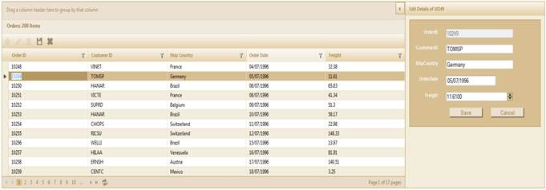
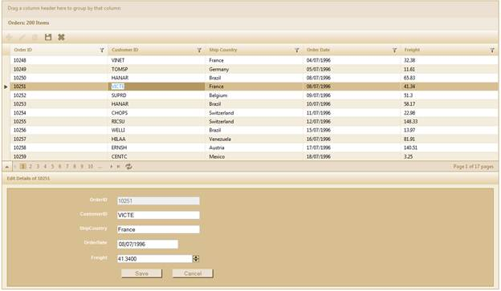
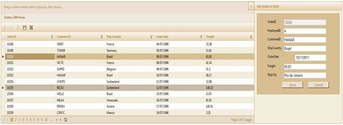
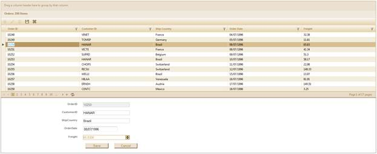

::: {style="DISPLAY: none"}
{#d2h_url_template}{#d2h_package_url style="WIDTH: 0px; DISPLAY: none; HEIGHT: 0px"}
:::

::::: {#nsbanner .d2h_main_nsbanner style="BORDER-BOTTOM: #999999 1px solid; POSITION: relative; PADDING-BOTTOM: 0px; BACKGROUND-COLOR: transparent; PADDING-LEFT: 0px; PADDING-RIGHT: 0px; DISPLAY: none; BORDER-TOP: #999999 1px solid; PADDING-TOP: 0px; LEFT: 0px"}
:::: {#TitleRow .d2h_main_titlerow style="PADDING-BOTTOM: 4px; BACKGROUND-COLOR: transparent; PADDING-LEFT: 22px; WIDTH: 100%; PADDING-RIGHT: 10px; DISPLAY: none; PADDING-TOP: 4px"}
::: {#ienav .d2h_main_ienav style="DISPLAY: none"}
{#D2HPrevious .D2HPreviousEnabled}  {#D2HNext .D2HNextEnabled}
:::
::::
:::::

:::::: {#nstext .d2h_main_nstext style="PADDING-BOTTOM: 10px; BACKGROUND-COLOR: transparent; PADDING-LEFT: 22px; PADDING-RIGHT: 10px; HEIGHT: 100%; OVERFLOW: auto; PADDING-TOP: 5px" hasuserbackground="true" valign="bottom"}
::: {#d2h_breadcrumbs .d2h_breadcrumbs}
[Essential Studio User Guide Documentation](ms-xhelp:///?Id=12457748-09e3-4d74-a240-8e049cedf030){.d2h_breadcrumbsNormal}[ \> ]{.d2h_breadcrumbsLinkSeparator}[User Interface Edition](ms-xhelp:///?Id=c29296b7-531c-413b-a0ec-488ca1f7f669){.d2h_breadcrumbsNormal}[ \> ]{.d2h_breadcrumbsLinkSeparator}[Essential ASP.NET MVC](ms-xhelp:///?Id=4b14e7d1-65c4-4f67-b1aa-2c37709905a5){.d2h_breadcrumbsNormal}[ \> ]{.d2h_breadcrumbsLinkSeparator}[Essential Grid]{.d2h_breadcrumbsContentsOnly}[ \> ]{.d2h_breadcrumbsLinkSeparator}[Getting Started](ms-xhelp:///?Id=c7ed3902-b25b-4170-be58-1d3d0b57748a){.d2h_breadcrumbsNormal}[ \> ]{.d2h_breadcrumbsLinkSeparator}[Feature Summary](ms-xhelp:///?Id=1923e679-441a-44e0-9bca-e0e50988a857){.d2h_breadcrumbsNormal}[ \> ]{.d2h_breadcrumbsLinkSeparator}[Concepts and Features](ms-xhelp:///?Id=4a1657fa-4756-42b9-9153-aebf5dcfc503){.d2h_breadcrumbsNormal}[ \> ]{.d2h_breadcrumbsLinkSeparator}[Editing](ms-xhelp:///?Id=51ad902e-b7e5-44e5-ad71-814595e92bf0){.d2h_breadcrumbsNormal}
:::

### External Form Edit Mode {#external-form-edit-mode style="tab-stops: 0pt"}

The External Form Edit Mode helps you to edit various data entries in the grid, one at a time, using an external edit form. It can contain the fields that you require, in the custom external form template that you would like to use.

This is different from the dialog editing mode in that it allows you to see the other entries in the Grid while you are editing one.\
\
You can position the edit form either in the top-right corner (by default), bottom-left left corner of the Grid; or in a custom location, using a target ID, if you choose.

Use Case Scenario

This feature allows you to view the data you edit more clearly, while offering an uncompromised view of the other data entries in the grid.

Appearance and Structure

The following figures illustrate the appearance and structure of the ExternalForm EditMode feature, and its settings:

 

{border="0"}

Figure 187: External Form Edit Mode with External Form in the top-right of the Grid

 

{border="0"}

Figure 188: External Edit Form in the bottom-left of the Grid

 

 

{border="0"}

Figure 189: External Form Edit Mode with Customized Template (Custom Fields in Grid)

 

If you have a customized template that you would like to use for the external edit form, this feature allows you to use it. You may have new fields and customized dimensions that you can use for the edit form.\
\

::: {style="BORDER-BOTTOM: windowtext 1pt solid; BORDER-LEFT: medium none; PADDING-BOTTOM: 1pt; MARGIN-TOP: 9pt; PADDING-LEFT: 0pt; PADDING-RIGHT: 0pt; MARGIN-BOTTOM: 9pt; BORDER-TOP: windowtext 1pt solid; BORDER-RIGHT: medium none; PADDING-TOP: 1pt"}
{border="0"}Note: The default skin overrides your template's skin.
:::

 

{border="0"}

Figure 190: External Edit Form with Custom Position (Target ID)

 

When you set the target ID for the ExternalForm EditMode, you will not only be able to customize the position of the edit form, but also the skin used. \
The target ID (of the element in the page) allows you to place the edit form anywhere on the same page as the grid. If in case the element doesn't exist on the page, you will not be able to place the edit form in that location.

::: {style="BORDER-BOTTOM: windowtext 1pt solid; BORDER-LEFT: medium none; PADDING-BOTTOM: 1pt; MARGIN-TOP: 9pt; PADDING-LEFT: 0pt; PADDING-RIGHT: 0pt; MARGIN-BOTTOM: 9pt; BORDER-TOP: windowtext 1pt solid; BORDER-RIGHT: medium none; PADDING-TOP: 1pt"}
{border="0"}Note: The custom skin of your edit form template is not overridden by the default skin used by the edit form, if you choose this option.
:::

 

Where do I find the installed samples?

You can find the installed samples when you follow the below steps:

1.   Go to sample browser.

2.   Click Grid tab to launch ASP.NET MVC samples.

3.   Select **Editing**\>**ExternalForm Editing**.

 

More:

[ ]{#related-topics}

[{border="0" align="absMiddle"}Properties](ms-xhelp:///?Id=3b857ded-0a7a-404a-8cfc-92a470b673e9){style="TEXT-DECORATION: none"}

[{border="0" align="absMiddle"}Enabling External Form Edit Mode in Grid MVC](ms-xhelp:///?Id=da212f0a-a4f7-4c67-b6c9-b30942e9bcda){style="TEXT-DECORATION: none"}
::::::
