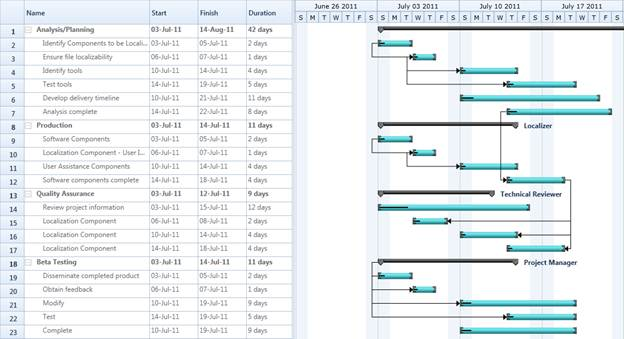

::: {style="DISPLAY: none"}
{#d2h_url_template}{#d2h_package_url style="WIDTH: 0px; DISPLAY: none; HEIGHT: 0px"}
:::

::::: {#nsbanner .d2h_main_nsbanner style="BORDER-BOTTOM: #999999 1px solid; POSITION: relative; PADDING-BOTTOM: 0px; BACKGROUND-COLOR: transparent; PADDING-LEFT: 0px; PADDING-RIGHT: 0px; DISPLAY: none; BORDER-TOP: #999999 1px solid; PADDING-TOP: 0px; LEFT: 0px"}
:::: {#TitleRow .d2h_main_titlerow style="PADDING-BOTTOM: 4px; BACKGROUND-COLOR: transparent; PADDING-LEFT: 22px; WIDTH: 100%; PADDING-RIGHT: 10px; DISPLAY: none; PADDING-TOP: 4px"}
::: {#ienav .d2h_main_ienav style="DISPLAY: none"}
{#D2HPrevious .D2HPreviousEnabled}  {#D2HNext .D2HNextEnabled}
:::
::::
:::::

:::: {#nstext .d2h_main_nstext style="PADDING-BOTTOM: 10px; BACKGROUND-COLOR: transparent; PADDING-LEFT: 22px; PADDING-RIGHT: 10px; HEIGHT: 100%; OVERFLOW: auto; PADDING-TOP: 5px" hasuserbackground="true" valign="bottom"}
::: {#d2h_breadcrumbs .d2h_breadcrumbs}
[Essential Studio User Guide Documentation](ms-xhelp:///?Id=12457748-09e3-4d74-a240-8e049cedf030){.d2h_breadcrumbsNormal}[ \> ]{.d2h_breadcrumbsLinkSeparator}[User Interface Edition](ms-xhelp:///?Id=c29296b7-531c-413b-a0ec-488ca1f7f669){.d2h_breadcrumbsNormal}[ \> ]{.d2h_breadcrumbsLinkSeparator}[Essential Silverlight](ms-xhelp:///?Id=66221bd1-ba2e-43c2-94a7-618f50e01d24){.d2h_breadcrumbsNormal}[ \> ]{.d2h_breadcrumbsLinkSeparator}[Essential Gantt]{.d2h_breadcrumbsContentsOnly}[ \> ]{.d2h_breadcrumbsLinkSeparator}[Concepts and Features](ms-xhelp:///?Id=00182e64-b79e-45a4-817a-bc3646aff2c1){.d2h_breadcrumbsNormal}[ \> ]{.d2h_breadcrumbsLinkSeparator}[Data Binding](ms-xhelp:///?Id=0e3bff30-6c68-4cbe-acbe-64dd6f68bd97){.d2h_breadcrumbsNormal}
:::

### External Property Binding {#external-property-binding style="tab-stops: 0pt"}

Essential Gantt for Silverlight allow you to bind any type of *IEnumerable* source to Gantt.You can bind any collection to Gantt using the *TaskAttributeMapping* class. This will get the mapping name of the requied fields from the underlying soruce. With this mapping the Gantt will get the required information to render the Chart nodes .

The following code illustrate how to map the properties using the *TaskAttributeMapping* class:

 

+----------------------------------------------------------------------------------------------------------------------------------------------------------------------------------------------------+
| **[\[XAML\]]{style="FONT-FAMILY: 'Courier New'"}**                                                                                                                                                 |
|                                                                                                                                                                                                    |
| [\                                                                                                                                                                                                 |
| [ \<]{style="COLOR: blue"}[gantt]{style="COLOR: #a31515"}[:]{style="COLOR: blue"}[TaskAttributeMapping]{style="COLOR: #a31515"}[ TaskIdMapping]{style="COLOR: red"}[=\"Id\"]{style="COLOR: blue"}\ |
|                     [ TaskNameMapping]{style="COLOR: red"}[=\"Name\"]{style="COLOR: blue"}\                                                                                                        |
|                     [ StartDateMapping]{style="COLOR: red"}[=\"StartDate\"]{style="COLOR: blue"} \                                                                                                 |
|                     [ ChildMapping]{style="COLOR: red"}[=\"ChildTask\"]{style="COLOR: blue"}\                                                                                                      |
|                     [ FinishDateMapping]{style="COLOR: red"}[=\"EndDate\"]{style="COLOR: blue"}\                                                                                                   |
|                     [ DurationMapping]{style="COLOR: red"}[=\"Duration\"]{style="COLOR: blue"}\                                                                                                    |
|                     [ ResourceInfoMapping]{style="COLOR: red"}[=\"Resource\"]{style="COLOR: blue"}\                                                                                                |
|                     [ ProgressMapping]{style="COLOR: red"}[=\"Complete\"]{style="COLOR: blue"}\                                                                                                    |
|                     [ PredecessorMapping]{style="COLOR: red"}[=\"Predecessor\"\>]{style="COLOR: blue"}\                                                                                            |
| [ \</]{style="COLOR: blue"}[gantt]{style="COLOR: #a31515"}[:]{style="COLOR: blue"}[TaskAttributeMapping]{style="COLOR: #a31515"}[\>]{style="COLOR: blue"}]{style="FONT-FAMILY: 'Courier New'"}     |
|                                                                                                                                                                                                    |
| []{style="FONT-FAMILY: 'Courier New'; COLOR: blue"}                                                                                                                                                |
+----------------------------------------------------------------------------------------------------------------------------------------------------------------------------------------------------+

 

+----------------------------------------------------------------------------------------------------------------------------------------------+
| **[\[C#\]]{style="FONT-FAMILY: 'Courier New'"}**                                                                                             |
|                                                                                                                                              |
| [  [TaskAttributeMapping]{style="COLOR: #2b91af"} attributes = [new]{style="COLOR: blue"} [TaskAttributeMapping]{style="COLOR: #2b91af"}();\ |
|   attributes.TaskIdMapping = [\"Id\"]{style="COLOR: #a31515"};\                                                                              |
|   attributes.TaskNameMapping = [\"Name\"]{style="COLOR: #a31515"};\                                                                          |
|   attributes.StartDateMapping = [\"StartDate\"]{style="COLOR: #a31515"};\                                                                    |
|   attributes.FinishDateMapping = [\"EndDate\"]{style="COLOR: #a31515"};\                                                                     |
|   attributes.DurationMapping = [\"Duration\"]{style="COLOR: #a31515"};\                                                                      |
|   attributes.ChildMapping = [\"ChildTask\"]{style="COLOR: #a31515"};\                                                                        |
|   attributes.ResourceInfoMapping = [\"Resource\"]{style="COLOR: #a31515"};\                                                                  |
|   attributes.ProgressMapping = [\"Predecessor\"]{style="COLOR: #a31515"};]{style="FONT-FAMILY: 'Courier New'"}                               |
|                                                                                                                                              |
| []{style="FONT-FAMILY: 'Courier New'"}                                                                                                       |
+----------------------------------------------------------------------------------------------------------------------------------------------+

 

The following code illustrates how to bind the external source to Gantt control:

 

+--------------------------------------------------------------------------------------------------------------------------------------------------------------------------------------------------------------------------------------------------------------------------------------------------------------------------------------------------------------------------------------------------------------------------------------------------------------------------------------------------------------------------------------------------------------------------------------------------------------------------------------------------------------------------------------------------------------------------------------------------------------------------------+
| **[\[XAML\]]{style="FONT-FAMILY: 'Courier New'"}**                                                                                                                                                                                                                                                                                                                                                                                                                                                                                                                                                                                                                                                                                                                             |
|                                                                                                                                                                                                                                                                                                                                                                                                                                                                                                                                                                                                                                                                                                                                                                                |
| [\<]{style="FONT-FAMILY: 'Courier New'; COLOR: blue"}[Sync]{style="FONT-FAMILY: 'Courier New'; COLOR: #a31515"}[:]{style="FONT-FAMILY: 'Courier New'; COLOR: blue"}[GanttControl]{style="FONT-FAMILY: 'Courier New'; COLOR: #a31515"}[ x]{style="FONT-FAMILY: 'Courier New'; COLOR: red"}[:]{style="FONT-FAMILY: 'Courier New'; COLOR: blue"}[Name]{style="FONT-FAMILY: 'Courier New'; COLOR: red"}[=\"Gantt\" ]{style="FONT-FAMILY: 'Courier New'; COLOR: blue"}[ItemsSource]{style="FONT-FAMILY: 'Courier New'; COLOR: red"}[=\"{]{style="FONT-FAMILY: 'Courier New'; COLOR: blue"}[Binding]{style="FONT-FAMILY: 'Courier New'; COLOR: #a31515"}[ GanttItemSource]{style="FONT-FAMILY: 'Courier New'; COLOR: red"}[}\"\>]{style="FONT-FAMILY: 'Courier New'; COLOR: blue"}[\ |
| [      ]{style="COLOR: #a31515"}[\<]{style="COLOR: blue"}[Sync]{style="COLOR: #a31515"}[:]{style="COLOR: blue"}[GanttControl.TaskMapping]{style="COLOR: #a31515"}[\>]{style="COLOR: blue"}\                                                                                                                                                                                                                                                                                                                                                                                                                                                                                                                                                                                    |
| [           ]{style="COLOR: #a31515"}[\<]{style="COLOR: blue"}[Sync]{style="COLOR: #a31515"}[:]{style="COLOR: blue"}[TaskCollectionMapping]{style="COLOR: #a31515"}[ TaskIdMapping]{style="COLOR: red"}[=\"Id\"]{style="COLOR: blue"}\                                                                                                                                                                                                                                                                                                                                                                                                                                                                                                                                         |
|                                       [ TaskNameMapping]{style="COLOR: red"}[=\"Name\"]{style="COLOR: blue"}\                                                                                                                                                                                                                                                                                                                                                                                                                                                                                                                                                                                                                                                                  |
|                                       [ StartDateMapping]{style="COLOR: red"}[=\"SDate\"]{style="COLOR: blue"}\                                                                                                                                                                                                                                                                                                                                                                                                                                                                                                                                                                                                                                                                |
|                                       [ FinishDateMapping]{style="COLOR: red"}[=\"EDate\"]{style="COLOR: blue"}\                                                                                                                                                                                                                                                                                                                                                                                                                                                                                                                                                                                                                                                               |
|                                       [ ResourceNameMapping]{style="COLOR: red"}[=\"ResName\"]{style="COLOR: blue"}\                                                                                                                                                                                                                                                                                                                                                                                                                                                                                                                                                                                                                                                           |
|                                       [ ChildMapping]{style="COLOR: red"}[=\"ChildTask\"]{style="COLOR: blue"}\                                                                                                                                                                                                                                                                                                                                                                                                                                                                                                                                                                                                                                                                |
|                                       [ PredecessorMapping]{style="COLOR: red"}[=\"Predecessor\"]{style="COLOR: blue"}\                                                                                                                                                                                                                                                                                                                                                                                                                                                                                                                                                                                                                                                        |
|                                       [ ProgressMapping]{style="COLOR: red"}[=\"Complete\" /\>]{style="COLOR: blue"}\                                                                                                                                                                                                                                                                                                                                                                                                                                                                                                                                                                                                                                                          |
| [            ]{style="COLOR: #a31515"}[\</]{style="COLOR: blue"}[Sync]{style="COLOR: #a31515"}[:]{style="COLOR: blue"}[GanttControl.TaskMapping]{style="COLOR: #a31515"}[\>]{style="COLOR: blue"}\                                                                                                                                                                                                                                                                                                                                                                                                                                                                                                                                                                             |
| [\</]{style="COLOR: blue"}[Sync]{style="COLOR: #a31515"}[:]{style="COLOR: blue"}[GanttControl]{style="COLOR: #a31515"}[\>]{style="COLOR: blue"}]{style="FONT-FAMILY: 'Courier New'"}[]{style="FONT-FAMILY: 'Courier New'"}                                                                                                                                                                                                                                                                                                                                                                                                                                                                                                                                                     |
|                                                                                                                                                                                                                                                                                                                                                                                                                                                                                                                                                                                                                                                                                                                                                                                |
| []{style="FONT-FAMILY: 'Courier New'"}                                                                                                                                                                                                                                                                                                                                                                                                                                                                                                                                                                                                                                                                                                                                         |
+--------------------------------------------------------------------------------------------------------------------------------------------------------------------------------------------------------------------------------------------------------------------------------------------------------------------------------------------------------------------------------------------------------------------------------------------------------------------------------------------------------------------------------------------------------------------------------------------------------------------------------------------------------------------------------------------------------------------------------------------------------------------------------+

[]{style="COLOR: #c00000"} 

 

+-------------------------------------------------------------------------------------------------------------------------------------------------------------------------+
| **[\[C#\]]{style="FONT-FAMILY: 'Courier New'"}**                                                                                                                        |
|                                                                                                                                                                         |
| [ //Initializing Gantt]{style="FONT-FAMILY: 'Courier New'; COLOR: green"}[\                                                                                             |
| [ GanttControl]{style="COLOR: #2b91af"} Gantt = [new]{style="COLOR: blue"} [GanttControl]{style="COLOR: #2b91af"}();]{style="FONT-FAMILY: 'Courier New'"}               |
|                                                                                                                                                                         |
| [ [ViewModel]{style="COLOR: #2b91af"} model=  [new]{style="COLOR: blue"} [ViewModel]{style="COLOR: #2b91af"}();]{style="FONT-FAMILY: 'Courier New'"}                    |
|                                                                                                                                                                         |
| []{style="FONT-FAMILY: 'Courier New'"}                                                                                                                                  |
|                                                                                                                                                                         |
| [ TaskAttributeMapping]{style="FONT-FAMILY: 'Courier New'; COLOR: #2b91af"}[ attributes = [new]{style="COLOR: blue"} [TaskAttributeMapping]{style="COLOR: #2b91af"}();\ |
|  attributes.TaskIdMapping = [\"Id\"]{style="COLOR: #a31515"};\                                                                                                          |
|  attributes.TaskNameMapping = [\"Name\"]{style="COLOR: #a31515"};\                                                                                                      |
|  attributes.StartDateMapping = [\"StartDate\"]{style="COLOR: #a31515"};\                                                                                                |
|  attributes.FinishDateMapping = [\"EndDate\"]{style="COLOR: #a31515"};\                                                                                                 |
|  attributes.DurationMapping = [\"Duration\"]{style="COLOR: #a31515"};\                                                                                                  |
|  attributes.ChildMapping = [\"ChildTask\"]{style="COLOR: #a31515"};\                                                                                                    |
|  attributes.ResourceInfoMapping = [\"Resource\"]{style="COLOR: #a31515"};\                                                                                              |
|  attributes.ProgressMapping = [\"Predecessor\"]{style="COLOR: #a31515"};]{style="FONT-FAMILY: 'Courier New'"}                                                           |
|                                                                                                                                                                         |
| []{style="FONT-FAMILY: 'Courier New'"}                                                                                                                                  |
|                                                                                                                                                                         |
| []{style="FONT-FAMILY: 'Courier New'"}                                                                                                                                  |
|                                                                                                                                                                         |
| [ Gantt.TaskAttributeMapping = attributes;]{style="FONT-FAMILY: 'Courier New'"}                                                                                         |
|                                                                                                                                                                         |
| [ Gantt.ItemsSource = model.GanttItemSource;]{style="FONT-FAMILY: 'Courier New'"}                                                                                       |
|                                                                                                                                                                         |
| []{style="FONT-FAMILY: 'Courier New'"}                                                                                                                                  |
+-------------------------------------------------------------------------------------------------------------------------------------------------------------------------+

 

 

+------------------------------------------------------------------------------------------------------------------------------------------------------------------------------------------------------------------+
| **[\[C#\]]{style="FONT-FAMILY: 'Courier New'"}**                                                                                                                                                                 |
|                                                                                                                                                                                                                  |
| [GanttItemSource]{style="FONT-FAMILY: 'Courier New'"}[ = [new]{style="COLOR: blue"} [ObservableCollection]{style="COLOR: #2b91af"}\<[Task]{style="COLOR: #2b91af"}\>();]{style="FONT-FAMILY: 'Courier New'"}     |
|                                                                                                                                                                                                                  |
| [GanttItemSource = ]{style="FONT-FAMILY: 'Courier New'"}[GetDataSourceStartToStart();]{style="FONT-FAMILY: 'Courier New'"}                                                                                       |
|                                                                                                                                                                                                                  |
| []{style="FONT-FAMILY: 'Courier New'; COLOR: blue"}                                                                                                                                                              |
|                                                                                                                                                                                                                  |
| [ObservableCollection]{style="FONT-FAMILY: 'Courier New'; COLOR: #2b91af"}[\<[Task]{style="COLOR: #2b91af"}\> GetDataSourceStartToStart()\                                                                       |
| {\                                                                                                                                                                                                               |
| [ObservableCollection]{style="COLOR: #2b91af"}\<[Task]{style="COLOR: #2b91af"}\> task = [ObservableCollection]{style="COLOR: #2b91af"}\<[Task]{style="COLOR: #2b91af"}\>();]{style="FONT-FAMILY: 'Courier New'"} |
|                                                                                                                                                                                                                  |
| [\                                                                                                                                                                                                               |
| task.Add([new]{style="COLOR: blue"} [Task]{style="COLOR: #2b91af"} { Id = 1, ]{style="FONT-FAMILY: 'Courier New'"}                                                                                               |
|                                                                                                                                                                                                                  |
| [                    Name = [\"Scope\"]{style="COLOR: #a31515"}, ]{style="FONT-FAMILY: 'Courier New'"}                                                                                                           |
|                                                                                                                                                                                                                  |
| [                    StartDate = [new]{style="COLOR: blue"} [DateTime]{style="COLOR: #2b91af"}(2011, 1, 3), ]{style="FONT-FAMILY: 'Courier New'"}                                                                |
|                                                                                                                                                                                                                  |
| [                    EndDate = [new]{style="COLOR: blue"} [DateTime]{style="COLOR: #2b91af"}(2011, 1, 14),]{style="FONT-FAMILY: 'Courier New'"}                                                                  |
|                                                                                                                                                                                                                  |
| [                    Progress = 40d });\                                                                                                                                                                         |
| task\[0\].ChildTask.Add([new]{style="COLOR: blue"} [Task]{style="COLOR: #2b91af"} { Id = 2, ]{style="FONT-FAMILY: 'Courier New'"}                                                                                |
|                                                                                                                                                                                                                  |
| [                    Name = [\"Determine project office scope\"]{style="COLOR: #a31515"}, ]{style="FONT-FAMILY: 'Courier New'"}                                                                                  |
|                                                                                                                                                                                                                  |
| [                    StartDate = [new]{style="COLOR: blue"} [DateTime]{style="COLOR: #2b91af"}(2011, 1, 3), ]{style="FONT-FAMILY: 'Courier New'"}                                                                |
|                                                                                                                                                                                                                  |
| [                    EndDate = [new]{style="COLOR: blue"} [DateTime]{style="COLOR: #2b91af"}(2011, 1, 5), ]{style="FONT-FAMILY: 'Courier New'"}                                                                  |
|                                                                                                                                                                                                                  |
| [                    Progress = 20d });\                                                                                                                                                                         |
| task\[0\].ChildTask.Add([new]{style="COLOR: blue"} [Task]{style="COLOR: #2b91af"} { Id = 3, ]{style="FONT-FAMILY: 'Courier New'"}                                                                                |
|                                                                                                                                                                                                                  |
| [                    Name = [\"Justify Project Offfice via business model\"]{style="COLOR: #a31515"}, ]{style="FONT-FAMILY: 'Courier New'"}                                                                      |
|                                                                                                                                                                                                                  |
| [                    StartDate = [new]{style="COLOR: blue"} [DateTime]{style="COLOR: #2b91af"}(2011, 1, 6), ]{style="FONT-FAMILY: 'Courier New'"}                                                                |
|                                                                                                                                                                                                                  |
| [                    EndDate = [new]{style="COLOR: blue"} [DateTime]{style="COLOR: #2b91af"}(2011, 1, 7), ]{style="FONT-FAMILY: 'Courier New'"}                                                                  |
|                                                                                                                                                                                                                  |
| [                    Progress = 20d });\                                                                                                                                                                         |
| task\[0\].ChildTask.Add([new]{style="COLOR: blue"} [Task]{style="COLOR: #2b91af"} { Id = 4, ]{style="FONT-FAMILY: 'Courier New'"}                                                                                |
|                                                                                                                                                                                                                  |
| [                    Name = [\"Secure executive sponsorship\"]{style="COLOR: #a31515"}, ]{style="FONT-FAMILY: 'Courier New'"}                                                                                    |
|                                                                                                                                                                                                                  |
| [                    StartDate = [new]{style="COLOR: blue"} [DateTime]{style="COLOR: #2b91af"}(2011, 1, 10), ]{style="FONT-FAMILY: 'Courier New'"}                                                               |
|                                                                                                                                                                                                                  |
| [                    EndDate = [new]{style="COLOR: blue"} [DateTime]{style="COLOR: #2b91af"}(2011, 1, 14), ]{style="FONT-FAMILY: 'Courier New'"}                                                                 |
|                                                                                                                                                                                                                  |
| [                    Progress = 20d });]{style="FONT-FAMILY: 'Courier New'"}                                                                                                                                     |
|                                                                                                                                                                                                                  |
| [task\[0\].ChildTask.Add([new]{style="COLOR: blue"} [Task]{style="COLOR: #2b91af"} { Id = 5, ]{style="FONT-FAMILY: 'Courier New'"}                                                                               |
|                                                                                                                                                                                                                  |
| [                    Name = [\"Secure complete\"]{style="COLOR: #a31515"}, ]{style="FONT-FAMILY: 'Courier New'"}                                                                                                 |
|                                                                                                                                                                                                                  |
| [                    StartDate = [new]{style="COLOR: blue"} [DateTime]{style="COLOR: #2b91af"}(2011, 1, 14), ]{style="FONT-FAMILY: 'Courier New'"}                                                               |
|                                                                                                                                                                                                                  |
| [                    EndDate = [new]{style="COLOR: blue"} [DateTime]{style="COLOR: #2b91af"}(2011, 1, 14), ]{style="FONT-FAMILY: 'Courier New'"}                                                                 |
|                                                                                                                                                                                                                  |
| [                    Progress = 20d });]{style="FONT-FAMILY: 'Courier New'"}                                                                                                                                     |
|                                                                                                                                                                                                                  |
| [return ]{style="FONT-FAMILY: 'Courier New'; COLOR: blue"}[task;]{style="FONT-FAMILY: 'Courier New'"}                                                                                                            |
|                                                                                                                                                                                                                  |
| [}\                                                                                                                                                                                                              |
| \                                                                                                                                                                                                                |
| ]{style="FONT-FAMILY: 'Courier New'"}[]{style="FONT-FAMILY: 'Courier New'"}                                                                                                                                      |
+------------------------------------------------------------------------------------------------------------------------------------------------------------------------------------------------------------------+

 {border="0"}

Figure 17: External Property Binding[]{style="COLOR: #c00000"}

Samples Link

To view samples:

1.   Select Start -\> Programs -\> Syncfusion -\> Essential Studio x.x.xx -\> Dashboard.

2.   Click **Run Samples** for Silverlight under User Interface Edition panel .

3.   Select **Gantt**.

4.   Expand the DataBinding Features item in the Sample Browser.

5.   Choose the External Property Binding samples to launch.

 

[]{#related-topics}
::::
