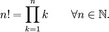

::: {style="DISPLAY: none"}
{#d2h_url_template}{#d2h_package_url style="WIDTH: 0px; DISPLAY: none; HEIGHT: 0px"}
:::

:::: {.d2h_secondary_topic style="PADDING-BOTTOM: 10pt; MARGIN: 0pt; PADDING-LEFT: 0pt; PADDING-RIGHT: 0pt; PADDING-TOP: 0pt"}
#### Factorial {#factorial style="tab-stops: 0pt"}

[]{style="FONT-FAMILY: 'Trebuchet MS','sans-serif'; FONT-SIZE: 9pt"} 

The **Factorial** function returns the factorial value of a given number. In mathematics, the factorial of a natural number n is the product of all positive integers less than or equal to n. It is denoted as n! and pronounced \"n factorial\", or colloquially \"n shriek\", \"n bang\" or \"n crit\". Factorial finds its main application in combinatorics like Permutations and Combinations and is also used in Number Theory.

 

The factorial function is defined by the following expression.

[]{style="FONT-FAMILY: 'Trebuchet MS','sans-serif'; FONT-SIZE: 9pt"} 

[{border="0"}]{style="FONT-FAMILY: 'Trebuchet MS','sans-serif'; FONT-SIZE: 9pt"}[]{style="FONT-FAMILY: 'Trebuchet MS','sans-serif'; FONT-SIZE: 9pt"}

[]{style="FONT-FAMILY: 'Trebuchet MS','sans-serif'; FONT-SIZE: 9pt"} 

which is equivalent to n! = n . (n-1) . \..... . 2 . 1.

 

The above definition incorporates the convention that the product of no numbers at all is 1, i.e., 0! = 1.

[]{style="FONT-FAMILY: 'Trebuchet MS','sans-serif'; FONT-SIZE: 9pt"} 

Using the formula

[]{style="COLOR: #4a5c8c; FONT-SIZE: 8pt"} 

The **Factorial** method of the **UtilityFunctions** class returns the factorial value for any positive integer.

[]{style="FONT-FAMILY: 'Trebuchet MS','sans-serif'; FONT-SIZE: 9pt"} 

::: {align="center"}
  Method Name   Parameters                                           Example
  ------------- ---------------------------------------------------- ---------------------------------------------
  Factorial     n: The number whose factorial should be found out.   An integer that returns the factorial of n.
:::

**[]{style="FONT-FAMILY: 'Trebuchet MS','sans-serif'"}** 

Example

[]{style="FONT-FAMILY: 'Trebuchet MS','sans-serif'; FONT-SIZE: 9pt"} 

Here is a code snippet that shows a sample usage.

[]{style="FONT-FAMILY: 'Trebuchet MS','sans-serif'; FONT-SIZE: 9pt"} 

+---------------------------------------------------------------------------------------------------------------------------------------------------------------------------------------------------------------------------------------------------------------+
| **[\[C#\]]{style="FONT-FAMILY: 'Courier New'; COLOR: black"}**                                                                                                                                                                                                |
|                                                                                                                                                                                                                                                               |
| **[]{style="FONT-FAMILY: 'Courier New'; COLOR: black"}**                                                                                                                                                                                                      |
|                                                                                                                                                                                                                                                               |
| [using Syncfusion.Windows.Forms.Chart.Statistics;]{style="FONT-FAMILY: 'Courier New'; COLOR: black"}                                                                                                                                                          |
|                                                                                                                                                                                                                                                               |
| [int]{style="FONT-FAMILY: 'Courier New'; COLOR: blue"}[ result = UtilityFunctions.Factorial(]{style="FONT-FAMILY: 'Courier New'; COLOR: black"}[int]{style="FONT-FAMILY: 'Courier New'; COLOR: blue"}[ n);]{style="FONT-FAMILY: 'Courier New'; COLOR: black"} |
+---------------------------------------------------------------------------------------------------------------------------------------------------------------------------------------------------------------------------------------------------------------+

[]{style="FONT-FAMILY: 'Trebuchet MS','sans-serif'; FONT-SIZE: 9pt"} 

+----------------------------------------------------------------------------------------------------------------------------------------------------------------------------------------------------------------------------------------------------------------------------------------------------------------------------------------------------------------------------+
| **[\[VB.NET\]]{style="FONT-FAMILY: 'Courier New'; COLOR: black"}**                                                                                                                                                                                                                                                                                                         |
|                                                                                                                                                                                                                                                                                                                                                                            |
| **[]{style="FONT-FAMILY: 'Courier New'; COLOR: black"}**                                                                                                                                                                                                                                                                                                                   |
|                                                                                                                                                                                                                                                                                                                                                                            |
| [Imports Syncfusion.Windows.Forms.Chart.Statistics]{style="FONT-FAMILY: 'Courier New'; COLOR: black"}                                                                                                                                                                                                                                                                      |
|                                                                                                                                                                                                                                                                                                                                                                            |
| [Dim]{style="FONT-FAMILY: 'Courier New'; COLOR: blue"}[ ]{style="FONT-FAMILY: 'Courier New'; COLOR: black"}[int as]{style="FONT-FAMILY: 'Courier New'; COLOR: blue"}[ result = UtilityFunctions.Factorial(]{style="FONT-FAMILY: 'Courier New'; COLOR: black"}[int]{style="FONT-FAMILY: 'Courier New'; COLOR: blue"}[ n)]{style="FONT-FAMILY: 'Courier New'; COLOR: black"} |
+----------------------------------------------------------------------------------------------------------------------------------------------------------------------------------------------------------------------------------------------------------------------------------------------------------------------------------------------------------------------------+

[]{#p237} 

[]{#related-topics}
::::
