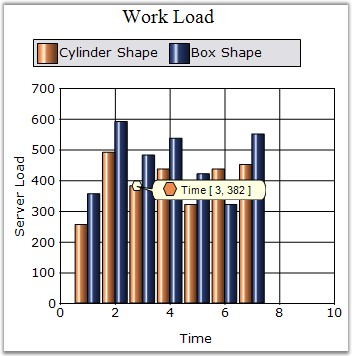

::: {style="DISPLAY: none"}
{#d2h_url_template}{#d2h_package_url style="WIDTH: 0px; DISPLAY: none; HEIGHT: 0px"}
:::

:::: {.d2h_secondary_topic style="PADDING-BOTTOM: 10pt; MARGIN: 0pt; PADDING-LEFT: 0pt; PADDING-RIGHT: 0pt; PADDING-TOP: 0pt"}
#### FancyToolTip {#fancytooltip style="tab-stops: 0pt"}

**[]{style="FONT-FAMILY: 'Trebuchet MS','sans-serif'; FONT-SIZE: 9pt"}** 

Defines the styles for a fancy tooltip. These styles include font, marker style, symbol shape, back color and other related styles.

[]{style="FONT-FAMILY: 'Trebuchet MS','sans-serif'; FONT-SIZE: 9pt"} 

::: {align="center"}
+-------------------------------------+--------------------------------------------------+
| Details                                                                                |
+-------------------------------------+--------------------------------------------------+
| Possible Values                     | Specifies symbol, symbol styles for the ToolTip. |
+-------------------------------------+--------------------------------------------------+
| Default Value                       | Visible - False                                  |
|                                     |                                                  |
|                                     | Angle  - 15                                      |
|                                     |                                                  |
|                                     | Alignment - Left                                 |
|                                     |                                                  |
|                                     | ForeColor - Color.Black                          |
|                                     |                                                  |
|                                     | BackColor - Color.Info                           |
|                                     |                                                  |
|                                     | SymbolColor - Color.Red                          |
|                                     |                                                  |
|                                     | Font - Arial, 8 pt                               |
|                                     |                                                  |
|                                     | Symbol Size - (10,10)                            |
|                                     |                                                  |
|                                     | Symbol - Circle                                  |
|                                     |                                                  |
|                                     | Style - SmoothRectangle                          |
+-------------------------------------+--------------------------------------------------+
| 2D / 3D Limitations                 | No                                               |
+-------------------------------------+--------------------------------------------------+
| Applies to Chart Element            | All series                                       |
+-------------------------------------+--------------------------------------------------+
| Applies to Chart Types              | All Chart Types                                  |
+-------------------------------------+--------------------------------------------------+
:::

**[]{style="FONT-FAMILY: 'Trebuchet MS','sans-serif'; FONT-SIZE: 9pt"}** 

Here is some sample code.

[]{style="FONT-FAMILY: 'Trebuchet MS','sans-serif'; FONT-SIZE: 9pt"} 

+-----------------------------------------------------------------------------------------------------------------------------------------------------------------------------------------------------+
| **[\[C#\]]{style="FONT-FAMILY: 'Courier New'; COLOR: black"}**                                                                                                                                      |
|                                                                                                                                                                                                     |
| **[]{style="FONT-FAMILY: 'Courier New'; COLOR: black"}**                                                                                                                                            |
|                                                                                                                                                                                                     |
| [this]{style="FONT-FAMILY: 'Courier New'; COLOR: blue"}[.ChartWebControl1.Series\[0\].FancyToolTip.Angle = 180;]{style="FONT-FAMILY: 'Courier New'"}                                                |
|                                                                                                                                                                                                     |
| [this]{style="FONT-FAMILY: 'Courier New'; COLOR: blue"}[.ChartWebControl1.Series\[0\].FancyToolTip.Style = [MarkerStyle]{style="COLOR: teal"}.SmoothRectangle;]{style="FONT-FAMILY: 'Courier New'"} |
|                                                                                                                                                                                                     |
| [this]{style="FONT-FAMILY: 'Courier New'; COLOR: blue"}[.ChartWebControl1.Series\[0\].FancyToolTip.Symbol = [ChartSymbolShape]{style="COLOR: teal"}.Hexagon;]{style="FONT-FAMILY: 'Courier New'"}   |
|                                                                                                                                                                                                     |
| [this]{style="FONT-FAMILY: 'Courier New'; COLOR: blue"}[.ChartWebControl1.Series\[0\].FancyToolTip.Visible = [true]{style="COLOR: blue"};]{style="FONT-FAMILY: 'Courier New'"}                      |
+-----------------------------------------------------------------------------------------------------------------------------------------------------------------------------------------------------+

[]{style="FONT-FAMILY: 'Trebuchet MS','sans-serif'; FONT-SIZE: 9pt"} 

+---------------------------------------------------------------------------------------------------------------------------------------------------------------------------+
| **[\[VB.NET\]]{style="FONT-FAMILY: 'Courier New'; COLOR: black"}**                                                                                                        |
|                                                                                                                                                                           |
| **[]{style="FONT-FAMILY: 'Courier New'; COLOR: black"}**                                                                                                                  |
|                                                                                                                                                                           |
| [Me]{style="FONT-FAMILY: 'Courier New'; COLOR: blue"}[.ChartWebControl1.Series(0).FancyToolTip.Angle = 180]{style="FONT-FAMILY: 'Courier New'"}                           |
|                                                                                                                                                                           |
| [Me]{style="FONT-FAMILY: 'Courier New'; COLOR: blue"}[.ChartWebControl1.Series(0).FancyToolTip.Style = MarkerStyle.SmoothRectangle]{style="FONT-FAMILY: 'Courier New'"}   |
|                                                                                                                                                                           |
| [Me]{style="FONT-FAMILY: 'Courier New'; COLOR: blue"}[.ChartWebControl1.Series(0).FancyToolTip.Symbol = ChartSymbolShape.Hexagon]{style="FONT-FAMILY: 'Courier New'"}     |
|                                                                                                                                                                           |
| [Me.]{style="FONT-FAMILY: 'Courier New'; COLOR: blue"}[ChartWebControl1.Series(0).FancyToolTip.Visible =[ True]{style="COLOR: blue"}]{style="FONT-FAMILY: 'Courier New'"} |
+---------------------------------------------------------------------------------------------------------------------------------------------------------------------------+

**[]{style="FONT-FAMILY: 'Trebuchet MS','sans-serif'; FONT-SIZE: 9pt"}** 

{border="0"}

**[]{style="FONT-FAMILY: 'Trebuchet MS','sans-serif'; FONT-SIZE: 9pt"}** 

Figure 123: Stacking Bar Chart with FancyToolTip

**[]{style="FONT-FAMILY: 'Courier New'; COLOR: black; FONT-SIZE: 9pt"}** 

See Also

[]{style="FONT-FAMILY: 'Trebuchet MS','sans-serif'; FONT-SIZE: 9pt"} 

[Chart Types]{.UGHyperlink}[]{.UGHyperlink}

[]{#p103} 

[]{#related-topics}
::::
