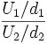

::: {style="DISPLAY: none"}
{#d2h_url_template}{#d2h_package_url style="WIDTH: 0px; DISPLAY: none; HEIGHT: 0px"}
:::

:::: {.d2h_secondary_topic style="PADDING-BOTTOM: 10pt; MARGIN: 0pt; PADDING-LEFT: 0pt; PADDING-RIGHT: 0pt; PADDING-TOP: 0pt"}
#### F Cumulative Distribution {#f-cumulative-distribution style="tab-stops: 0pt"}

 

This formula returns cumulative F Distribution which can be defined as the ratio of two chi-square distributions. The formula can be expressed as given below.

 

{border="0"}

where,

 

**U1** is the first chi square distribution with d1 degrees of freedom and

**[U2]{style="FONT-FAMILY: 'Segoe UI','sans-serif'"}** is the second chi square distribution with d2 degrees of freedom.

 

Using the Formula

 

FCumulativeDistribution is calculated using the **Statistics.UtilityFunctions** class. The following table describes the F Cumulative distribution method.

 

::: {align="center"}
+-------------------------+-----------------------------------------------------------------------------------------------+-----------------------------------------------------+
| Method Name             | Parameters                                                                                    | Return Value                                        |
+-------------------------+-----------------------------------------------------------------------------------------------+-----------------------------------------------------+
| FCumulativeDistribution | 1\. **fValue**: The F value for which you want the distribution.                              | A double that represents T cumulative distribution. |
|                         |                                                                                               |                                                     |
|                         | 2\. **firstDegreeOfFreedom**: an integer value that represents the first degree of freedom.   |                                                     |
|                         |                                                                                               |                                                     |
|                         | 3\. **secondDegreeOfFreedom**: an integer value that represents the second degree of freedom. |                                                     |
+-------------------------+-----------------------------------------------------------------------------------------------+-----------------------------------------------------+
:::

 

Example

 

Here is a code snippet that shows a sample usage.

 

+----------------------------------------------------------------------------------------------------------------------------------------------------------------------------------------------------------------------------------+
| **[\[C#\]]{style="FONT-FAMILY: 'Courier New'; COLOR: black"}**                                                                                                                                                                   |
|                                                                                                                                                                                                                                  |
| []{style="COLOR: black"}                                                                                                                                                                                                         |
|                                                                                                                                                                                                                                  |
| [using]{style="FONT-FAMILY: 'Courier New'; COLOR: blue"}[ Syncfusion.Windows.Forms.Chart.Statistics;]{style="FONT-FAMILY: 'Courier New'; COLOR: black"}                                                                          |
|                                                                                                                                                                                                                                  |
| [double]{style="FONT-FAMILY: 'Courier New'; COLOR: blue"}[ x = Statistics.UtilityFunctions. FCumulativelDistribution( fvalue, firstdegreeOf Freedom, secondDegreeOfFreedom );]{style="FONT-FAMILY: 'Courier New'; COLOR: black"} |
+----------------------------------------------------------------------------------------------------------------------------------------------------------------------------------------------------------------------------------+

 

+-------------------------------------------------------------------------------------------------------------------------------------------------------------------------------------------------------------------------------+
| **[\[VB.NET\]]{style="FONT-FAMILY: 'Courier New'; COLOR: black"}**                                                                                                                                                            |
|                                                                                                                                                                                                                               |
| []{style="COLOR: black"}                                                                                                                                                                                                      |
|                                                                                                                                                                                                                               |
| [Imports]{style="FONT-FAMILY: 'Courier New'; COLOR: blue"}[ Syncfusion.Windows.Forms.Chart.Statistics]{style="FONT-FAMILY: 'Courier New'; COLOR: black"}                                                                      |
|                                                                                                                                                                                                                               |
| [double]{style="FONT-FAMILY: 'Courier New'; COLOR: blue"}[ x = Statistics.UtilityFunctions. FCumulativelDistribution(fvalue, firstdegreeOf Freedom, secondDegreeOfFreedom)]{style="FONT-FAMILY: 'Courier New'; COLOR: black"} |
+-------------------------------------------------------------------------------------------------------------------------------------------------------------------------------------------------------------------------------+

[]{#p238} 

[]{#related-topics}
::::
