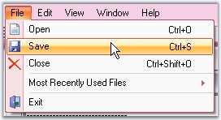
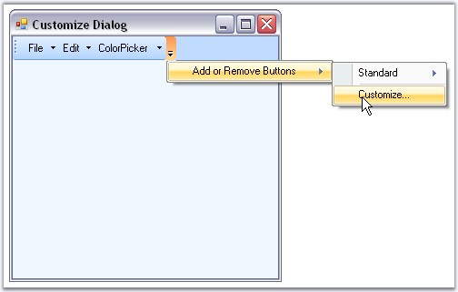

::: {style="DISPLAY: none"}
{#d2h_url_template}{#d2h_package_url style="WIDTH: 0px; DISPLAY: none; HEIGHT: 0px"}
:::

::::: {#nsbanner .d2h_main_nsbanner style="BORDER-BOTTOM: #999999 1px solid; POSITION: relative; PADDING-BOTTOM: 0px; BACKGROUND-COLOR: transparent; PADDING-LEFT: 0px; PADDING-RIGHT: 0px; DISPLAY: none; BORDER-TOP: #999999 1px solid; PADDING-TOP: 0px; LEFT: 0px"}
:::: {#TitleRow .d2h_main_titlerow style="PADDING-BOTTOM: 4px; BACKGROUND-COLOR: transparent; PADDING-LEFT: 22px; WIDTH: 100%; PADDING-RIGHT: 10px; DISPLAY: none; PADDING-TOP: 4px"}
::: {#ienav .d2h_main_ienav style="DISPLAY: none"}
{#D2HPrevious .D2HPreviousEnabled}  {#D2HNext .D2HNextEnabled}
:::
::::
:::::

::::: {#nstext .d2h_main_nstext style="PADDING-BOTTOM: 10px; BACKGROUND-COLOR: transparent; PADDING-LEFT: 22px; PADDING-RIGHT: 10px; HEIGHT: 100%; OVERFLOW: auto; PADDING-TOP: 5px" hasuserbackground="true" valign="bottom"}
::: {#d2h_breadcrumbs .d2h_breadcrumbs}
[Essential Studio User Guide Documentation](ms-xhelp:///?Id=12457748-09e3-4d74-a240-8e049cedf030){.d2h_breadcrumbsNormal}[ \> ]{.d2h_breadcrumbsLinkSeparator}[User Interface Edition](ms-xhelp:///?Id=c29296b7-531c-413b-a0ec-488ca1f7f669){.d2h_breadcrumbsNormal}[ \> ]{.d2h_breadcrumbsLinkSeparator}[Essential Windows](ms-xhelp:///?Id=e60759d8-47a4-4570-9d7a-16a68d63f2ea){.d2h_breadcrumbsNormal}[ \> ]{.d2h_breadcrumbsLinkSeparator}[Essential Tools]{.d2h_breadcrumbsContentsOnly}[ \> ]{.d2h_breadcrumbsLinkSeparator}[Tools Controls](ms-xhelp:///?Id=13c3c4f4-9d16-4b69-93f2-7e98eec67452){.d2h_breadcrumbsNormal}[ \> ]{.d2h_breadcrumbsLinkSeparator}[Menus Package](ms-xhelp:///?Id=f2acb534-5655-4dbb-a168-f0dfaf1cb8c7){.d2h_breadcrumbsNormal}
:::

### Features {#features style="tab-stops: 0pt"}

[]{style="COLOR: #15428b"} 

This section provides the key features available for Menus package and advantages of using it.

**[]{style="COLOR: #15428b"}** 

Key Features

[]{style="COLOR: #15428b"} 

[·      ]{style="FONT-FAMILY: Symbol"}Custom Colors can be applied for Menus. See Visual Styles topic.

[]{style="COLOR: #15428b"} 

{border="0"}

[]{style="COLOR: #15428b"} 

Figure 709: Custom Colors applied to Menus

[]{style="COLOR: #15428b"} 

[·      ]{style="FONT-FAMILY: Symbol"}Added Save - Load BarItem Customization feature that allows users to save / load custom baritems, which were created and added during application runtime.

[·      ]{style="FONT-FAMILY: Symbol"}Added **AutoSaveCustomData** and **AutoLoadCustomData** properties. Added SaveCustomData and LoadCustomData methods.

[]{style="COLOR: #15428b"} 

Toolbar

[]{style="COLOR: #15428b"} 

[·      ]{style="FONT-FAMILY: Symbol"}It allows the user to add toolbars, bar items onto the form without adding a single line of code.

[·      ]{style="FONT-FAMILY: Symbol"}Provides ability to customize the toolbars and menus at run time easily as shown below.

 

{border="0"}

***[]{style="COLOR: #15428b"}*** 

Figure 710: Toolbar Customization Option

[]{style="COLOR: #15428b"} 

[·      ]{style="FONT-FAMILY: Symbol"}Custom colors can be applied to the Toolbars.

[·      ]{style="FONT-FAMILY: Symbol"}BarManager lets the end users to display large or small icons in the toolbars.

[·      ]{style="FONT-FAMILY: Symbol"}XP toolbars can be dragged and dropped at any appropriate position inside the form.

[·      ]{style="FONT-FAMILY: Symbol"}CommandBars and ControlBars (TaskPane Toolbars as in Microsoft Office) are used to generate dockable and floatable toolbars as in Microsoft Office on the form.

**[]{style="COLOR: #15428b"}** 

Menus

[]{style="COLOR: #15428b"} 

XP Menus framework allows you to create elegant menus and menu items on the toolbar and provides the following features.

[]{style="COLOR: #15428b"} 

[·      ]{style="FONT-FAMILY: Symbol"}Supports multi-level cascading menus as in Microsoft Office.

[·      ]{style="FONT-FAMILY: Symbol"}Can create multiple menus on a single form.

[·      ]{style="FONT-FAMILY: Symbol"}Advanced features like adding separators in-between the bar items, Grouping the items etc., are supported.

[·      ]{style="FONT-FAMILY: Symbol"}Rich set of menu items supported in XP menus framework.

[·      ]{style="FONT-FAMILY: Symbol"}ParentBarItem

[·      ]{style="FONT-FAMILY: Symbol"}ComboBoxBarItem

[·      ]{style="FONT-FAMILY: Symbol"}DropDownBarItem

[·      ]{style="FONT-FAMILY: Symbol"}ListBarItem

[·      ]{style="FONT-FAMILY: Symbol"}StaticBarItem

[·      ]{style="FONT-FAMILY: Symbol"}ToolBarListBarItem

[·      ]{style="FONT-FAMILY: Symbol"}MDIListBarItem - used on a PopupMenu to display a list of the currently available MDI child windows along with the standard MDI window commands such as Cascade, Tile, and so on

[·      ]{style="FONT-FAMILY: Symbol"}TextBoxBarItem

[·      ]{style="FONT-FAMILY: Symbol"}Supports following Menu Styles.

[·      ]{style="FONT-FAMILY: Symbol"}Menus with check mark.

[·      ]{style="FONT-FAMILY: Symbol"}Menus with Image support.

[·      ]{style="FONT-FAMILY: Symbol"}Menus with different back color, fore color and font styles.

[·      ]{style="FONT-FAMILY: Symbol"}Menus with docking/floating and tabbed style.

[·      ]{style="FONT-FAMILY: Symbol"}Menus with mnemonics.

[·      ]{style="FONT-FAMILY: Symbol"}Menus with MRU list.

[·      ]{style="FONT-FAMILY: Symbol"}Menus with FontList, ColorPalette.

[·      ]{style="FONT-FAMILY: Symbol"}Partial menus.

 

Popup Menu

[]{style="COLOR: #15428b"} 

A Popup menu represents a context menu which will be displayed when the user right clicks on any item.

[]{style="COLOR: #15428b"} 

[·      ]{style="FONT-FAMILY: Symbol"}Popup menu can be shown over any control, anywhere in an application.

[·      ]{style="FONT-FAMILY: Symbol"}Provides ability to[ ]{style="COLOR: black"}group the menu items[ ]{style="COLOR: black"}in the Popup menu.

[]{style="COLOR: #15428b"} 

MDI support

[]{style="COLOR: #15428b"} 

[·      ]{style="FONT-FAMILY: Symbol"}The XP Menus framework goes to a great extent to support associating menus and toolbars for **MDIChild** forms.

[·      ]{style="FONT-FAMILY: Symbol"}Provides complete support for automatic MDI menu merging.

[]{style="COLOR: #15428b"} 

Look and Feel

[]{style="COLOR: #15428b"} 

[·      ]{style="FONT-FAMILY: Symbol"}Supports Office 2007 color themes (blue, silver and black).

[·      ]{style="FONT-FAMILY: Symbol"}Supports latest GUI style.

[·      ]{style="FONT-FAMILY: Symbol"}Supports Office 2007 look and feel.

[·      ]{style="FONT-FAMILY: Symbol"}Custom Colors can be applied to the menus using the MenuColors, Office2003Colors and Office2007Colors classes.

[]{style="COLOR: #15428b"} 

Persisting Bar state

 

The bar state can be persisted across multiple applications in the following formats.

[]{style="COLOR: #15428b"} 

[·      ]{style="FONT-FAMILY: Symbol"}Binary file

[·      ]{style="FONT-FAMILY: Symbol"}XML file

[·      ]{style="FONT-FAMILY: Symbol"}Isolated storage medium

[·      ]{style="FONT-FAMILY: Symbol"}Windows Registry

[]{style="COLOR: #15428b"} 

SuperToolTip support

[]{style="COLOR: #15428b"} 

The BarItems in XPMenus provides[ ]{style="COLOR: black"}SuperToolTip support[.]{style="COLOR: black"}[ ]{style="COLOR: black"}Other than the usual tooltip XPMenus now allows users to associate a SuperToolTip to the BarItems.

[]{style="COLOR: #15428b"} 

Miscellaneous Features

[]{style="COLOR: #15428b"} 

[·      ]{style="FONT-FAMILY: Symbol; COLOR: #15428b"}[Extensive ]{style="COLOR: #15428b"}keyboard support[.]{style="COLOR: #15428b"}[]{style="COLOR: #15428b"}

[·      ]{style="FONT-FAMILY: Symbol; COLOR: #15428b"}Visual Inheritance Support[]{style="COLOR: #15428b"}

[·      ]{style="FONT-FAMILY: Symbol; COLOR: #15428b"}[Localization support.]{style="COLOR: #15428b"}

[·      ]{style="FONT-FAMILY: Symbol; COLOR: #15428b"}[Provides full range of events that signal your application when any toolbar or menu activity occurs. ]{style="COLOR: #15428b"}

[]{style="COLOR: #15428b"} 

::: {style="BORDER-BOTTOM: windowtext 1pt solid; BORDER-LEFT: medium none; PADDING-BOTTOM: 1pt; MARGIN-TOP: 9pt; PADDING-LEFT: 0pt; PADDING-RIGHT: 0pt; MARGIN-BOTTOM: 9pt; BORDER-TOP: windowtext 1pt solid; BORDER-RIGHT: medium none; PADDING-TOP: 1pt"}
{border="0"} Note: SDI (Single Document Interface) is a Windows function that allows an application to display only one document at a time. SDI requires the user to load another instance of the application to work with two or more documents.
:::

[]{style="COLOR: #15428b"} 

MDI (Multiple Document Interface) is a Microsoft Windows programming interface for creating an application that enables users to work with multiple documents at the same time. Each document is in a separate space with its own controls for scrolling.

[]{style="COLOR: #15428b"} 

[]{style="COLOR: #15428b"} 

[]{style="COLOR: #15428b"} 

Advantages

**[]{style="COLOR: #15428b"}** 

[·      ]{style="FONT-FAMILY: Symbol"}Offers an incredible amount of flexibility over the look and feel of its controls.

[·      ]{style="FONT-FAMILY: Symbol"}Entire product is written in 100% native C# code which fully takes the advantage of what the **.NET framework** has to offer.

[·      ]{style="FONT-FAMILY: Symbol"}Easy to use.

[·      ]{style="FONT-FAMILY: Symbol"}Applicable for both Single Document Interface (SDI) and Multiple Document Interface (MDI).

[·      ]{style="FONT-FAMILY: Symbol"}Avoids complex coding.

[]{style="COLOR: #15428b"} 

See Also

[]{style="COLOR: #15428b"} 

[Concepts and Features]{.UGHyperlink}[]{.UGHyperlink}

[]{#related-topics}
:::::
