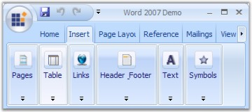
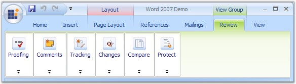
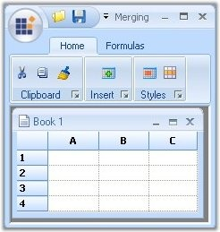
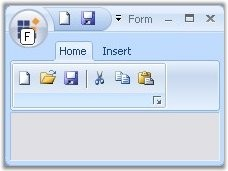
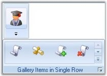
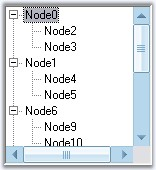

::: {style="DISPLAY: none"}
{#d2h_url_template}{#d2h_package_url style="WIDTH: 0px; DISPLAY: none; HEIGHT: 0px"}
:::

::::: {#nsbanner .d2h_main_nsbanner style="BORDER-BOTTOM: #999999 1px solid; POSITION: relative; PADDING-BOTTOM: 0px; BACKGROUND-COLOR: transparent; PADDING-LEFT: 0px; PADDING-RIGHT: 0px; DISPLAY: none; BORDER-TOP: #999999 1px solid; PADDING-TOP: 0px; LEFT: 0px"}
:::: {#TitleRow .d2h_main_titlerow style="PADDING-BOTTOM: 4px; BACKGROUND-COLOR: transparent; PADDING-LEFT: 22px; WIDTH: 100%; PADDING-RIGHT: 10px; DISPLAY: none; PADDING-TOP: 4px"}
::: {#ienav .d2h_main_ienav style="DISPLAY: none"}
{#D2HPrevious .D2HPreviousEnabled}  {#D2HNext .D2HNextEnabled}
:::
::::
:::::

:::: {#nstext .d2h_main_nstext style="PADDING-BOTTOM: 10px; BACKGROUND-COLOR: transparent; PADDING-LEFT: 22px; PADDING-RIGHT: 10px; HEIGHT: 100%; OVERFLOW: auto; PADDING-TOP: 5px" hasuserbackground="true" valign="bottom"}
::: {#d2h_breadcrumbs .d2h_breadcrumbs}
[Essential Studio User Guide Documentation](ms-xhelp:///?Id=12457748-09e3-4d74-a240-8e049cedf030){.d2h_breadcrumbsNormal}[ \> ]{.d2h_breadcrumbsLinkSeparator}[User Interface Edition](ms-xhelp:///?Id=c29296b7-531c-413b-a0ec-488ca1f7f669){.d2h_breadcrumbsNormal}[ \> ]{.d2h_breadcrumbsLinkSeparator}[Essential Windows](ms-xhelp:///?Id=e60759d8-47a4-4570-9d7a-16a68d63f2ea){.d2h_breadcrumbsNormal}[ \> ]{.d2h_breadcrumbsLinkSeparator}[Essential Tools]{.d2h_breadcrumbsContentsOnly}[ \> ]{.d2h_breadcrumbsLinkSeparator}[Tools Controls](ms-xhelp:///?Id=13c3c4f4-9d16-4b69-93f2-7e98eec67452){.d2h_breadcrumbsNormal}[ \> ]{.d2h_breadcrumbsLinkSeparator}[Office 2007 Controls](ms-xhelp:///?Id=8380f008-0502-457f-8427-d93a9a17cefc){.d2h_breadcrumbsNormal}
:::

### Features {#features style="MARGIN-LEFT: 18pt; tab-stops: 18.0pt"}

**[]{style="COLOR: #15428b"}** 

Office2007 Controls Features

**[]{style="COLOR: #15428b"}** 

RibbonControlAdv

[]{style="COLOR: #15428b"} 

[·      ]{style="FONT-FAMILY: Symbol"}**OfficeMenuButton -** The RibbonControlAdv comes with the Office MenuButton with desired image. The visibility of this OfficeMenuButton can also be toggled during runtime. This OfficeMenuButton can have SuperToolTips associated with it. See [[ToolTips]{.UGHyperlink}](../../../../../../../../Documents%20and%20Settings/sylviap/Desktop/Tools%20-%20Part%202.docx#_Tooltips).

 

[·      ]{style="FONT-FAMILY: Symbol"}**OfficeMenuDropDown -** Similar to the Office2007 UI, the RibbonControlAdv can have [[OfficeMenuDropDown]{.UGHyperlink}](../../../../../../../../Documents%20and%20Settings/sylviap/Desktop/Tools%20-%20Part%202.docx#_MenuButton_Drop_Down) with both the Main and Auxiliary panels.

 

[·      ]{style="FONT-FAMILY: Symbol"}**Quick Access ToolBar -** [[Quick Access ToolBar]{.UGHyperlink}](../../../../../../../../Documents%20and%20Settings/sylviap/Desktop/Tools%20-%20Part%202.docx#_Quick_Access_Toolbar) can host items in it to make a more easy and efficient access to the items. The RibbonControlAdv supports full customization of Quick Access ToolBar at runtime.

 

[·      ]{style="FONT-FAMILY: Symbol"}**Ribbon Panel  -** The [[RibbonPanel]{.UGHyperlink}](../../../../../../../../Documents%20and%20Settings/sylviap/Desktop/Tools%20-%20Part%202.docx#_Ribbon_Panel) can have various tabitems with the ability to scroll the tabs. The RibbonPanel can have three different states such as Expanded, Collapsed and floating state while expanded.

[]{style="COLOR: #15428b"} 

The TabItems in the RibbonPanel can auto align the controls when width of the RibbonControl is reduced.

[]{style="COLOR: #15428b"} 

{border="0"}

[]{style="COLOR: #15428b"} 

Figure 1283: : Ribbon Panel[]{style="FONT-FAMILY: 'Trebuchet MS','sans-serif'; COLOR: #15428b"}

[·      ]{style="FONT-FAMILY: Symbol"}**RibbonForm -** The RibbonForm is exclusively designed to be used as a Form that hosts RibbonControlAdv. This supports all three color schemes.

 

[·      ]{style="FONT-FAMILY: Symbol"}**ToolStripTabItems -** The TabItems can have a number of ToolStripEx which in turn can host various items in it. ToolStripTabItems can also host custom controls such as Grid, Treeview through ToolStrip.

 

[·      ]{style="FONT-FAMILY: Symbol"}**Tab Group -** The RibbonControlAdv allows TabItems to be grouped together. The TabGroups can have colors set and this color will also be applied for the corresponding TabPanel.

[]{style="COLOR: #15428b"} 

{border="0"}

[]{style="COLOR: #15428b"} 

Figure 1284: Tab Groups

**[]{style="COLOR: #15428b"}** 

[·      ]{style="FONT-FAMILY: Symbol"}**GalleryItem -** Essential Tools RibbonControlAdv provides options to add a collection of items and store them into a gallery. The GalleryItem comes with a standard and a Compact scrollbars type. It supports all the three color schemes (Blue, Silver and Black).

[·      ]{style="FONT-FAMILY: Symbol"}Option to merge RibbonPanel of child form with the RibbonPanel in parent form RibbonControlAdv. See [[Ribbon Merging]{.UGHyperlink}](../../../../../../../../Documents%20and%20Settings/sylviap/Desktop/Tools%20-%20Part%202.docx#_Ribbon_Merging).

[]{style="COLOR: #15428b"} 

{border="0"}

***[]{style="COLOR: #15428b"}*** 

Figure 1285: Ribbon Merging Support

[]{style="COLOR: #15428b"} 

[·      ]{style="FONT-FAMILY: Symbol"}Super accelerator support for Office Menu button. This is discussed in [Customization]{style="COLOR: black"} topic.

[]{style="COLOR: #15428b"} 

{border="0"}

***[]{style="COLOR: #15428b"}*** 

Figure 1286: Super Accelerator Support Illustrated

[]{style="COLOR: #15428b"} 

[·      ]{style="FONT-FAMILY: Symbol"}Multiline text support for all Text and ToolTip properties.

[·      ]{style="FONT-FAMILY: Symbol"}Support to display the gallery items one row at a time when it was invoked by the collapsed ToolStripEx.

[]{style="COLOR: #15428b"} 

[{border="0"}]{style="COLOR: #15428b"}[]{style="COLOR: #15428b"}

[]{style="COLOR: #15428b"} 

Figure 1287: Gallery Items displayed in a Single Row

[]{style="COLOR: #15428b"} 

[·      ]{style="FONT-FAMILY: Symbol"}Collection related properties MainItems and QuickItems to the RibbonControlAdv Header to access items collection.

[·      ]{style="FONT-FAMILY: Symbol"}AllowCollapse property to restrict the Ribbon Panel from collapsing.

[·      ]{style="FONT-FAMILY: Symbol"}Events **RibbonControlAdv.BeforeCustomizeDropDownPopup** and **RibbonControlAdv.AfterCustomizeDropDownPopup** that occurs before/after DropDown of QuickItemsDropDownButton is shown.

[·      ]{style="FONT-FAMILY: Symbol"}Events like RibbonControlAdv.Header.QuickItems.BeforeAddItem and RibbonControlAdv.Header.QuickItems.BeforeRemoveItem that occurs before ToolStripItem is added/removed from the QuickAccessPanel collection.

[·      ]{style="FONT-FAMILY: Symbol"}RibbonControlAdv.SelectedTabItemChanged that occurs when selected ToolStripTabItem has changed.

[·      ]{style="FONT-FAMILY: Symbol"}Method RibbonControlAdv.ShowCustomizeDialog that shows QuickItems customizing dialog.

[·      ]{style="FONT-FAMILY: Symbol"}Checkbox item option with Tristate behavior in the ToolStripEx items collection.

[·      ]{style="FONT-FAMILY: Symbol"}RadioButton item option in the ToolStripEx items collection.

[·      ]{style="FONT-FAMILY: Symbol"}Ability to define the color scheme for the RibbonControlAdv, RibbonForm, StatusStripEx and Office2007Form.

[·      ]{style="FONT-FAMILY: Symbol"}[[Tooltip]{.UGHyperlink}](../../../../../../../../Documents%20and%20Settings/sylviap/Desktop/Tools%20-%20Part%202.docx#_ToolTips_1) features included for ToolStripEx in this new version.

[·      ]{style="FONT-FAMILY: Symbol"}New ToolStrip item, [[ComboBoxEx]{.UGHyperlink}](../../../../../../../../Documents%20and%20Settings/sylviap/Desktop/Tools%20-%20Part%202.docx#_ComboBoxEx) is added, which has Office 2007 look and feel and resizable dropdown height feature at run time.

[]{style="COLOR: #15428b"} 

Office2007 Form

 

[[Office2007 Form]{.UGHyperlink}](../../../../../../../../Documents%20and%20Settings/sylviap/Desktop/Tools%20-%20Part%202.docx#_Office2007_Form) which does not have any dependency in RibbonControlAdv is now available in Essential suite. It supports all three color schemes, help button, Right To left feature everything similar to the normal form with the Office2007 look and feel.

 

New property UseOffice2007SchemeBackColor is added, which lets you use the Office2007 scheme color, as the back color for the [[Office2007Form]{.UGHyperlink}](../../../../../../../../Documents%20and%20Settings/sylviap/Desktop/Tools%20-%20Part%202.docx#_Office2007_Form).

 

MiniToolBar

 

[[MiniToolBar]{.UGHyperlink}](../../../../../../../../Documents%20and%20Settings/sylviap/Desktop/Tools%20-%20Part%202.docx#_MiniToolBar) control which is available in the Essential Tools will appear when the user selects a text. It gives options to customize the selected text.

[]{style="COLOR: #15428b"} 

Added ability to associate MiniToolBar to any control with a [[AssociatedControl]{.UGHyperlink}](../../../../../../../../Documents%20and%20Settings/sylviap/Desktop/Tools%20-%20Part%202.docx#_Creating_MiniToolBar)[ ]{style="COLOR: #15428b"}property.[]{style="COLOR: #15428b"}

[]{style="COLOR: #15428b"} 

StatusStripEx

**[]{style="COLOR: #15428b"}** 

It can be docked to the bottom of the Form. It can hold controls like TrackBarEx, ProgressBar, StatusStripButton. See [[StatusStripEx]{.UGHyperlink}](../../../../../../../../Documents%20and%20Settings/sylviap/Desktop/Tools%20-%20Part%202.docx#_StatusStripEx)[.]{style="COLOR: #15428b"}

[Custom colors]{style="COLOR: black"} can be applied to StatusStripEx.

[]{style="COLOR: #15428b"} 

[{border="0"}]{style="COLOR: #15428b"}[]{style="COLOR: #15428b"}

[]{style="COLOR: #15428b"} 

Figure 1288: Custom Color applied to StatusStripEx

[]{style="COLOR: #15428b"} 

ScrollersFrame

**[]{style="COLOR: #15428b"}** 

[[ScrollersFrame]{.UGHyperlink}](../../../../../../../../Documents%20and%20Settings/sylviap/Desktop/Tools%20-%20Part%202.docx#_ScrollersFrame) is a new control that attaches scrollbars to any control, that is added to the form. This supports all three color schemes.

[]{style="COLOR: #15428b"} 

[[Custom colors]{.UGHyperlink}](../../../../../../../../Documents%20and%20Settings/sylviap/Desktop/Tools%20-%20Part%202.docx#_Visual_Styles_1)[ ]{.UGHyperlink}can be applied to ScrollerFrame.

[]{style="COLOR: #15428b"} 

{border="0"}

***[]{style="COLOR: #15428b"}*** 

***[]{style="COLOR: #15428b"}*** 

***[]{style="COLOR: #15428b"}*** 

Figure 1289: Custom Color applied to ScrollerFrame

[]{style="COLOR: #15428b"} 

ContextMenuStripEx

**[]{style="COLOR: #15428b"}** 

[[ContextMenuStripEx]{.UGHyperlink}](../../../../../../../../Documents%20and%20Settings/sylviap/Desktop/Tools%20-%20Part%202.docx#_ContextMenuStripEx)[ ]{style="COLOR: #15428b"}control that appears on right clicking during runtime, has numerous advanced features.[]{style="COLOR: #15428b"}

[]{style="COLOR: #15428b"} 

[·      ]{style="FONT-FAMILY: Symbol"}RightToLeft support for the items in the ContextMenuStripEx.

[·      ]{style="FONT-FAMILY: Symbol"}The shadow of the ContextMenuStripEx can be made visible or hidden.

[·      ]{style="FONT-FAMILY: Symbol"}It supports Office2007 color schemes.

[·      ]{style="FONT-FAMILY: Symbol"}It can have a header associated with it.

[]{style="COLOR: #15428b"} 

TrackBarEx

**[]{style="COLOR: #15428b"}** 

[·      ]{style="FONT-FAMILY: Symbol"}This control allows the user to slide between minimum value and maximum value specified through a pointer. See [[[TrackBarEx]{style="COLOR: windowtext; TEXT-DECORATION: none; text-underline: none"}]{.UGHyperlink}](../../../../../../../../Documents%20and%20Settings/sylviap/Desktop/Tools%20-%20Part%202.docx#_TrackBarEx).

[·      ]{style="FONT-FAMILY: Symbol"}Orientation property for the TrackBarEx with options vertical and horizontal. This is discussed [[[here]{style="COLOR: windowtext; TEXT-DECORATION: none; text-underline: none"}]{.UGHyperlink}](../../../../../../../../Documents%20and%20Settings/sylviap/Desktop/Tools%20-%20Part%202.docx#_TrackBar_Appearance).

[·      ]{style="FONT-FAMILY: Symbol"}Scroll Event is added to the TrackBarEx control.

[]{style="COLOR: #15428b"} 

SuperToolTip

 

Essential Tools has come up with a new control known as the [[Super ToolTip]{.UGHyperlink}](../../../../../../../../Documents%20and%20Settings/sylviap/Desktop/Tools%20-%20Part%202.docx#_SuperToolTip) which, enables the user to give tooltip information using this control with an  appealing look and feel.

The SuperToolTip can have three segments, Header, body and Footer to display the content. The superToolTip control supports high level customization of the SuperTooltip Look and Feel through properties for colors, Images and Text.

 

SuperAccelerator

 

With this component users can accelerate the click event of items by using a Single key stroke without mouse hover on it. This control have options to customize the look and feel of the Key tips. See [[Super Accelerator]{.UGHyperlink}](../../../../../../../../Documents%20and%20Settings/sylviap/Desktop/Tools%20-%20Part%202.docx#_Super_Accelerator).

[]{style="COLOR: #15428b"} 

Quick Access Toolbar

[]{style="COLOR: #15428b"} 

Office2007 form look and feel for QAT dialog.

[]{style="COLOR: #15428b"} 

{border="0"}

[]{style="COLOR: #15428b"} 

***[]{style="COLOR: #15428b"}*** 

Figure 1290: Office2007 Look and Feel for QAT Dialog Box

 

More:

[ ]{#related-topics}

[{border="0" align="absMiddle"}Office2007 Form](ms-xhelp:///?Id=c5d87cee-5135-45a3-b9ee-034f8becea2f){style="TEXT-DECORATION: none"}

[{border="0" align="absMiddle"}RibbonControlAdv](ms-xhelp:///?Id=1ffe353e-da60-406c-b405-ac7afa97c9bf){style="TEXT-DECORATION: none"}

[{border="0" align="absMiddle"}MiniToolBar](ms-xhelp:///?Id=1d3c76e5-b0cc-4976-9114-34545a0fc673){style="TEXT-DECORATION: none"}

[{border="0" align="absMiddle"}StatusStripEx](ms-xhelp:///?Id=17ea8973-cbee-4fb1-8edc-248aa79c049d){style="TEXT-DECORATION: none"}

[{border="0" align="absMiddle"}ScrollersFrame](ms-xhelp:///?Id=f74c9153-89a7-400f-9dd6-61366f0c3434){style="TEXT-DECORATION: none"}

[{border="0" align="absMiddle"}ContextMenuStripEx](ms-xhelp:///?Id=f6717476-366a-4335-b2af-bc8bdde1c0eb){style="TEXT-DECORATION: none"}

[{border="0" align="absMiddle"}TrackBarEx](ms-xhelp:///?Id=29957456-ac04-48c4-afee-d02a3ff34647){style="TEXT-DECORATION: none"}

[{border="0" align="absMiddle"}SuperToolTip](ms-xhelp:///?Id=0aa8d67f-eea8-4665-ac33-de9d9063631f){style="TEXT-DECORATION: none"}

[{border="0" align="absMiddle"}Super Accelerator](ms-xhelp:///?Id=f0e69e75-854e-42f9-a756-1600f0cef77d){style="TEXT-DECORATION: none"}

[{border="0" align="absMiddle"}MessageBoxAdv](ms-xhelp:///?Id=b2094518-428f-4193-8b66-f9518336b774){style="TEXT-DECORATION: none"}

[{border="0" align="absMiddle"}Office 2010 Style Ribbon](ms-xhelp:///?Id=354eec9f-4d68-4757-a3c4-a4374b114f70){style="TEXT-DECORATION: none"}
::::
